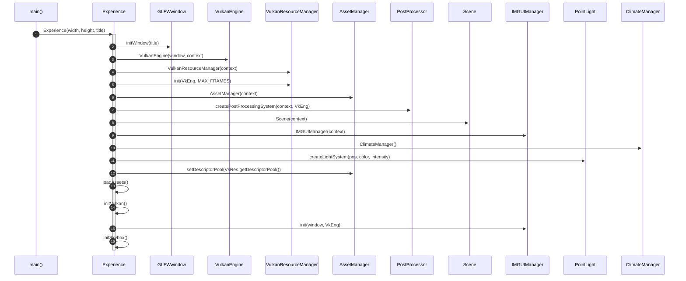
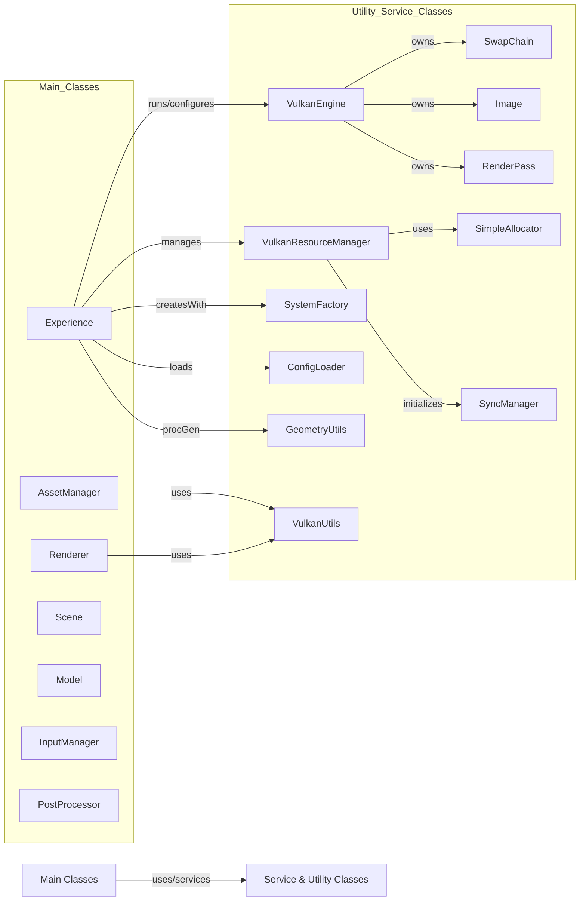
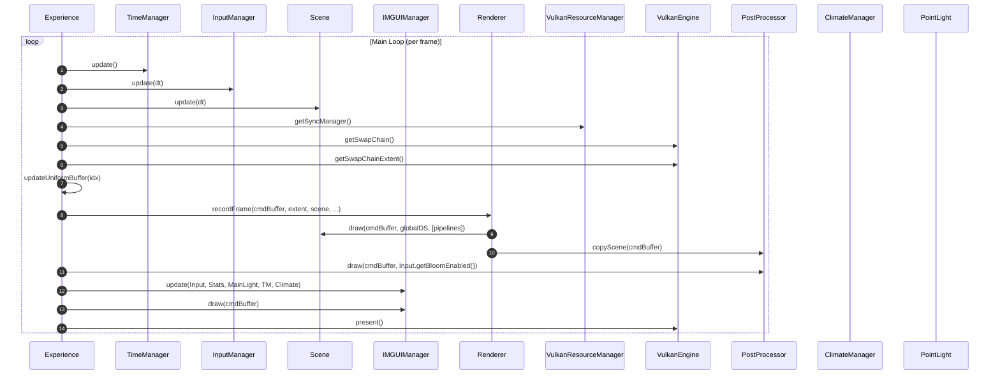
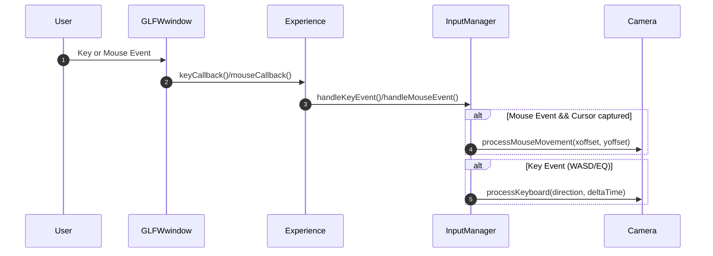
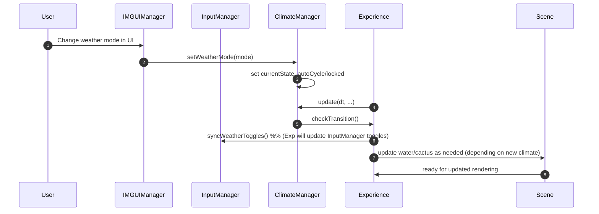
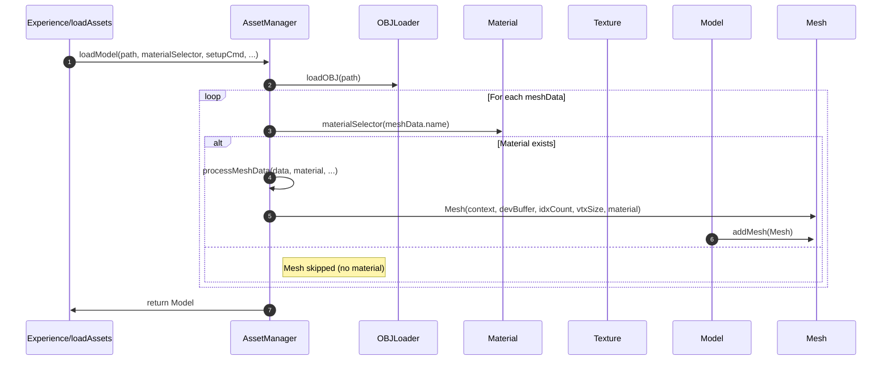

# Final Lab Book: C++ Programming and Design (700120)

---

## MSc Computer Science for Games Programming

---

**Course**: 700120 - C++ Programming and Design

**Name**: JOSE JAVIER SERRANO SOLIS

**Instructor:** Warren Viant

---

## 1. Introduction: Architectural Integrity

The "Sandy-Snow Globe" engine is a Vulkan 1.3 to a modern C++20 framework project. The design prioritizes **separation of concerns**, using Object-Oriented (OO) interfaces to abstract hardware verbosity into a high-integrity simulation.
```mermaid
%% Flowchart Diagram - Main Execution Flow
flowchart TD
   A([Start]) --> B["Initialize Experience"]
   B --> C["Create Window"]
   C --> D["Initialize VulkanEngine, ResourceManager, AssetManager, PostProcessor, etc."]
   D --> E["Load Assets & Scene"]
   E --> F["Initialize UI, Camera(s), Lighting, Particle & Climate Systems"]
   F --> G{Main Loop Running?}
   G -- No --> Z([Shutdown & Cleanup])
   G -- Yes --> H["Poll OS & Input Events"]
   H --> I["Update TimeManager (Delta/Accum)"]
   I --> J["Update InputManager (Keyboard/Mouse, Camera Switches)"]
   J --> K["Update Scene (Animations, Model Transforms, Procedural Motions)"]
   K --> L["Update Climate/Weather Manager"]
   L --> M["Update Particle Systems"]
   M --> N["Update Uniform Buffers (UBO/Lights/Cameras, Weather States)"]
   N --> O["Record Rendering Commands"]
   O --> P["Draw/Present Frame (Renderer, PostProcessor, UI)"]
   P --> G
   Z --> END([End])
   ```
**Figure 1.1:** *A high-level overview of the 'Sandy-Snow Globe' execution flow, illustrating the sequential transition from hardware initialization to the synchronized update-draw loop.*

---

## 2. Abstraction and Encapsulation

### 2.1 RAII and Resource Management

It utilizes **RAII** to manage GPU resources. Encapsulating handles in classes like `ShaderModule` and `Texture` ensures deterministic cleanup via destructors.

```cpp
// Deleting copy semantics to protect hardware handles
class ShaderModule {
public:
    ShaderModule(const ShaderModule&) = delete;
    ShaderModule& operator=(const ShaderModule&) = delete;
    ~ShaderModule() { vkDestroyShaderModule(m_device, m_module, nullptr); }
    // ...
};
```

* **Safety:** Explicitly deleting copy constructors enforces **Unique Ownership**, preventing "double-free" crashes.
* **Criticism:** The current model lacks **Move Semantics** (`std::move`), making resource transfer between threads rigid. Furthermore, it relies on implicit stack destruction order; some classes like `SimpleAllocator` uses default.

### 2.2 Layered Architecture: The VulkanContext

A `VulkanContext` struct acts as the "Single Source of Truth," injected into sub-systems to avoid the "Singleton Trap."

```mermaid
%% Class Diagram - Main Classes
classDiagram
    class Experience {
        +void run()
        -void drawFrame()
        -void updateUniformBuffer(idx:uint)
        -void cleanup()
        -void performFullReset()
        -void syncWeatherToggles()
        -void initWindow(title:char*)
        -void initVulkan()
        -void createGraphicsPipelines()
        -void loadAssets()
        -void initSkybox()
        -GLFWwindow* window
        -Renderer* renderer
        -IMGUIManager* uiManager
        -AssetManager* assetManager
        -VulkanEngine* vulkanEngine
        -VulkanResourceManager* resources
        -TimeManager* timeManager
        -InputManager* inputManager
        -StatsManager* statsManager
        -ClimateManager* climateManager
        -Scene* scene
        -Skybox* skybox
        -PointLight* mainLight
        -PostProcessor* postProcessor
        -Cubemap* skyboxTexture
        -vector<Model*> ownedModels
        -vector<Mesh*> meshes
        -vector<Pipeline*> pipelines
        -vector<ShaderModule*> shaderModules
        -map<string, ObjectTransform> cachedConfig
    }

    class Renderer {
        +void recordFrame(...)
        -void recordShadowPass(...)
        -void recordOpaquePass(...)
        -void recordTransparentPass(...)
        -void recordParticlePass(...)
        -VulkanContext* context
    }

    class IMGUIManager {
        +void update(input:InputManager*, stats:StatsManager*, light:PointLight*, time:TimeManager*, climate:ClimateManager*)
        +void draw(VkCommandBuffer cb) 
        -VulkanContext* context
        -VkDescriptorPool imguiPool
    }

    class AssetManager {
        +shared_ptr<Texture> loadTexture(path:string)
        +unique_ptr<Model> loadModel(path:string, selector, setupCmd, stagingBuffers, stagingMemories)
        +shared_ptr<Material> createMaterial(albedo, normal, ao, metallic, roughness, pipeline)
        +unique_ptr<Mesh> processMeshData(data, material, setupCmd, sBuf, sMem)
        -map<string, shared_ptr<Texture>> textureCache
        -VulkanContext* context
        -VkDescriptorPool descriptorPool
    }

    class Scene {
        +void update(dt:float)
        +void draw(cb, ds, pl)
        +Model* getModel(key:string)
        +void addModel(name:string, model:Model*)
        -map<string, unique_ptr<Model>> models
        -VulkanContext* context
    }

    class Model {
        +void addMesh(mesh:unique_ptr<Mesh>)
        +void setPosition(pos:vec3)
        +void setRotation(rot:vec3)
        +void setScale(scale:vec3)
        +void setShadowCasting(enabled:bool)
        +void draw(cb, ds, pl)
        +const vector<unique_ptr<Mesh>>& getMeshes()
        +const vec3& getPosition()
        +const vec3& getRotation()
        +const vec3& getScale()
        +bool castsShadows()
        -vector<unique_ptr<Mesh>> meshes
        -vec3 position
        -vec3 rotation
        -vec3 scale
        -mat4 modelMatrix
        -bool canProduceShadows
        -VulkanContext* context
    }

    class Mesh {
        +void draw(cb, ds, pl) const
        +void setModelMatrix(matrix:mat4)
        +void setName(n:string)
        +bool hasTransparency() const
        +Material* getMaterial() const
        +const string& getName() const
        -VkBuffer buffer
        -uint32_t indexCount
        -VkDeviceSize indexOffset
        -mat4 modelMatrix
        -string name
        -shared_ptr<Material> material
        -VulkanContext* context
    }

    class Material {
        +VkDescriptorSet getDescriptorSet() const
        +Pipeline* getPipeline() const
        -VkDescriptorSet descriptorSet
        -Pipeline* pipeline
        -shared_ptr<Texture> baseColor
        -shared_ptr<Texture> normalMap
        -shared_ptr<Texture> aoMap
        -shared_ptr<Texture> metallicMap
        -shared_ptr<Texture> roughnessMap
        -VulkanContext* context
    }

    class Texture { }
    class Pipeline { }
    class ShaderModule { }

    class Skybox { +void draw(cmdBuffer, globalDescriptorSet) }
    class Cubemap { }
    class PostProcessor { 
        +void resize(extent:VkExtent2D)
        +void draw(cmdBuffer, enableBloom:bool)
        +void copyScene(cmdBuffer) 
        +void createPipeline(finalRenderPass)
    }

    class ParticleSystem {
        +void update(cmdBuffer, deltaTime, spawnEnabled, totalTime, ...)
        +void draw(cmdBuffer, globalDescriptorSet) const
        +vector<SparkLight> getLightData() const
        -VulkanContext* context
        -uint32_t particleCount
        -VkBuffer storageBuffer
        -VkDeviceMemory storageBufferMemory
        -VkBuffer uniformBuffer
        -VkDeviceMemory uniformBufferMemory
        ...
    }

    class Particle { }

    class InputManager {
        +void update(dt:float) const
        +void handleKeyEvent(key, scancode, action, mods)
        +void handleMouseEvent(xpos:double, ypos:double)
        +Camera* getActiveCamera() const
        +const char* getActiveCameraLabel() const
        +void resetDefaults()
        +bool consumeResetRequest()
        +bool getGouraudEnabled() const
        -resetCameraToDefault(index) const
        ...
        -vector<unique_ptr<Camera>> cameras
        -int32_t activeCameraIndex
        -float lastX, lastY
        -bool cursorCaptured
        -bool useGouraud, dustEnabled, fireEnabled, smokeEnabled, rainEnabled, snowEnabled, bloomEnabled, autoOrbit
        ...
    }

    class Camera {
        +mat4 getViewMatrix() const
        +void processKeyboard(direction, deltaTime)
        +void processMouseMovement(xoffset, yoffset, constrainPitch)
        +void updateCameraVectors()
        +const vec3& getPosition() const
        +void setPosition(pos:vec3)
        +const vec3& getFront() const
        ...
        -vec3 Position, Front, Up, Right, WorldUp
        -float Yaw, Pitch
        ...
    }

    class StatsManager {
        +void update(dt:float)
        +float getAverageFPS() const
        +const float* getHistoryData() const
        +uint32_t getOffset() const
        +uint32_t getCount() const
        -vector<float> fpsHistory
        -uint32_t offset
    }

    class TimeManager {
        +void update()
        +void speedUp()
        +void slowDown()
        +void resetScale()
        +float getDelta() const
        +float getTotal() const
        +float getScale() const
        -float deltaTime
        -float totalTime
        -float timeScale
    }

    class ClimateManager {
        +void update(dt, totalTime, autoOrbit, orbitRadius, orbitSpeed, configIntensity)
        +void reset()
        +bool isRainEnabled() const
        +bool isSnowEnabled() const
        +bool isDustEnabled() const
        +bool isFireEnabled() const
        +bool isSmokeEnabled() const
        +float getCactusScale() const
        +const glm::vec3& getWaterScale() const
        ...
        -WeatherState currentState
        -WeatherMode activeMode
        -float stateTimer
        ...
    }

    class Light {
        +vec3 getColor() const
        +float getIntensity() const
        +vec3 getLightValue() const
        +void setColor(c:vec3)
        +void setIntensity(i:float)
        -vec3 color
        -float intensity
    }
    class PointLight {
        +void orbit(time, radius, speed, height)
        +mat4 getLightSpaceMatrix() const
        +void setPosition(pos:vec3)
        +const vec3& getPosition() const
        -vec3 position
    }
    PointLight --|> Light

    %% === Key Relationships (Main only) ===
    Experience *-- Renderer
    Experience *-- IMGUIManager
    Experience *-- AssetManager
    Experience *-- TimeManager
    Experience *-- InputManager
    Experience *-- StatsManager
    Experience *-- ClimateManager
    Experience *-- Scene
    Experience *-- Skybox
    Experience *-- PointLight
    Experience *-- PostProcessor
    Experience *-- Cubemap
    Experience *-- ParticleSystem

    Renderer --> Scene
    Renderer --> Model
    Renderer --> Mesh
    Renderer --> Skybox
    Renderer --> ParticleSystem
    Renderer --> PostProcessor
    Renderer --> Pipeline

    AssetManager --> Texture
    AssetManager --> Material
    AssetManager --> Model
    AssetManager --> Mesh

    Scene *-- "many" Model
    Model *-- "many" Mesh
    Mesh *-- Material
    Material *-- Texture
    Material *-- Pipeline
    InputManager *-- "many" Camera
    PostProcessor --> Texture
    ParticleSystem --> Particle
```


**Figure 2.1:** *Main Engine Class Diagram showing the layered abstraction. High-level simulation classes communicate with hardware management layers only through sanitized context interfaces.*

* **Integrity:** High-level classes (`Scene`, `Model`) remain "blind" to Vulkan initialization, interacting only with the context for command recording.
* **Criticism:** This introduces the **Tramp Data Pattern**, where the context is passed through layers (Experience  Scene  Model  Mesh) that may not use it. Future iterations should use a **Service Locator** to reduce constructor bloat.

---

## 3. Cohesion: Functional and Logical Grouping

### 3.1 The Factory Pattern (`SystemFactory`)

I implemented a **Simple Factory** to centralize complex "creation recipes" for systems like `PostProcessor`.

```cpp
// Example from SystemFactory.cpp: Encapsulating complex construction logic
std::unique_ptr<ParticleSystem> SystemFactory::createDustSystem(VulkanContext* const ctx, const VkRenderPass rp, const VkSampleCountFlagBits msaa) {
    // Hidden knowledge: Specific shader paths for the Dust simulation
    return std::make_unique<ParticleSystem>(
        ctx, rp, ctx->globalSetLayout,
        "./shaders/dust_comp.spv", "./shaders/dust_vert.spv", "./shaders/dust_frag.spv",
        glm::vec3(0.0f, 1.2f, 0.0f), 1000U, msaa
    );
}
```


**Figure 3.1:** *Initialization Sequence illustrating the System Factory orchestration. The 'Experience' class delegates system construction to isolate initialization logic.*


* **Cohesion:** It shields the `Experience` class from low-level requirements like `VkRenderPass` or shader paths.
* **Criticism:** It violates the **Open-Closed Principle**; adding new systems requires modifying the factory source. Transitioning to an **Abstract Factory** or registry-based creator would improve extensibility.

### 3.2 Utility Cohesion (`VulkanUtils` and `GeometryUtils`)

```cpp
// Logic from VulkanUtils.cpp: Encapsulating a complex Vulkan sequence
void VulkanUtils::createBuffer(const VkDevice device, const VkPhysicalDevice physicalDevice, const VkDeviceSize size,
    const VkBufferUsageFlags usage, const VkMemoryPropertyFlags properties, VkBuffer& buffer, VkDeviceMemory& bufferMemory) {

    VkBufferCreateInfo bufferInfo{ VK_STRUCTURE_TYPE_BUFFER_CREATE_INFO };
    bufferInfo.size = size;
    bufferInfo.usage = usage;
    bufferInfo.sharingMode = VK_SHARING_MODE_EXCLUSIVE;

    if (vkCreateBuffer(device, &bufferInfo, nullptr, &buffer) != VK_SUCCESS) {
        throw std::runtime_error("VulkanUtils: Failed to create buffer.");
    }
    // ... Memory requirement and allocation logic follows
}
```

```cpp
// Logic from GeometryUtils.cpp: Pure mathematical generation of a sphere
OBJLoader::MeshData GeometryUtils::generateSphere(const uint32_t segments, const float radius, const float cutoffY, const glm::vec3& color) {
    OBJLoader::MeshData data{};
    data.name = "Procedural_Sphere_Dome";

    const float fSegments = static_cast<float>(segments);

    // Step 1: Generate Vertices along the latitude and longitude rings
    for (uint32_t y = 0U; y <= segments; ++y) {
        const float phi = (GeometryUtils::PI * static_cast<float>(y)) / fSegments;
        const float yPos = static_cast<float>(std::cos(static_cast<double>(phi))) * radius;

        // Truncate the sphere if it falls below the specified cutoff height
        if (yPos < cutoffY) {
            continue;
        }

        for (uint32_t x = 0U; x <= segments; ++x) {
            const float theta = (GeometryUtils::TWO_PI * static_cast<float>(x)) / fSegments;
            // ... Trigonometric vertex calculation
        }
    }
    return data;
}
```

* **VulkanUtils:** Centralizes static, API-specific boilerplate for buffer/image creation.
* **GeometryUtils:** A mathematically "pure," API-agnostic library for procedural vertex generation.
* **Criticism:** `VulkanUtils` is stateless, requiring constant context-passing. Converting this to a **Service Provider** model would simplify method signatures. Additionally, CPU-bound procedural math in `GeometryUtils` creates a bottleneck that should be moved to **Compute Shaders**.

### 3.3 Resource Management Cohesion (`VulkanResourceManager`)

This class establishes **Logical Cohesion** by orchestrating the `SyncManager` (frame flow) and `SimpleAllocator` (VRAM).

```cpp
// From VulkanResourceManager.cpp: Centralizing shared resource access
void VulkanResourceManager::init(const VulkanEngine* const engine, const uint32_t maxFrames) {
    // Step 1: Establish Layouts and Infrastructure Pools
    createLayouts();
    createPools(engine);

    // Step 2: Allocate Dedicated Shadow Mapping Hardware
    createShadowResources(engine);

    // Step 3: Prepare Uniform Buffers (one per swapchain image for overlapping frames)
    const uint32_t imageCount = engine->getSwapChainImageCount();
    createUniformBuffers(imageCount);

    // Step 4: Initialize CPU-GPU Synchronization (SyncManager)
    syncManager = std::make_unique<SyncManager>(context);
    syncManager->init(context, maxFrames, imageCount);

    // Step 5: Allocate Primary Graphics Command Buffers
    syncManager->allocateCommandBuffers(context, context->graphicsCommandPool, maxFrames);
}
```
As evidenced in **Figure 3.2**, you can see the service and utility classes.

```mermaid
%% Class Diagram - Service & Utility Classes
classDiagram
    class VulkanEngine {
        +void recreateSwapChain(GLFWwindow* window)
        +void cleanupSwapChain()
        +VkSwapchainKHR getSwapChain() const
        +VkFormat getSwapChainFormat() const
        +VkExtent2D getSwapChainExtent() const
        +VkRenderPass getFinalRenderPass() const
        +VkFramebuffer getFramebuffer(uint32_t idx) const
        ...
        -SwapChain* swapChainObj
        -Image* depthBuffer
        -RenderPass* finalPass
        -VkFormat depthFormat
        -QueueFamilyIndices queueIndices
        -VkSampleCountFlagBits msaaSamples
    }
    class VulkanResourceManager {
        +void init(const VulkanEngine* engine, uint32_t maxFrames)
        +void cleanup()
        +SyncManager* getSyncManager() const
        +VkDescriptorPool getDescriptorPool() const
        +VkDescriptorSet getDescriptorSet(uint32_t idx) const
        +void* getMappedBuffer(uint32_t idx) const
        +VkRenderPass getShadowRenderPass() const
        +VkFramebuffer getShadowFramebuffer() const
        -SyncManager* syncManager
        -VkDescriptorPool descriptorPool
        -std::vector<VkBuffer> uniformBuffers
        ...
    }
    class SyncManager {
        +void init(const VulkanContext* ctx, uint32_t maxFrames, uint32_t imageCount)
        +void allocateCommandBuffers(const VulkanContext* ctx, VkCommandPool pool, uint32_t count)
        +VkCommandBuffer getCommandBuffer(const uint32_t idx) const
        +VkSemaphore getImageAvailableSemaphore(const uint32_t idx) const
        +VkSemaphore getRenderFinishedSemaphore(const uint32_t idx) const
        +VkFence getInFlightFence(const uint32_t idx) const
        +void advanceFrame()
        +uint32_t getCurrentFrame() const
        -std::vector<VkCommandBuffer> commandBuffers
        -std::vector<VkSemaphore> imageAvailableSemaphores
        -std::vector<VkSemaphore> renderFinishedSemaphores
        -std::vector<VkFence> inFlightFences
        -VulkanContext* context
    }
    class SwapChain {
        +void cleanup()
        +VkSwapchainKHR getHandle() const
        +VkFormat getFormat() const
        +VkExtent2D getExtent() const
        +uint32_t getImageCount() const
        +const std::vector<VkImage>& getImages() const
        +const std::vector<VkImageView>& getImageViews() const
        +const std::vector<VkFramebuffer>& getFramebuffers() const
        +VkFramebuffer getFramebuffer(uint32_t idx) const
        +void setHandle(VkSwapchainKHR handle)
        +void setFormat(VkFormat format)
        +void setExtent(const VkExtent2D& extent)
        +void initImages(const std::vector<VkImage>& images)
        +void addImageView(VkImageView view)
        +void addFramebuffer(VkFramebuffer buffer)
        -VulkanContext* context
        -VkSwapchainKHR swapChain
        -VkFormat swapChainImageFormat
        -VkExtent2D swapChainExtent
        -std::vector<VkImage> swapChainImages
        -std::vector<VkImageView> swapChainImageViews
        -std::vector<VkFramebuffer> swapChainFramebuffers
    }
    class Image { }
    class RenderPass { }
    class SimpleAllocator {
        +void init(VkDevice logicalDevice, VkPhysicalDevice physDevice, VkDeviceSize size)
        +VkDeviceSize allocate(const VkMemoryRequirements& requirements)
        +VkDeviceMemory getMemoryHandle() const
        +void cleanup()
        -VkDevice device
        -VkDeviceMemory memoryChunk
        -VkDeviceSize currentOffset
        -VkDeviceSize totalSize
        -uint32_t memoryTypeIndex
    }
    class SystemFactory {
        +std::unique_ptr<PostProcessor> createPostProcessingSystem(VulkanContext*, VulkanEngine*)
        +std::unique_ptr<ParticleSystem> createDustSystem(VulkanContext*, VkRenderPass, VkSampleCountFlagBits)
        +std::unique_ptr<ParticleSystem> createFireSystem(...)
        +std::unique_ptr<ParticleSystem> createSmokeSystem(...)
        +std::unique_ptr<ParticleSystem> createRainSystem(...)
        +std::unique_ptr<ParticleSystem> createSnowSystem(...)
        +std::unique_ptr<PointLight> createLightSystem(vec3, vec3, float)
        +std::unique_ptr<ClimateManager> createClimateSystem()
    }
    class VulkanUtils {
        +static uint32_t findMemoryType(...)
        +static VkMemoryRequirements getBufferMemoryRequirements(...)
        +static VkCommandBuffer beginSingleTimeCommands(...)
        +static void endSingleTimeCommands(...)
        +static void createBuffer(...)
        +static void copyBuffer(...)
        +static void createImage(...)
        +static VkImageView createImageView(...)
        +static void transitionImageLayout(...)
        +static void copyBufferToImage(...)
        +static void createTextureSampler(...)
        +static void generateMipmaps(...)
        +static void recordImageBarrier(...)
        +static VkRenderPass createDepthRenderPass(...)
        +static VkGraphicsPipelineCreateInfo preparePipelineCreateInfo(...)
        +static VkPipelineDynamicStateCreateInfo prepareDynamicState(...)
        +static VkPipelineRasterizationStateCreateInfo prepareRasterizer(...)
        +static VkPipelineMultisampleStateCreateInfo prepareMultisampling(...)
        +static VkPipelineDepthStencilStateCreateInfo prepareDepthStencil(...)
    }
    class ConfigLoader {
        +static std::map<std::string, ObjectTransform> loadConfig(const std::string& path)
    }
    class GeometryUtils {
        +static OBJLoader::MeshData generateSphere(uint32_t segments, float radius, float cutoffY, glm::vec3 color)
        +static OBJLoader::MeshData generateSandPlug(...)
        +static OBJLoader::MeshData generateCylinder(...)
    }

    %% Key utility/service class relationships
    VulkanEngine *-- SwapChain
    VulkanEngine *-- Image
    VulkanEngine *-- RenderPass
    VulkanResourceManager *-- SyncManager
    VulkanResourceManager *-- SimpleAllocator
    VulkanResourceManager *-- VulkanEngine
    SystemFactory ..> PostProcessor
    SystemFactory ..> ParticleSystem
    SystemFactory ..> PointLight
    SystemFactory ..> ClimateManager

    %% Other service/utility class uses/links as appropriate
```



**Figure 3.2:** *Evidence of logical cohesion. Hardware services like synchronization and memory allocation are grouped into a dedicated utility layer for centralized management.*


* **Critique:** Composition-based RAII ensures deterministic cleanup, but the current **Hard-Coded Heuristics** for descriptor pools limit scalability.
* **Criticism:** The manager risks becoming a **God Object**. A **Facade Pattern** should be employed to delegate specific resource logic to specialized sub-brokers.

---

## 4. Coupling: Managing Interdependencies

### 4.1 Dependency Injection (DI)

All sub-systems receive dependencies via pointers, declaring requirements upfront to satisfy the **Principle of Least Privilege**.

```cpp
// Constructor-based Dependency Injection in ParticleSystem.cpp
ParticleSystem::ParticleSystem(
    VulkanContext* const inContext,
    const VkRenderPass renderPass,
    const VkDescriptorSetLayout inGlobalSetLayout,
    const std::string& compPath,
    const std::string& vertPath,
    const std::string& fragPath,
    const glm::vec3& spawnPos,
    const uint32_t maxParticles,
    const VkSampleCountFlagBits inMsaa)
    : context(inContext), // Injecting the hardware context
    globalSetLayout(inGlobalSetLayout),
    particleCount(maxParticles),
    msaaSamples(inMsaa)
{
    // ...
}
```

The flowchart illustrates a clean **client-server relationship** where "Main Classes" act as clients that receive services from the "Utility & Service" layer.


**Figure 4.1:** *Flowchart of main interaction between simulation and service layers. This structural decoupling illustrates a clean client-server relationship between logic and hardware.*


* **Critique:** DI makes the engine modular and testable, yet raw pointers lack compiler-enforced safety. `std::shared_ptr` would be safer but introduces reference-counting overhead.

### 4.2 Decoupling via Command Recording

The engine achieves **Temporal Decoupling** by resolving simulation logic before submitting hardware commands.

```cpp
// Logic from Renderer.cpp: Pure recording logic decoupled from state updates
void Renderer::recordOpaquePass(
    const VkCommandBuffer cb,
    const VkExtent2D& extent,
    const std::vector<Mesh*>& opaque,
    const Skybox* const skybox,
    const PostProcessor* const postProcessor,
    const VkDescriptorSet globalSet
) const {
    // The Renderer doesn't calculate positions; it simply retrieves 
    // the pre-calculated state and records the hardware instructions.
    for (Mesh* const mesh : opaque) {
        if (mesh != nullptr) {
            mesh->draw(cb, globalSet);
        }
    }
}
```


**Figure 4.2:** *Render Loop Sequence demonstrating temporal decoupling. Logic updates on the CPU are recorded into command buffers for independent GPU execution.*


* **Critique:** Using **Command Buffers** allows the CPU to process frame  while the GPU draws frame .
* **Criticism:** The engine uses a single-threaded recording flow. To scale, it requires **Secondary Command Buffers** to utilize multi-core CPU recording.

---

## 5. State Propagation and User Flow

The engine uses roughly **Observer-style propagation** model via the `InputManager`and `ClimateManager`. This prevents **Control Coupling** by sanitizing raw events into flags polled at frame start.

```cpp
// Logic from InputManager.cpp showing state-based consumption
void InputManager::handleKeyEvent(const int32_t key, const int32_t scancode, const int32_t action, const int32_t mods) {
    static_cast<void>(scancode);

    // Only process discrete presses
    if (action != GLFW_PRESS) {
        return;
    }

    switch (key) {
    case GLFW_KEY_R:
        resetRequested = true;
        break;

    case GLFW_KEY_ESCAPE:
        glfwSetWindowShouldClose(window, GLFW_TRUE);
        break;

    // ...
}
```

```cpp
// State synchronization bridge in Experience.cpp
void Experience::syncWeatherToggles() {
    // Ensuring the UI/Climate state matches the InputManager's internal toggles
    inputManager->setRainEnabled(climateManager->isRainEnabled());
    inputManager->setSnowEnabled(climateManager->isSnowEnabled());
    
    // Procedural updates based on new state
    scene->updateEnvironment(climateManager->getCurrentState());
}
```




**Figures 5.1 & 5.2:** *Sequences for input and climate synchronization. These show how the engine maintains state consistency between user actions and environmental logic.*


* **Sync Bridge:** The `Experience` class acts as a mediator, ensuring climate changes (e.g., Summer  Rain) synchronize the `Scene` and particle systems simultaneously.
* **Criticism:** Polling is less efficient than a true **Publish-Subscribe** model with **Command Pattern**. An**Event Bus** would allow to react to climate transitions without manual orchestration by the `Experience` class.

---

## 6. Reusability and Generalization

### 6.1 Data-Driven Extensibility (`ConfigLoader`)

The scene is defined in an external `config.txt`, reducing **Compilation Coupling**.

```cpp
// Logic from ConfigLoader.cpp showing the parsing of external parameters
std::map<std::string, ObjectTransform> ConfigLoader::loadConfig(const std::string& path) {
    std::map<std::string, ObjectTransform> configs{};
    std::ifstream file(path);

    // Step 1: Safety check to ensure the configuration file exists and is accessible
    if (!file.is_open()) {
        return configs;
    }

    std::string line{ "" };
    std::string currentObject{ "" };

    // Step 2: Iterate through the file line by line
    while (std::getline(file, line)) {

        // Skip empty lines or comment lines starting with '#'
        if (line.empty() || (line[INDEX_FIRST] == CHAR_COMMENT)) {
            continue;
        }

    // ...
}
```

* **Critique:** Runtime caching of transforms allows for rapid moddability without code changes.
* **Criticism:** The string-parser lacks validation. A transition to **JSON/YAML** with schema verification is necessary for production stability.

```cpp
// Application of the data-driven config in Experience.cpp
void Experience::loadAssets() {
    // ... 
    auto cactusTransform = m_cachedConfig["Cactus"];
    m_scene->getModel("Cactus")->setPosition(cactusTransform.position);
    m_scene->getModel("Cactus")->setScale(cactusTransform.scale);
    // ...
}
```

### 6.2 Generic Asset Processing

The `AssetManager` uses **Dependency Inversion** via a `materialSelector` callback.

```cpp
// Utilization of functional callbacks for flexible material mapping
auto sorcSelector = [&](const std::string& meshName) -> std::shared_ptr<Material> {
    std::string n = meshName;
    for (char& c : n) {
        c = static_cast<char>(std::tolower(static_cast<unsigned char>(c)));
    }
    if (n == "tiles_low") {
        return nullptr;
    }
    if (n == "skirt") {
        return sSkirtMat;
    }
    if (n == "book") {
        return sBookMat;
    }

// The same loader works for any model, regardless of complexity
auto sorceressModel = assetManager->loadModel("./models/sorceress/Pose_Body.obj", sorcSelector, setupCmd, stagingBuffers, stagingMemories);
```


**Figure 6.1:** *Demonstration of behavioral generalization. The Asset Manager utilizes dynamic callbacks to process generic mesh data into the engine's model structure.*


* **Critique:** The loader is agnostic to mesh complexity, handling the Viking House or procedural spheres through the same code path.
* **Criticism:** The synchronous loading causes "hitches." **Asynchronous Command Buffers** are needed to stream assets without blocking the main loop.

---

## 7. Novel Feature Design: The SimpleAllocator

The `SimpleAllocator` abstracts a **Memory Heap**. It allocates a 256MB "Super-Block" of VRAM and performs sub-allocation to bypass Vulkan’s driver allocation limits.

```cpp
// Logic from SimpleAllocator.cpp: Abstracting bitwise alignment math
VkDeviceSize SimpleAllocator::allocate(const VkMemoryRequirements& requirements) {
    // Step 1: Calculate necessary padding to satisfy hardware alignment
    VkDeviceSize padding = VAL_ZERO;
    const VkDeviceSize remainder = currentOffset % requirements.alignment;

    if (remainder != VAL_ZERO) {
        padding = requirements.alignment - remainder;
    }

    const VkDeviceSize alignedOffset = currentOffset + padding;

    // Step 2: Ensure the super-block has sufficient capacity for the request
    if ((alignedOffset + requirements.size) > totalSize) {
        throw std::runtime_error("SimpleAllocator: VRAM Super-Block exhausted!");
    }

    // Step 3: Update the tracking offset and return the sub-allocation start point
    currentOffset = alignedOffset + requirements.size;
    return alignedOffset;
}
```

* **Critique:** It satisfies the **Law of Demeter**; the `AssetManager` requests memory without needing to understand bitwise alignment math.
* **Criticism:** As a **Linear Allocator**, it suffers from fragmentation. A **TLSF (Two-Level Segregated Fit)** model would be required for dynamic resource recycling.

---

## 8. Final Reflection

* **Reflect on what you have learnt from this exercise:**
This project served as a rigorous exercise in **architectural integrity**. I have learned that when dealing with a verbose API like Vulkan. By implementing **RAII** and other strategies, I transformed a procedural script into a deterministic engine. I now understand that a professional engine must be built on the **Separation of Concerns**.
* **Did you make any mistakes?**
A significant mistake was **High Coupling** between the `Experience` and everything else I resolved this by refactoring the "draw" logic into the `Model` and `Mesh` classes, allowing the Experience to function as a pure orchestrator. I also did mistakes around performance, like using switch/if statements for material selection instead of a data-driven approach.

```cpp
// Experience.cpp extract: Material selection
auto sorcSelector = [&](const std::string& meshName) -> std::shared_ptr<Material> {
    std::string n = meshName;
    for (char& c : n) {
        c = static_cast<char>(std::tolower(static_cast<unsigned char>(c)));
    }
    if (n == "tiles_low") {
        return nullptr;
    }
    if (n == "skirt") {
        return sSkirtMat;
    }
    if (n == "book") {
        return sBookMat;
    }
    if ((n == "object003") || (n == "sphere_low")) {
        return orbMat;
    }
    if (n == "effects") {
        return spellMat;
    }
    return sBodyMat;
    };
```

```cpp
// InputManager.cpp extract: Key event handling with state propagation
void InputManager::handleKeyEvent(const int32_t key, const int32_t scancode, const int32_t action, const int32_t mods) {
    static_cast<void>(scancode);

    // Only process discrete presses
    if (action != GLFW_PRESS) {
        return;
    }

    switch (key) {
    case GLFW_KEY_R:
        resetRequested = true;
        break;

    case GLFW_KEY_ESCAPE:
        glfwSetWindowShouldClose(window, GLFW_TRUE);
        break;

    case GLFW_KEY_C:
        // Step 1: Toggle cursor capture mode
        cursorCaptured = !cursorCaptured;
        glfwSetInputMode(window, GLFW_CURSOR, cursorCaptured ? GLFW_CURSOR_DISABLED : GLFW_CURSOR_NORMAL);
        firstMouse = true;
        break;

    case GLFW_KEY_L:
        useGouraud = !useGouraud;
        break;

    case GLFW_KEY_F1:
        resetCameraToDefault(CAM_IDX_FRONT);
        activeCameraIndex = static_cast<int32_t>(CAM_IDX_FRONT);
        break;

    case GLFW_KEY_F2:
        resetCameraToDefault(CAM_IDX_BIRD);
        activeCameraIndex = static_cast<int32_t>(CAM_IDX_BIRD);
        break;

    case GLFW_KEY_F3:
        resetCameraToDefault(CAM_IDX_GLOBE);
        activeCameraIndex = static_cast<int32_t>(CAM_IDX_GLOBE);
        break;

    case GLFW_KEY_T:
        // Step 2: Handle time-scaling logic with Shift-modifier detection
        if (timeManager != nullptr) {
            const bool isShift = (mods & GLFW_MOD_SHIFT) != 0;
            if (isShift) {
                if (T_pressedLast) {
                    timeManager->resetScale();
                    T_pressedLast = false;
                }
                else {
                    timeManager->resetScale();
                    timeManager->speedUp();
                    T_pressedLast = true;
                    t_pressedLast = false;
                }
            }
            else {
                if (t_pressedLast) {
                    timeManager->resetScale();
                    t_pressedLast = false;
                }
                else {
                    timeManager->resetScale();
                    timeManager->slowDown();
                    t_pressedLast = true;
                    T_pressedLast = false;
                }
            }
        }
        break;

    default:
        break;
    }
}
```

* * **In what way has your knowledge improved?**
I went from a procedural programmer to a hardware-aware **Object-Oriented Engineer**. My understanding of **Memory Safety** has evolved from basic pointer management to enforcing resource ownership at the compiler level using deleted copy semantics and smart pointers.
---

# Appendix:

## Class Diagrams
* **UML Class Diagram - Main Classes**:
    /Mermaid-Class-1-Main Classes.png> "UML Class Diagram - Main Classes")
* **UML Class Diagram - Services & Utilities Classes**:
    /Mermaid-Class-2-Service And Utilities.png> "UML Class Diagram - Services & Utilities")

## Interaction/Sequence Diagrams
* **UML Sequence Diagram - Initialization**:
    /Mermaid-Sequence-1-Init.png> "UML Sequence Diagram - Initialization")
* **UML Sequence Diagram - Render Loop**:
    /Mermaid-Sequence-2-Render Loop.png> "UML Sequence Diagram - Render Loop")
* **UML Sequence Diagram - Load Model**:
    /Mermaid-Sequence-3-Load Model.png> "UML Sequence Diagram - Load Model")
* **UML Sequence Diagram - User Input**:
    /Mermaid-Sequence-4-User Input.png> "UML Sequence Diagram - User Input")
* **UML Sequence Diagram - Weather Input**:
    /Mermaid-Sequence-5-Weather Input.png> "UML Sequence Diagram - Weather Input")


## Flowcharts Diagrams
* **UML Flowchart Diagram - Main And Service And Utilities Interaction**:
    /Mermaid-Flowchart-1-Main And Service And Utilities Interaction.png> "UML Flowchart Diagram - Main And Service And Utilities Interaction.")
* **UML Flowchart Diagram - Main Flow**:
    /Mermaid-Flowchart-2-Main Flow.png> "UML Flowchart Diagram - Main Flow")