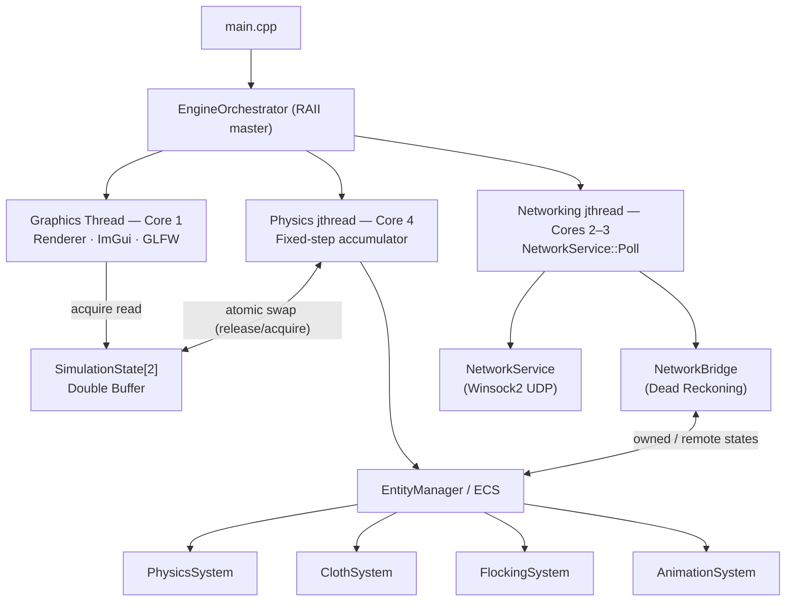
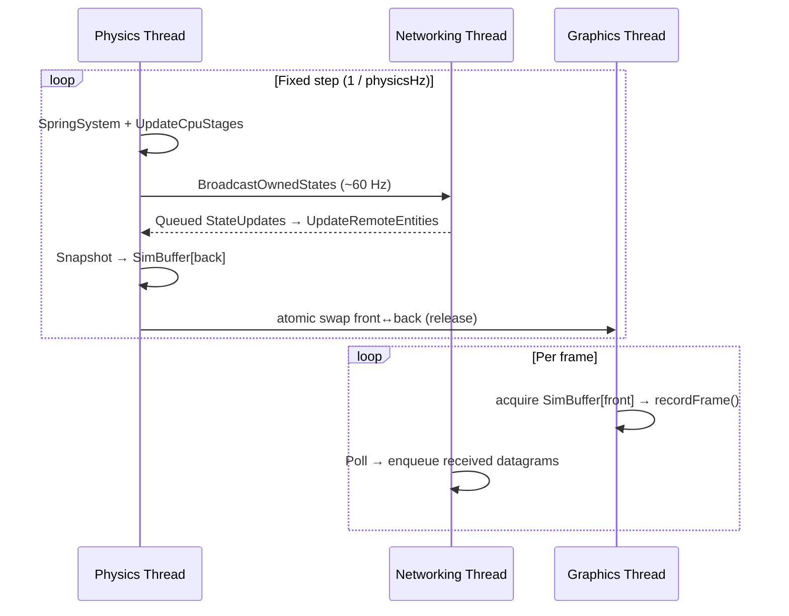

# Final Lab Book — Simulation and Concurrency (700105)

**Module:** 700105 — Simulation and Concurrency  
**Student:** José Javier Serrano Solís  
**Repository branch:** `final-lab`

---

## 1. System Architecture

<!-- TODO: Run 01_multiplayer.bin with 2+ peers connected. Screenshot the engine window showing the arena with colour-coded player spheres (Red=ONE, Green=TWO, Blue=THREE, Yellow=FOUR) and the animated platforms. Save as markdown-resources/FinalLab700105/s1_multiplayer_overview.png -->


This engine is a real-time 3D simulation built on Vulkan. It combines a custom Entity-Component-System (ECS) with the State Pattern for scene management and runs three concurrent threads coordinated through a double-buffered simulation snapshot and C++20 atomic primitives. Physics is implemented exclusively with GLM; networking with Winsock 2 UDP; threading with `std::jthread` and Win32 affinity pinning via `SetThreadAffinityMask`.

### 1.1 Threading Model

<!-- TODO: With the engine running, open Windows Resource Monitor (resmon.exe) → CPU tab. Screenshot the per-core CPU graph showing distinct activity on Core 1 (graphics), Cores 2–3 (networking), and Core 4 (physics). Save as markdown-resources/FinalLab700105/s1_thread_affinity.png -->


Three threads are created at startup, each pinned to specific CPU cores via `SetThreadAffinityMask`:

| Thread | OS type | Core(s) | Affinity mask | Frequency |
|---|---|---|---|---|
| Graphics (main) | Main thread | Core 1 | `0x01` | 0–300 Hz (configurable) |
| Networking | `std::jthread` | Cores 2–3 | `0x06` | Tight poll loop (1 ms yield) |
| Physics | `std::jthread` | Core 4 | `0x08` | 1–2000 Hz (configurable) |

Physics and graphics run at independently configurable frequencies because rigid-body accuracy improves with higher tick rates (the fixed-step accumulator sustains up to 2000 Hz) while the renderer need only match the display refresh rate; decoupling the two means neither thread blocks the other. `std::jthread` is preferred over `std::thread` because its destructor automatically joins on scope exit and its cooperative `stop_token` integrates naturally with the accumulator's loop-exit condition. Pinning threads to dedicated cores via `SetThreadAffinityMask` eliminates OS scheduler contention on the networking and physics hotpaths, reducing latency jitter.

The physics thread runs a fixed-step accumulator: real elapsed time is clamped to eight missed ticks (preventing spiral-of-death on hitches) and drained in whole steps of `1/physicsHz`. Each tick executes `SpringSystem` → `EntityManager::UpdateCpuStages()` → `NetworkBridge::BroadcastOwnedStates()` → `NetworkBridge::UpdateRemoteEntities()`, then snapshots all world-matrices into the inactive back buffer. `std::this_thread::yield()` is called after each tick so the physics `jthread` does not starve the render thread at high frequencies.

The physics and render threads share ECS data, but locking the entire ECS on every draw call would serialise them. Instead, a double-buffered `SimulationState[2]` stores transform snapshots. After each tick the completed snapshot is written to the inactive back buffer, and `m_frontSimIdx.store(backIdx, memory_order_release)` atomically publishes it:

```cpp
int backIdx = 1 - m_frontSimIdx.load(memory_order_relaxed);
m_simBuffers[backIdx] = snapshot;
m_frontSimIdx.store(backIdx, memory_order_release);   // publish
// ─────────────────────────────────────────────────────
int frontIdx = m_frontSimIdx.load(memory_order_acquire);  // renderer
drawFromSnapshot(m_simBuffers[frontIdx]);
```

`memory_order_acquire` on the renderer's load guarantees every write preceding the store is visible before the snapshot is consumed. This means the renderer never waits on an in-progress physics tick, and the physics thread never waits on the renderer to finish reading the front buffer.

Scene changes are deferred via `requestScenarioChange(path)` and only processed inside `drawFrame()` after `vkDeviceWaitIdle()`, because Vulkan pipelines cannot be destroyed while the GPU has in-flight work.

### 1.2 ECS Architecture

The ECS uses `EntityManager` to manage entity IDs and packed `ComponentArray<T>` storage (SoA layout, three-way index mapping for O(1) component add/remove without holes). Systems implement either `ICpuSystem::OnUpdate(float dt)` for CPU logic or `IGpuSystem::OnUpdate(float dt, VkCommandBuffer cb)` for GPU work, and are registered per-scene in `Scenario::OnLoad()` and unregistered in `Scenario::OnUnload()`:

| System | Interface | Stage | Responsibility |
|---|---|---|---|
| `SpringSystem` | `ICpuSystem` | Pre-Physics | Hooke spring constraints between entity pairs |
| `PhysicsSystem` | `ICpuSystem` | Physics | Rigid body integration + 10-pass collision |
| `ClothSystem` | `ICpuSystem` | Physics | Jakobsen positional cloth constraints |
| `AnimationSystem` | `ICpuSystem` | GameLogic | Waypoint interpolation; momentum transfer to spheres |
| `SpawnerSystem` | `ICpuSystem` | GameLogic | Entity-pool spawning with peer ownership assignment |
| `FlockingSystem` | `ICpuSystem` | GameLogic | Reynolds boids + three spatial-partitioning backends |
| `ParticleEmitterSystem` | `IGpuSystem` | Render | GPU compute particle dispatch |

`ServiceLocator` provides global access to core services (time, input, assets, network bridge) without threading references through fifteen-plus subsystem constructors. All registered pointers are raw non-owning pointers, safe because `EngineOrchestrator` owns every service lifetime and outlives all consumers.

### 1.3 P2P Networking and Ownership

<!-- TODO: With 2+ peers connected on the same scene, open the ImGui Network menu. Screenshot the Connected Peers list showing peer IDs, IP addresses, port numbers, and the current scene path in the auto-connect status line. Save as markdown-resources/FinalLab700105/s1_network_panel.png -->


Up to four peers connect over LAN via auto-discovery: a new peer broadcasts or unicasts `DiscoveryHello` packets carrying `scenePath[128]`; the first recipient on the same scene replies with `DiscoveryResponse` and also relays one additional `DiscoveryResponse` per peer it already knows (with `peerAddr` carrying each peer's real IP), giving the joiner the complete peer topology in a single round trip. All peers send a raw subnet `PeerAnnounce` broadcast on connection; each recipient unicasts its own `PeerAnnounce` back if the sender was previously unknown, ensuring full mutual registration even when the host's firewall blocks inbound unicast. Peers on different scenes are silently filtered by an atomic `m_acceptedPeerMask` bitmask, preventing cross-scene packet pollution without explicit disconnect logic.

| Packet | ID | Key payload | Purpose |
|---|---|---|---|
| `Heartbeat` | 0 | — | Keep-alive |
| `StateUpdate` | 1 | pos, quat, vel, angVel | Authoritative physics state (~60 Hz) |
| `SceneChange` | 2 | `scenePath[128]` | Global scene switch broadcast |
| `SpawnObject` | 3 | entityId, type, pos, owner | Spawn replication |
| `AnimationSync` | 4 | entityId, timer, waypointIdx | Animation state synchronisation |
| `DiscoveryHello` | 5 | `scenePath[128]` | LAN discovery probe |
| `DiscoveryResponse` | 6 | peerId, peerAddr, scenePath | Discovery reply + host relay |
| `PeerAnnounce` | 7 | peerId | Post-connect broadcast |

Each entity carries an `OwnerComponent` (ONE–FOUR, colour-coded Red/Green/Blue/Yellow). The owning peer alone runs physics and resolves collisions for its entities, preventing impulses from being duplicated across the network. Static and animated objects are owned locally by all peers and do not broadcast `StateUpdate`.

Remote entities are kept in sync via dead reckoning in `NetworkBridge::UpdateRemoteEntities()`: `predictedPos = authPos + authVel × Δt`. When a fresh `StateUpdate` arrives, a 120 ms blend window linearly interpolates from the current extrapolated position to the newly predicted one, absorbing network jitter without visible teleporting. A per-peer sequence number prevents stale out-of-order packets from overwriting newer state.





---

## 2. Motion Physics — Integration, Detection, and Response

<!-- TODO: Run 02_shapes_and_materials.bin. Drop several shapes (sphere, cuboid, capsule) so they land and stack on the floor plane, showing visible collisions and resting contact. Screenshot. Save as markdown-resources/FinalLab700105/s2_collision_shapes.png -->


### 2.1 Rigid Body State

Each simulated entity carries a `RigidBody` component storing: `mass`, `inverseMass` (cached reciprocal to avoid per-tick division), `velocity`, `angularVelocity`, `orientation` (3×3 rotation matrix), `forceAccum`, `torqueAccum`, `linearDamping`, and `angularDamping`. At the start of each physics tick the force accumulator is cleared, external forces (gravity, spring impulses, player input) are accumulated, and the integrator advances the state from the result.

### 2.2 Integration Methods

Three methods are implemented and selectable at runtime via the ImGui Simulation menu:

```
// Euler (explicit):
accel    = forceAccum * inverseMass
position += velocity * dt;   velocity += accel * dt

// Semi-Implicit Euler (symplectic):
accel    = forceAccum * inverseMass
velocity += accel * dt;      position += velocity * dt  // uses updated vel

// RK4:
k1 = f(state);               k2 = f(state + dt/2 * k1)
k3 = f(state + dt/2 * k2);  k4 = f(state + dt   * k3)
Δstate = (dt/6) * (k1 + 2*k2 + 2*k3 + k4)
```

<!-- TODO: Open 02_shapes_and_materials.bin. Open the ImGui Simulation menu. Screenshot showing the Integration Method dropdown (Euler / Semi-Implicit Euler / RK4), the Physics Hz slider, and the Gravity toggle clearly readable. Save as markdown-resources/FinalLab700105/s2_physics_controls.png -->


Semi-Implicit Euler is the default because it is a symplectic integrator: updating velocity before position conserves energy for conservative forces, so spheres settle onto surfaces rather than accelerating indefinitely. RK4 is the most accurate — for constant gravity it analytically satisfies `s = ut + ½at²` — but its four slope evaluations per tick are unnecessary overhead for the simple forces present here. All three methods operate inside a fixed-step accumulator running at 120 Hz by default. A fixed step is essential: variable-timestep integration makes collision response and spring stiffness depend on rendering framerate, producing inconsistent behaviour across machines.

Gravity is applied as a force each tick: `forceAccum += mass * g`. Linear damping is applied as exponential decay: `velocity *= pow(linearDamping, dt)`, which is framerate-independent and models drag without a separate force term.

### 2.3 Angular Dynamics

Orientation is stored as a 3×3 rotation matrix to avoid gimbal lock and keep inertia-tensor mathematics straightforward. Each tick the orientation advances using the skew-symmetric representation of angular velocity ω, followed by Gram-Schmidt orthogonalisation to prevent floating-point drift:

```cpp
mat3 skew    = {{0, -ω.z, ω.y}, {ω.z, 0, -ω.x}, {-ω.y, ω.x, 0}};
R            = R + dt * skew * R;           // integrate orientation
R[0]         = normalize(R[0]);             // Gram-Schmidt col 0
R[1]         = normalize(R[1] - dot(R[1], R[0]) * R[0]);  // col 1
R[2]         = cross(R[0], R[1]);           // col 2 by cross product
I_world_inv  = R * I_body_inv * transpose(R);  // world-space inertia
```

Without orthogonalisation, accumulated floating-point errors would cause the matrix to shear, distorting the collision shape over time. The world-space inertia tensor is recomputed each tick from the current rotation and the body-space inverse, ensuring torque responses remain correct as the body rotates.

### 2.4 Collision Detection — 10 Passes

`PhysicsSystem::ResolveCollisions()` runs ten sequential narrow-phase passes per tick. Each pass is guarded by an ownership check: only pairs where at least one entity is locally owned are tested, so each collision is resolved exactly once across the network.

| Pass | Shape pair | Algorithm |
|---|---|---|
| A | Sphere–Plane | Signed distance from plane equation; push-out along normal |
| B | Sphere–Sphere | Distance vs. sum of radii; full two-body impulse |
| C | Sphere–Box AABB | Clamp sphere centre to AABB; normal from closest surface point |
| D | Box–Plane | Support point (deepest corner) signed-distance test |
| E | Capsule–Plane | Closest endpoint on segment + radius offset |
| F | Cylinder–Plane | Closest endpoint on Y-aligned segment + radius offset |
| G | Capsule–Box | Closest point on capsule axis to box centre; sphere-box test |
| H | Sphere–Capsule | Closest point on capsule axis to sphere; full two-body impulse |
| I | Box–Box | Separating Axis Theorem on three world axes; minimum-overlap axis |
| J | Cylinder–Sphere / Box | Closest-point-on-axis approximation |

Sequential passes are used rather than a unified shape-pair dispatcher because each algorithm is specialised — sphere-plane uses a closed-form signed distance, box-box uses SAT, capsule shapes use closest-point-on-segment — and mixing them would introduce branching inside each algorithm without benefit. Adding new shape pairs is additive: a new pass is appended without modifying existing code.

Animated platforms are handled as a special case in Pass B: they contribute their `linearVelocity` to the relative-velocity calculation but have `inverseMass = 0`, so they transfer momentum to physics objects without being deflected themselves. This produces the expected conveyor-belt behaviour.

### 2.5 Impulse-Based Collision Response

All passes share the same impulse formulation:

```
vRel = dot(velA - velB, n)
if (vRel >= 0) skip;                       // bodies separating

e = MaterialInteractionRegistry::Lookup(matA, matB)  // or per-body default
j = -(1 + e) * vRel / (invMassA + invMassB)

velA +=  j * invMassA * n                 // velocity correction
velB -=  j * invMassB * n

correction = (penetration / (invMassA + invMassB)) * n
posA +=  correction * invMassA            // positional correction
posB -=  correction * invMassB
```

Impulse-based response is used rather than penalty forces because an impulse satisfies the non-penetration constraint in one step; penalty forces require careful stiffness tuning and can oscillate or diverge at high physics frequencies. Positional correction redistributes overlap proportional to inverse mass — a light sphere touching a heavy box moves mostly while the box barely shifts — resolving sinking without injecting kinetic energy.

### 2.6 Material Interaction Registry

`MaterialInteractionRegistry` maps material-name pairs `(matA, matB)` to a `MaterialRecord` containing per-pair restitution and friction coefficients. Before computing `j`, the system calls `Lookup(matNameA, matNameB, record)` and overrides the per-body default if a record is found. This decouples material-pair behaviour entirely from the collision-pass code: rubber-on-ice and rubber-on-concrete can have different restitution values without touching any physics logic.

### 2.7 Cloth Simulation (Level 2 / Level 3)

<!-- TODO: Run 05_cloth_simulation.bin. Apply wind and click Burn in several spots. Wait until the 4-stage heat gradient is visible (yellow → orange → red → charred/black) and some springs have torn. Screenshot the cloth with the debug visualisation off so the PBR fabric texture is visible. Save as markdown-resources/FinalLab700105/s2_cloth_burning.png -->


Cloth uses Jakobsen positional constraint projection rather than Hooke force-spring integration: each tick, springs iteratively displace particle positions to satisfy their rest lengths, which is unconditionally stable at any physics frequency. A force-spring approach diverges at the stiffnesses needed for fabric unless the timestep is extremely small. Wind is modelled as a per-triangle aerodynamic panel force — proportional to the dot product of the panel normal and the wind direction — augmented by a sinusoidal gust and per-particle hash turbulence.

| Spring type | Function | Tearing / burning |
|---|---|---|
| Structural | Adjacent grid neighbours | Tear when `strain > tearThreshold`; stress transfers to neighbours |
| Shear | Diagonal grid connections | Resist shear deformation |
| Flexion | Two-hop grid neighbours | Resist out-of-plane bending |

Tearing accumulates `stressAccum` on each spring and transfers a fraction (`stressTransferRate`) to adjacent springs when one fails, allowing tears to propagate realistically from a single point. Burning uses Laplacian heat diffusion across the spring graph: any number of `BurnSource` origins can be active simultaneously, spreading heat to neighbouring particles each tick. At four heat thresholds the vertex colour transitions cold → yellow → orange → red → charred; burned particles freeze in place and are skipped by both integration and constraint solving.

### 2.8 Flocking and Steering (Level 2 / Level 3)

<!-- TODO: Run 06_flocking_boids.bin. Switch the spatial mode to Octree in the ImGui Flocking menu. Screenshot the agents mid-flight with visible cohesion groupings around the sphere obstacles. If possible, show the Flocking panel with the neighbour-check counter and spatial mode combo visible. Save as markdown-resources/FinalLab700105/s2_flocking_octree.png -->


`FlockingSystem` implements Reynolds boids: separation (steer away from neighbours within `separationRadius`), alignment (match average heading within `alignmentRadius`), and cohesion (steer toward average position within `cohesionRadius`). Forces are combined using the Weighted Truncated Sum: each force is scaled by its weight and added until `maxForce` is reached, then the remainder is discarded. Static obstacle avoidance uses forward feeler rays; nearby obstacles contribute a perpendicular steering force proportional to proximity.

| Spatial mode | Complexity | Notes |
|---|---|---|
| `BruteForce` | O(N²) | Tests all agent pairs; suitable for ≤ 30 agents |
| `UniformGrid` | O(N + k) | Divides world into cells; query only neighbouring cells |
| `Octree` | O(N log N + k) | Recursive 8-child partition; sphere-AABB overlap culls branches early |

At 200 agents, the Octree reduces per-tick neighbour checks by over 90 % compared to brute force, with negligible tree-rebuild cost. Spatial mode and all per-agent parameters (radii, force weights, max speed) are adjustable at runtime via ImGui without restarting the simulation.

---

## 3. Final Reflection

- **What I learnt:** That concurrency requires reasoning about *memory visibility*, not just mutual exclusion. Using the wrong atomic ordering on the front-buffer index produced flickering geometry at high physics Hz — one line change (relaxed → release/acquire) fixed it once I understood the happens-before guarantee it establishes. The fixed-step accumulator taught me that determinism in simulation is a design choice that must be made upfront, not retrofitted.

- **Did I make any mistakes?** Yes. Cloth was originally built on force-spring (Hooke) integration and diverged at fabric-level stiffness — switching to Jakobsen positional constraints was a significant but necessary rework. The accumulator had no elapsed-time clamping early on; a single file-system hitch queued thousands of ticks and locked the engine solid until the eight-tick clamp was added.

- **How has my knowledge improved?** I moved from understanding concurrency abstractly to implementing a three-thread engine with explicit memory-ordering guarantees and a distributed ownership model. On the physics side, progressing from a single-body Euler integrator to a ten-pass collision pipeline with angular dynamics and two Level 3 features gave me a working mental model of how simulation complexity compounds.
