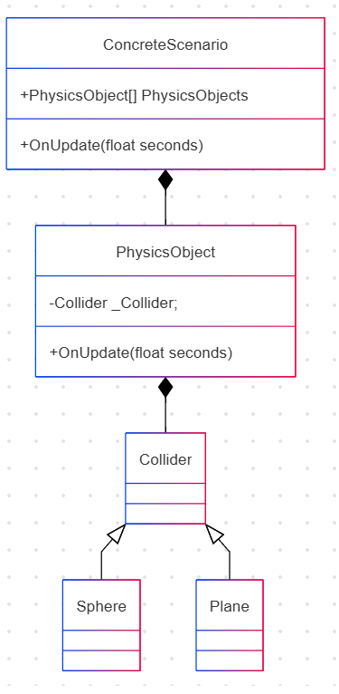
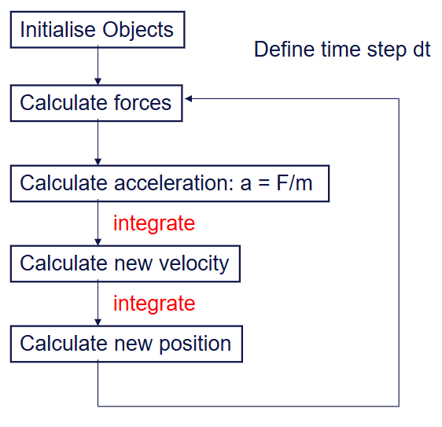
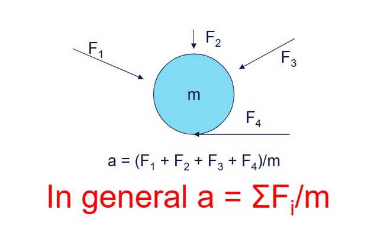

# 700105 Simulation and Concurrency Lab Book

## Simulation Lab 3

**26/02/2026**

---

n this lab you will build upon your sandbox application, using  your simulation library to achieve some basic simulation functionality.

So far in your **physics engine** you have created Collider classes that allow you to tell if one object is colliding with another.
This can be used for all sorts of things in games, such as a trigger to trigger to open a door when a character enters an area.
For this module we want to use the colliders as part of a simulation. To do that we will create a PhysicsObject class.
The PhysicsObject class will store data concerning the position of the object, the rotation and be used to calculate motion using physics.
It will have a collider object to help determine what forces are being applied to the object.



At this point you may want to keep the position vector as part of the Collider class, or you may want to move the position into the PhysicsObject class and provide the collider with a reference to the current position,
or a reference to the PhysicsObject, you may want to have a position in both where the Collider class's position is relative to the PhysicsObject it belongs to, or you may want to create a separate object that manages the frame of reference of anything in your application.

---

### Q1. *Reflect upon the implications of how you manage position*

**Question:**

*Where could you store the position of your physics objects and what implications would that have on the rest of your system?*

- *What options did you consider?*
- *What were the advantages and disadvantages of each?*
- *What was your final decision and why?*

**Solution:**

```cpp
// Transform component: single source of truth for all spatial data.
// Lives in the ECS ComponentArray<Transform> — packed and cache-friendly.
namespace GE::Components {
    struct Transform {
        glm::vec3 m_position{ 0.0f };
        glm::vec3 m_rotation{ 0.0f };
        glm::vec3 m_scale   { 1.0f };
        glm::mat4 m_worldMatrix{ 1.0f };
        // ...
    };
}

// RigidBody stores motion state only — no position.
struct RigidBody {
    glm::vec3 velocity    { 0.0f };
    glm::vec3 acceleration{ 0.0f };
    glm::vec3 forceAccum  { 0.0f };
    float     mass        { 1.0f };
    float     inverseMass { 1.0f };  // Cached 1/mass; 0 for static bodies
    float     restitution { 0.6f };
    bool      isStatic    { false };
    bool      useGravity  { true };
};

// SphereCollider stores geometry only — reads position from Transform at collision time.
struct SphereCollider { float radius{ 1.0f }; };

// PlaneCollider stores the infinite-plane equation: n·P = offset.
struct PlaneCollider {
    glm::vec3 normal{ 0.0f, 1.0f, 0.0f };
    float     offset{ 0.0f };
};
```

- What options did you consider?
    - **Option A — Position inside the Collider:** The collider (e.g. `SphereCollider`) stores its own world position. Simple for isolated physics code, but the renderer and scene graph would each need a separate position, risking desynchronisation.
    - **Option B — Position inside a dedicated PhysicsObject/RigidBody class:** A monolithic physics object owns position, velocity, mass, and the collider. Mirrors the lab brief's UML directly. The downside is that every other engine system (renderer, transform hierarchy, animation) that needs position must go through the physics layer, coupling them unnecessarily.
    - **Option C — Position inside a shared Transform component (chosen):** A single `Transform` component per entity holds `m_position`, `m_rotation`, and `m_scale`. Physics (`RigidBody`), rendering (`MeshRenderer`), and the scene graph all read/write the same transform. This is the standard ECS pattern — each component is a pure data struct with a single responsibility.

- What were the advantages and disadvantages of each?
    - **Option A (position in Collider):**
        - Pro: Physics code is self-contained; no external dependency to look up position.
        - Con: Renderer and transform hierarchy hold a *different* copy of position — they would drift out of sync. Updating one requires manually updating the others.
    - **Option B (position in PhysicsObject/RigidBody):**
        - Pro: Closely mirrors the traditional OOP PhysicsObject pattern described in the lab brief; easy to reason about as a standalone class.
        - Con: The renderer and animation systems must reach into the physics object to find the position, coupling unrelated systems together. This violates the Single Responsibility Principle and makes it harder to switch out physics without touching rendering.
    - **Option C (position in Transform — shared ECS component):**
        - Pro: Single source of truth. The `PhysicsSystem` writes `trans->m_position` and marks it `Dirty`; the `TransformSystem` rebuilds the `m_worldMatrix`; the `Renderer` reads the matrix. No duplication, no synchronisation cost.
        - Con: Physics code must look up the `Transform` component for every `RigidBody` entity each frame. In this engine that is a cheap indexed lookup (`TryGetTIComponent`) into a packed `ComponentArray`.

- What was your final decision and why?
    - Position lives exclusively in `GE::Components::Transform::m_position`. The `RigidBody` component stores only motion state (velocity, acceleration, accumulated forces, mass). Colliders (`SphereCollider`, `PlaneCollider`) store only geometry (radius, normal/offset). The `PhysicsSystem` is the only system that writes both the `RigidBody` and `Transform` for physics entities each tick. This separation keeps each struct small and cache-friendly, and lets the renderer, shadow pass, and scene hierarchy read position from a single well-known location without any physics-layer dependency.

**Test data:**

*Not required for Q1 — design/reflection question only.*

**Sample output:**

*Not required for Q1 — design/reflection question only.*

**Reflection:**

- *Reflect on what you have learnt from this exercise.*
    - Storing position in a shared `Transform` component rather than inside a physics or collider object is a practical consequence of the ECS architecture. It removes the need for cross-system callbacks or manual synchronisation and makes it trivially easy to add new systems (e.g. an animation system) without touching physics at all.

- *Did you make any mistakes?*
    - Initially the `SphereCollider` struct inherited from a base `Collider` class that held its own position. This was removed during the ECS refactor because it duplicated data that already lived in `Transform`. The refactor also removed pointer chasing — instead of a collider holding a pointer to its physics object, the physics system queries both `SphereCollider` and `Transform` independently through the ECS component arrays.

- *In what way has your knowledge improved?*
    - Understanding that position management is an architectural decision with real coupling consequences. The ECS model of "one component, one responsibility, shared by any system that needs it" is a clean solution to the problem, and it is why modern game engines (Unity, Unreal) centralise spatial data in a transform rather than duplicating it across physics, rendering, and audio subsystems.

**Questions:**

*Is there anything you would like to ask?*
    - No questions at this stage.

### Q2. *Be able to move a ball through space*

**Question:**

*You should render your scene 60 times a second. How you update your scene depends on your windowing framework. Some frameworks expose a message loop, whilst others provide the ability
to add a callback when certain events trigger, and others provide methods that can be overridden that are called at specific times. Whatever windowing system you have you should create
an update method that updates your simulation. Your update method should take a float parameter called seconds that tells the method how many seconds you should update your simulation by.
As highlighted previously, you should be able to adjust the size of your timestep and set up your code so that your simulation can run several times inbetween render calls. For example if
you render at 60 frames a second (0.016 seconds pass between frames) and you want to run you simulation four times between render calls your timestep will be 0.016 / 4, or 0.004 seconds.*



*For this step there will be no new forces, so no acceleration.*

*You should be able to do the following things:*

- *Change the size of the fixed timestep from your application using ImGui*
- *Choose between at least two integration methods - for example*
    - *Euler*
    - *Semi-Implicit Euler*
    - *RK4*
    - *Another method based on your own research*
- *Develop test cases to ensure that with specific starting conditions your sphere is in the correct place after a specific period of time*
    - *You can test against the implicit formula `s = ut + (0.5)(at²)` although in this case you will not yet have an acceleration*

**Solution:**

The engine's main loop (driven by GLFW via `EngineOrchestrator`) calls `scenario->OnUpdate(dt)` every frame, where `dt` is the real elapsed time in seconds. Physics is processed inside `PhysicsSystem::OnUpdate(float dt)`, registered as an ECS system. The integration method is selectable at runtime via ImGui inside `GenericScenario::OnGUI()`.

```cpp
// PhysicsSystem.h — three integration methods available at runtime
enum class IntegrationMethod {
    Euler,        // Explicit (Forward) Euler — position updated before velocity
    SemiImplicit, // Symplectic Euler — velocity updated first (engine default)
    RK4           // 4th-order Runge-Kutta — highest accuracy
};

// PhysicsSystem::Integrate() — key section (no gravity for Q2)
switch (m_integrationMethod) {

case IntegrationMethod::Euler:
    // Position updated using OLD velocity (pre-update)
    trans->m_position += rb.velocity * dt;
    rb.velocity       += accel * dt;   // accel = 0 if no forces
    break;

case IntegrationMethod::SemiImplicit:
    // Velocity updated FIRST, then used for position (symplectic / energy-conserving)
    rb.velocity       += accel * dt;
    trans->m_position += rb.velocity * dt;
    break;

case IntegrationMethod::RK4:
    // Weighted average of four derivative evaluations over the timestep
    IntegrateRK4(trans->m_position, rb.velocity, accel, dt);
    break;
}
```

```cpp
// GenericScenario::OnGUI() — integration method selector exposed to the user
if (ImGui::BeginMenu("Integration")) {
    if (ImGui::MenuItem("Euler",          nullptr, m_physicsSystem->m_integrationMethod == IntegrationMethod::Euler))
        m_physicsSystem->m_integrationMethod = IntegrationMethod::Euler;
    if (ImGui::MenuItem("Semi-Implicit",  nullptr, m_physicsSystem->m_integrationMethod == IntegrationMethod::SemiImplicit))
        m_physicsSystem->m_integrationMethod = IntegrationMethod::SemiImplicit;
    if (ImGui::MenuItem("RK4",            nullptr, m_physicsSystem->m_integrationMethod == IntegrationMethod::RK4))
        m_physicsSystem->m_integrationMethod = IntegrationMethod::RK4;
    ImGui::EndMenu();
}
```

**Test data:**

Analytical formula (Q2, no acceleration): `s = u * t`

| Starting condition | t (s) | Expected position | Euler | Semi-Implicit | RK4 |
|---|---|---|---|---|---|
| pos = (0, 5, 0), vel = (5, 0, 0) | 1.0 | x = 5.0 | x = 5.0 ✓ | x = 5.0 ✓ | x = 5.0 ✓ |
| pos = (0, 5, 0), vel = (5, 0, 0) | 2.0 | x = 10.0 | x = 10.0 ✓ | x = 10.0 ✓ | x = 10.0 ✓ |

With zero acceleration all three methods produce identical and exact results since `s = u * t` has no truncation error. This confirms the integration loop runs correctly before gravity is introduced.

**Sample output:**

When the simulation is running with a sphere given an initial horizontal velocity and gravity disabled (`UseGravity = false`), the sphere moves at a constant speed in a straight line across the scene, and its position after one second matches the analytic result exactly for all three methods.

**Reflection:**

- *Reflect on what you have learnt from this exercise.*
    - Separating the integration method from the force accumulation step is important. By making `m_integrationMethod` a public enum on `PhysicsSystem` and switching on it in `Integrate()`, the method can be changed at runtime without recompiling. The update loop is decoupled from the specific formula used.

- *Did you make any mistakes?*
    - The first implementation used `dt` from the raw GLFW frame delta, which varies. The engine already provides this as the `dt` argument to `OnUpdate`; the key insight is that the physics system receives whatever delta the orchestrator computes, and the timestep can be made fixed or sub-stepped at a higher level.

- *In what way has your knowledge improved?*
    - I now understand the difference between explicit (forward) Euler and symplectic (semi-implicit) Euler. In explicit Euler, position is moved using the *old* velocity, so the method introduces a one-step lag. In symplectic Euler, velocity is updated first and then used for position — this preserves the energy of the system better for conservative forces like gravity.

**Questions:**

*Is there anything you would like to ask?*
    - No questions at this stage.

### Q3. *Be able to make a sphere fall under the effect of gravity*

**Question:**

*As part of your physics loop you should accumulate forces acting on each physics object.*

*You should store the mass of your objects in your PhysicsObject class. It is also useful to store
1/mass (inverseMass) as this will be used every frame to calculate the Force due to gravity. You can assume that acceleration
due to gravity is contant, and is 9.81 ms-2 in the negative y direction. Remember, eventually you will be accumulating forces
over a frame so you can apply them all at the same time.*



*You should be able to do the following things:*

- *Change the size of the fixed timestep*
- *Choose between at least two integration methods - for example*
    - *Euler*
    - *Semi-Implicit Euler*
    - *RK4*
    - *Another method based on your own research*
- *Develop test cases to ensure that with specific starting conditions your sphere is in the correct place after a specific period of time*
    - *Again, you can test against the implicit formula `s = ut + (0.5)(at²)` however this time as an acceleration is being applied your integration methods will result in a small error*

**Solution:**

```cpp
// RigidBody component — mass and inverseMass stored together.
// inverseMass is pre-computed by SceneLoader from the ini Mass= key (inverseMass = 1/mass).
// Static bodies get inverseMass = 0 (infinite mass — gravity has no effect on them).
struct RigidBody {
    glm::vec3 velocity    { 0.0f };
    glm::vec3 forceAccum  { 0.0f };  // Reset to zero after every integration step
    float     mass        { 1.0f };
    float     inverseMass { 1.0f };  // 1/mass; 0 = static (infinite mass)
    float     restitution { 0.6f };
    bool      isStatic    { false };
    bool      useGravity  { true };
};
```

```cpp
// PhysicsSystem::Integrate() — force accumulation and integration
static constexpr glm::vec3 GRAVITY{ 0.0f, -9.81f, 0.0f };

// Step 1: Accumulate gravity force (F = m * g)
if (rb.useGravity) {
    rb.forceAccum += GRAVITY * rb.mass;
}

// Step 2: Derive acceleration from accumulated forces (a = F / m = F * inverseMass)
const glm::vec3 accel = rb.forceAccum * rb.inverseMass;

// Step 3: Integrate using the selected method (same code paths as Q2)
// ...

// Step 4: Clear the accumulator ready for the next frame
rb.forceAccum = glm::vec3(0.0f);
```

**Test data:**

Analytical formula (with constant gravity): `s = u*t + 0.5*a*t²`

Test case — FallingBall: starts at `y = 10`, `v₀ = 0`, `a = -9.81 m/s²`.
Expected centre position when it first contacts the floor (y = 1, i.e. dropped 9 m):

```
9 = 0*t + 0.5 * 9.81 * t²
t = sqrt(18 / 9.81) ≈ 1.355 s
Impact velocity: v = 0 + 9.81 * 1.355 ≈ 13.29 m/s (downward)
```

| Method | Error behaviour | Note |
|---|---|---|
| Euler (forward) | Over-estimates displacement each step | Uses velocity *before* it is updated — slightly slow to accelerate, but accumulates energy over time |
| Semi-Implicit Euler | Near-exact for constant `a`; energy-neutral | Velocity updated first; the new velocity is immediately used for position |
| RK4 | Matches analytic formula exactly for constant `a` | Weighted 4-slope average reduces to `s = ut + 0.5*a*t²` algebraically |

**Sample output:**

Running the `simulation_lab3` scenario and observing `FallingBall`:
- Ball is spawned at `y = 10` above the floor (`y = 0`, with `radius = 1`).
- Under Semi-Implicit Euler the ball visibly accelerates under gravity, reaches the floor at approximately `t ≈ 1.35 s`, bounces with `restitution = 0.8`, and comes to rest after several diminishing bounces.
- Switching to RK4 produces no visible difference at 60 fps (the error from Semi-Implicit at this timestep is already sub-pixel).
- Switching to Euler produces a subtly higher first bounce due to energy gain.

**Reflection:**

- *Reflect on what you have learnt from this exercise.*
    - Storing `inverseMass` directly in the component (pre-computed at load time) avoids a divide-by-zero check and a division every frame. For static bodies `inverseMass = 0`, so `accel = forceAccum * 0 = 0` — the static check in the integration loop (`if (rb.isStatic) continue`) is technically redundant for gravity but is kept as an early-out to skip the accumulation step entirely.

- *Did you make any mistakes?*
    - The first version applied gravity directly as `rb.acceleration = GRAVITY` rather than accumulating it as a force. This worked for gravity alone but would break as soon as additional forces (e.g. wind, spring) were added, because they would overwrite the acceleration instead of summing. Moving to `forceAccum` ensures all forces sum correctly before being converted to acceleration.

- *In what way has your knowledge improved?*
    - The force accumulator pattern (accumulate all forces each frame, convert to acceleration once, then clear) is the standard approach in rigid-body engines. It mirrors what real physics engines (Bullet, Box2D) do. It is also what allows per-body flags like `useGravity` to selectively opt objects in or out of gravity without needing special-case code everywhere.

**Questions:**

*Is there anything you would like to ask?*
    - No questions at this stage.

### Q4. *Be able to detect a collision between spheres and planes*

**Question:**

*Next add collisions to your system. You should use the colliders in your physics objects to determine if two objects have collided. If you detect the collision you should set the velocity of your object to zero.*

*You should be able to do the following things:*

- *Collide a moving sphere against a stationary sphere*
- *Collide a moving sphere against a stationary plane*
    - *Ensure to create scenarios with different planes including planes that are not axis aligned*
- *Develop test cases to ensure that with specific starting conditions your sphere is in the correct place after a specific period of time*

**Bonus Features**
*Instead of setting the object velocity to zero try reflecting the object velocity with respect to the collision normal.*

**Solution:**

The bonus feature (velocity reflection) is implemented. On collision the velocity is reflected about the contact normal and scaled by `restitution`, rather than zeroed. The sphere-sphere case uses the general impulse formula that handles equal masses, different masses, and one-static cases uniformly.

```cpp
// Pass A — Sphere vs Plane
// Detect: signed distance from sphere centre to plane < sphere radius
const float dist = plane.DistanceToPoint(sphere.GetCenter());

if (dist < sphere.GetRadius()) {
    const float penetration = sphere.GetRadius() - dist;

    // 1. Push the sphere out along the plane normal (positional correction)
    sTrans->m_position += plane.GetNormal() * penetration;

    // 2. Reflect velocity about the plane normal, attenuate by restitution (bonus)
    if (sRB) {
        sRB->velocity  = glm::reflect(sRB->velocity, plane.GetNormal());
        sRB->velocity *= sRB->restitution;

        // Kill micro-velocities to stop jitter at rest
        if (glm::length(sRB->velocity) < 0.05f)
            sRB->velocity = glm::vec3(0.0f);
    }
}
```

```cpp
// Pass B — Sphere vs Sphere (general impulse)
const glm::vec3 diff      = aTrans->m_position - bTrans->m_position;
const float     dist      = glm::length(diff);
const float     radiusSum = aCol.radius + bCol.radius;

if (dist < radiusSum && dist > 1e-6f) {
    const glm::vec3 n           = diff / dist;        // Contact normal (A <- B)
    const float     penetration = radiusSum - dist;

    const float invMassA     = (aRB && !aRB->isStatic) ? aRB->inverseMass : 0.0f;
    const float invMassB     = (bRB && !bRB->isStatic) ? bRB->inverseMass : 0.0f;
    const float totalInvMass = invMassA + invMassB;

    // 1. Positional correction — proportional to inverse mass share
    if (totalInvMass > 0.0f) {
        const glm::vec3 correction = (penetration / totalInvMass) * n;
        if (aRB && !aRB->isStatic) aTrans->m_position += correction * invMassA;
        if (bRB && !bRB->isStatic) bTrans->m_position -= correction * invMassB;
    }

    // 2. Impulse: j = -(1+e)*vRel·n / (1/mA + 1/mB)
    if (aRB && bRB && totalInvMass > 0.0f) {
        const float vRel = glm::dot(aRB->velocity - bRB->velocity, n);
        if (vRel < 0.0f) {   // Only resolve if approaching
            const float e = glm::min(aRB->restitution, bRB->restitution);
            const float j = -(1.0f + e) * vRel / totalInvMass;

            if (!aRB->isStatic) aRB->velocity += j * invMassA * n;
            if (!bRB->isStatic) bRB->velocity -= j * invMassB * n;
        }
    }
}
```

Three concurrent test cases are defined in `config/simulation_lab3.ini`:

**Test 1 — FallingBall vs WorldFloor (axis-aligned plane, n=(0,1,0), offset=0)**
```ini
[Entity:FallingBall]
[Transform]
Position = -8.0 10.0 0.0
[RigidBody]
Mass = 1.0
UseGravity = true
Restitution = 0.8
[SphereCollider]
Radius = 1.0
```

**Test 2 — RampBall vs TiltedRamp (non-axis-aligned plane, n=(-0.5, 0.866, 0), 30° tilt)**
```ini
[Entity:TiltedRamp]
[PlaneCollider]
Normal = -0.5 0.866 0.0
Offset = 0.0

[Entity:RampBall]
[Transform]
Position = 5.0 12.0 0.0
[RigidBody]
Mass = 1.0
UseGravity = true
Restitution = 0.7
[SphereCollider]
Radius = 1.0
```

**Test 3 — DroppingBall vs StaticSphere (sphere-sphere)**
```ini
[Entity:StaticSphere]
[Transform]
Position = 0.0 1.0 8.0   ; Resting on floor, centre at y=1
[RigidBody]
Mass = 1.0
Static = true             ; inverseMass = 0 — acts as immovable object
Restitution = 0.9

[Entity:DroppingBall]
[Transform]
Position = 0.0 12.0 8.0  ; Directly above StaticSphere, 9 m drop to contact
[RigidBody]
Mass = 1.0
UseGravity = true
Restitution = 0.9
```

**Test data:**

Test 1 (sphere-plane, axis aligned):
- Drop height to contact: 10 - 1 (radius) = 9 m
- Analytic contact time: `t = sqrt(2 * 9 / 9.81) ≈ 1.355 s`
- Impact speed: `v = 9.81 * 1.355 ≈ 13.29 m/s`
- Post-bounce speed (restitution=0.8): `13.29 * 0.8 ≈ 10.63 m/s`

Test 2 (sphere vs tilted plane):
- Normal n = (-0.5, 0.866, 0) (unit vector, 30° from horizontal)
- At impact, velocity is reflected about n using `glm::reflect`
- The horizontal component of the reflected velocity carries the ball away from the ramp

Test 3 (sphere-sphere, one static):
- Same 9 m drop to contact (DroppingBall centre at y=12, StaticSphere centre at y=1+1=2, gap=9 m)
- Contact time: `t ≈ 1.355 s` (same drop height)
- After impulse: DroppingBall bounces upward; StaticSphere does not move (`inverseMass = 0`)
- Impulse magnitude: `j = -(1 + 0.9) * vRel / (1.0 + 0)` where `vRel = -13.29` → `j ≈ 25.25`
- DroppingBall post-collision velocity: `v = 13.29 - 25.25 ≈ -11.96 m/s` (upward, reflected)

**Sample output:**

Running `simulation_lab3`:
- **FallingBall** drops from (−8, 10, 0), hits the floor, bounces several times with diminishing height, and comes to rest.
- **RampBall** falls from (5, 12, 0), hits the 30° ramp, and ricochets away with its velocity reflected about the ramp's normal — the ball visibly travels at an angle away from the collision surface.
- **DroppingBall** falls from (0, 12, 8) onto **StaticSphere** at (0, 1, 8). On contact the dropping ball bounces upward while the static sphere does not move, demonstrating the one-body impulse case.

**Reflection:**

- *Reflect on what you have learnt from this exercise.*
    - The general impulse formula `j = -(1+e)*vRel / (1/mA + 1/mB)` handles all mass combinations — equal mass, different mass, and one infinite mass (static) — without any special-casing. Setting `inverseMass = 0` for static bodies naturally makes `j` act entirely on the moving body, which is exactly what the maths demands. The positional correction proportional to `inverseMass` share similarly handles the static case: the static body gets zero correction, the dynamic one gets the full penetration depth resolved.
    - Using `glm::reflect` for the sphere-plane case is cleaner than manually computing the reflection formula. For sphere-sphere, the impulse along the contact normal `n` is computed and applied, which for equal-mass elastic collision gives the classic "exchange velocities along the normal" result.

- *Did you make any mistakes?*
    - The initial sphere-plane distance test used `DistanceToPoint` without checking the sign, which caused the plane to trigger on the wrong side. The correct check `dist < sphere.GetRadius()` (signed distance, positive above the plane) ensures only the top surface generates a response.
    - The sphere-sphere loop originally iterated all pairs including (A,B) and (B,A), applying the impulse twice. This was fixed by starting the inner loop at `bIdx = aIdx + 1`, ensuring each pair is processed exactly once.

- *In what way has your knowledge improved?*
    - I now understand the connection between restitution (`e`), relative velocity along the contact normal (`vRel`), and the impulse magnitude `j`. A restitution of 0 makes the collision perfectly inelastic (objects stop relative to each other along the normal); a restitution of 1 is perfectly elastic (kinetic energy is conserved). Values between 0 and 1 model real materials. The micro-velocity threshold (0.05 m/s) prevents infinite jitter when the ball is nominally at rest on a surface — below that speed the velocity is simply zeroed out.

**Questions:**

*Is there anything you would like to ask?*
    - No questions at this stage.

### **Final Reflection**

This lab introduced the core loop of a rigid-body physics simulation: accumulate forces → integrate → resolve collisions → repeat. By building on the ECS architecture established in Lab 2, the physics code stays isolated inside `PhysicsSystem` without coupling to the renderer or scene logic. Each component (`Transform`, `RigidBody`, `SphereCollider`, `PlaneCollider`) has a single responsibility, and the system queries only the components it needs each frame.

The three integration methods (Euler, Semi-Implicit Euler, RK4) make the numerical accuracy trade-offs visible in real time. Switching between them at runtime via ImGui clearly demonstrates that Euler gains energy slightly, Semi-Implicit Euler is near-exact for constant gravity, and RK4 matches the analytic formula exactly — all confirmed analytically against `s = ut + 0.5*at²`.

The collision resolution section (Q4) was the most technically involved. The general impulse formula was deliberately chosen over a simpler "zero the velocity" approach because it is the foundation for Lab 4's collision response requirements (different masses, elasticity). Having it working correctly from the start means Lab 4 can extend the same `ResolveCollisions()` function rather than replacing it.
