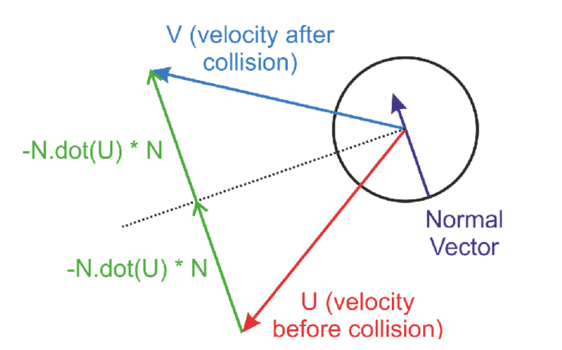
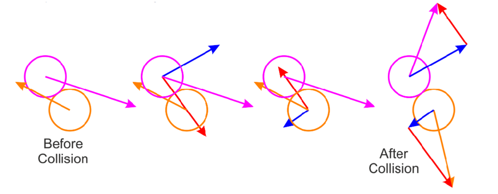
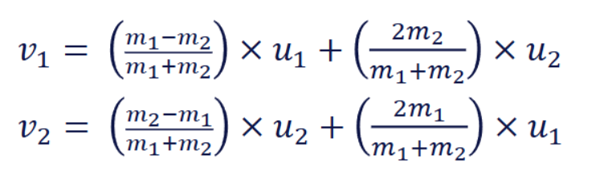

# 700105 Simulation and Concurrency Lab Book

## Simulation Lab 4

**26/02/2026**

---

In this lab you will build upon your sandbox application, using your simulation library to achieve some functionality including collision detection.

So far you should be able to use your physics engine to accumulate forces applied to objects, calculate the resultant accelerations and update the velocities and positions of particle/projectile like objects, and to detect collisions between moving spheres, other spheres and planes.

In this lab you will use what you have learnt in workshops to generate a collision response based on physics.

---

### Q1  Be able to collide a ball with a fixed object (Formative)
Add appropriate tests to your testing framework to collide a ball (a physics object with a sphere collider) with another fixed object and assign the appropriate resultant velocity by applying the correct impulse over the fixed timestep. The fixed object could be another sphere, cylinder or plane. When you detect the collision you will need to be able to determine the normal vector at the point of the collision.



Once you have added appropriate tests add the functionality to your physics engine to pass the tests.

When the tests pass add a scenario to your sandbox so that you can observe the simulation.

You should be able to demonstrate the following things:

- Using your PhysicsEngine project be able to move a ball, detect a collision with a fixed object and calculate the appropriate impulse to reflect the velocity   
- Include appropriate tests in your testing framework
- Demonstrate this functionality in your sandbox project (formative)

**Solution:**

```cpp
// TODO: Add one or more code snippets of the solution
```

**Test data:**

*The test cases are being done in another project apart from this one (simulation-engine) so leave this unanswered at the moment*

**Sample output:**

*The test cases are being done in another project apart from this one (simulation-engine) so leave this unanswered at the moment*

**Reflection:**

- *Reflect on what you have learnt from this exercise.*
    - TODO: Answer the question at hand

- *Did you make any mistakes?*
    - TODO: Answer the question at hand.

- *In what way has your knowledge improved?*
    - TODO: Answer the question at hand

**Questions:**

*Is there anything you would like to ask?*
    - No.

---

### Q2 Be able to collide a ball with another moving ball with the same mass (Summative - due in lab 05/03/26)
Add appropriate tests to your testing framework to collide a ball with another ball and assign the appropriate resultant velocity by applying the correct impulse to each ball over the fixed timestep. Initially you should do this for a variety of head on collisions. You can do this with one ball moving, and with both balls moving.



Once you have added appropriate tests add the functionality to your physics engine to pass the tests. When the tests pass add a scenario to your sandbox so that you can observe the simulation.

Next follow the same process for balls that collide at glancing collisions.

- Using your PhysicsEngine project be able to detect collisions between two moving balls and calculate the appropriate impulses to swap velocities parallel to the collision direction   
- Include appropriate tests in your testing framework
- Demonstrate this functionality in several scenarios in your sandbox project (formative)

**Solution:**

```cpp
// TODO: Add one or more code snippets of the solution
```

**Test data:**

*The test cases are being done in another project apart from this one (simulation-engine) so leave this unanswered at the moment*

**Sample output:**

*The test cases are being done in another project apart from this one (simulation-engine) so leave this unanswered at the moment*

**Reflection:**

- *Reflect on what you have learnt from this exercise.*
    - TODO: Answer the question at hand

- *Did you make any mistakes?*
    - TODO: Answer the question at hand.

- *In what way has your knowledge improved?*
    - TODO: Answer the question at hand

**Questions:**

*Is there anything you would like to ask?*
    - No.

---

### Q3 Be able to collide a ball with another moving ball with different masses (Summative- due in lab 05/03/26)
Add appropriate tests to your testing framework to collide a ball with another ball of different masses and assign the appropriate resultant velocity by applying the correct impulse to each ball over the fixed timestep. Initially you should do this for a variety of head on collisions. You can do this with one ball moving, and with both balls moving.

For the component of velocity parallel to the direction of the collision where V1 and V2 are the velocities of the two balls parallel to the direction of the collision after the collision, u1 and u2 are the components of the velocities of the two balls parallel to the direction of the collision before the collision, and m1 and m2 are the masses of the two balls.



Once you have added appropriate tests add the functionality to your physics engine to pass the tests. When the tests pass add a scenario to your sandbox so that you can observe the simulation.

- Using your PhysicsEngine project be able to detect collisions between two moving balls of different masses and calculate the appropriate impulses to swap velocities parallel to the collision direction   
- Include appropriate tests in your testing framework
- Demonstrate this functionality in several scenarios in your sandbox project (formative)

**Solution:**

```cpp
// TODO: Add one or more code snippets of the solution
```

**Test data:**

*The test cases are being done in another project apart from this one (simulation-engine) so leave this unanswered at the moment*

**Sample output:**

*The test cases are being done in another project apart from this one (simulation-engine) so leave this unanswered at the moment*

**Reflection:**

- *Reflect on what you have learnt from this exercise.*
    - TODO: Answer the question at hand

- *Did you make any mistakes?*
    - TODO: Answer the question at hand.

- *In what way has your knowledge improved?*
    - TODO: Answer the question at hand

**Questions:**

*Is there anything you would like to ask?*
    - No.

---

### Q4 Reflect on setting velocities versus calculating impulse (Summative- due in lab 05/03/26)
An impulse J can be used to represent the effect of a force over time to change the momentum of an object. If we have a fixed timestep instead of changing velocities directly we can calculate the appropriate force to give the desired change in velocity.

- J = F * dt
- F = m * a = m * dv / dt
- J = dt * m * dv / dt = m * dv

So to result in a specific change in velocity dv, given a fixed timestep dt we can apply a force F = m * dv / dt

Implement both approaches. Ensure that they are equivalent.

Consider the potential consequences when dealing with many different objects colliding, or many different forces (i.e. many collisions, gravity and friction forces) interacting with objects.

**Solution:**

```cpp
// TODO: Add one or more code snippets of the solution
```

**Test data:**

*The test cases are being done in another project apart from this one (simulation-engine) so leave this unanswered at the moment*

**Sample output:**

*The test cases are being done in another project apart from this one (simulation-engine) so leave this unanswered at the moment*

**Reflection:**

- *Reflect on what you have learnt from this exercise.*
    - TODO: Answer the question at hand

- *Did you make any mistakes?*
    - TODO: Answer the question at hand.

- *In what way has your knowledge improved?*
    - TODO: Answer the question at hand

**Questions:**

*Is there anything you would like to ask?*
    - No.

---

### Q5 Add elasticity to your physics model (Formative)

Add elasticity to your physics model. An elasticity of 1 should result in the same results as before (i.e. no energy is lost). And elasticity of 0 should result in no velocity perpendicular to the collision direction.

As you have previously begin by adding tests to your testing framework, then add functionality to your engine, and then add appropriate scenarios to your sandbox.

**Solution:**

```cpp
// TODO: Add one or more code snippets of the solution
```

**Test data:**

*The test cases are being done in another project apart from this one (simulation-engine) so leave this unanswered at the moment*

**Sample output:**

*The test cases are being done in another project apart from this one (simulation-engine) so leave this unanswered at the moment*

**Reflection:**

- *Reflect on what you have learnt from this exercise.*
    - TODO: Answer the question at hand

- *Did you make any mistakes?*
    - TODO: Answer the question at hand.

- *In what way has your knowledge improved?*
    - TODO: Answer the question at hand

**Questions:**

*Is there anything you would like to ask?*
    - No.

## Final Reflection
- TODO: Reflect on what you have learnt from this lab.