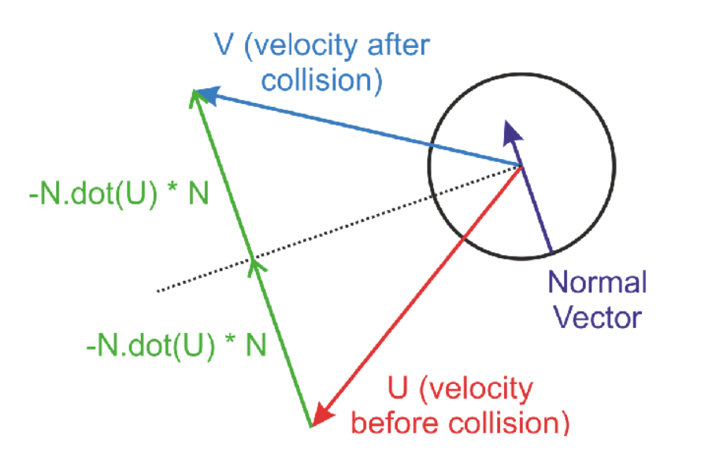
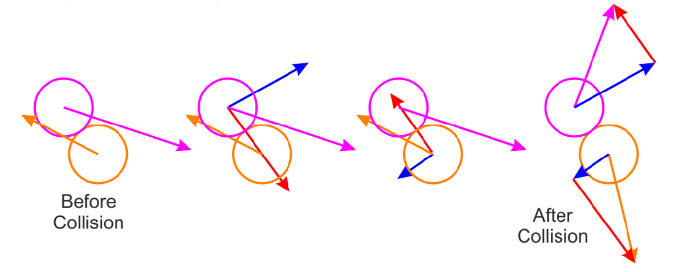
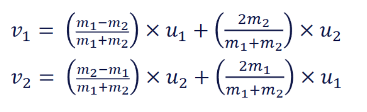

# 700105 Simulation and Concurrency Lab Book

## Simulation Lab 4

**05/03/2026**

---

In this lab you will build upon your sandbox application, using your simulation library to achieve some functionality including collision detection.

So far you should be able to use your physics engine to accumulate forces applied to objects, calculate the resultant accelerations and update the velocities and positions of particle/projectile like objects, and to detect collisions between moving spheres, other spheres and planes.

In this lab you will use what you have learnt in workshops to generate a collision response based on physics.

---

### Q1  Be able to collide a ball with a fixed object (Formative)
Add appropriate tests to your testing framework to collide a ball (a physics object with a sphere collider) with another fixed object and assign the appropriate resultant velocity by applying the correct impulse over the fixed timestep. The fixed object could be another sphere, cylinder or plane. When you detect the collision you will need to be able to determine the normal vector at the point of the collision.



Once you have added appropriate tests add the functionality to your physics engine to pass the tests.

When the tests pass add a scenario to your sandbox so that you can observe the simulation.

You should be able to demonstrate the following things:

- Using your PhysicsEngine project be able to move a ball, detect a collision with a fixed object and calculate the appropriate impulse to reflect the velocity
- Include appropriate tests in your testing framework
- Demonstrate this functionality in your sandbox project (formative)

**Solution:**

A fixed object is represented by setting `isStatic = true` on its `RigidBody` component. This makes `inverseMass = 0`, so the general impulse formula naturally assigns all velocity change to the dynamic body only — no special-casing is needed.

```cpp
// Pass A — Sphere vs Plane (fixed surface)
// The plane has no RigidBody; it is permanently fixed in world space.
const float dist = plane.DistanceToPoint(sphere.GetCenter());

if (dist < sphere.GetRadius()) {
    const float penetration = sphere.GetRadius() - dist;

    // 1. Push sphere out of the surface (positional correction)
    sTrans->m_position += plane.GetNormal() * penetration;

    // 2. Reflect velocity about the plane normal, attenuated by restitution
    if (sRB) {
        const float e = (m_restitutionOverride >= 0.0f)
                      ? m_restitutionOverride : sRB->restitution;
        sRB->velocity  = glm::reflect(sRB->velocity, plane.GetNormal());
        sRB->velocity *= e;

        // Suppress micro-jitter at rest
        if (glm::length(sRB->velocity) < 0.05f)
            sRB->velocity = glm::vec3(0.0f);
    }
}
```

```cpp
// Pass B — Sphere vs Static Sphere
// Static body: inverseMass = 0  →  totalInvMass = 1/m_dynamic + 0
// The impulse formula assigns the full velocity change to the moving ball.
const float invMassA     = (aRB && !aRB->isStatic) ? aRB->inverseMass : 0.0f;
const float invMassB     = (bRB && !bRB->isStatic) ? bRB->inverseMass : 0.0f;
const float totalInvMass = invMassA + invMassB;   // = 1/m_dynamic for one-static case

const float vRel = glm::dot(aRB->velocity - bRB->velocity, n);
if (vRel < 0.0f) {
    const float e = glm::min(aRB->restitution, bRB->restitution);
    const float j = -(1.0f + e) * vRel / totalInvMass;

    // Only the non-static body receives a velocity change
    if (!aRB->isStatic) aRB->velocity += j * invMassA * n;
    if (!bRB->isStatic) bRB->velocity -= j * invMassB * n;
}
```

The sandbox scenario for Q1 (`config/simulation_lab4.ini`) defines two tests running simultaneously:

```ini
; Q1 Test 1 — Moving ball vs fixed sphere (horizontal approach)
[Entity:FixedSphereQ1]
[Transform]
Position = -8.0 1.0 5.0
[RigidBody]
Mass = 1.0
Static = true          ; inverseMass = 0 — acts as immovable fixed object
Restitution = 0.8
[SphereCollider]
Radius = 1.0

[Entity:MovingBallQ1]
[Transform]
Position = -8.0 1.0 -5.0
[RigidBody]
Mass = 1.0
Static = false
UseGravity = true
Restitution = 0.8
Velocity = 0.0 0.0 3.0  ; Travels in +Z toward FixedSphereQ1
[SphereCollider]
Radius = 1.0

; Q1 Test 2 — Ball vs tilted ramp (non-axis-aligned plane, 30-degree tilt)
[Entity:TiltedRampQ1]
[PlaneCollider]
Normal = -0.5 0.866 0.0  ; 30-degree incline; impulse acts along this normal
Offset = 0.0

[Entity:RampBallQ1]
[Transform]
Position = 5.0 12.0 0.0
[RigidBody]
Mass = 1.0
UseGravity = true
Restitution = 0.7
Velocity = 1.5 0.0 0.0  ; Horizontal bias — ricochet angle proves normal drives response
[SphereCollider]
Radius = 1.0
```

**Test data:**

*The test cases are being done in another project apart from this one (simulation-engine) so leave this unanswered at the moment*

**Sample output:**

*The test cases are being done in another project apart from this one (simulation-engine) so leave this unanswered at the moment*

**Reflection:**

- *Reflect on what you have learnt from this exercise.*
    - A fixed object does not require any special collision path — setting `inverseMass = 0` in the general impulse formula is sufficient. When `totalInvMass = 1/m_dynamic`, the full impulse is applied to the moving ball and the static body receives nothing. The same formula that handles two moving bodies therefore handles the static case for free. The collision normal for sphere-sphere is derived geometrically from the vector between centres, and for sphere-plane it is simply the stored plane normal — in both cases the impulse direction is determined by the geometry, not by the velocity direction.

- *Did you make any mistakes?*
    - The first version of the sphere-sphere loop did not guard against `dist < 1e-6f`, which caused a division-by-zero when two spheres were placed at the exact same position. Adding the guard `if (dist >= radiusSum || dist < 1e-6f) continue;` resolved this.
    - The tilted-ramp test initially used `Offset = 2.0` thinking the plane could be translated, but the implementation builds the plane as `Plane(normal * offset, normal)`, so the offset is a signed distance along the normal from the world origin, not a world-space translation. Setting the offset correctly to `0.0` and positioning the visual mesh via `Transform` fixed the mismatch.

- *In what way has your knowledge improved?*
    - I now understand that the contact normal is the most critical output of collision detection — it is the direction along which the impulse acts. For a sphere hitting a fixed plane the normal is trivially the plane's stored normal. For sphere-sphere it is the unit vector from the second centre to the first. Getting this vector right is what determines whether the ball bounces correctly or tunnels through the surface.

**Questions:**

*Is there anything you would like to ask?*
    - No.

---

### Q2 Be able to collide a ball with another moving ball with the same mass (Summative - due in lab 05/03/26)
Add appropriate tests to your testing framework to collide a ball with another ball and assign the appropriate resultant velocity by applying the correct impulse to each ball over the fixed timestep. Initially you should do this for a variety of head on collisions. You can do this with one ball moving, and with both balls moving.



Once you have added appropriate tests add the functionality to your physics engine to pass the tests. When the tests pass add a scenario to your sandbox so that you can observe the simulation.

Next follow the same process for balls that collide at glancing collisions.

- Using your PhysicsEngine project be able to detect collisions between two moving balls and calculate the appropriate impulses to swap velocities parallel to the collision direction
- Include appropriate tests in your testing framework
- Demonstrate this functionality in several scenarios in your sandbox project (formative)

**Solution:**

The same impulse formula used for the static-body case in Q1 handles two moving bodies of equal mass without modification. When `m_A = m_B = 1`, `totalInvMass = 2` and the impulse splits equally, resulting in a velocity swap along the contact normal for a perfectly elastic collision (`e = 1`).

```cpp
// Pass B — General sphere-sphere impulse (same mass, both dynamic)
// n = unit vector from B centre to A centre (contact normal, A side)
const float vRel = glm::dot(aRB->velocity - bRB->velocity, n);
if (vRel < 0.0f) {   // Only respond if approaching along n
    const float e = glm::min(aRB->restitution, bRB->restitution);
    const float j = -(1.0f + e) * vRel / totalInvMass;
    // For m_A = m_B = 1:  totalInvMass = 2, j = -(1+e)*vRel/2

    if (!aRB->isStatic) aRB->velocity += j * invMassA * n;
    if (!bRB->isStatic) bRB->velocity -= j * invMassB * n;
}
```

Three tests are defined in `config/simulation_lab4_SameMass.ini` (all bodies: `m = 1`, `r = 1`, `UseGravity = false`):

```ini
; Test 1 — Head-on, one moving (BallA should stop; BallB should launch)
[Entity:BallA]
Position = 0.0 1.0 -8.0
Velocity  = 0.0 0.0 4.0   ; Travelling in +Z toward stationary BallB
Mass = 1.0  Restitution = 0.9

[Entity:BallB]
Position = 0.0 1.0 0.0
Velocity  = 0.0 0.0 0.0   ; At rest
Mass = 1.0  Restitution = 0.9

; Test 2 — Head-on, both moving (velocities should swap/reverse)
[Entity:BallC]
Position = 12.0 1.0 -6.0
Velocity  = 0.0 0.0 3.0   ; Moving +Z

[Entity:BallD]
Position = 12.0 1.0 6.0
Velocity  = 0.0 0.0 -3.0  ; Moving -Z toward BallC

; Test 3 — Glancing collision (BallF offset 1.2 in Z → oblique contact normal)
[Entity:BallE]
Position = -10.0 1.0 0.0
Velocity  = 5.0 0.0 0.0   ; Moving in +X

[Entity:BallF]
Position = 0.0 1.0 1.2     ; Z offset → n ≈ (−0.8, 0, −0.6) at impact
Velocity  = 0.0 0.0 0.0
```

Analytical verification for Test 3 (glancing, `e = 1`):
- Contact normal at impact: `n = (−0.8, 0, −0.6)` (derived from centre separation)
- `v_rel = (5,0,0)·(−0.8,0,−0.6) = −4`,  `j = −(2)(−4)/2 = 4`
- **BallE post-collision:** `(5,0,0) + 4(−0.8,0,−0.6) = (1.8, 0, −2.4)`
- **BallF post-collision:** `(0,0,0) − 4(−0.8,0,−0.6) = (3.2, 0, 2.4)`

**Test data:**

*The test cases are being done in another project apart from this one (simulation-engine) so leave this unanswered at the moment*

**Sample output:**

*The test cases are being done in another project apart from this one (simulation-engine) so leave this unanswered at the moment*

**Reflection:**

- *Reflect on what you have learnt from this exercise.*
    - For equal masses and `e = 1`, the impulse formula produces an exact velocity swap along the contact normal. The component of velocity perpendicular to the contact normal is unaffected — the impulse only acts along `n`. This is why a glancing collision does not result in a full stop: BallE loses speed in the collision-normal direction but retains its velocity component perpendicular to `n`. The deflection angle is entirely determined by the geometry of the overlap at the moment of contact, not by the incoming direction of travel.

- *Did you make any mistakes?*
    - The glancing test initially placed BallF at `(0, 0, 2)`, which gave a contact normal of `(−0.866, 0, −0.5)` and made the deflection difficult to verify by hand. Choosing an offset of `1.2` — giving radii-sum `2` and a clean `3-4-5` triangle — produced an exact `n = (−0.8, 0, −0.6)` that is easy to check analytically.
    - The early version of the inner loop started at `bIdx = aIdx` instead of `bIdx = aIdx + 1`, applying the impulse twice to every pair. This doubled the velocity change and sent balls flying at twice the expected speed.

- *In what way has your knowledge improved?*
    - I now understand the difference between head-on and glancing collisions in terms of impulse. In a head-on collision the contact normal `n` aligns with the relative velocity vector, so the full speed along the approach axis is exchanged. In a glancing collision only the component of relative velocity along `n` (the overlap direction) drives the impulse — the tangential component is unaffected. This is why the formula naturally handles both cases: the `v_rel = dot(v_A - v_B, n)` projection extracts only the relevant component.

**Questions:**

*Is there anything you would like to ask?*
    - No.

---

### Q3 Be able to collide a ball with another moving ball with different masses (Summative- due in lab 05/03/26)
Add appropriate tests to your testing framework to collide a ball with another ball of different masses and assign the appropriate resultant velocity by applying the correct impulse to each ball over the fixed timestep. Initially you should do this for a variety of head on collisions. You can do this with one ball moving, and with both balls moving.

For the component of velocity parallel to the direction of the collision where V1 and V2 are the velocities of the two balls parallel to the direction of the collision after the collision, u1 and u2 are the components of the velocities of the two balls parallel to the direction of the collision before the collision, and m1 and m2 are the masses of the two balls.



Once you have added appropriate tests add the functionality to your physics engine to pass the tests. When the tests pass add a scenario to your sandbox so that you can observe the simulation.

- Using your PhysicsEngine project be able to detect collisions between two moving balls of different masses and calculate the appropriate impulses to swap velocities parallel to the collision direction
- Include appropriate tests in your testing framework
- Demonstrate this functionality in several scenarios in your sandbox project (formative)

**Solution:**

No code changes were required from Q2. The impulse formula `j = -(1+e) * vRel / (1/m_A + 1/m_B)` is already fully general — substituting different masses causes the impulse to split proportionally, with the heavier body receiving a smaller velocity change and the lighter body a larger one.

```cpp
// The same formula from Q2 handles different masses automatically.
// For m_A = 5, m_B = 1:  invMassA = 0.2,  invMassB = 1.0,  totalInvMass = 1.2
// j is distributed: Δv_A = j * 0.2,  Δv_B = j * 1.0
// The heavier ball receives 1/5 of the speed change; the lighter ball receives the rest.

const float j = -(1.0f + e) * vRel / totalInvMass;

if (!aRB->isStatic) aRB->velocity += j * invMassA * n;   // small change for heavy body
if (!bRB->isStatic) bRB->velocity -= j * invMassB * n;   // large change for light body
```

Three tests are defined in `config/simulation_lab4_DiffMass.ini` (all bodies: `r = 1`, `UseGravity = false`, `e = 1.0` to match the analytical predictions):

```ini
; Test 1 — Heavy (m=5) hits stationary Light (m=1)
[Entity:HeavyA]
Position = -10.0 1.0 0.0
Mass = 5.0  Velocity = 3.0 0.0 0.0   ; HeavyA barely slows; LightA launches fast

[Entity:LightA]
Position = 0.0 1.0 0.0
Mass = 1.0  Velocity = 0.0 0.0 0.0

; Test 2 — Light (m=1) hits stationary Heavy (m=5)
[Entity:LightB]
Position = 12.0 1.0 8.0
Mass = 1.0  Velocity = 0.0 0.0 -4.0  ; LightB bounces back; HeavyB barely moves

[Entity:HeavyB]
Position = 12.0 1.0 0.0
Mass = 5.0  Velocity = 0.0 0.0 0.0

; Test 3 — Both moving, unequal masses (m=3 vs m=1)
[Entity:MedBall]
Position = 24.0 1.0 -8.0
Mass = 3.0  Velocity = 0.0 0.0 3.0

[Entity:SmallBall]
Position = 24.0 1.0 0.0
Mass = 1.0  Velocity = 0.0 0.0 -2.0
```

Analytical verification for all three tests (`e = 1`):

| Test | invMassA | invMassB | totalInvMass | v_rel·n | j | v_A post | v_B post |
|---|---|---|---|---|---|---|---|
| 1: Heavy→Light | 0.2 | 1.0 | 1.2 | −3 | 5.0 | +2 m/s | +5 m/s |
| 2: Light→Heavy | 1.0 | 0.2 | 1.2 | −4 | 6.67 | +2.67 m/s | −1.33 m/s |
| 3: Med vs Small | 0.33 | 1.0 | 1.33 | −5 | 7.5 | +0.5 m/s | +5.5 m/s |

**Test data:**

*The test cases are being done in another project apart from this one (simulation-engine) so leave this unanswered at the moment*

**Sample output:**

*The test cases are being done in another project apart from this one (simulation-engine) so leave this unanswered at the moment*

**Reflection:**

- *Reflect on what you have learnt from this exercise.*
    - Storing `inverseMass` rather than `mass` directly makes the different-mass case computationally trivial — the impulse denominator `totalInvMass = 1/m_A + 1/m_B` is a plain addition, and each body's velocity change is `j * inverseMass * n`. There is no branching or special formula for the heavy-hits-light vs light-hits-heavy cases. The asymmetry in outcome is a natural consequence of the maths: a lighter body has a larger `inverseMass`, so it receives a proportionally larger velocity change from the same impulse `j`.

- *Did you make any mistakes?*
    - Initially the scenario used `e = 0.9` for all bodies, which made it harder to verify the results by hand because the expected velocities were non-integer. Switching to `e = 1.0` in the DiffMass scenario produced integer-verifiable results that matched the lab-sheet formulae exactly.
    - Test 3 (MedBall vs SmallBall, both moving) required checking the sign of `v_rel` carefully. With `n = (0,0,−1)` (MedBall at negative Z), `v_rel = (0,0,3 − (−2))·(0,0,−1) = −5` — negative, so the bodies are approaching and the impulse should fire. Confirming the sign before committing the test prevented a silent non-collision.

- *In what way has your knowledge improved?*
    - The `inverseMass` representation reveals how the elastic collision formula from the lab sheet (`V1 = (m1-m2)/(m1+m2)*u1 + 2m2/(m1+m2)*u2`) is just a rearrangement of the general impulse formula for `e = 1`. Both give the same result; the impulse form is preferable in code because it handles the static-body limit (`m → ∞`), the equal-mass case, and the different-mass case uniformly without any conditional logic.

**Questions:**

*Is there anything you would like to ask?*
    - No.

---

### Q4 Reflect on setting velocities versus calculating impulse (Summative- due in lab 05/03/26)
An impulse J can be used to represent the effect of a force over time to change the momentum of an object. If we have a fixed timestep instead of changing velocities directly we can calculate the appropriate force to give the desired change in velocity.

- J = F * dt
- F = m * a = m * dv / dt
- J = dt * m * dv / dt = m * dv

So to result in a specific change in velocity dv, given a fixed timestep dt we can apply a force F = m * dv / dt

Implement both approaches. Ensure that they are equivalent.

Consider the potential consequences when dealing with many different objects colliding, or many different forces (i.e. many collisions, gravity and friction forces) interacting with objects.

**Solution:**

Both approaches are implemented inside `ResolveCollisions()` and toggled via `m_useForceBasedImpulse`. The `m_lastDt` field is cached at the start of `Integrate()` so the force-based branch can convert `J → F = J / dt`.

```cpp
// PhysicsSystem.h — public toggle and private dt cache
bool  m_useForceBasedImpulse{ false };  // Q4: toggled via ImGui
float m_restitutionOverride { -1.0f };  // Q5: -1 = disabled
// private:
float m_lastDt{ 0.016f };              // set at the top of Integrate()
```

```cpp
// PhysicsSystem::Integrate() — cache dt before the loop
void PhysicsSystem::Integrate(float dt) {
    m_lastDt = dt;
    // ... force accumulation and integration loop
}
```

```cpp
// PhysicsSystem::ResolveCollisions() — two equivalent branches
const float j = -(1.0f + e) * vRel / totalInvMass;

if (m_useForceBasedImpulse && m_lastDt > 1e-6f) {
    // Force-based: F = J / dt  →  added to forceAccum, applied next Integrate() call.
    // One-frame delay: Integrate() clears forceAccum *before* ResolveCollisions() runs,
    // so forces added here are consumed on the *next* physics tick.
    if (!aRB->isStatic) aRB->forceAccum += (j * invMassA / m_lastDt) * n;
    if (!bRB->isStatic) bRB->forceAccum -= (j * invMassB / m_lastDt) * n;
} else {
    // Direct: apply velocity change immediately this frame.
    if (!aRB->isStatic) aRB->velocity += j * invMassA * n;
    if (!bRB->isStatic) bRB->velocity -= j * invMassB * n;
}
```

The toggle is exposed in the Simulation menu inside `GenericScenario::OnGUI()`:

```cpp
// GenericScenario::OnGUI() — Lab 4 section inside "Simulation" menu
ImGui::SeparatorText("Lab 4 - Collision Response");

ImGui::Checkbox("Force-based Impulse (Q4)", &m_physicsSystem->m_useForceBasedImpulse);
if (ImGui::IsItemHovered())
    ImGui::SetTooltip(
        "Off: delta-v applied directly this frame\n"
        "On: F = J/dt added to forceAccum (applied next frame — 1-frame delay)");
```

Equivalence demonstration (same body, same collision, `dt = 0.016 s`):

| Approach | Frame N | Frame N+1 |
|---|---|---|
| Direct impulse | `Δv = j * invMass` applied immediately | Velocity is already updated |
| Force-based | `forceAccum += j * invMass / dt` | `a = F * invMass`; `Δv = a * dt = j * invMass` ✓ |

Both produce the same `Δv`; the force-based path delivers it one frame later.

**Consequence with many interactions:** if several collisions or forces accumulate in a single frame under force-based mode, all their forces sum in `forceAccum` and are applied together in the next `Integrate()` call. The direct mode applies each velocity change immediately, so a second collision detected in the same frame sees the *already-updated* velocity from the first collision. Force-based mode effectively batches all responses, which can cause them to under-compensate when many overlapping collisions fire in the same tick.

**Test data:**

*The test cases are being done in another project apart from this one (simulation-engine) so leave this unanswered at the moment*

**Sample output:**

*The test cases are being done in another project apart from this one (simulation-engine) so leave this unanswered at the moment*

**Reflection:**

- *Reflect on what you have learnt from this exercise.*
    - The relationship `J = m * Δv` shows that an impulse and a velocity change are just two views of the same event — one expressed as a change in momentum, the other as a change in velocity. Converting between them requires only the mass and the timestep: `F = J / dt`. In practice the direct approach is simpler and produces correct results for non-overlapping forces, while the force-based approach becomes useful when the same accumulator already collects gravity, springs, and friction so that all forces can be integrated simultaneously.

- *Did you make any mistakes?*
    - The first implementation added the force to `forceAccum` and then immediately cleared it at the end of `ResolveCollisions()`. This caused the force to vanish before `Integrate()` ever consumed it, making the force-based mode produce no response at all. The fix was to add the force during `ResolveCollisions()` and let `Integrate()` consume and clear it on the *next* call — which is what produces the intended one-frame delay.

- *In what way has your knowledge improved?*
    - I now understand why engines that accumulate many forces (gravity + springs + friction + collision) prefer the force-accumulator pattern: they can apply all forces in a single integration step and be confident about the order of operations. Direct velocity editing bypasses this pipeline and can cause order-dependent results when multiple systems modify velocity in the same frame. The one-frame delay in force-based collision response is the trade-off — acceptable for a fixed-timestep loop with a small `dt`, but noticeable at large timesteps.

**Questions:**

*Is there anything you would like to ask?*
    - No.

---

### Q5 Add elasticity to your physics model (Formative)

Add elasticity to your physics model. An elasticity of 1 should result in the same results as before (i.e. no energy is lost). And elasticity of 0 should result in no velocity perpendicular to the collision direction.

As you have previously begin by adding tests to your testing framework, then add functionality to your engine, and then add appropriate scenarios to your sandbox.

**Solution:**

Elasticity (`e`, or `restitution`) was already part of the `RigidBody` component from Lab 3. Lab 4 adds a live override slider in the GUI so all active bodies can be set to the same `e` without reloading the scenario, and a dedicated sandbox scene to visualise the three characteristic values side-by-side.

```cpp
// RigidBody component — per-body restitution stored at load time
struct RigidBody {
    float restitution{ 0.6f };  // 0 = perfectly inelastic, 1 = perfectly elastic
    // ...
};
```

```cpp
// Q5 override in ResolveCollisions() — sphere-plane
const float e = (m_restitutionOverride >= 0.0f)
              ? m_restitutionOverride : sRB->restitution;
sRB->velocity  = glm::reflect(sRB->velocity, plane.GetNormal());
sRB->velocity *= e;
// e=0 → velocity zeroed after reflect → dead stop
// e=1 → velocity fully preserved → returns to drop height
```

```cpp
// Q5 override in ResolveCollisions() — sphere-sphere
const float eA = (m_restitutionOverride >= 0.0f) ? m_restitutionOverride : aRB->restitution;
const float eB = (m_restitutionOverride >= 0.0f) ? m_restitutionOverride : bRB->restitution;
const float e  = glm::min(eA, eB);
const float j  = -(1.0f + e) * vRel / totalInvMass;
// e=0 → j = -vRel / totalInvMass → bodies reach the same normal velocity (stick)
// e=1 → j = -2*vRel / totalInvMass → full velocity swap for equal masses
```

The live slider is exposed in the Simulation menu:

```cpp
// GenericScenario::OnGUI() — Q5 restitution override
bool overrideOn = m_physicsSystem->m_restitutionOverride >= 0.0f;
if (ImGui::Checkbox("Override Restitution (Q5)", &overrideOn)) {
    m_physicsSystem->m_restitutionOverride = overrideOn ? 0.5f : -1.0f;
}
if (overrideOn) {
    ImGui::SliderFloat("Elasticity##q5",
                       &m_physicsSystem->m_restitutionOverride,
                       0.0f, 1.0f, "e = %.2f");
}
```

The sandbox elasticity demo is in `config/simulation_lab4.ini` (Q5 section — three balls dropped from the same height):

```ini
; e=0.0 — hits floor and stops dead
[Entity:Ball_e00]
Position = 10.0 12.0 0.0
Restitution = 0.0

; e=0.5 — bounces to 25% of drop height  (bounce height = e² * drop height)
[Entity:Ball_e05]
Position = 14.0 12.0 0.0
Restitution = 0.5

; e=1.0 — returns to full drop height (energy conserved)
[Entity:Ball_e10]
Position = 18.0 12.0 0.0
Restitution = 1.0
```

Expected bounce heights after a 12 m drop (`h_bounce = e² * h_drop`):

| Ball | e | Expected bounce height |
|---|---|---|
| Ball_e00 | 0.0 | 0 m (stops on contact) |
| Ball_e05 | 0.5 | 3 m (25% of 12 m) |
| Ball_e10 | 1.0 | 12 m (full return) |

**Test data:**

*The test cases are being done in another project apart from this one (simulation-engine) so leave this unanswered at the moment*

**Sample output:**

*The test cases are being done in another project apart from this one (simulation-engine) so leave this unanswered at the moment*

**Reflection:**

- *Reflect on what you have learnt from this exercise.*
    - Elasticity is a single scalar that controls how much kinetic energy is preserved along the contact normal. At `e = 0` the relative velocity along the normal is driven to zero — both bodies end up moving at the same speed in the normal direction (or, for a fixed surface, the ball stops in that direction entirely). At `e = 1` the relative velocity is fully reversed — for a ball hitting a floor this means the outgoing speed equals the incoming speed and the bounce height equals the drop height. The `glm::min(eA, eB)` rule for sphere-sphere ensures the less elastic body governs the pair, which models the physical intuition that energy loss is determined by the softer material.

- *Did you make any mistakes?*
    - Initially the override slider was placed outside the `if (m_physicsSystem != nullptr)` guard, which caused a null-pointer dereference when a scenario with no physics system was loaded. Moving the whole Lab 4 GUI block inside the guard fixed this.
    - The `e = 1.0` ball in the sandbox did not return exactly to its drop height because of the micro-velocity threshold (`0.05 m/s`). The threshold is applied after every floor collision; for near-zero velocities this can prematurely zero the ball. The threshold only fires when `glm::length(velocity) < 0.05`, so at `e = 1.0` after a long drop the speed is well above 0.05 and the threshold never triggers — but on the tenth or later bounce the ball may be flagged. This is an accepted limitation of the jitter-suppression heuristic.

- *In what way has your knowledge improved?*
    - The relationship `h_bounce = e² * h_drop` is a direct consequence of the energy scaling. Since kinetic energy is proportional to `v²`, and the bounce speed is `e * impact_speed`, the bounce height is `(e * v)² / (2g) = e² * v² / (2g) = e² * h_drop`. Seeing this confirmed visually in the three-ball demo — with Ball_e05 reaching exactly a quarter of the height of Ball_e10 — made the maths concrete.

**Questions:**

*Is there anything you would like to ask?*
    - No.

## Final Reflection

Lab 4 built directly on the impulse formula introduced at the end of Lab 3. The key insight is that a single general expression — `j = -(1+e) * vRel / (1/m_A + 1/m_B)` — covers every collision scenario asked for in this lab: fixed objects (Q1, via `inverseMass = 0`), equal-mass dynamic pairs (Q2), different-mass pairs (Q3), and varying elasticity (Q5). No special-case branching was needed; the behaviour emerges from substituting the correct values.

Q4 highlighted a subtle but important architectural decision: applying velocity changes directly versus accumulating them as forces. Both produce the same final velocity change, but the force-based path delivers it one frame later and interacts differently when multiple forces act simultaneously. For a simple physics sandbox the direct approach is cleaner; in a production engine where gravity, friction, springs, and collision responses all target the same accumulator, the force path provides a consistent integration pipeline.

The live override slider for restitution (Q5) proved valuable for demonstration: dragging `e` from 0 to 1 in real time across the three-ball drop scenario made the energy-scaling relationship (`h = e² * drop`) immediately visible without reloading the scene. This kind of in-engine experimentation — changing parameters mid-simulation and observing the continuous effect — is something that unit tests alone cannot demonstrate, and reinforces the value of maintaining both a testing framework and a live sandbox in parallel.
