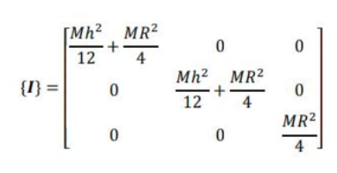
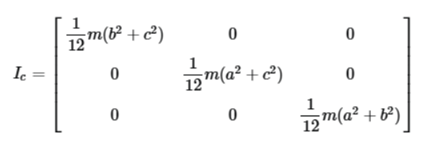

# 700105_A25_T2: Simulation and Concurrency

---

## Simulation Lab 6
In this lab you will build upon your physics engine library to achieve some functionality for manipulating the angular velocity of objects using torque.

---

### Q1  Add accumulating torque and angular acceleration (Summative - due in lab 26/03/26)
Add appropriate tests to your testing framework to apply a torque to a physics objects. Remember torque is equal to the component of force applied at a point that is perpendicular to the centre of mass multiplied by the distance to that mass. Your torque can be represented as a 3d vector with magnitude equal to the size of the torque, pointing in the direction of the axis of rotation according to the right hand rule.

 Values you might like to test include a force that only has a component that is perpendicular to the centre of mass as different distances from the centre of mass, a force that only has a parallel component (and so should produce no torque).

Once you have added appropriate tests add the functionality to your physics engine to pass the tests. When the tests pass add a scenario to your sandbox so that you can observe the simulation.

You should be able to demonstrate the following things:

- Using your PhysicsEngine project be able to apply torque producing force to a physics object.  
- Verify that your force results in the appropriate torque, angular rotation and angular velocity as expected in your testing project.
- Document your approach, your tests and your reflection in markdown.
- Demonstrate this functionality by adding appropriate scenarios to your sandbox project ***(Formative element)***

---

### Q2 Add inertia for a sphere (Summative - due in lab 26/03/26)
Inertia can be thought of as the resistance of an object to change it's angular momentum.

I = 2/5 mr2

Using this modify your physics object calculation for angular velocity such that 𝜏 = ⅆ𝐿/ⅆ𝑡 and 𝐿 = 𝐼𝜔

Repeat (or rewrite - the tests will now have different outcomes for angular velocity) your previous tests to include inertia. Verify that objects that have more mass require more torque to achieve the same angular velocity.

Once you have added appropriate tests add the functionality to your physics engine to pass the tests. When the tests pass add a scenario to your sandbox so that you can observe the simulation.

You should be able to demonstrate the following things:

- Using your PhysicsEngine project be able to apply torque producing force to a physics object.  
- Verify that your force results in the appropriate torque, angular rotation and angular velocity as expected in your testing project.
- Document your approach, your tests and your reflection in markdown.
- Demonstrate this functionality by adding appropriate scenarios to your sandbox project ***(Formative element)***

---

### Q3 Add inertia tensor for a cylinder (Summative - due in lab 26/03/26)
In the case of a solid sphere the rotational symmetry means that we can treat inertia with a single value. More generally the moment of inertia will be different along different axis. 

Modify your solution to include an inertia tensor with it's axis aligned with the z direction. For a cylinder the inertia tensor is as follows:

Remember to account for the local orientation of the cylinder - initially you should do this by using the orientation matrix to convert your torque into inertial (object) space.

Create tests to check that your program works as expected. Initially use objects with the identity matrix for their orientation. Then create more complex scenarios, like using known rotations (like 90 degrees around each cardinal axis) to compare results. Once you have added appropriate tests add the functionality to your physics engine to pass the tests. When the tests pass add a scenario to your sandbox so that you can observe the simulation.

You should be able to demonstrate the following things:

- Using your PhysicsEngine project be able to apply torque producing force to a physics object.  
- Verify that your force results in the appropriate torque, angular rotation and angular velocity (calculated using the change in angular momentum using the inertia tensor) as expected in your testing project.
- Document your approach, your tests and your reflection in markdown.
- Demonstrate this functionality by adding appropriate scenarios to your sandbox project ***(Formative element)***

---

### Q4 Reflect on the Impact of Adding Inertia when Simulating Many Objects (Summative - due in lab 26/03/26)
What is the impact of performance over a single frame. Which calculations are quick and which are slow? What results are being calculated very often? 

---

### Q5 Inverse Inertia Tensor in World Coordinates (Formative)
Once you are convinced that your calculations are correct you can optimize your engine by storing the inverse inertia tensor in your physics object. Once that is working you can also store the inverse inertia tensor in world coordinates and use that to apply your torque (again in world coordinates - instead of converting your torques to object space).

---

### Q6 Add inertia tensor for a cuboid (Formative)
Add a cuboid shape to your physics engine. The interia tensor for a cuboid is as follows:

Where the cuboid is axis aligned, and a, b and c are the dimensions of the cuboid aligned with the x, y and z axes respectively.
