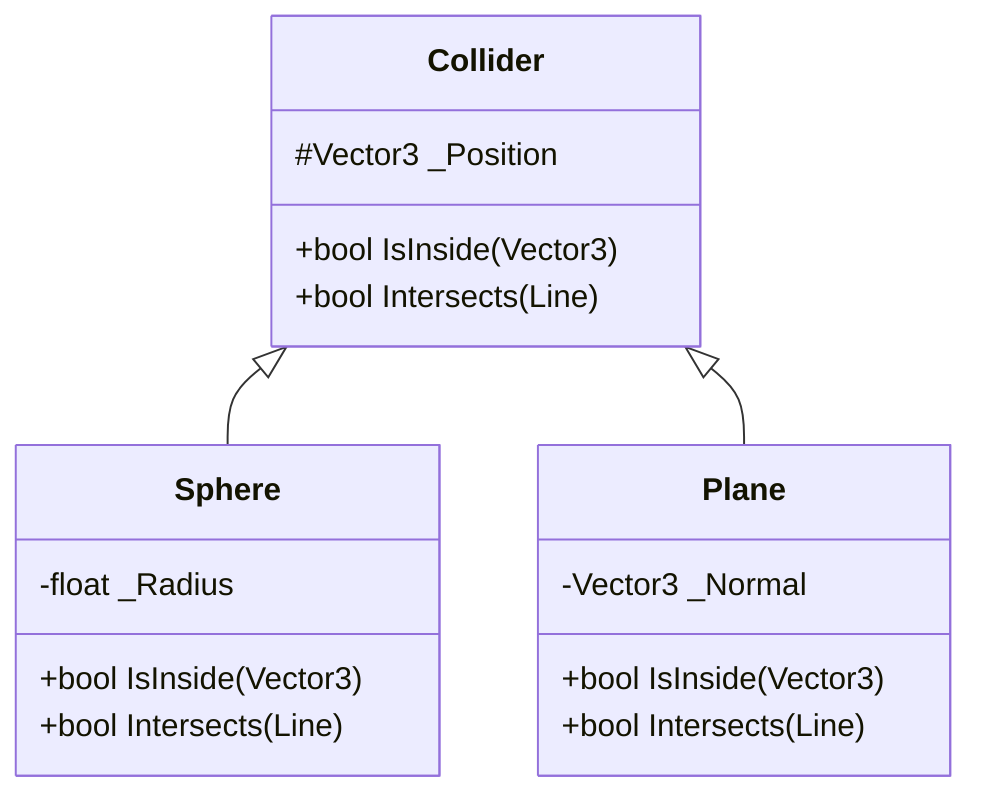
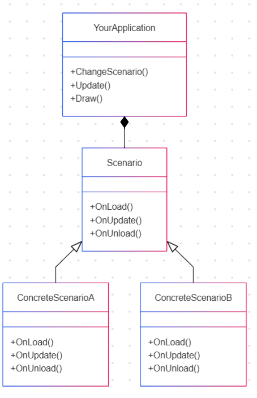
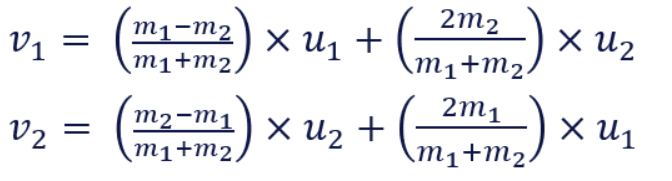

# 700105_A25_T2: Simulation and Concurrency Workshops

## Workshop 1.2 Intersections with Spheres and Planes

- Create a Line class
- Create this structure


You may want to create a "NotImplementedException" whilst you create functionality. Perhaps something like this:
```cpp
#pragma once
#include <exception>
 
class NotImplementedException : public std::exception
{
public:
	NotImplementedException(const char* message = "Function not yet implemented")
		: std::exception(message) {}
};
```

- Write Unit Tests
    - Feel free to try to use AI to generate test cases for specific scenarios - but check that they are valid. This will ensure that you understand the maths as well as checking the validity of your tests.
        - In my experience because AI likes to introduce some amount of randomness simply asking for test cases is unlikely to produce tests that are correct. It is better to also ask AI to provide it's working. 
    - Run tests to ensure failure
- Write functionality to pass tests

What does it mean for a point to be "inside" a plane? Typically this means you can be on one side or the other - either on the side that the plane normal is pointing to, or the other side. 

## Workshop 2.2 Creating a Sandbox
In this module you should create a program to run simulations to help verify your physics engine. You should start thinking about this today.

You need to create a windowing system (using Vulkan) with a user interface (using ImGui) that allows you to easily change scenarios for testing purposes

You need:

- Ability to load scenarios
    - Recommend using a state pattern (see UML below)
- Ability to render primitives
    - Sphere, Cylinder, Plane, Capsule
    - Simple Lighting
    - Orthographic Camera
    - Extra enhancements
        - Procedural "checkboard" textures in model space
        - Simple shadowmapping - shadows can give important depth cues
        - Ability to view a scenario from different positions - ideally at the same time - for example orthographic cameras aligned to an arbitrary axis (like the axis of a collision)
- Ability to start, stop and pause simulation
- Ability to change timestep

### State pattern for loading scenarios.

I recommend creating something similar to this:



You can find out about the state pattern [here](https://refactoring.guru/design-patterns/state).

---

## Workshop 3.2 Continuing the sandbox
Continue to create a program to run simulations to help verify your physics engine. You need to create a windowing system (using Vulkan) with a user interface (using ImGui) that allows you to easily change scenarios for testing purposes.

As a reminder you need:

- Ability to load scenarios
    - Recommend using a state pattern
- Ability to render primitives
    - Sphere, Cylinder, Plane, Capsule
    - Simple Lighting
    - Orthographic Camera
    - Extra enhancements
        - Procedural "checkboard" textures in model space
        - Simple shadowmapping - shadows can give important depth cues
        - Ability to view a scenario from different positions - ideally at the same time - for example orthographic cameras aligned to an arbitrary axis (like the axis of a collision)
- Ability to start, stop and pause simulation
- Ability to change timestep

### Adding movement

Give your objects a velocity and start to move objects using integration methods we have covered previously. Check you are able to start, stop and pause the simulation, and adjust a fixed simulation timestep.

Add some of your collision detection to stop an object when it collides with another object.

---

## Workshop 4.1 Creating Collision Response Tests

Generate test data for the following cases and add tests to your testing project. You might like to create a table in your markdown files associated with the module to record your tests. You may also want to write the tests as you go.

### Direct collisions moving ball A to stationary ball B

If a moving ball A collides with a stationary ball B in a direct collision (i.e. where the direction of the collision goes through the centre of the ball) then the moving ball should stop and the stationary ball should start moving with the velocity of the moving ball (assuming the same mass)

You can test this with velocities that are axis aligned, and with a more general velocity.

You should test this using your Physics Engine and Unit Test Project and also your Sandbox if is it ready.

### Direct collisions with 2 moving balls

If a moving ball A collides with a moving ball B in a direct collision (i.e. where the direction of the collision goes through the centre of the ball and the velocities are parallel) then the balls should "swap" their velocities.

You can test this with velocities opposing directions or in the same direction (the trailing ball will have to be moving faster than the leading ball to catch up), and with velocities that are axis aligned, or more general velocities.

You should test this using your Physics Engine and Unit Test Project and also your Sandbox if is it ready.

### Collisions at an angle with 2 moving balls

If a ball A collides with another ball B at an angle the components of the velocity that are parallel to the collision direction are swapped. The perpendicular components are retained by the original ball.

You can test this with velocities that are parallel to the collision direction, perpendicular to the collision direction or at an angle. 

You should test this using your Physics Engine and Unit Test Project and also your Sandbox if is it ready.

All previous tests should still be valid.

### Additional testing strategy

An additional test could be to measure the kinetic energy of the system before and after the collision. Energy should be conserved. This test will fail when we add elasticity that simulates loss of energy (for example due to deformation) however with elasticity set to 1 the tests should still be valid.

---

## Workshop 4.2 Conservation of Momentum Tests

Generate test data for the following cases and add tests to your testing project. You might like to create a table in your markdown files associated with the module to record your tests. You may also want to write the tests as you go.



In all cases momentum before collision should equal momentum after the collision.

***m1u1 + m2u2 = m1v1 + m2v2***

Where m is mass, u is velocity before collision and v is velocity after collision.

Similar to the previous workshop develop a series of tests to cover each distinct scenario. For objects with the same mass all previous tests should still work.

You should test this using your Physics Engine and Unit Test Project and also your Sandbox if is it ready - although the sandbox is unlikely to give clear visual results in the same way that swapping velocities does.

---

## Workshop 5.1 Angular Velocity Tests

Add a representation of orientation and angular velocity to your physics object class. Initially use whatever method makes most sense to you. If you 're not sure start by representing both as 3x3 matrices.

### Create Basic Rotational Displacement Tests

Your tests will depend on your representation. Generate test data to apply a rotation to your physics object orientation, then check the values of the cardinal axis are correct. You might like to create a table in your markdown files associated with the module to record your tests. You may also want to write the tests as you go.

Values you might like to test include 90 ( pi/2 radians), 180 (pi radians), 270 ( 3 pi / 2 radians) and 360 (2 pi radians) degree rotations in x, y and z - and some combination of both.

Later it will be important that angles are expressed as radians, but here degrees are used to aid comprehension.

### Create Basic Angular Velocity Tests

Your tests will depend on your representation. Generate test data to simulate an angular velocity with a fixed timestep for a specific period of time, then check the values of the cardinal axis are correct. You might like to create a table in your markdown files associated with the module to record your tests. You may also want to write the tests as you go.

Values you might like to test include 90 ( pi/2 radians), 180 (pi radians), 270 ( 3 pi / 2 radians) and 360 (2 pi radians) degree rotations per second in x, y and z - and some combination of both. The run your simulation for 1, 2, 3 and 4 seconds (integrating over timesteps) and check that your orientation is correct.

---

## Workshop 5.2 Applying Torque

In this workshop you will apply torque to your objects. Initially you will not consider inertia. 

### Adding Torque without Inertia

- Add a representation of accumulated torques to your physics object class. Use that to calculate angular acceleration and apply that to your objects each frame. Use the acceleration to modify the angular velocity, which you can use to modify angular displacement.
    - For this step you can either use τ = mω (which is incorrect - we will fix this later)
    - Alternatively you could use I for a sphere, which is (2/5) * mr2
- Create methods to apply a force at a point, and split that force into a parallel (linear - through the centre of mass) force and a perpendicular force. Calculate the torque generated by the perpendicular force using the perpendicular force multiplied by the distance.

### Adding Inertia

- Add a representation of the inertia tensor I that represents the distribution of mass around an object. This is typically stored as a 3x3 matrix and will be different for different shapes. You can calculate the inertia tensor mathematically, but I recommend looking up the formula for different shapes.
- Using τ=ⅆL/ⅆt and L=Iω (L is angular momentum – ω is angular acceleration and I is the inertia tensor) calculate ω and use that in your PhysicsObject
