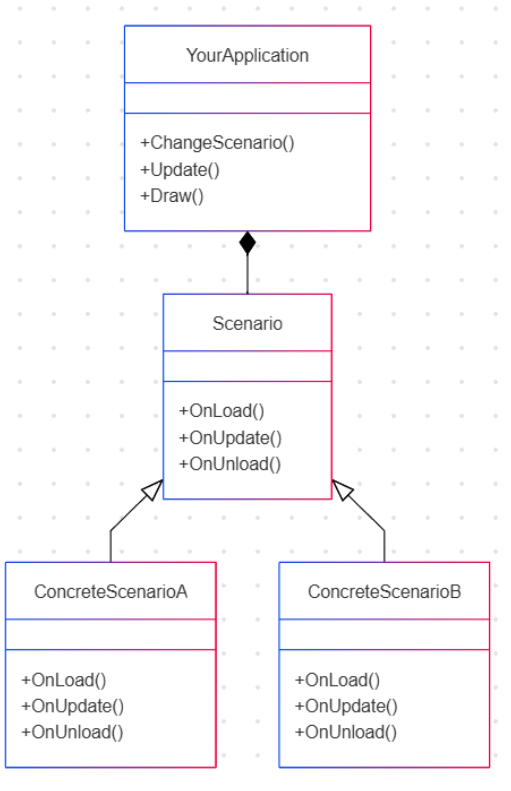

# 700105_A25_T2: Simulation and Concurrency

## Workshop 2.2 Creating a Sandbox
In this module you should create a program to run simulations to help verify your physics engine. You should start thinking about this today.

You need to create a windowing system (using Vulkan) with a user interface (using ImGui) that allows you to easily change scenarios for testing purposes

You need:

- Ability to load scenarios
    - Recommend using a state pattern (see UML below)
- Ability to render primitives
    - Sphere, Cylinder, Plane, Capsule
    - Simple Lighting
    - Orthographic Camera
    - Extra enhancements
        - Procedural "checkboard" textures in model space
        - Simple shadowmapping - shadows can give important depth cues
        - Ability to view a scenario from different positions - ideally at the same time - for example orthographic cameras aligned to an arbitrary axis (like the axis of a collision)
- Ability to start, stop and pause simulation
- Ability to change timestep

### State pattern for loading scenarios.

I recommend creating something similar to this:

You can find out about the state pattern [here](https://refactoring.guru/design-patterns/state).

---

## Workshop 3.2 Continuing the sandbox
Continue to create a program to run simulations to help verify your physics engine. You need to create a windowing system (using Vulkan) with a user interface (using ImGui) that allows you to easily change scenarios for testing purposes.

As a reminder you need:

- Ability to load scenarios
    - Recommend using a state pattern
- Ability to render primitives
    - Sphere, Cylinder, Plane, Capsule
    - Simple Lighting
    - Orthographic Camera
    - Extra enhancements
        - Procedural "checkboard" textures in model space
        - Simple shadowmapping - shadows can give important depth cues
        - Ability to view a scenario from different positions - ideally at the same time - for example orthographic cameras aligned to an arbitrary axis (like the axis of a collision)
- Ability to start, stop and pause simulation
- Ability to change timestep

### Adding movement

Give your objects a velocity and start to move objects using integration methods we have covered previously. Check you are able to start, stop and pause the simulation, and adjust a fixed simulation timestep.

Add some of your collision detection to stop an object when it collides with another object.