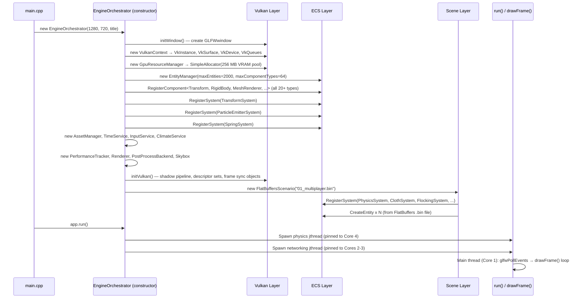

# Chapter 0 — Getting Started: From Zero to First Frame

> **Who this chapter is for:** Someone who just cloned or received this repository and wants to
> build and run the engine for the first time, understand every file they see, and make their
> first meaningful code change.

---

## 0.1 Prerequisites

Before you open Visual Studio, you need the following installed on your machine.

### Required Tools

| Tool | Version | Where to Get It |
|------|---------|----------------|
| **Windows** | 10 or 11 | — |
| **Visual Studio 2022** | 17.x (Community is free) | visualstudio.microsoft.com |
| **Vulkan SDK** | 1.4.x (tested on 1.4.321.1) | vulkan.lunarg.com |
| **GLFW** | 3.4 (pre-compiled Win64 binaries included in repo) | Already in `external-libraries/` |
| **GLM** | 0.9.9+ (header-only, included in repo) | Already in `external-libraries/` |
| **stb** | (header-only, included in repo) | Already in `external-libraries/` |

### Optional (for authoring new scenes)

| Tool | Version | Notes |
|------|---------|-------|
| **FlatBuffers compiler (`flatc`)** | 23.x | Only for JSON → `.bin` scene authoring |

**Why FlatBuffers is optional:** The engine loads pre-compiled `.bin` files at runtime. The
`.bin` files are already committed to the repository. You only need `flatc` if you want to
create or modify scene JSON files and re-compile them.

### Visual Studio Workloads

During VS installation, enable:
- **Desktop development with C++** (provides MSVC v143 compiler)
- **C++ CMake tools** is NOT needed — this project uses a `.sln` / `.vcxproj`

### Verifying the Vulkan SDK

Open a command prompt and run:
```
glslc --version
```
You should see something like `glslc 2024.x Shaderc v...`. If not, add
`C:\VulkanSDK\1.4.321.1\Bin` to your `PATH` environment variable.

---

## 0.2 Building the Engine

### Opening the Solution

1. Navigate to the repository root in File Explorer.
2. Double-click **`simulation-engine.sln`** to open it in Visual Studio 2022.
3. Visual Studio will load the single project `simulation-engine`.

### Choosing a Configuration

Use the **Release x64** configuration for normal use:
- **Release** enables optimisations. Physics at 120 Hz + graphics at 60 Hz run smoothly.
- **Debug** disables optimisations and enables Vulkan validation layers. Expect 30–50% slower
  rendering but helpful error messages from the validation layer.

To switch: in the VS toolbar, change the dropdowns to `Release` and `x64`.

### Building

Press **Ctrl+Shift+B** (Build Solution) or go to **Build → Build Solution**.

A successful build ends with:
```
========== Build: 1 succeeded, 0 failed, 0 up-to-date, 0 skipped ==========
```

**Output binary:** `x64\Release\simulation-engine.exe`

### Common Build Errors and Fixes

| Error | Cause | Fix |
|-------|-------|-----|
| `Cannot open include file: 'vulkan/vulkan.h'` | Vulkan SDK not installed or not in Include dirs | Install Vulkan SDK; VS project already has the include path set via `$(VULKAN_SDK)` |
| `unresolved external symbol vkCreateInstance` | Vulkan lib not linked | The `.vcxproj` links `vulkan-1.lib` from `$(VULKAN_SDK)\Lib`; verify the SDK installed correctly |
| `Cannot open include file: 'GLFW/glfw3.h'` | Wrong project configuration | Ensure you are building `x64`, not `Win32`; paths are x64-only |
| `LNK2019` with `glfw3` | GLFW lib missing | The GLFW `.lib` is in `external-libraries/glfw-3.4.bin.WIN64/lib-vc2022/` |

---

## 0.3 Compiling Shaders

Shaders are written in **GLSL** (`.vert`, `.frag`, `.comp` files in `shaders/`) and must be
compiled to **SPIR-V** (`.spv` binary) before the engine can load them.

The compiled `.spv` files are **already committed** to the repository. You do not need to
recompile unless you edit a shader source file.

### When to Recompile

- You edit any `.vert`, `.frag`, or `.comp` file in `shaders/`.
- If you run the engine without recompiling after a shader change, you will see either a crash
  or the old shader behavior (the `.spv` on disk is stale).

### How to Recompile

Open a command prompt, navigate to `shaders/`, and run:

```bat
cd shaders
compile.bat
```

`compile.bat` calls `glslc.exe` for every shader pair:

```bat
C:/VulkanSDK/1.4.321.1/Bin/glslc.exe phong.vert  -o phong_vert.spv
C:/VulkanSDK/1.4.321.1/Bin/glslc.exe phong.frag  -o phong_frag.spv
...
```

> **Important:** `compile.bat` hardcodes the Vulkan SDK path to version 1.4.321.1. If you
> install a different version, edit the paths at the top of `compile.bat`.

### What SPIR-V Is

SPIR-V is a binary intermediate representation. Vulkan does not accept GLSL directly — it
requires SPIR-V. The compiler (`glslc`) validates the GLSL, optimises it, and outputs the
`.spv` binary. This binary is loaded at runtime by `ShaderModule` in `include/graphics/ShaderModule.h`.

---

## 0.4 Running for the First Time

### Launching

Double-click `x64\Release\simulation-engine.exe` in File Explorer, or press **F5** in Visual
Studio (which builds and runs in one step).

### What You Should See

A 1280×720 window titled **"Simulation and Concurrency Lab: Simulation-Engine"** opens with:
- A 3D arena (box-shaped room) containing four coloured physics balls (one per peer slot)
- An animated platform moving back and forth
- A debug overlay (ImGui) in the top-left corner

### Navigating the Engine

| Control | Effect |
|---------|--------|
| **Arrow keys / WASD** | Move the local player ball |
| **Space** | Jump (apply upward force) |
| **Right-click + drag** | Rotate the camera |
| **Scroll wheel** | Zoom the camera |
| **Tab** | Cycle camera presets (front / bird's eye / orbit) |
| **R** | Reset simulation |

### The ImGui Menus

Click on any top-bar menu to open it:

| Menu | Controls |
|------|---------|
| **Scenes** | Switch between the 6 demo scenes |
| **Simulation** | Pause/step, physics Hz, graphics Hz |
| **Physics** | Integration method (Euler/SemiImplicit/RK4), gravity, restitution override |
| **Cloth** | Wind, burn sources, tearing threshold, spring constants |
| **Flocking** | Spatial mode, neighbour weights, freeze, restart |
| **Network** | Auto-connect or manual peer configuration |
| **Spawner** | Monitor spawner entity counts |
| **Debug** | Toggle collider wireframes, cloth debug lines, entity inspector |
| **Display** | Shading mode (Phong/Gouraud), shadows, post-processing bloom |
| **Climate** | Wind direction/speed, temperature |

### The Six Demo Scenes

| File | Description |
|------|-------------|
| `01_multiplayer.bin` | Open arena with 4 player balls, moving platforms |
| `02_shapes_and_materials.bin` | All geometry types, per-material restitution |
| `03_animation_platforms.bin` | Waypoint-animated objects, easing functions |
| `04_spawner_factory.bin` | Spawner entities shooting physics objects |
| `05_cloth_simulation.bin` | PBR fabric cloth, wind, burn, tear |
| `06_flocking_boids.bin` | 60 boids with obstacles, spatial partitioning |

---

## 0.5 Project File Tour

Understanding where things live is the first step to modifying the engine.

```
simulation-engine/
│
├── simulation-engine.sln          ← Visual Studio solution file (open this)
├── simulation-engine.vcxproj      ← Project file (source files, include paths, libs)
│
├── include/                       ← All header files, mirrored by source/
│   ├── core/                      ← EngineOrchestrator, ServiceLocator, Logger, Common
│   ├── ecs/                       ← EntityManager, ComponentArray, IECSystem
│   ├── components/                ← Transform, RigidBody, ClothComponent, etc.
│   ├── systems/                   ← PhysicsSystem, ClothSystem, FlockingSystem, etc.
│   ├── scene/                     ← Scenario, FlatBuffersScenario, FBSceneAdapter
│   │   └── fb/                    ← FlatBuffers-specific adapters and context
│   ├── graphics/                  ← VulkanContext, Renderer, GraphicsPipeline, etc.
│   ├── networking/                ← NetworkService, Packets
│   ├── particles/                 ← GpuParticleBackend, Particle
│   ├── assets/                    ← AssetManager, OBJLoader, Vertex, Model, Mesh
│   ├── physics/                   ← Collider shape headers (Sphere, Plane, Capsule, etc.)
│   ├── lighting/                  ← LightSource, PointLightSource
│   ├── services/                  ← InputService, TimeService, DebugOverlay, etc.
│   └── memory/                    ← SimpleAllocator (TLSF VRAM pool)
│
├── source/                        ← .cpp implementations (mirroring include/)
│   ├── main.cpp                   ← Entry point
│   ├── core/                      ← EngineOrchestrator.cpp, NetworkBridge.cpp
│   ├── systems/                   ← PhysicsSystem.cpp, ClothSystem.cpp, etc.
│   └── networking/                ← NetworkService.cpp
│
├── shaders/                       ← GLSL sources + compiled .spv files
│   ├── compile.bat                ← Recompile all shaders
│   ├── phong.vert / phong.frag    ← Primary Phong lighting shader
│   ├── flatcolor.vert / .frag     ← Flat-color (owner-color) shader
│   ├── *.comp                     ← GPU compute shaders (snow, rain, fire, etc.)
│   └── *.spv                      ← Compiled SPIR-V (committed to repo)
│
├── config/
│   └── flatbufferConfig/
│       ├── showcases/             ← Active demo scenes (.bin files)
│       ├── old_showcases/         ← Legacy scenes (not shown in menu)
│       └── tests/                 ← Test scenes (cloth_test, flock_test, etc.)
│
├── flatbuffers/
│   ├── Scene.fbs                  ← FlatBuffers schema (edit to extend the scene format)
│   └── Scene_generated.h          ← Hand-patched C++ types (do NOT regenerate via flatc)
│
├── models/                        ← OBJ mesh files (cacti, rocks, sorceress, etc.)
├── textures/                      ← PNG textures and cubemap faces
└── external-libraries/            ← Vendored dependencies (read-only)
    ├── glfw-3.4.bin.WIN64/
    ├── glm/
    ├── imgui/                     ← Dear ImGui (NEVER EDIT THESE FILES)
    └── stb/
```

### The Header/Source Split

Headers live in `include/<domain>/`, implementations in `source/<domain>/`. This mirrors the
subsystem namespacing (`GE::ECS::`, `GE::Graphics::`, etc.) and makes it easy to find a file:
if you want to understand the physics system, open `include/systems/PhysicsSystem.h` for the
interface and `source/systems/PhysicsSystem.cpp` for the implementation.

---

## 0.6 Your First Modification

This exercise walks you through a simple, observable change that verifies your build pipeline
works end-to-end.

### Goal: Change the Gravity Constant

The default gravity is 9.8 m/s². We will change it to 2.0 m/s² (Moon gravity) to see objects
fall in slow motion.

### Step 1 — Locate the gravity value

Open `source/systems/PhysicsSystem.cpp`. Search for `9.8f` or `gravity`. You should find a
line similar to:

```cpp
// In PhysicsSystem::Integrate() — approximate location
if (rb.useGravity) {
    rb.forceAccum += glm::vec3(0.0f, -9.8f * rb.mass, 0.0f);
}
```

### Step 2 — Change the value

```cpp
rb.forceAccum += glm::vec3(0.0f, -2.0f * rb.mass, 0.0f);  // Moon gravity
```

### Step 3 — Rebuild

Press **Ctrl+Shift+B**. Only `PhysicsSystem.cpp` needs to recompile — MSVC's incremental
compilation handles this automatically.

### Step 4 — Run and observe

Launch the engine. Open the `02_shapes_and_materials` scene (Scenes menu). Drop the physics
balls off the platform — they should float down noticeably slower than before.

### Step 5 — Revert or expose via ImGui

The engine already exposes gravity via an ImGui slider in the **Physics** menu (`m_gravityEnabled`
flag). For a more permanent change, you could add a `m_gravityStrength` member to
`PhysicsSystem` and wire it to a slider — this is exactly how most engine parameters are
exposed.

---

## 0.7 What Happens Between `main()` and the First Frame

Understanding the startup sequence helps you know where to look when something goes wrong.



### Key Observations

**RAII ordering matters.** The constructor initialises subsystems in dependency order: Vulkan
hardware is needed before the renderer; the renderer is needed before the scene; the scene is
needed before the first `drawFrame()`. If construction throws (e.g., Vulkan device creation
fails), all already-constructed members are destroyed in reverse order — no GPU resources leak.

**All entities come from the scene.** The `EngineOrchestrator` itself creates no entities.
Entity creation only happens in `Scenario::OnLoad()` → `FBSceneAdapter::Adapt()` → `EntityManager::CreateEntity()`.

**Three threads start before the first frame.** By the time `drawFrame()` runs, the physics
thread is already ticking at 120 Hz. The rendering thread reads a pre-populated
`SimulationState` snapshot immediately.

### Step-by-Step File References

| Step | File | What Happens |
|------|------|-------------|
| `main()` entry | `source/main.cpp:13` | Constructs `EngineOrchestrator`, calls `run()` |
| Window creation | `source/core/EngineOrchestrator.cpp` → `initWindow()` | GLFW window created, callbacks registered |
| Vulkan init | `source/core/EngineOrchestrator.cpp` → `initVulkan()` | Instance, device, swapchain, render pass |
| ECS bootstrap | `EngineOrchestrator` constructor | Components registered, engine systems added |
| Scene load | `FlatBuffersScenario::OnLoad()` | `.bin` parsed, entities created |
| Physics thread | `runPhysicsLoop(stop_token)` | Fixed-timestep accumulator starts |
| Render loop | `drawFrame()` | Acquires swapchain image, records commands, submits |

---

*Next: [Chapter 1 — Entity Component System](01_ECS_Core.md)*
