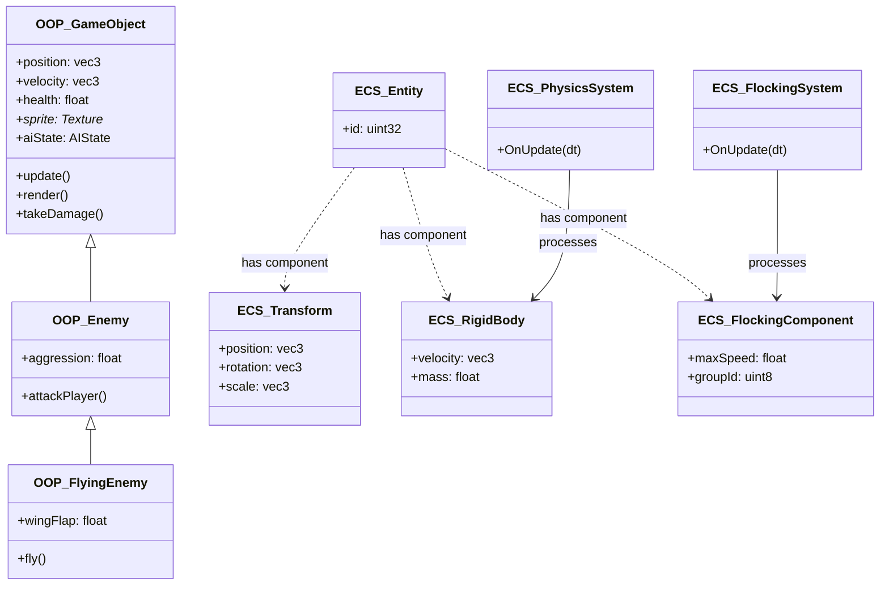
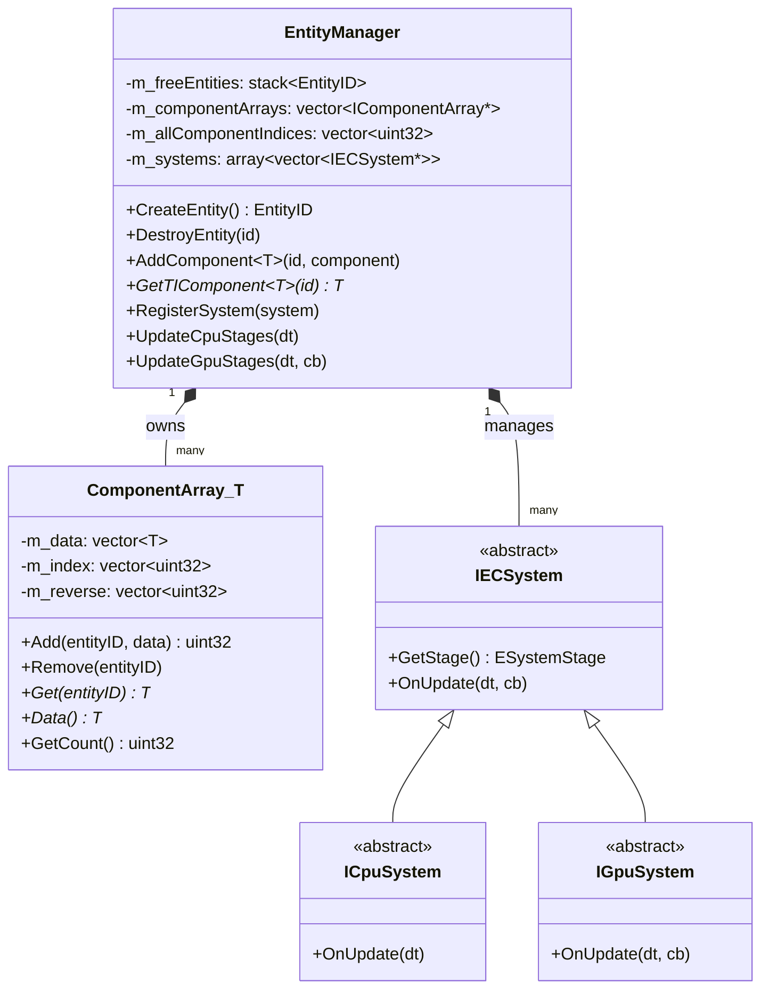
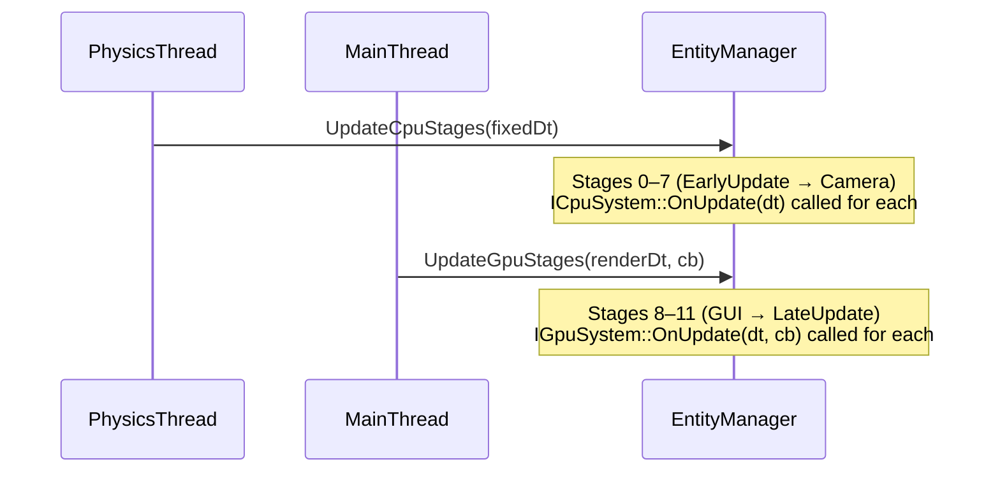
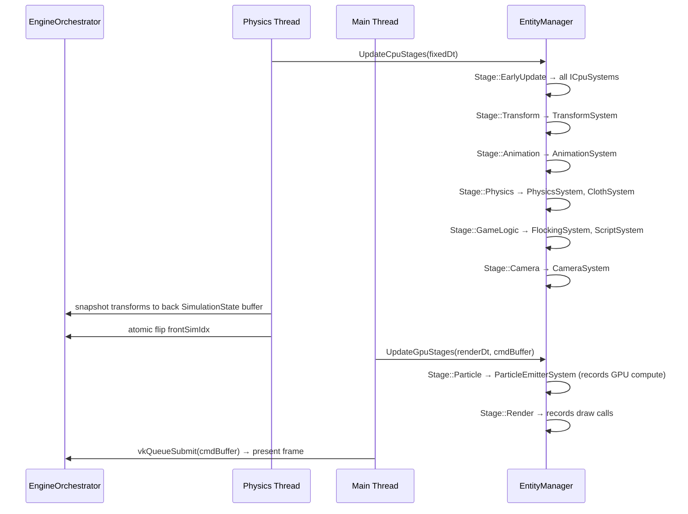

# Chapter 1 — Entity Component System: From Concept to Implementation

## 1.1 What Is ECS and Why Does It Exist?

Imagine a classic object-oriented game engine. You might have a class `GameObject` that holds position, health, a sprite, AI state, and physics data all together. As the game grows, you add more fields. Subclasses proliferate — `Enemy extends GameObject`, `FlyingEnemy extends Enemy`. Within a few months you have an inheritance tree that is impossible to reason about, and changing one base class breaks everything below it.

**ECS (Entity Component System)** solves this by flipping the design:

- **Entity** — just an ID (a number). It holds no data.
- **Component** — a plain data struct. It holds data but has no logic.
- **System** — a class that holds logic and operates on collections of components.

### Traditional OOP vs ECS



The key insight: **composition over inheritance**. A "flying enemy that has health and AI" is just an entity with `Transform`, `RigidBody`, `FlockingComponent`, and `HealthComponent` — no subclassing needed.

### Performance Benefit: Data-Oriented Design

OOP stores all data for one object together (**Array of Structs / AoS**). ECS stores all data of one type together (**Structure of Arrays / SoA**).

```
AoS (OOP): Memory looks like...
[Entity0: pos|vel|health|sprite][Entity1: pos|vel|health|sprite]...
 ↑ When iterating physics, we read pos+vel but skip health+sprite — cache wasted

SoA (ECS): Memory looks like...
[pos0|pos1|pos2|...] [vel0|vel1|vel2|...] [health0|health1|...]
 ↑ Physics iterates only pos+vel arrays — every cache line is useful
```

This difference can be 3–10× faster for large numbers of entities.

---

## 1.2 This Engine's ECS at a Glance



**Files involved:**
- `include/ecs/EntityManager.h` — central ECS hub
- `include/ecs/ComponentArray.h` — SoA storage per component type
- `include/ecs/IECSystem.h` — system interfaces + `ESystemStage` enum
- `include/ecs/Entity.h` — `Entity` struct (wraps `uint32_t`)
- `include/ecs/ComponentType.h` — auto-generates type IDs at compile time

---

## 1.3 Entities: Just Numbers

```cpp
// include/ecs/Entity.h
struct Entity {
    Entity();
    ~Entity();
    bool Initialize(uint32_t id);
    void Shutdown();
    uint32_t m_id;    // The entity IS this number
};

using EntityID = uint32_t;
```

Creating and destroying entities:

```cpp
// Somewhere in a Scenario::OnLoad():
GE::ECS::EntityManager* em = ServiceLocator::GetEntityManager();

EntityID sphereID = em->CreateEntity();    // Gets next available ID
EntityID planeID  = em->CreateEntity();    // Another ID

// Later, when the scenario unloads:
em->DestroyEntity(sphereID);               // ID pushed back onto free stack
em->ClearAllEntities();                    // Wipes everything
```

**Entity recycling:** `EntityManager` keeps a `std::stack<EntityID> m_freeEntities`. When you destroy entity 42, its ID goes onto the stack. The next `CreateEntity()` call pops it and reuses 42. This prevents ID overflow and avoids gaps.

---

## 1.4 Components: Pure Data Structs

Components are **plain data** — no virtual methods, no constructors with side effects, no logic. Here are representative examples from this engine:

```cpp
// include/components/Transform.h — every visible entity has this
namespace GE::Components {
struct Transform {
    glm::vec3 m_position { 0.0f, 0.0f, 0.0f };
    glm::vec3 m_rotation { 0.0f, 0.0f, 0.0f };  // Euler angles (degrees)
    glm::vec3 m_scale    { 1.0f, 1.0f, 1.0f };
    glm::mat4 m_worldMatrix { 1.0f };             // Computed by TransformSystem
    glm::mat4 m_localMatrix { 1.0f };
};
}

// include/components/PhysicsComponents.h — entities with physics
namespace GE::Components {
struct RigidBody {
    float     mass { 1.0f };
    float     inverseMass { 1.0f };    // Pre-computed 1/mass; 0 = infinite (static)
    glm::vec3 velocity { 0.0f };
    glm::vec3 angularVelocity { 0.0f };
    glm::vec3 forceAccum { 0.0f };     // Accumulated forces, cleared each tick
    glm::vec3 torqueAccum { 0.0f };
    float     restitution { 0.5f };    // Bounciness coefficient 0–1
    bool      useGravity { true };
    bool      isStatic { false };
};
}
```

### Component Type IDs (Auto-generated)

Each component type gets a unique integer ID at runtime, generated via a static atomic counter:

```cpp
// include/ecs/ComponentType.h
namespace GE::ECS::Internal {
    inline std::atomic<uint32_t> g_nextComponentID { 0U };
    inline uint32_t FetchNextComponentID() {
        return g_nextComponentID.fetch_add(1U, std::memory_order_relaxed);
    }
}

template <typename T>
class ComponentType {
public:
    static uint32_t ID() {
        // Static local: initialised exactly once, thread-safe by C++11 rules
        static const uint32_t id = Internal::FetchNextComponentID();
        return id;
    }
};

// Usage:
uint32_t transformID = ComponentType<Transform>::ID();  // e.g. returns 0
uint32_t rigidBodyID = ComponentType<RigidBody>::ID();  // e.g. returns 1
```

The first call to `ComponentType<T>::ID()` for any type T creates and locks in its ID for the process lifetime.

---

## 1.5 ComponentArray: Structure of Arrays in Practice

Each component type gets its own `ComponentArray<T>` — a contiguous block of data, tightly packed:

```cpp
// include/ecs/ComponentArray.h (simplified key members)
template <typename T>
class ComponentArray final : public IComponentArray {
    std::vector<T>        m_data;     // [0]=component for entity A, [1]=component for entity B...
    std::vector<uint32_t> m_index;    // m_index[slot] = entityID that owns this slot
    std::vector<uint32_t> m_reverse;  // m_reverse[entityID] = slot (UINT32_MAX if absent)
    uint32_t              m_size { 0U };
};
```

### How these three arrays work together

Say entities 0, 5, and 12 each have a `Transform` component:

```
m_data:    [Transform@0] [Transform@5] [Transform@12]
m_index:   [0]           [5]           [12]
m_reverse: [0] [MAX] [MAX] [MAX] [MAX] [1] [MAX]...[2]...
            ↑0         ↑1         ↑2         ↑5           ↑12
```

- **Add:** Append to `m_data` and `m_index`, update `m_reverse[entityID]`
- **Get:** `m_data[m_reverse[entityID]]` — one indirection, O(1)
- **Iterate all:** Loop `m_data[0..m_size)` — perfectly contiguous, maximally cache-friendly
- **Remove (swap-and-pop):** Overwrite the removed slot with the last slot, update mappings, pop the tail

### EntityManager's flat component index table

```cpp
// include/ecs/EntityManager.h
// Flat 2D: [typeID * m_maxEntities + entityID] → packed slot index (or UINT32_MAX)
std::vector<uint32_t> m_allComponentIndices;
```

This gives O(1) "does entity X have component of type Y?" checks without any hash maps.

---

## 1.6 Systems: Stage-Ordered Logic Runners

Systems are where the logic lives. Each system declares which **stage** it belongs to, so the engine can run them in a predictable order every frame.

### ESystemStage — Execution Order

```cpp
// include/ecs/IECSystem.h
enum class ESystemStage {
    EarlyUpdate  = 0,  // Pre-physics setup, collision broadphase prep
    Transform    = 1,  // Compute world matrices from pos/rot/scale
    Animation    = 2,  // Move animated objects along their waypoints
    Physics      = 3,  // Apply forces, integrate, resolve collisions
    SceneControl = 4,  // High-level scene switches
    DayNight     = 5,  // Environmental / lighting changes
    GameLogic    = 6,  // User scripts (ScriptSystem)
    Camera       = 7,  // Update camera matrices
    GUI          = 8,  // ImGui preparations
    Particle     = 9,  // Particle GPU command recording
    Render       = 10, // Record draw commands
    LateUpdate   = 11, // Final per-frame cleanup
    Count        = 12
};
```

Internally, `EntityManager` holds one bucket per stage:

```cpp
std::array<std::vector<IECSystem*>, static_cast<size_t>(ESystemStage::Count)> m_systems;
```

### ICpuSystem vs IGpuSystem

Not all systems are the same. The key distinction is whether a system needs to **record Vulkan GPU commands**:

```cpp
// include/ecs/IECSystem.h

// CPU-only system — safe to run from any thread, no GPU command buffer needed
struct ICpuSystem : IECSystem {
    // Engine calls this with cb=VK_NULL_HANDLE; the override ignores it
    void OnUpdate(float dt, VkCommandBuffer /*cb*/) final { OnUpdate(dt); }
    virtual void OnUpdate(float dt) = 0;
};

// GPU system — MUST run on the main thread with a live command buffer
struct IGpuSystem : IECSystem {
    // Override OnUpdate(float dt, VkCommandBuffer cb) directly
};
```

**Examples:**
| System | Type | Stage |
|--------|------|-------|
| `TransformSystem` | `ICpuSystem` | Transform |
| `PhysicsSystem` | `ICpuSystem` | Physics |
| `ClothSystem` | `ICpuSystem` | Physics |
| `FlockingSystem` | `ICpuSystem` | GameLogic |
| `AnimationSystem` | `ICpuSystem` | Animation |
| `ScriptSystem` | `ICpuSystem` | GameLogic |
| `ParticleEmitterSystem` | `IGpuSystem` | Particle |

### How stages are called

```cpp
// Physics thread calls this (CPU stages only — EarlyUpdate through Camera)
em->UpdateCpuStages(fixedDt);

// Main thread calls this (GPU stages — Particle through LateUpdate, with live VkCommandBuffer)
em->UpdateGpuStages(renderDt, commandBuffer);
```



---

## 1.7 Adding, Getting, and Iterating Components

### Adding a component to an entity

```cpp
GE::ECS::EntityManager* em = ServiceLocator::GetEntityManager();

// Create entity
EntityID sphereID = em->CreateEntity();

// Add a Transform
GE::Components::Transform tr;
tr.m_position = glm::vec3(0.0f, 5.0f, 0.0f);
em->AddComponent<GE::Components::Transform>(sphereID, tr);

// Add a RigidBody
GE::Components::RigidBody rb;
rb.mass        = 2.5f;
rb.inverseMass = 1.0f / rb.mass;
rb.useGravity  = true;
em->AddComponent<GE::Components::RigidBody>(sphereID, rb);
```

### Retrieving a single component

```cpp
auto* tr = em->GetTIComponent<GE::Components::Transform>(sphereID);
if (tr != nullptr) {
    tr->m_position.y += 0.1f;  // Move sphere up
}
```

### Retrieving multiple components at once (structured binding)

```cpp
auto [tr, rb] = em->GetTIComponents<GE::Components::Transform,
                                    GE::Components::RigidBody>(sphereID);
// tr and rb are pointers; either may be nullptr if component is absent
if (tr && rb) {
    rb->forceAccum += glm::vec3(0.0f, -9.8f * rb->mass, 0.0f);  // gravity
}
```

### Iterating ALL components of a type (hot path in systems)

```cpp
// Inside PhysicsSystem::OnUpdate():
auto& transforms = em->GetCompArr<GE::Components::Transform>();
auto& rigidBodies = em->GetCompArr<GE::Components::RigidBody>();

const uint32_t count = rigidBodies.GetCount();
for (uint32_t i = 0; i < count; ++i) {
    GE::Components::RigidBody& rb = rigidBodies.Data()[i];
    EntityID eid                  = rigidBodies.Index()[i];

    auto* tr = em->GetTIComponent<GE::Components::Transform>(eid);
    if (!tr || rb.isStatic) continue;

    // Integrate position...
}
```

---

## 1.8 System Registration & Lifecycle

### Engine-global systems (registered once at startup)

```cpp
// source/core/EngineOrchestrator.cpp (constructor, simplified)
auto* transformSystem  = new GE::Systems::TransformSystem();
auto* particleSystem   = new GE::Systems::ParticleEmitterSystem();
em->RegisterSystem(transformSystem);
em->RegisterSystem(particleSystem);
// These persist for the entire engine lifetime
```

### Scenario-specific systems (registered per scene load)

```cpp
// source/scene/FlatBuffersScenario.cpp

void FlatBuffersScenario::OnLoad(GpuUploadContext& ctx) {
    auto* em = ServiceLocator::GetEntityManager();

    // Create and register systems that only exist while this scenario is active
    m_clothSystem    = new GE::Systems::ClothSystem(ctx);
    m_flockingSystem = new GE::Systems::FlockingSystem();
    m_physicsSystem  = new GE::Systems::PhysicsSystem(&m_interactionRegistry);
    m_animationSystem = new GE::Systems::AnimationSystem();
    m_spawnerSystem  = new GE::Systems::SpawnerSystem();

    em->RegisterSystem(m_clothSystem);
    em->RegisterSystem(m_flockingSystem);
    em->RegisterSystem(m_physicsSystem);
    em->RegisterSystem(m_animationSystem);
    em->RegisterSystem(m_spawnerSystem);

    // ... load entities from .bin file
}

void FlatBuffersScenario::OnUnload() {
    auto* em = ServiceLocator::GetEntityManager();

    // Unregister in reverse order (good practice, prevents dangling pointers)
    em->UnregisterSystem(m_spawnerSystem);
    em->UnregisterSystem(m_animationSystem);
    em->UnregisterSystem(m_physicsSystem);
    em->UnregisterSystem(m_flockingSystem);
    em->UnregisterSystem(m_clothSystem);

    // delete is handled by unique_ptr or explicit ownership
    em->ClearAllEntities();
}
```

---

## 1.9 Summary: How a Frame Flows Through the ECS



The complete separation between CPU stages (physics thread) and GPU stages (main thread) is what makes the engine thread-safe without needing locks on the ECS itself.

---

*Next: [Chapter 2 — Threading & Concurrency](02_Threading_and_Concurrency.md)*

---

## 1.10 Build Your Own ECS in Six Steps

This section shows the minimal code to build an ECS from scratch — no engine headers, no Vulkan.
Each step maps to an actual file in this engine.

### Step 1 — EntityID and the Free Stack

An entity is nothing more than a `uint32_t`. The manager hands them out from a pool:

```cpp
using EntityID = uint32_t;
static constexpr EntityID INVALID_ENTITY = UINT32_MAX;

class EntityPool {
    std::stack<EntityID> m_free;
    EntityID m_next = 0;
    uint32_t m_max;
public:
    explicit EntityPool(uint32_t max) : m_max(max) {
        for (uint32_t i = 0; i < max; ++i) m_free.push(max - 1 - i);
    }
    EntityID Create() {
        if (m_free.empty()) throw std::runtime_error("Entity limit reached");
        EntityID id = m_free.top(); m_free.pop(); return id;
    }
    void Destroy(EntityID id) { m_free.push(id); }
};
```

**In the engine:** `include/ecs/EntityManager.h` — `m_freeEntities` stack, `CreateEntity()`,
`DestroyEntity()`.

### Step 2 — IComponentArray: A Type-Erased Storage Interface

You need one array per component type, but you cannot know all component types at compile time.
The solution is a polymorphic interface:

```cpp
struct IComponentArray {
    virtual ~IComponentArray() = default;
    virtual void RemoveEntity(EntityID id) = 0;
    virtual bool HasEntity(EntityID id) const = 0;
};
```

**In the engine:** `include/ecs/IComponentArray.h`

### Step 3 — ComponentArray<T>: Packed Dense Storage

The implementation stores components in a contiguous array for cache efficiency, with two
index arrays to bridge sparse EntityIDs to dense array slots:

```cpp
template <typename T>
class ComponentArray : public IComponentArray {
    std::vector<T>        m_data;    // dense: [comp0, comp1, comp2, ...]
    std::vector<uint32_t> m_index;   // dense: [entityID0, entityID1, ...]
    std::vector<uint32_t> m_reverse; // sparse: [entityID → packed index]
    uint32_t m_size = 0;

public:
    explicit ComponentArray(uint32_t maxEntities)
        : m_reverse(maxEntities, UINT32_MAX) {}

    void Add(EntityID id, const T& comp) {
        m_data.push_back(comp);
        m_index.push_back(id);
        m_reverse[id] = m_size++;
    }

    void Remove(EntityID id) override {
        uint32_t idx = m_reverse[id];
        EntityID last = m_index[m_size - 1];
        // Swap-and-pop: move last element to the removed slot
        m_data[idx]    = m_data[m_size - 1];
        m_index[idx]   = last;
        m_reverse[last] = idx;
        m_reverse[id]  = UINT32_MAX;
        m_data.pop_back(); m_index.pop_back();
        --m_size;
    }

    T* Get(EntityID id) {
        uint32_t idx = m_reverse[id];
        return (idx != UINT32_MAX) ? &m_data[idx] : nullptr;
    }

    T* Data() { return m_data.data(); }
    const uint32_t* Index() const { return m_index.data(); }
    uint32_t GetCount() const { return m_size; }
};
```

**In the engine:** `include/ecs/ComponentArray.h`

### Step 4 — EntityManager: The Registry

The manager holds one `IComponentArray*` per component type, indexed by a type ID:

```cpp
class EntityManager {
    std::vector<IComponentArray*> m_arrays;
    std::vector<uint32_t>         m_compIndex; // [typeID * maxE + entityID] → packed index

    template <typename T>
    ComponentArray<T>& GetArray() {
        return *static_cast<ComponentArray<T>*>(m_arrays[TypeID<T>()]);
    }
public:
    template <typename T>
    void RegisterComponent() {
        m_arrays.resize(std::max(m_arrays.size(), TypeID<T>() + 1));
        m_arrays[TypeID<T>()] = new ComponentArray<T>(m_maxEntities);
    }
    template <typename T>
    void AddComponent(EntityID id, const T& comp) { GetArray<T>().Add(id, comp); }
    template <typename T>
    T* GetComponent(EntityID id) { return GetArray<T>().Get(id); }
};
```

**In the engine:** `include/ecs/EntityManager.h`

### Step 5 — IECSystem: Stage-Ordered Logic

Systems declare their execution stage at construction. The manager runs them in stage order:

```cpp
enum class ESystemStage { Physics, GameLogic, Render, Count };

struct ICpuSystem {
    ESystemStage stage;
    virtual void OnUpdate(float dt) = 0;
    virtual ~ICpuSystem() = default;
};
```

**In the engine:** `include/ecs/IECSystem.h` — `ICpuSystem`, `IGpuSystem`, `ESystemStage`

### Step 6 — System Registration and Dispatch

```cpp
class EntityManager {
    // ... (previous fields) ...
    std::vector<ICpuSystem*> m_systems[static_cast<int>(ESystemStage::Count)];

public:
    void RegisterSystem(ICpuSystem* sys) {
        m_systems[static_cast<int>(sys->stage)].push_back(sys);
    }
    void UpdateCpuStages(float dt) {
        for (auto& stageList : m_systems)
            for (auto* sys : stageList)
                sys->OnUpdate(dt);
    }
};
```

**In the engine:** `EntityManager::UpdateCpuStages()` and `UpdateGpuStages()`.

The GPU variant additionally passes a `VkCommandBuffer cb` to `IGpuSystem::OnUpdate(dt, cb)`.

---

## 1.11 Common ECS Mistakes and How to Diagnose Them

| Mistake | Symptom | Fix |
|---------|---------|-----|
| Forgot `RegisterComponent<T>()` before `AddComponent<T>()` | Assert/crash inside `EntityManager` | Call `RegisterComponent` in `EngineOrchestrator` constructor before any scenario loads |
| Used `GetTIComponent` when component may be absent | Fatal assert fires on null dereference | Use `TryGetTIComponent` — returns `nullptr` instead of asserting |
| System registered in wrong `ESystemStage` | Transform lags one frame behind physics | Physics must run after `Stage::Transform`; the Transform rebuild must precede physics reads |
| Iterating `ComponentArray` while adding/removing | Iterator invalidation — silent corruption or crash | Collect entity IDs in a temporary `vector<EntityID>` first, then add/remove outside the loop |
| Modifying ECS from a GPU system on the physics thread | Thread safety violation — random crashes | `IGpuSystem::OnUpdate` runs on the main thread; never schedule it during physics tick |
| Calling `DestroyEntity` inside `OnUpdate` | Swap-and-pop shifts later entities mid-iteration | Queue destroy requests in a `vector<EntityID>` and flush them at the end of the tick |
| Two systems in the same stage share mutable data | Order-dependent bugs when system order changes | Either separate them into different stages or use an explicit shared data buffer |
