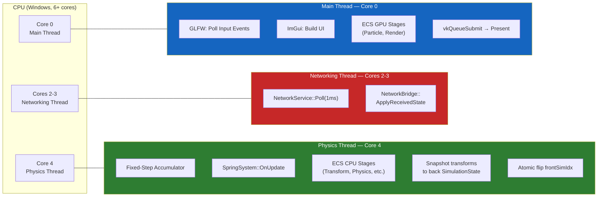
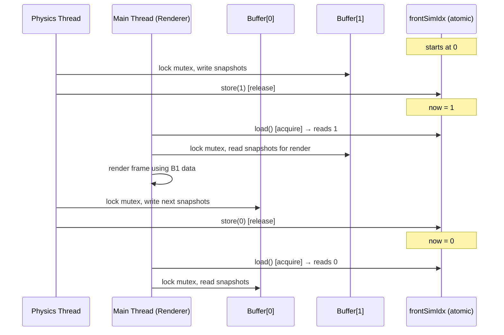
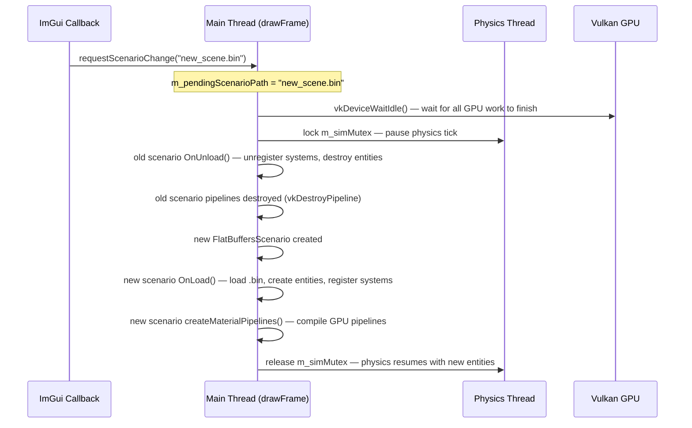

# Chapter 2 — Threading & Concurrency: Physics, Rendering, and Networking

## 2.1 Why Run Multiple Threads?

A naive single-threaded engine does everything on one loop:

```
while(running) {
    pollInput();
    updatePhysics(dt);
    renderFrame();
    pollNetwork();
}
```

This causes three concrete problems in a simulation engine:

1. **Physics must be deterministic** — it runs at a fixed timestep (e.g. 60 Hz), but rendering may run at 144 Hz or 30 Hz depending on GPU load. Tying them together means physics speed varies with frame rate.
2. **Network I/O blocks** — a blocking `recv()` call stalls the render thread, causing frame drops during packet processing.
3. **Wasted CPU cores** — modern CPUs have 6–16 cores. A single-threaded engine uses exactly one.

This engine solves all three with a **three-thread model** — each thread pinned to a specific CPU core.

---

## 2.2 Thread Topology



---

## 2.3 Thread Affinity: Pinning Threads to Cores

Windows provides `SetThreadAffinityMask()` to bind threads to specific cores. The engine calls this immediately after creating each thread:

```cpp
// source/core/EngineOrchestrator.cpp

// Main thread (called in constructor)
SetThreadAffinityMask(GetCurrentThread(), 0x01);   // bit 0 = Core 0

// Physics thread (std::jthread, C++20)
m_physicsThread = std::jthread([this](std::stop_token st) {
    runPhysicsLoop(st);
});
HANDLE physHandle = reinterpret_cast<HANDLE>(m_physicsThread.native_handle());
SetThreadAffinityMask(physHandle, 0x08);           // bit 3 = Core 4 (0x08 = 0b1000)

// Networking thread
m_networkingThread = std::jthread([this](std::stop_token st) {
    while (!st.stop_requested()) {
        m_networkService->Poll(1);   // 1ms blocking timeout
    }
});
HANDLE netHandle = reinterpret_cast<HANDLE>(m_networkingThread.native_handle());
SetThreadAffinityMask(netHandle, 0x06);            // bits 1+2 = Cores 2-3 (0x06 = 0b0110)
```

**Why `std::jthread` instead of `std::thread`?**
- `std::jthread` (C++20) automatically joins on destruction — no risk of `std::terminate` if you forget to call `join()`
- It provides a `std::stop_token` that threads can poll to know when to shut down — no manual `atomic<bool>` flags needed

```cpp
// Stopping the threads (EngineOrchestrator destructor):
m_physicsThread.request_stop();    // Sets stop_token
m_networkingThread.request_stop();
// Destructor auto-joins both threads
```

---

## 2.4 The Double-Buffered SimulationState

### The Problem

The physics thread writes entity positions every tick. The renderer reads them every frame. These run at different rates — if you read while writing, you get a **data race** (undefined behaviour; typically visual tearing or crashes).

### The Solution: Two Snapshot Buffers + Atomic Swap

```cpp
// include/core/SimulationState.h
struct EntitySnapshot {
    uint32_t  id;
    glm::mat4 worldMatrix;   // Full world transform matrix
};

struct SimulationState {
    std::vector<EntitySnapshot> snapshots;  // All entities at one physics tick
    std::mutex                  mutex;      // Protects snapshots vector
};

// include/core/EngineOrchestrator.h
GE::SimulationState  m_simBuffers[2];          // Front + Back
std::atomic<int>     m_frontSimIdx { 0 };      // Which buffer the renderer reads
```

The two buffers alternate roles:
- **Front buffer** (`m_simBuffers[m_frontSimIdx]`): read by the renderer
- **Back buffer** (`m_simBuffers[1 - m_frontSimIdx]`): written by the physics thread



**Memory ordering:**
- Physics thread uses `std::memory_order_release` when storing — ensures all writes to the back buffer are visible before the index flips
- Renderer uses `std::memory_order_acquire` when loading — ensures it sees all writes published before the flip

```cpp
// Physics thread (after writing back buffer):
m_frontSimIdx.store(backIdx, std::memory_order_release);

// Renderer (before reading front buffer):
const int frontIdx = m_frontSimIdx.load(std::memory_order_acquire);
```

---

## 2.5 The Physics Loop: Fixed-Step Accumulator

The physics thread runs a **fixed-timestep accumulator** — one of the most important patterns in game development.

### The Problem with Variable Timestep

If physics uses `dt = time since last frame`, then:
- At 60 FPS: `dt = 0.0167s` → physics advances 0.0167 seconds
- At 10 FPS: `dt = 0.100s` → physics advances 0.100 seconds

The large dt causes "explosion bugs" — objects teleport through walls, springs oscillate chaotically. Physics is not stable with arbitrary timesteps.

### Fixed-Step Accumulator

```cpp
// source/core/EngineOrchestrator.cpp — simplified

void EngineOrchestrator::runPhysicsLoop(std::stop_token st) {
    using Clock    = std::chrono::steady_clock;
    using FloatSec = std::chrono::duration<float>;

    auto  prevTime    = Clock::now();
    float accumulator = 0.0f;
    const float fixedDt = 1.0f / m_physicsHz;  // e.g. 1/120 = 0.00833s

    while (!st.stop_requested()) {
        // 1. Measure real elapsed time
        const auto  now     = Clock::now();
        const float realDt  = FloatSec(now - prevTime).count();
        prevTime = now;

        // 2. "Spiral of Death" guard: if frame took too long (e.g. debug breakpoint),
        //    cap the time we try to simulate. Without this, the loop tries to simulate
        //    10 seconds of physics in one frame and never catches up.
        const float clamped = std::min(realDt, 4.0f * fixedDt);
        accumulator += clamped;

        // 3. Consume accumulated time in fixed-size bites
        while (accumulator >= fixedDt) {
            std::lock_guard<std::mutex> lock(m_simMutex);

            if (m_activeScenario && !m_activeScenario->IsPaused()) {
                // Spring forces first (Hooke's law, applied before physics integration)
                m_springSystem->OnUpdate(fixedDt);

                // All CPU-stage ECS systems: Transform, Animation, Physics, Cloth, Flocking...
                m_entityManager->UpdateCpuStages(fixedDt);

                // Networking: broadcast owned entities, apply remote state
                m_networkBridge->BroadcastOwnedStates();
                m_networkBridge->UpdateRemoteEntities(fixedDt);

                // Snapshot all transforms to back buffer
                const int backIdx = 1 - m_frontSimIdx.load(std::memory_order_relaxed);
                {
                    std::lock_guard<std::mutex> snapLock(m_simBuffers[backIdx].mutex);
                    auto& arr = m_entityManager->GetCompArr<GE::Components::Transform>();
                    const uint32_t count = arr.GetCount();
                    m_simBuffers[backIdx].snapshots.resize(count);
                    for (uint32_t i = 0; i < count; ++i) {
                        m_simBuffers[backIdx].snapshots[i] = {
                            arr.Index()[i],
                            arr.Data()[i].m_worldMatrix
                        };
                    }
                }

                // Atomically publish the new front
                m_frontSimIdx.store(backIdx, std::memory_order_release);
            }

            accumulator -= fixedDt;
        }

        // 4. Sleep for the remaining budget of this tick
        //    (prevents this thread from burning 100% CPU)
        const auto tickEnd    = Clock::now();
        const auto tickElapsed = tickEnd - now;
        const auto budget      = std::chrono::duration_cast<Clock::duration>(FloatSec(fixedDt));
        if (tickElapsed < budget) {
            std::this_thread::sleep_for(budget - tickElapsed);
        }
    }
}
```

### What "Spiral of Death" Means

Without the clamp, the loop can fall into a death spiral:

```
Frame 1: dt = 0.100s → simulate 12 ticks at 120Hz → takes 0.120s
Frame 2: dt = 0.120s → simulate 14 ticks → takes 0.140s
Frame 3: dt = 0.140s → simulate 17 ticks → takes 0.170s
                         ↑ Feedback loop: physics can never catch up
```

With `clamped = min(realDt, 4 * fixedDt)`, the worst case is 4 ticks per frame. The simulation runs slow but doesn't spiral.

---

## 2.6 The Networking Thread

The networking thread is simple — it just calls `Poll()` in a loop:

```cpp
// source/core/EngineOrchestrator.cpp
m_networkingThread = std::jthread([this](std::stop_token st) {
    while (!st.stop_requested()) {
        if (m_networkService) {
            m_networkService->Poll(1);   // Non-blocking; sleeps 1ms if no packet
        }
    }
});
```

`Poll()` calls a callback when a packet arrives. The callback is `NetworkBridge::ApplyReceivedState()`, which updates remote entity positions. See [Chapter 7 — UDP Networking](07_UDP_Networking.md) for details.

---

## 2.7 Synchronisation Points Summary

| Lock / Atomic | Held By | Guards |
|---------------|---------|--------|
| `m_simMutex` | Physics thread (whole tick) | ECS state during scene rebuild (scene changes only) |
| `m_simBuffers[i].mutex` | Physics (write) / Main (read) | Individual snapshot buffer |
| `m_frontSimIdx` (atomic) | Physics (store) / Main (load) | Which buffer is "current" |

**The critical rule:** Never call `changeScenario()` directly from an ImGui callback or the networking thread. The correct call is:

```cpp
// SAFE: queues the change for next drawFrame() after vkDeviceWaitIdle()
ServiceLocator::GetExperience()->requestScenarioChange("config/flatbufferConfig/scene.bin");

// UNSAFE: destroys Vulkan pipelines on the calling thread mid-render
// m_activeScenario = newScenario;  ← DO NOT DO THIS
```

`requestScenarioChange()` sets `m_pendingScenarioPath`. At the start of the next `drawFrame()`, the main thread checks this, calls `vkDeviceWaitIdle()` (ensuring no in-flight GPU work), then calls `changeScenario()` safely.

---

## 2.8 Scene Change Flow



---

## 2.9 Why `std::jthread` and C++20 Matters

Before C++20, stopping a thread required manual coordination:

```cpp
// Old C++11 approach (error-prone):
std::atomic<bool> m_running { true };
std::thread m_thread([this]() {
    while (m_running.load()) { /* ... */ }
});
// Destructor:
m_running.store(false);
m_thread.join();  // Easy to forget — causes std::terminate at exit
```

C++20's `std::jthread` with `std::stop_token` makes this clean and safe:

```cpp
// C++20:
std::jthread m_thread([](std::stop_token st) {
    while (!st.stop_requested()) { /* ... */ }
});
// Destructor automatically calls request_stop() then join() — nothing to forget
```

This engine uses `std::jthread` throughout and requires `/std:c++20` in the Visual Studio project.

---

*Next: [Chapter 3 — Vulkan & Rendering](03_Vulkan_and_Rendering.md)*
