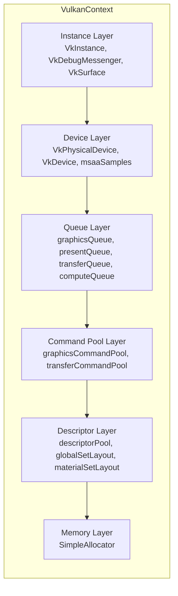
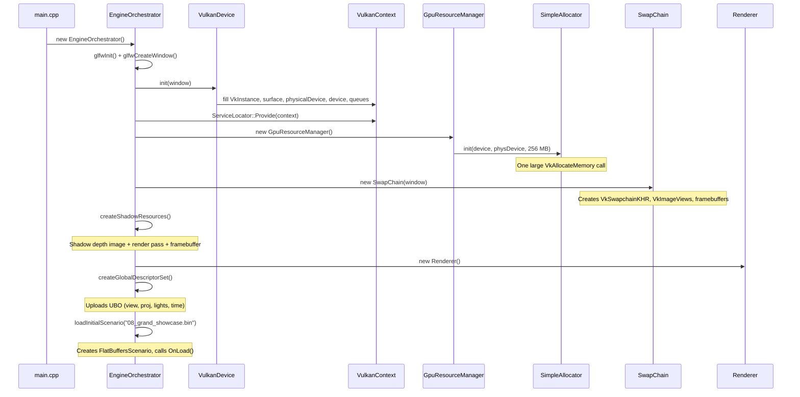
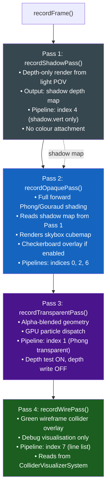

# Chapter 3 — Vulkan Architecture: From Window to Pixels

## 3.1 What Is Vulkan? (Zero-Knowledge Primer)

Vulkan is a **low-level graphics and compute API** for GPUs. Unlike OpenGL (which manages memory and synchronisation on your behalf), Vulkan gives you **explicit control over everything**:

- You allocate GPU memory manually
- You record command buffers (lists of draw calls) yourself
- You manage synchronisation between the CPU and GPU, and between GPU passes
- You describe exactly what a "render pass" does (which attachments, what format, load/store ops)

This explicitness is why Vulkan is harder than OpenGL but also faster — there are no hidden state machines, no driver-side validation, no surprise recompilations.

**Key Vulkan concepts you need to know:**

| Concept | Meaning |
|---------|---------|
| `VkInstance` | Connection to the Vulkan loader/driver |
| `VkPhysicalDevice` | Represents the GPU hardware |
| `VkDevice` | Logical interface to the GPU (used for all API calls) |
| `VkQueue` | A lane for submitting work to the GPU |
| `VkCommandBuffer` | A recorded list of GPU commands (draw, copy, dispatch) |
| `VkRenderPass` | Describes the structure of a rendering pass (attachments, formats) |
| `VkPipeline` | A baked GPU state machine: shaders + rasteriser config + blending + etc. |
| `VkDescriptorSet` | Binds resources (UBOs, textures) to shader stages |
| `VkSwapchainKHR` | The sequence of images presented to the screen |

---

## 3.2 VulkanContext: The Shared Handle Container

Rather than passing every Vulkan handle individually through the codebase, the engine centralises all hardware handles in a single struct:

```cpp
// include/graphics/VulkanContext.h
namespace GE::Graphics {

struct VulkanContext {
    // --- 1. Instance & Surface ---
    VkInstance                instance         { VK_NULL_HANDLE };  // Vulkan entry point
    VkDebugUtilsMessengerEXT  debugMessenger   { VK_NULL_HANDLE };  // Validation layer callback
    VkSurfaceKHR              surface          { VK_NULL_HANDLE };  // GLFW window surface

    // --- 2. Device ---
    VkPhysicalDevice          physicalDevice   { VK_NULL_HANDLE };  // GPU hardware
    VkDevice                  device           { VK_NULL_HANDLE };  // Logical GPU interface
    VkSampleCountFlagBits     msaaSamples      { VK_SAMPLE_COUNT_1_BIT };  // Global MSAA

    // --- 3. Queues ---
    VkQueue  graphicsQueue   { VK_NULL_HANDLE };  // Rendering + draw calls
    VkQueue  presentQueue    { VK_NULL_HANDLE };  // Swapchain presentation
    VkQueue  transferQueue   { VK_NULL_HANDLE };  // Async CPU→GPU uploads
    VkQueue  computeQueue    { VK_NULL_HANDLE };  // GPU compute (particles)

    // --- 4. Command Pools ---
    VkCommandPool  graphicsCommandPool  { VK_NULL_HANDLE };  // Per-frame render commands
    VkCommandPool  transferCommandPool  { VK_NULL_HANDLE };  // Asset upload commands

    // --- 5. Descriptor Infrastructure ---
    VkDescriptorPool       descriptorPool   { VK_NULL_HANDLE };
    VkDescriptorSetLayout  globalSetLayout  { VK_NULL_HANDLE };   // set=0: view/proj/lights
    VkDescriptorSetLayout  materialSetLayout { VK_NULL_HANDLE };  // set=1: textures/PBR

    // --- 6. Memory ---
    SimpleAllocator  allocator {};  // Sub-allocating VRAM pool

    // RAII: no copy, move-only
    VulkanContext(const VulkanContext&) = delete;
    VulkanContext& operator=(const VulkanContext&) = delete;
    VulkanContext(VulkanContext&&) noexcept = default;
};

} // namespace GE::Graphics
```



`VulkanContext` is accessed globally via `ServiceLocator::GetContext()`. Subsystems like `GraphicsPipeline` call it in their constructors to get the device handle.

---

## 3.3 Initialization Chain

The engine initialises Vulkan in a strict dependency order. You cannot create a `VkDevice` without first creating a `VkInstance`, and you cannot create swapchain images without a `VkDevice`.



---

## 3.4 Memory Management: SimpleAllocator

### The Problem

Vulkan has a strict limit on the number of `vkAllocateMemory` calls (typically 4096 per device). If you call `vkAllocateMemory` for every buffer, you quickly hit this limit.

### The Solution: Sub-allocation from a Super-Block

```cpp
// include/memory/SimpleAllocator.h
class SimpleAllocator final {
public:
    // Called once at startup: allocate one large VRAM block
    void init(VkDevice device, VkPhysicalDevice physDevice, VkDeviceSize size);

    // Called for each buffer: returns a byte offset within the super-block
    VkDeviceSize allocate(const VkMemoryRequirements& requirements);

    // Bind a buffer to the super-block at the returned offset
    // vkBindBufferMemory(device, buffer, allocator.getMemoryHandle(), offset)
    VkDeviceMemory getMemoryHandle() const;

    void cleanup();

private:
    VkDevice       device       { VK_NULL_HANDLE };
    VkDeviceMemory memoryChunk  { VK_NULL_HANDLE };  // The single allocation
    VkDeviceSize   currentOffset { 0 };              // Next free byte
};
```

**Usage:**
```cpp
// Create a vertex buffer and bind it to the allocator's super-block
VkBuffer vertexBuffer;
VkBufferCreateInfo bufInfo { VK_STRUCTURE_TYPE_BUFFER_CREATE_INFO };
bufInfo.size  = sizeof(Vertex) * vertexCount;
bufInfo.usage = VK_BUFFER_USAGE_VERTEX_BUFFER_BIT;
vkCreateBuffer(ctx->device, &bufInfo, nullptr, &vertexBuffer);

VkMemoryRequirements memReqs;
vkGetBufferMemoryRequirements(ctx->device, vertexBuffer, &memReqs);

VkDeviceSize offset = ctx->allocator.allocate(memReqs);
vkBindBufferMemory(ctx->device, vertexBuffer, ctx->allocator.getMemoryHandle(), offset);
```

One `VkDeviceMemory` handles all GPU buffers. Sub-allocation is just tracking the offset into that block.

---

## 3.5 Shaders: GLSL → SPIR-V

All shaders are written in **GLSL** (the shader language) and compiled offline to **SPIR-V** (the GPU bytecode Vulkan actually understands).

```
shaders/phong.vert  →  glslc  →  shaders/phong_vert.spv
shaders/phong.frag  →  glslc  →  shaders/phong_frag.spv
```

Compiled `.spv` files are **committed to the repository** — no runtime compilation. This means:
- Startup is fast (no GLSL parsing)
- The same `.spv` file works on any Vulkan driver

To recompile all shaders: run `shaders/compile.bat` (requires `glslc` from the Vulkan SDK).

**Key shader pairs:**
| Shaders | Purpose |
|---------|---------|
| `phong.vert / phong.frag` | Phong lighting model (per-fragment normals) |
| `gouraud.vert / gouraud.frag` | Gouraud lighting model (per-vertex normals) |
| `shadow.vert / shadow.frag` | Depth-only shadow map generation |
| `flat_color.vert / flat_color.frag` | Solid colour (cloth, boids) |
| `snow.comp / rain.comp / fire.comp` | GPU compute particle systems |
| `skybox.vert / skybox.frag` | Cubemap skybox |
| `checkerboard.vert / checkerboard.frag` | Procedural checkerboard |

---

## 3.6 GraphicsPipeline: Baking GPU State

In OpenGL, you set rendering state at draw time with individual function calls (`glEnable(GL_DEPTH_TEST)`, `glBlendFunc()`, etc.). Each call is cheap individually but expensive when the driver has to revalidate state.

In Vulkan, you **bake all state into a single `VkPipeline` object at load time**. Draw time is then just: bind pipeline, bind resources, draw. No state revalidation.

```cpp
// include/graphics/GraphicsPipeline.h (constructor — creates the VkPipeline)
GraphicsPipeline(
    const VkRenderPass          renderPass,       // Which render pass this pipeline is for
    const VkDescriptorSetLayout materialLayout,   // Binding layout for material resources
    ShaderModule* const         vertShader,       // Vertex shader (.spv)
    ShaderModule* const         fragShader,       // Fragment shader (.spv)
    const bool   enableCulling     = true,        // Back-face culling
    const bool   enableBlending    = false,       // Alpha blending (transparent pass)
    const bool   enableDepthWrite  = true,        // Write to depth buffer
    const VkSampleCountFlagBits msaaSamples = VK_SAMPLE_COUNT_1_BIT,
    const uint32_t pushConstantSize   = sizeof(glm::mat4),  // 64 bytes = model matrix
    const VkShaderStageFlags pushConstantStages = VK_SHADER_STAGE_VERTEX_BIT,
    const VkPrimitiveTopology topology = VK_PRIMITIVE_TOPOLOGY_TRIANGLE_LIST,
    const bool includeMaterialSet = true
)
```

Internally, the constructor builds and submits a `VkGraphicsPipelineCreateInfo` with 9 sub-states:

```cpp
// Step 1: Shader stages
VkPipelineShaderStageCreateInfo stages[] = { vert->getStageInfo(), frag->getStageInfo() };

// Step 2: Vertex input layout (defined once in GE::Assets::Vertex)
VkVertexInputBindingDescription   binding    = Vertex::getBindingDescription();
auto                               attributes = Vertex::getAttributeDescriptions();

// Step 3: Input assembly (triangles)
inputAssembly.topology = VK_PRIMITIVE_TOPOLOGY_TRIANGLE_LIST;

// Step 4: Dynamic viewport and scissor (set per-frame, not baked)
dynamicStates = { VK_DYNAMIC_STATE_VIEWPORT, VK_DYNAMIC_STATE_SCISSOR };

// Step 5: Rasteriser (culling, fill mode, winding order)
rasterizer.cullMode  = enableCulling ? VK_CULL_MODE_BACK_BIT : VK_CULL_MODE_NONE;
rasterizer.frontFace = VK_FRONT_FACE_COUNTER_CLOCKWISE;

// Step 6: MSAA
multisampling.rasterizationSamples = msaaSamples;

// Step 7: Depth/stencil
depthStencil.depthTestEnable  = VK_TRUE;
depthStencil.depthWriteEnable = enableDepthWrite ? VK_TRUE : VK_FALSE;

// Step 8: Color blending (alpha-over compositing for transparent pass)
if (enableBlending) {
    colorBlendAttachment.blendEnable         = VK_TRUE;
    colorBlendAttachment.srcColorBlendFactor = VK_BLEND_FACTOR_SRC_ALPHA;
    colorBlendAttachment.dstColorBlendFactor = VK_BLEND_FACTOR_ONE_MINUS_SRC_ALPHA;
}

// Step 9: Pipeline layout (descriptor set layouts + push constant range)
VkPushConstantRange pcRange { pushConstantStages, 0, pushConstantSize };
vkCreatePipelineLayout(device, &layoutInfo, nullptr, &pipelineLayout);

// Assemble and create
vkCreateGraphicsPipelines(device, VK_NULL_HANDLE, 1, &pipelineInfo, nullptr, &pipeline);
```

### Push Constants: Fast Per-Draw Data

Push constants are a small (128–256 byte) block of data you can change between draw calls **without** binding a descriptor set. The engine uses them for:

- **Model matrix** (64 bytes = `glm::mat4`) — sent in the vertex stage, transforms object to world space
- **Checkerboard parameters** (100 bytes) — colorA, colorB, tile scale — sent in both stages

```cpp
// Binding a pipeline:
pipeline->bind(commandBuffer);

// Uploading the model matrix push constant:
vkCmdPushConstants(commandBuffer,
    pipeline->getPipelineLayout(),
    VK_SHADER_STAGE_VERTEX_BIT,
    0,                        // offset
    sizeof(glm::mat4),        // size = 64 bytes
    &worldMatrix);

// Draw call
vkCmdDrawIndexed(commandBuffer, indexCount, 1, 0, 0, 0);
```

---

## 3.7 Material Pipeline Index Table

`Scenario::createMaterialPipelines()` creates a fixed array of pipelines. Each mesh's `MeshRenderer` component stores a pipeline index to select which one to use:

| Index | Pipeline | Key Settings |
|-------|----------|-------------|
| 0 | Phong opaque | culling on, depth write on, no blend |
| 1 | Phong transparent | culling off, depth write off, blend enabled |
| 2 | Gouraud opaque | culling on, depth write on |
| 3 | Skybox | depth test with LESS_EQUAL, no depth write |
| 4 | Shadow depth | vertex-only (no frag shader needed) |
| 5 | Post-process composite | full-screen quad |
| 6 | Checkerboard | 100-byte push constant (colorA@64, colorB@80, scale@96) |
| 7 | Collider wireframe | topology = LINE_LIST, no culling |
| 8 | Flat colour | used for cloth mesh, boid spheres |

---

## 3.8 Multi-Pass Renderer

The renderer orchestrates the entire frame as a sequence of **four render passes**. Each pass has a specific purpose and writes to specific attachments (colour, depth, etc.):

```cpp
// include/graphics/Renderer.h
void Renderer::recordFrame(
    const VkCommandBuffer cb,
    const VkExtent2D& extent,
    const Skybox* skybox,
    GE::ECS::EntityManager* em,
    const PostProcessBackend* postProcessor,
    const VkDescriptorSet globalDescriptorSet,
    const VkRenderPass shadowPass,
    const VkFramebuffer shadowFramebuffer,
    const std::vector<GraphicsPipeline*>& materialPipelines,
    const GraphicsPipeline* shadowPipeline,
    const glm::vec4& clearColor,
    const GraphicsPipeline* checkerboardPipeline,
    const void* checkerboardPushData,
    uint32_t checkerboardPushDataSize,
    const GraphicsPipeline* wirePipeline,
    GE::Systems::ColliderVisualizerSystem* visualizer
) const;
```



### Pass 1: Shadow Pass

The shadow pass renders the scene from the **light's point of view** to produce a depth map. Later, the opaque pass uses this depth map to determine if a fragment is in shadow.

```cpp
void Renderer::recordShadowPass(cb, renderPass, framebuffer, shadowPipeline, globalSet, em) {
    vkCmdBeginRenderPass(cb, &shadowRPInfo, VK_SUBPASS_CONTENTS_INLINE);
    shadowPipeline->bind(cb);
    vkCmdBindDescriptorSets(cb, VK_PIPELINE_BIND_POINT_GRAPHICS,
                            shadowPipeline->getPipelineLayout(), 0, 1, &globalSet, 0, nullptr);

    // Iterate all MeshRenderer components and draw each mesh
    auto& meshRenderers = em->GetCompArr<GE::Components::MeshRenderer>();
    for (uint32_t i = 0; i < meshRenderers.GetCount(); ++i) {
        EntityID eid = meshRenderers.Index()[i];
        auto* tr     = em->GetTIComponent<GE::Components::Transform>(eid);
        // Push model matrix as push constant
        vkCmdPushConstants(cb, shadowPipeline->getPipelineLayout(),
                           VK_SHADER_STAGE_VERTEX_BIT, 0,
                           sizeof(glm::mat4), &tr->m_worldMatrix);
        // Draw each sub-mesh
        for (auto& sub : meshRenderers.Data()[i].subMeshes) {
            sub.mesh->draw(cb, shadowPipeline, nullptr, nullptr);
        }
    }
    vkCmdEndRenderPass(cb);
}
```

### Pass 2: Opaque Pass

The full shading pass. Each mesh looks up its pipeline by index and draws itself:

```cpp
// Simplified from Renderer::recordOpaquePass
for (uint32_t i = 0; i < meshRenderers.GetCount(); ++i) {
    auto& mr      = meshRenderers.Data()[i];
    EntityID eid  = meshRenderers.Index()[i];
    auto* tr      = em->GetTIComponent<Transform>(eid);

    for (auto& sub : mr.subMeshes) {
        // Bind the correct material pipeline
        GraphicsPipeline* pipe = (*pipelines)[sub.pipelineIndex].get();
        pipe->bind(cb);

        // Bind global UBO (view, proj, lights, time, shadow map)
        vkCmdBindDescriptorSets(cb, VK_PIPELINE_BIND_POINT_GRAPHICS,
                                pipe->getPipelineLayout(), 0, 1, &globalSet, 0, nullptr);
        // Bind material descriptor set (textures)
        if (sub.material != nullptr) {
            vkCmdBindDescriptorSets(cb, VK_PIPELINE_BIND_POINT_GRAPHICS,
                                    pipe->getPipelineLayout(), 1, 1,
                                    &sub.material->descriptorSet, 0, nullptr);
        }

        // Model matrix push constant
        vkCmdPushConstants(cb, pipe->getPipelineLayout(),
                           VK_SHADER_STAGE_VERTEX_BIT, 0,
                           sizeof(glm::mat4), &tr->m_worldMatrix);

        sub.mesh->draw(cb, pipe, extraPush, extraPushSize);
    }
}
```

---

## 3.9 Descriptor Sets and UBOs

Shaders need data that doesn't change per-vertex (camera matrices, light positions, texture samplers). This data is bound through **descriptor sets**.

### Set 0: Global UBO (bound to every draw call)

```glsl
// In every .vert / .frag shader:
layout(set = 0, binding = 0) uniform GlobalUBO {
    mat4 view;
    mat4 proj;
    mat4 lightSpaceMatrix;   // For shadow map lookup
    vec3 lightDirection;
    float time;
    vec3 cameraPos;
    // ... etc.
} global;
```

The CPU side (`Common.h`) defines the matching struct. Uploaded once per frame from the main thread.

### Set 1: Material UBO (bound per material / per draw call)

```glsl
layout(set = 1, binding = 0) uniform sampler2D diffuseTexture;
layout(set = 1, binding = 1) uniform sampler2D normalMap;
layout(set = 1, binding = 2) uniform MaterialParams {
    vec4 albedo;
    float roughness;
    float metallic;
} material;
```

---

## 3.10 Particle System: GPU Compute

Snow, rain, fire, dust, and smoke particles are simulated entirely on the **GPU** using compute shaders — the CPU doesn't touch individual particle positions:

```glsl
// shaders/snow.comp (simplified)
layout(local_size_x = 256) in;  // 256 particles per workgroup

layout(set = 0, binding = 0) buffer ParticleBuffer {
    Particle particles[];
};

void main() {
    uint idx = gl_GlobalInvocationID.x;
    if (idx >= pushConstants.particleCount) return;

    // Update particle position
    particles[idx].position.y -= particles[idx].speed * pushConstants.dt;

    // Wrap around if below floor
    if (particles[idx].position.y < pushConstants.minY) {
        particles[idx].position.y = pushConstants.maxY;
    }
}
```

`ParticleEmitterSystem` (an `IGpuSystem`) records `vkCmdDispatch` calls into the command buffer each frame. The GPU simulates hundreds of thousands of particles at interactive rates.

---

*Next: [Chapter 4 — Scene Management](04_Scene_Management.md)*
