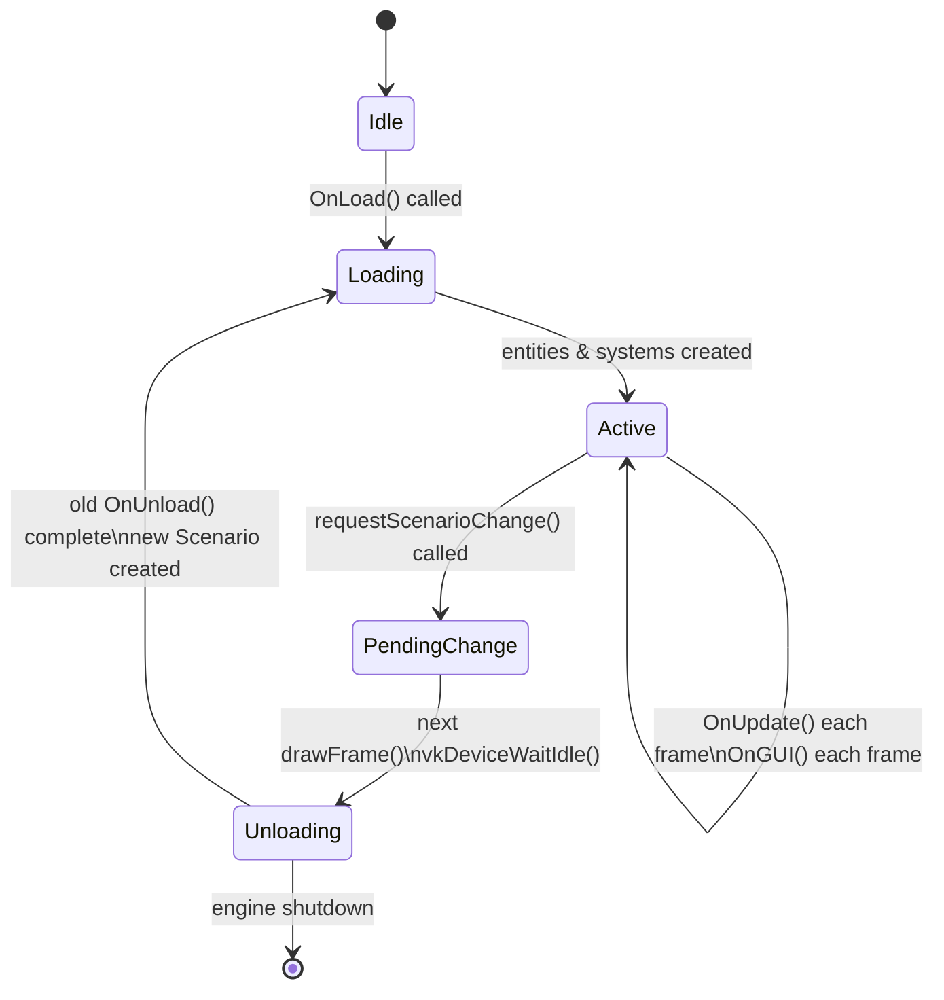
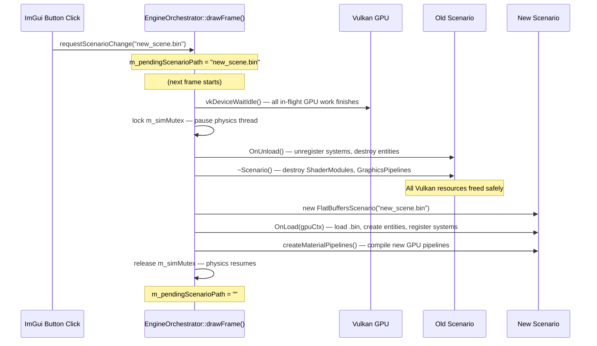
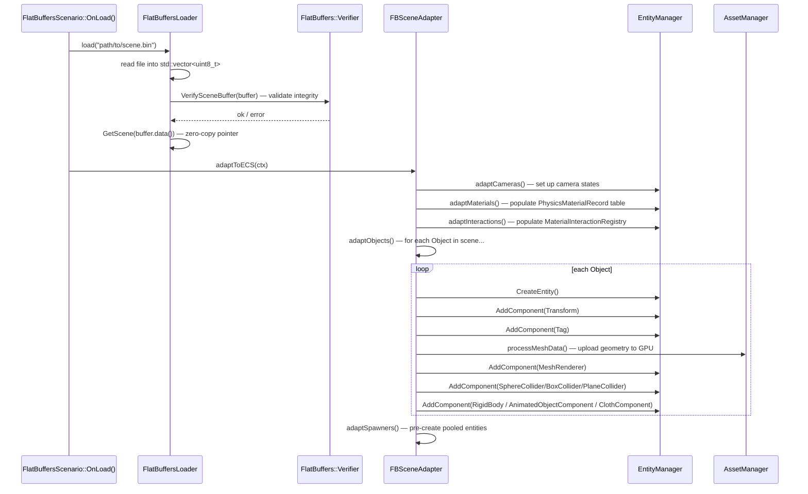

# Chapter 4 — Scene Management: State Pattern & FlatBuffers

## 4.1 The State Pattern — Scenarios as States

A simulation engine needs to switch between entirely different scenes — each scene has its own entities, systems, GPU pipelines, and logic. The naive approach is a big `switch` statement in the main loop. This becomes unmanageable quickly.

This engine uses the **State Pattern**: a `Scenario` abstract base class represents one active "state" of the engine. The `EngineOrchestrator` is the context that holds a `unique_ptr<Scenario>`. Swapping scenarios = swapping states.



### The Abstract Scenario Interface

```cpp
// include/scene/Scenario.h
namespace GE::Scene {

class Scenario {
public:
    virtual ~Scenario() = default;

    // --- State interface ---
    virtual void OnLoad(GE::Graphics::GpuUploadContext& ctx) = 0;   // Enter state
    virtual void OnUpdate(float dt, float totalTime) = 0;           // Run state
    virtual void OnUnload() = 0;                                    // Exit state
    virtual void OnGUI() {}                                         // ImGui menus

    // --- Scenario controls ---
    bool  IsPaused() const    { return m_isPaused; }
    void  SetPaused(bool p)   { m_isPaused = p; }
    float GetTimeScale() const { return m_timeScale; }

    const glm::vec4& GetClearColor() const { return m_clearColor; }

    // --- Owned GPU resources (scenario-scoped) ---
    const std::vector<std::unique_ptr<GE::Graphics::GraphicsPipeline>>&
    GetPipelines() const { return m_pipelines; }

protected:
    void createMaterialPipelines();  // Creates the standard 9+ pipelines

    bool      m_isPaused   = false;
    float     m_timeScale  = 1.0f;
    glm::vec4 m_clearColor { 0.05f, 0.05f, 0.1f, 1.0f };

    std::vector<std::unique_ptr<GE::Assets::Model>>          m_ownedModels;
    std::vector<std::unique_ptr<GE::Graphics::ShaderModule>> m_shaderModules;
    std::vector<std::unique_ptr<GE::Graphics::GraphicsPipeline>> m_pipelines;
    std::string m_configPath;
};

} // namespace GE::Scene
```

### Concrete Scenarios

| Class | Config Format | Primary Use |
|-------|---------------|-------------|
| `GenericScenario` | `.ini` text file | Legacy physics labs |
| `SnowGlobeScenario` | `.ini` text file | Snow globe demo with weather |
| `FlatBuffersScenario` | `.bin` binary file | All modern scenes |

**Which systems each `FlatBuffersScenario` registers in `OnLoad()`:**

```cpp
// source/scene/FlatBuffersScenario.cpp — OnLoad()
auto* em = ServiceLocator::GetEntityManager();

m_clothSystem     = new GE::Systems::ClothSystem(ctx);
m_flockingSystem  = new GE::Systems::FlockingSystem();
m_physicsSystem   = new GE::Systems::PhysicsSystem(&m_interactionRegistry);
m_animationSystem = new GE::Systems::AnimationSystem();
m_spawnerSystem   = new GE::Systems::SpawnerSystem();

em->RegisterSystem(m_clothSystem);     // Stage::Physics
em->RegisterSystem(m_flockingSystem);  // Stage::GameLogic
em->RegisterSystem(m_physicsSystem);   // Stage::Physics
em->RegisterSystem(m_animationSystem); // Stage::Animation
em->RegisterSystem(m_spawnerSystem);   // Stage::EarlyUpdate
```

And in `OnUnload()`:

```cpp
em->UnregisterSystem(m_spawnerSystem);
em->UnregisterSystem(m_animationSystem);
em->UnregisterSystem(m_physicsSystem);
em->UnregisterSystem(m_flockingSystem);
em->UnregisterSystem(m_clothSystem);

// Destroy cloth GPU buffers
for (auto& cc : clothComponents) {
    vkDestroyBuffer(ctx->device, cc.vertexBuffer, nullptr);
    vkFreeMemory(ctx->device, cc.vertexMemory, nullptr);
}

em->ClearAllEntities();
```

---

## 4.2 Scene-Change Safety Rule

Calling `vkDestroyPipeline()` while the GPU is still drawing with that pipeline is undefined behaviour. The engine defers all scene changes to a safe synchronisation point.

```cpp
// SAFE: queues for next drawFrame() after vkDeviceWaitIdle
ServiceLocator::GetExperience()->requestScenarioChange("config/flatbufferConfig/scene.bin");

// UNSAFE: may destroy pipelines mid-draw — causes Vulkan validation errors!
// changeScenario(newScenario);   ← NEVER call from ImGui callbacks or the networking thread
```

**What happens on the next frame:**



---

## 4.3 FlatBuffers: Zero-Copy Binary Scenes

### What is FlatBuffers?

FlatBuffers is Google's binary serialisation library. Unlike JSON (a text format you parse), a FlatBuffers binary is read via **direct pointer access** — no parsing, no allocation, no copying:

```cpp
// JSON approach: parse text → allocate AST → access fields
// (slow, allocates memory, CPU-intensive)
nlohmann::json j = nlohmann::json::parse(jsonText);
float radius = j["objects"][0]["shape"]["radius"];

// FlatBuffers approach: point into the binary buffer, read directly
// (zero allocation, cache-friendly)
const Simulation::Scene* scene = Simulation::GetScene(buffer.data());
float radius = scene->objects()->Get(0)->shape_as_Sphere()->radius();
```

### Schema File

The schema (`flatbuffers/Scene.fbs`) defines the structure of every scene file:

```
// flatbuffers/Scene.fbs (abbreviated)
namespace Simulation;

table Scene {
  name:        string;
  description: string;
  gravity_on:  bool = true;
  cameras:     [Camera];
  objects:     [Object];
  spawners:    [SpawnerType];
  materials:   [Material];
  interactions:[MaterialInteraction];
}

table Object {
  name:           string;
  transform:      Transform;
  material:       string;
  shape:          Shape;           // Union: Sphere | Plane | Cuboid | Cylinder | Capsule
  behaviour:      Behaviour;       // Union: StaticObject | SimulatedObject | AnimatedObject | ClothObject | FlockAgent
  collision_type: CollisionType = SOLID;
}

enum Behaviour : byte {
  StaticObject, SimulatedObject, AnimatedObject, ClothObject, FlockAgent
}
```

Binary `.bin` files are compiled from JSON source files using `flatc`:
```bash
flatc --binary -o config/flatbufferConfig/ flatbuffers/Scene.fbs -- scene.json
```

> **Important:** `Scene_generated.h` is patched by hand and must NOT be regenerated via `flatc`. The installed `flatc` version produces incompatible enum style (flat enums vs. required scoped enums).

### Schema Compatibility with Teacher-Provided `.bin` Files

Our `flatbuffers/Scene.fbs` is the **teacher-provided schema with backwards-compatible extensions appended**. This was verified by diffing against the original `Scene.fbs` supplied by the assessors.

**Union orderings are identical to the teacher's schema:**

| Union | Teacher | Ours |
|---|---|---|
| `Shape` | Sphere=1, Plane=2, Capsule=3, Cylinder=4, **Cuboid**=5 | Identical |
| `Behaviour` | StaticObject=1, SimulatedObject=2, AnimatedObject=3 | Identical for first 3; we add ClothObject=4, FlockAgent=5 |
| `SpawnType` | SingleBurstSpawn=1, RepeatingSpawn=2 | Identical |
| `SpawnLocation` | FixedLocation=1, RandomBox=2, RandomSphere=3 | Identical |
| `SpawnerType` | SphereSpawner=1, CylinderSpawner=2, CapsuleSpawner=3, CuboidSpawner=4 | Identical |

**All our extensions are backward-compatible:**
- Extra fields on `Object`, `BaseSpawner`, `Scene` are **appended at the end** — FlatBuffers vtable layout means old binaries without these fields simply return field defaults
- `ClothObject` (4) and `FlockAgent` (5) are beyond any discriminant a teacher-provided `.bin` would use
- Both teacher and our schema use `table Cuboid` (not `Cube`) — names are identical

**Conclusion:** A teacher-provided `.bin` compiled from the original `Scene.fbs` will load and run correctly in our engine without any modifications.

---

## 4.4 FlatBuffers Loading Pipeline



---

## 4.5 FBSceneAdapter: One Object → Many Components

`FBSceneAdapter::adaptObject()` is the bridge between FlatBuffers data and the ECS. Every object in the scene file goes through this function:

```cpp
// include/scene/fb/FBSceneAdapter.h
void FBSceneAdapter::adaptObject(const Simulation::Object* obj, FBSceneContext& ctx) {
    // 1. Create the entity
    const GE::ECS::EntityID id = ctx.em->CreateEntity();
    const glm::vec3 color      = resolveColor(obj, ctx);

    // 2. Transform component (position, rotation, scale from FlatBuffers)
    GE::Components::Transform transform;
    if (obj->transform() != nullptr) {
        const auto* t = obj->transform();
        transform.m_position = { t->position()->x(), t->position()->y(), t->position()->z() };
        transform.m_rotation = { t->rotation()->yaw(), t->rotation()->pitch(), t->rotation()->roll() };
        transform.m_scale    = { t->scale()->x(),    t->scale()->y(),    t->scale()->z() };
    }
    ctx.em->AddComponent(id, transform);

    // 3. Name tag
    ctx.em->AddComponent(id, GE::Components::Tag{ obj->name()->str() });
    ctx.scene->addEntity(obj->name()->str(), id);   // Register for named lookups

    // 4. Physics material (density lookup for mass calculation)
    if (obj->material()) {
        std::string matName = obj->material()->str();
        float density = lookupDensity(matName, ctx.physicsMaterials);
        ctx.em->AddComponent(id, GE::Components::PhysicsMaterialTag{ matName, density });
    }

    // 5. Geometry (shape → procedural mesh) + collision component
    //    Skip for ClothObject and FlockAgent (they build their own geometry)
    const bool isCloth      = (obj->behaviour_type() == Simulation::Behaviour::ClothObject);
    const bool isFlockAgent = (obj->behaviour_type() == Simulation::Behaviour::FlockAgent);
    if (!isCloth && !isFlockAgent) {
        adaptShape(obj, id, color, ctx);
    }

    // 6. Behaviour → RigidBody / AnimatedObjectComponent / ClothComponent / FlockingComponent
    adaptBehaviour(obj, id, ctx);
}
```

### Shape Dispatch (adaptShape)

```cpp
void FBSceneAdapter::adaptShape(const Simulation::Object* obj, EntityID id,
                                const glm::vec3& color, FBSceneContext& ctx) {
    switch (obj->shape_type()) {
    case Simulation::Shape::Sphere: {
        float radius = obj->shape_as_Sphere()->radius();
        auto meshData = GE::Assets::GeometryUtils::generateSphere(32, radius, color);
        ctx.em->AddComponent(id, GE::Components::SphereCollider{ radius });
        // upload mesh to GPU, create MeshRenderer...
        break;
    }
    case Simulation::Shape::Plane: {
        auto meshData = GE::Assets::GeometryUtils::generatePlane(10.0f, 10.0f);
        auto normal   = obj->shape_as_Plane()->normal();
        ctx.em->AddComponent(id, GE::Components::PlaneCollider{
            { normal->x(), normal->y(), normal->z() }, 0.0f });
        break;
    }
    case Simulation::Shape::Cuboid: {
        auto sz = obj->shape_as_Cuboid()->size();
        auto meshData = GE::Assets::GeometryUtils::generateBox(sz->x(), sz->y(), sz->z(), color);
        ctx.em->AddComponent(id, GE::Components::BoxCollider{ sz->x(), sz->y(), sz->z() });
        break;
    }
    }
    // Common: upload to GPU and attach MeshRenderer with correct pipeline index
}
```

### Behaviour Dispatch (adaptBehaviour)

```cpp
void FBSceneAdapter::adaptBehaviour(const Simulation::Object* obj, EntityID id,
                                    FBSceneContext& ctx) {
    switch (obj->behaviour_type()) {

    case Simulation::Behaviour::StaticObject:
        // Nothing to add — static objects have no physics component
        break;

    case Simulation::Behaviour::SimulatedObject: {
        const auto* sim = obj->behaviour_as_SimulatedObject();
        GE::Components::RigidBody rb;
        rb.mass         = computeMassFromShapeAndDensity(obj, ctx);
        rb.inverseMass  = (rb.mass > 0.0f) ? (1.0f / rb.mass) : 0.0f;
        rb.restitution  = sim->restitution();
        rb.useGravity   = sim->use_gravity();
        rb.isStatic     = sim->is_static();
        ctx.em->AddComponent(id, rb);
        break;
    }

    case Simulation::Behaviour::AnimatedObject: {
        const auto* anim = obj->behaviour_as_AnimatedObject();
        GE::Components::AnimatedObjectComponent ac;
        for (const auto* wp : *anim->waypoints()) {
            ac.waypoints.push_back({
                { wp->position()->x(), wp->position()->y(), wp->position()->z() },
                { wp->rotation()->yaw(), wp->rotation()->pitch(), wp->rotation()->roll() },
                wp->time()
            });
        }
        ac.totalDuration = anim->total_duration();
        ac.easing   = static_cast<GE::Components::EasingType>(anim->easing());
        ac.pathMode = static_cast<GE::Components::PathMode>(anim->path_mode());
        ctx.em->AddComponent(id, ac);
        break;
    }

    case Simulation::Behaviour::ClothObject:
        adaptClothObject(obj, id, ctx);   // See Chapter 6
        break;

    case Simulation::Behaviour::FlockAgent:
        adaptFlockAgent(obj, id, ctx);    // See Chapter 6
        break;
    }
}
```

---

## 4.6 FBSceneContext: Passing Context to Adapters

`FBSceneContext` is a parameter object passed down through all `adapt*()` methods. It holds all non-owning pointers that the adapter needs:

```cpp
// include/scene/fb/FBSceneContext.h
namespace GE::Scene::FB {

struct FBSceneContext {
    // --- Input services (non-owning, provided by scenario) ---
    GE::ECS::EntityManager*                                 em         { nullptr };
    GE::Assets::AssetManager*                               am         { nullptr };
    GE::Scene::Scene*                                       scene      { nullptr };
    GE::Graphics::GpuUploadContext*                         uploadCtx  { nullptr };
    const std::vector<std::unique_ptr<GE::Graphics::GraphicsPipeline>>* pipelines { nullptr };

    // --- Outputs populated by adapt*() calls ---
    std::vector<PhysicsMaterialRecord>     physicsMaterials;    // name → density
    std::vector<FBCameraRecord>            cameras;
    std::vector<MaterialInteractionRecord> interactions;         // name pair → restitution
    std::vector<SpawnerRecord>             spawners;

    // --- Owner colour palette (one colour per network peer) ---
    static constexpr std::array<glm::vec3, 4> ownerColors {{
        { 1.0f, 0.2f, 0.2f },   // Peer 1 — red
        { 0.2f, 1.0f, 0.2f },   // Peer 2 — green
        { 0.2f, 0.4f, 1.0f },   // Peer 3 — blue
        { 1.0f, 1.0f, 0.2f }    // Peer 4 — yellow
    }};
};

} // namespace GE::Scene::FB
```

---

## 4.7 INI-Based Scenes (Legacy Path)

The older `GenericScenario` and `SnowGlobeScenario` use `.ini` text files. `SceneLoader` parses these:

```ini
; config/simulation_lab2.ini
[Entity_sphere]
Model=SPHERE
Position=0,5,0
Scale=0.5,0.5,0.5
Pipeline=0
Mass=1.0
Gravity=true
Restitution=0.7
```

`SceneLoader` has handler methods for each component type (one per type — this is a known OCP violation flagged in the refactoring plan, Step 19). The FlatBuffers path replaces this entirely for new scenes.

---

## 4.8 Available Scene Files

All `.bin` files are in `config/flatbufferConfig/`. The engine scans this directory recursively at startup:

| File | Description |
|------|-------------|
| `08_grand_showcase.bin` | Default startup scene — all systems showcased |
| `01_shapes_and_collisions.bin` | Rigid body collision demo |
| `02_materials_and_physics.bin` | Material interaction (rubber, steel, glass) |
| `03_cameras_and_views.bin` | Multiple camera modes |
| `04_animation_platforms.bin` | Animated moving platforms |
| `05_spawner_factory.bin` | Burst and repeating spawners |
| `06_cloth_simulation.bin` | Cloth with wind and tearing |
| `07_flocking_boids.bin` | Reynolds boid flock |
| `cloth_test.bin` | 15×15 cloth dev test |
| `flock_test.bin` | 60-agent flock dev test |

---

*Next: [Chapter 5 — Physics System](05_Physics_System.md)*
