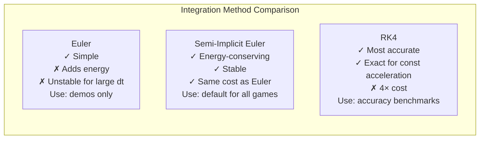
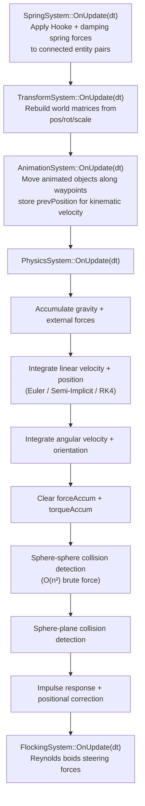

# Chapter 5 — Physics System: Integration Methods, Rigid Bodies & Collision Response

## 5.1 What Is a Physics Simulation?

A physics simulation approximates the real world by applying Newton's laws numerically. The fundamental relationship is:

```
F = ma   →   a = F / m
```

Every frame (at a fixed timestep), for each physics object:
1. Accumulate all forces (gravity, springs, etc.)
2. Compute acceleration: `a = F / mass`
3. Integrate acceleration → velocity → position

The word **"integrate"** means: given the current state and its rate of change, compute the next state. Different numerical integration methods have different accuracy and stability trade-offs.

---

## 5.2 The RigidBody Component

```cpp
// include/components/PhysicsComponents.h
namespace GE::Components {

struct RigidBody {
    // --- Linear motion ---
    float     mass          { 1.0f };
    float     inverseMass   { 1.0f };      // Pre-computed 1/mass. inverseMass=0 → infinite mass (static)
    glm::vec3 velocity      { 0.0f };
    glm::vec3 forceAccum    { 0.0f };      // Forces accumulated during the frame, cleared after integration
    float     linearDamping { 0.0f };      // Velocity multiplied by (1 - damping*dt) each tick

    // --- Angular motion ---
    glm::vec3 angularVelocity  { 0.0f };
    glm::vec3 torqueAccum      { 0.0f };
    glm::mat3 orientation      { 1.0f };           // 3×3 rotation matrix (world space)
    glm::mat3 invInertiaTensor { 1.0f };           // Body-space inverse inertia tensor
    glm::mat3 invInertiaTensorWorld { 1.0f };      // World-space = R · I⁻¹ · Rᵀ (updated each tick)

    // --- Material ---
    float restitution { 0.5f };    // Coefficient of restitution: 0 = clay, 1 = perfect bounce

    // --- Flags ---
    bool  useGravity { true };
    bool  isStatic   { false };    // Immovable; inverseMass treated as 0 in impulse calculations
};

} // namespace GE::Components
```

**Key design: `inverseMass`**

Division is expensive. Storing `inverseMass = 1/mass` means the hot path in integration and impulse response only ever multiplies. A static body has `inverseMass = 0` — any impulse formula using `invMassA + invMassB` naturally gives zero contribution from the static body. No special-casing needed.

---

## 5.3 Three Integration Methods

The engine exposes three integration methods, selectable at runtime from the ImGui menu:

```cpp
// include/systems/PhysicsSystem.h
enum class IntegrationMethod {
    Euler,         // Forward Euler — simplest, gains energy over time
    SemiImplicit,  // Symplectic Euler — energy-conserving, default
    RK4            // Runge-Kutta 4th order — most accurate, 4× costlier
};
```

### Method 1: Forward (Explicit) Euler

The simplest method. Compute velocity from the **old** state, then update position:

```cpp
// source/systems/PhysicsSystem.cpp — Euler branch
glm::vec3 acceleration = forceAccum * rb.inverseMass;
if (rb.useGravity) acceleration.y -= 9.81f;

rb.velocity          += acceleration * dt;         // Update velocity
tr->m_position       += rb.velocity * dt;          // Update position using OLD velocity
// Note: This "old velocity" means we're extrapolating FROM the start of the tick
```

**Problem:** Euler adds energy to conservative systems. A bouncing ball bounces higher each tick. It is numerically unstable for large `dt` values.

### Method 2: Semi-Implicit (Symplectic) Euler ← Default

Update velocity **first**, then use the new velocity for position:

```cpp
// source/systems/PhysicsSystem.cpp — Semi-Implicit branch
glm::vec3 acceleration = forceAccum * rb.inverseMass;
if (rb.useGravity) acceleration.y -= 9.81f;

rb.velocity    += acceleration * dt;    // Update velocity first
tr->m_position += rb.velocity * dt;    // Then use NEW velocity for position
```

This tiny change makes the integrator **symplectic** — it conserves energy for conservative forces (gravity, spring forces). A bouncing ball bounces to exactly the same height each time. This is the correct choice for game physics simulations.

### Method 3: Runge-Kutta 4th Order (RK4)

RK4 takes four sub-step samples and combines them with a weighted average. It is **exact** for polynomial ODEs (like constant acceleration):

```cpp
// source/systems/PhysicsSystem.cpp — RK4 branch
// For constant acceleration a, all four k derivatives are equal:
const glm::vec3 accel = forceAccum * rb.inverseMass + (rb.useGravity ? glm::vec3{0,-9.81f,0} : glm::vec3{0});

const glm::vec3 k1p = rb.velocity;                   // Slope at t
const glm::vec3 k2p = rb.velocity + accel * (dt * 0.5f); // Slope at t + dt/2 (midpoint)
const glm::vec3 k3p = rb.velocity + accel * (dt * 0.5f); // Slope at t + dt/2 (midpoint again)
const glm::vec3 k4p = rb.velocity + accel * dt;           // Slope at t + dt

// Weighted average: 1/6 * (k1 + 2k2 + 2k3 + k4)
tr->m_position += (dt / 6.0f) * (k1p + 2.0f*k2p + 2.0f*k3p + k4p);
rb.velocity    += accel * dt;   // Velocity update simplifies to standard for constant a
```

For constant gravity, RK4 gives the same result as the analytic solution. It becomes beneficial only for forces that vary with position or velocity (springs, drag). The cost is 4× more force evaluations per tick.

### Comparison



---

## 5.4 Sphere-Sphere Collision Detection

Before resolving a collision, we must detect it. Two spheres overlap when:

```
distance(centerA, centerB) < radiusA + radiusB
```

```cpp
// source/systems/PhysicsSystem.cpp — broadphase + narrowphase
for (uint32_t i = 0; i < sphereCount; ++i) {
    for (uint32_t j = i + 1; j < sphereCount; ++j) {
        glm::vec3 posA = transformA.m_position;
        glm::vec3 posB = transformB.m_position;
        float     sumR = sphereA.radius + sphereB.radius;

        glm::vec3 delta    = posA - posB;
        float     distSq   = glm::dot(delta, delta);

        if (distSq < sumR * sumR && distSq > 0.0f) {
            // Collision detected
            float dist = glm::sqrt(distSq);
            glm::vec3 n = delta / dist;   // Unit normal pointing A←B

            resolveCollision(idA, idB, n, dist, sumR, ...);
        }
    }
}
```

---

## 5.5 Sphere-Sphere Impulse Response

When two spheres collide, we apply an **impulse** — an instantaneous change in momentum — along the collision normal. The impulse formula for two bodies with arbitrary masses is:

```
j = -(1 + e) * v_rel / (1/mA + 1/mB)
```

Where:
- `e` = coefficient of restitution (minimum of the two bodies' restitution values)
- `v_rel` = relative velocity along the collision normal (negative = approaching)
- `j` = impulse magnitude (scalar)

```cpp
// source/systems/PhysicsSystem.cpp — ResolveCollisions()
glm::vec3 velA = rbA->velocity;
glm::vec3 velB = rbB->velocity;

// Relative approach velocity along collision normal
float vRel = glm::dot(velA - velB, n);

// Only resolve if approaching (vRel < 0)
if (vRel < 0.0f) {
    // Pick the lower restitution (e.g., rubber hitting stone → rubber's bounce)
    float e = std::min(rbA->restitution, rbB->restitution);

    // General impulse formula — works for equal mass, unequal mass, and static bodies
    const float totalInvMass = rbA->inverseMass + rbB->inverseMass;
    if (totalInvMass <= 0.0f) return;  // Both infinitely massive — do nothing

    const float j = -(1.0f + e) * vRel / totalInvMass;

    // Apply inverse-mass-weighted impulse (heavier body changes velocity less)
    rbA->velocity += j * rbA->inverseMass * n;   // Push A away from B
    rbB->velocity -= j * rbB->inverseMass * n;   // Push B away from A
}
```

**For a static body (`inverseMass = 0`):**
- The formula gives `j = -(1+e) * vRel / (invMassA + 0)` = normal impulse
- `velB -= j * 0 * n` = no change (static body never moves)
- This correctly handles the "ball hits wall" case without any special casing

### Positional Correction (Preventing Sinking)

After applying impulse, the spheres may still physically overlap (they were overlapping when we detected the collision). Without correction, objects sink into each other over many frames:

```cpp
// Positional correction: push spheres apart proportionally to their masses
const float overlap = (radiusA + radiusB) - dist;
const float correction = overlap / totalInvMass * 0.8f;  // 0.8 = "slop" factor

tr_A->m_position += correction * rbA->inverseMass * n;
tr_B->m_position -= correction * rbB->inverseMass * n;
```

---

## 5.6 Sphere-Plane Collision

A plane is defined by a normal `n` and a signed distance `d` from the origin: `dot(x, n) = d`.

```cpp
// Signed distance from sphere centre to plane
float signedDist = glm::dot(transform.m_position, planeNormal) - planeOffset;

if (signedDist < sphere.radius) {  // Sphere is below (or touching) the plane
    // Reflect velocity component along plane normal
    float velAlongNormal = glm::dot(rb.velocity, planeNormal);

    if (velAlongNormal < 0.0f) {   // Moving toward plane
        rb.velocity -= (1.0f + rb.restitution) * velAlongNormal * planeNormal;
    }

    // Push sphere out of plane
    float penetration = sphere.radius - signedDist;
    transform.m_position += planeNormal * penetration;
}
```

---

## 5.7 Angular Dynamics

Beyond translational motion, the engine simulates **rotation** driven by torque.

### Inertia Tensor

The inertia tensor `I` is the rotational analogue of mass — it describes how resistant a body is to angular acceleration about each axis. For a uniform sphere: `I = (2/5) * m * r²` (same on all axes). For a box: different values on each axis.

The engine stores `invInertiaTensor` (the inverse, for cheaper calculation) in **body space** (the object's local axes) and transforms it to world space each tick:

```cpp
// source/systems/PhysicsSystem.cpp — angular dynamics update
// Transform inertia tensor from body space to world space
rb.invInertiaTensorWorld =
    rb.orientation * rb.invInertiaTensor * glm::transpose(rb.orientation);
// (R · I⁻¹ · Rᵀ transforms the body-space tensor by the current rotation)

// Angular acceleration = I⁻¹_world * torque
glm::vec3 angularAccel = rb.invInertiaTensorWorld * rb.torqueAccum;
rb.angularVelocity += angularAccel * dt;
```

### Integrating Rotation

Rotation is stored as a 3×3 matrix (not Euler angles or quaternion — avoids gimbal lock and quaternion normalisation). The derivative of a rotation matrix is:

```
dR/dt = [ω]× · R
```

Where `[ω]×` is the skew-symmetric matrix of angular velocity ω:

```cpp
static glm::mat3 SkewSymmetric(const glm::vec3& w) {
    return glm::mat3(
         0.0f,  w.z, -w.y,   // Column 0
        -w.z,  0.0f,  w.x,   // Column 1
         w.y, -w.x,  0.0f    // Column 2
    );
}

// Integrate orientation
rb.orientation += dt * SkewSymmetric(rb.angularVelocity) * rb.orientation;

// Orthogonalise after integration to prevent numerical drift
// (the matrix should always be a pure rotation — no shear, no scale)
orthogonalise(rb.orientation);   // Gram-Schmidt process
```

---

## 5.8 MaterialInteractionRegistry

Different material pairs can have different bounce coefficients. A rubber ball hitting a glass surface bounces differently than rubber hitting steel:

```cpp
// include/physics/Physics.h
namespace GE::Physics {

struct MaterialInteractionRecord {
    std::string materialA;
    std::string materialB;
    float restitution;   // Override coefficient when these materials meet
};

class MaterialInteractionRegistry {
public:
    void Register(const std::string& a, const std::string& b, float restitution);
    bool Lookup(const std::string& a, const std::string& b,
                MaterialInteractionRecord& out) const;
private:
    std::vector<MaterialInteractionRecord> m_records;
};

} // namespace GE::Physics
```

**Usage in collision resolution:**

```cpp
// In PhysicsSystem::ResolveCollisions():
float e = std::min(rbA->restitution, rbB->restitution);  // Default: per-body minimum

if (m_registry != nullptr) {
    auto* matA = em->GetTIComponent<PhysicsMaterialTag>(idA);
    auto* matB = em->GetTIComponent<PhysicsMaterialTag>(idB);
    if (matA && matB) {
        MaterialInteractionRecord rec;
        if (m_registry->Lookup(matA->name, matB->name, rec)) {
            e = rec.restitution;   // Override with table value
        }
    }
}
```

Materials are registered from the FlatBuffers scene file's `interactions` table:

```json
// config/flatbufferConfig/02_materials_and_physics.json (human-readable)
"interactions": [
    { "material_a": "rubber", "material_b": "steel",  "restitution": 0.85 },
    { "material_a": "rubber", "material_b": "rubber",  "restitution": 0.70 },
    { "material_a": "glass",  "material_b": "concrete","restitution": 0.30 }
]
```

---

## 5.9 Physics System Execution Order

Each physics tick (inside `UpdateCpuStages`):



---

*Next: [Chapter 6 — Cloth Simulation & Flocking Boids](06_Cloth_and_Flocking.md)*
