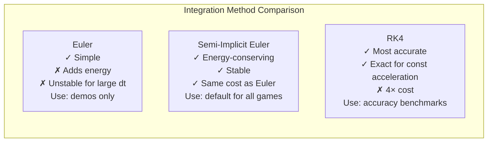
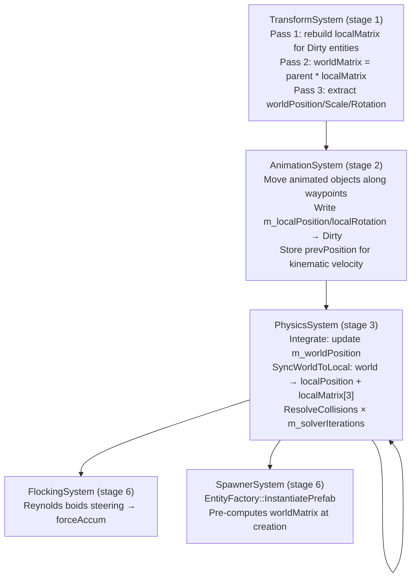

# Chapter 5 — Physics System: Integration Methods, Rigid Bodies & Collision Response

## 5.1 What Is a Physics Simulation?

A physics simulation approximates the real world by applying Newton's laws numerically. The fundamental relationship is:

```
F = ma   →   a = F / m
```

Every frame (at a fixed timestep), for each physics object:
1. Accumulate all forces (gravity, springs, etc.)
2. Compute acceleration: `a = F / mass`
3. Integrate acceleration → velocity → position

The word **"integrate"** means: given the current state and its rate of change, compute the next state. Different numerical integration methods have different accuracy and stability trade-offs.

---

## 5.2 The RigidBody Component

```cpp
// include/components/PhysicsComponents.h
namespace GE::Components {

struct RigidBody {
    // --- Linear motion ---
    float     mass          { 1.0f };
    float     inverseMass   { 1.0f };      // Pre-computed 1/mass. inverseMass=0 → infinite mass (static)
    glm::vec3 velocity      { 0.0f };
    glm::vec3 forceAccum    { 0.0f };      // Forces accumulated during the frame, cleared after integration
    float     linearDamping { 0.0f };      // Velocity multiplied by (1 - damping*dt) each tick

    // --- Angular motion ---
    glm::vec3 angularVelocity  { 0.0f };
    glm::vec3 torqueAccum      { 0.0f };
    glm::mat3 orientation      { 1.0f };           // 3×3 rotation matrix (world space)
    glm::mat3 invInertiaTensor { 1.0f };           // Body-space inverse inertia tensor
    glm::mat3 invInertiaTensorWorld { 1.0f };      // World-space = R · I⁻¹ · Rᵀ (updated each tick)

    // --- Material ---
    float restitution { 0.5f };    // Coefficient of restitution: 0 = clay, 1 = perfect bounce

    // --- Flags ---
    bool  useGravity { true };
    bool  isStatic   { false };    // Immovable; inverseMass treated as 0 in impulse calculations
};

} // namespace GE::Components
```

**Key design: `inverseMass`**

Division is expensive. Storing `inverseMass = 1/mass` means the hot path in integration and impulse response only ever multiplies. A static body has `inverseMass = 0` — any impulse formula using `invMassA + invMassB` naturally gives zero contribution from the static body. No special-casing needed.

---

## 5.3 Three Integration Methods

The engine exposes three integration methods, selectable at runtime from the ImGui menu:

```cpp
// include/systems/PhysicsSystem.h
enum class IntegrationMethod {
    Euler,         // Forward Euler — simplest, gains energy over time
    SemiImplicit,  // Symplectic Euler — energy-conserving, default
    RK4            // Runge-Kutta 4th order — most accurate, 4× costlier
};
```

### Method 1: Forward (Explicit) Euler

The simplest method. Compute velocity from the **old** state, then update position:

```cpp
// source/systems/PhysicsSystem.cpp — Euler branch
glm::vec3 acceleration = forceAccum * rb.inverseMass;

rb.velocity              += acceleration * dt;
tr->m_worldPosition      += rb.velocity * dt;   // writes world-space position
// SyncWorldToLocal() then converts worldPosition → localPosition + rebuilds localMatrix
```

**Problem:** Euler adds energy to conservative systems. A bouncing ball bounces higher each tick. It is numerically unstable for large `dt` values.

### Method 2: Semi-Implicit (Symplectic) Euler ← Default

Update velocity **first**, then use the new velocity for position:

```cpp
// source/systems/PhysicsSystem.cpp — Semi-Implicit branch
glm::vec3 acceleration = forceAccum * rb.inverseMass;

rb.velocity              += acceleration * dt;    // velocity updated first
tr->m_worldPosition      += rb.velocity * dt;    // then use NEW velocity
```

This tiny change makes the integrator **symplectic** — it conserves energy for conservative forces (gravity, spring forces). A bouncing ball bounces to exactly the same height each time. This is the correct choice for game physics simulations.

### Method 3: Runge-Kutta 4th Order (RK4)

RK4 takes four sub-step samples and combines them with a weighted average. It is **exact** for polynomial ODEs (like constant acceleration):

```cpp
// source/systems/PhysicsSystem.cpp — RK4 branch
const glm::vec3 k1p = rb.velocity;
const glm::vec3 k2p = rb.velocity + accel * (dt * 0.5f);
const glm::vec3 k3p = rb.velocity + accel * (dt * 0.5f);
const glm::vec3 k4p = rb.velocity + accel * dt;

tr->m_worldPosition += (dt / 6.0f) * (k1p + 2.0f*k2p + 2.0f*k3p + k4p);
rb.velocity         += accel * dt;
```

For constant gravity, RK4 gives the same result as the analytic solution. It becomes beneficial only for forces that vary with position or velocity (springs, drag). The cost is 4× more force evaluations per tick.

### Comparison



---

## 5.4 Sphere-Sphere Collision Detection

Before resolving a collision, we must detect it. Two spheres overlap when:

```
distance(centerA, centerB) < radiusA + radiusB
```

```cpp
// source/systems/PhysicsSystem.cpp — broadphase + narrowphase
for (uint32_t i = 0; i < sphereCount; ++i) {
    for (uint32_t j = i + 1; j < sphereCount; ++j) {
        // Use m_worldPosition — the world-space coordinate computed by TransformSystem
        glm::vec3 posA = transformA->m_worldPosition;
        glm::vec3 posB = transformB->m_worldPosition;
        float     sumR = sphereA.radius + sphereB.radius;

        glm::vec3 delta  = posA - posB;
        float     distSq = glm::dot(delta, delta);

        if (distSq < sumR * sumR && distSq > 0.0f) {
            float dist = glm::sqrt(distSq);
            glm::vec3 n = delta / dist;   // Unit normal A←B
            resolveCollision(idA, idB, n, dist, sumR, ...);
        }
    }
}
```

---

## 5.5 Sphere-Sphere Impulse Response

When two spheres collide, we apply an **impulse** — an instantaneous change in momentum — along the collision normal. The impulse formula for two bodies with arbitrary masses is:

```
j = -(1 + e) * v_rel / (1/mA + 1/mB)
```

Where:
- `e` = coefficient of restitution (minimum of the two bodies' restitution values)
- `v_rel` = relative velocity along the collision normal (negative = approaching)
- `j` = impulse magnitude (scalar)

```cpp
// source/systems/PhysicsSystem.cpp — ResolveCollisions()
glm::vec3 velA = rbA->velocity;
glm::vec3 velB = rbB->velocity;

// Relative approach velocity along collision normal
float vRel = glm::dot(velA - velB, n);

// Only resolve if approaching (vRel < 0)
if (vRel < 0.0f) {
    // Pick the lower restitution (e.g., rubber hitting stone → rubber's bounce)
    float e = std::min(rbA->restitution, rbB->restitution);

    // General impulse formula — works for equal mass, unequal mass, and static bodies
    const float totalInvMass = rbA->inverseMass + rbB->inverseMass;
    if (totalInvMass <= 0.0f) return;  // Both infinitely massive — do nothing

    const float j = -(1.0f + e) * vRel / totalInvMass;

    // Apply inverse-mass-weighted impulse (heavier body changes velocity less)
    rbA->velocity += j * rbA->inverseMass * n;   // Push A away from B
    rbB->velocity -= j * rbB->inverseMass * n;   // Push B away from A
}
```

**For a static body (`inverseMass = 0`):**
- The formula gives `j = -(1+e) * vRel / (invMassA + 0)` = normal impulse
- `velB -= j * 0 * n` = no change (static body never moves)
- This correctly handles the "ball hits wall" case without any special casing

### Positional Correction (Preventing Sinking)

After applying impulse, the spheres may still physically overlap. Without correction, objects sink into each other over many frames. The correction writes to `m_worldPosition`, then calls `SyncWorldToLocal` to keep `m_localPosition` and `m_localMatrix[3]` consistent — essential so TransformSystem computes the correct `m_worldMatrix` for the next frame:

```cpp
// Positional correction
const glm::vec3 correction = (penetration / totalInvMass) * n;
if (!aIsStatic) {
    aTrans->m_worldPosition += correction * invMassA;
    SyncWorldToLocal(*aTrans, em);   // patches m_localPosition and m_localMatrix[3]
}
if (!bIsStatic) {
    bTrans->m_worldPosition -= correction * invMassB;
    SyncWorldToLocal(*bTrans, em);
}
```

**Why `SyncWorldToLocal` must also patch `m_localMatrix[3]`:** TransformSystem sets `m_worldMatrix = m_localMatrix` (for root entities) in pass 2, then extracts `m_worldPosition` from `m_worldMatrix[3]` in pass 3. If `m_localMatrix[3]` were stale (pointing to the pre-correction position), pass 3 would overwrite the corrected `m_worldPosition` — causing the "quicksand sinking" bug where objects slowly drift through floors.

---

## 5.6 Sphere-Plane Collision

A plane is defined by a normal `n` and a signed distance `d` from the origin: `dot(x, n) = d`.

```cpp
// Signed distance from sphere centre to plane
GE::Physics::Sphere sphere(sTrans->m_worldPosition, sCol.radius);
float dist = plane.DistanceToPoint(sphere.GetCenter());

if (dist < sphere.GetRadius()) {
    float penetration = sphere.GetRadius() - dist;

    // Push sphere out of plane (world-space correction)
    sTrans->m_worldPosition += plane.GetNormal() * penetration;
    SyncWorldToLocal(*sTrans, em);  // keep localPosition and localMatrix[3] in sync

    // Reflect velocity
    float vRelN = glm::dot(rb.velocity, plane.GetNormal());
    if (vRelN < 0.0f) {
        rb.velocity -= (1.0f + e) * vRelN * plane.GetNormal();
    }
}
```

---

## 5.7 Angular Dynamics

Beyond translational motion, the engine simulates **rotation** driven by torque.

### Inertia Tensor

The inertia tensor `I` is the rotational analogue of mass — it describes how resistant a body is to angular acceleration about each axis. For a uniform sphere: `I = (2/5) * m * r²` (same on all axes). For a box: different values on each axis.

The engine stores `invInertiaTensor` (the inverse, for cheaper calculation) in **body space** (the object's local axes) and transforms it to world space each tick:

```cpp
// source/systems/PhysicsSystem.cpp — angular dynamics update
// Transform inertia tensor from body space to world space
rb.invInertiaTensorWorld =
    rb.orientation * rb.invInertiaTensor * glm::transpose(rb.orientation);
// (R · I⁻¹ · Rᵀ transforms the body-space tensor by the current rotation)

// Angular acceleration = I⁻¹_world * torque
glm::vec3 angularAccel = rb.invInertiaTensorWorld * rb.torqueAccum;
rb.angularVelocity += angularAccel * dt;
```

### Integrating Rotation

Rotation is stored as a 3×3 matrix (not Euler angles or quaternion — avoids gimbal lock and quaternion normalisation). The derivative of a rotation matrix is:

```
dR/dt = [ω]× · R
```

Where `[ω]×` is the skew-symmetric matrix of angular velocity ω:

```cpp
static glm::mat3 SkewSymmetric(const glm::vec3& w) {
    return glm::mat3(
         0.0f,  w.z, -w.y,   // Column 0
        -w.z,  0.0f,  w.x,   // Column 1
         w.y, -w.x,  0.0f    // Column 2
    );
}

// Integrate orientation
rb.orientation += dt * SkewSymmetric(rb.angularVelocity) * rb.orientation;

// Orthogonalise after integration to prevent numerical drift
// (the matrix should always be a pure rotation — no shear, no scale)
orthogonalise(rb.orientation);   // Gram-Schmidt process
```

---

## 5.8 MaterialInteractionRegistry

Different material pairs can have different bounce coefficients. A rubber ball hitting a glass surface bounces differently than rubber hitting steel:

```cpp
// include/physics/Physics.h
namespace GE::Physics {

struct MaterialInteractionRecord {
    std::string materialA;
    std::string materialB;
    float restitution;   // Override coefficient when these materials meet
};

class MaterialInteractionRegistry {
public:
    void Register(const std::string& a, const std::string& b, float restitution);
    bool Lookup(const std::string& a, const std::string& b,
                MaterialInteractionRecord& out) const;
private:
    std::vector<MaterialInteractionRecord> m_records;
};

} // namespace GE::Physics
```

**Usage in collision resolution:**

```cpp
// In PhysicsSystem::ResolveCollisions():
float e = std::min(rbA->restitution, rbB->restitution);  // Default: per-body minimum

if (m_registry != nullptr) {
    auto* matA = em->GetTIComponent<PhysicsMaterialTag>(idA);
    auto* matB = em->GetTIComponent<PhysicsMaterialTag>(idB);
    if (matA && matB) {
        MaterialInteractionRecord rec;
        if (m_registry->Lookup(matA->name, matB->name, rec)) {
            e = rec.restitution;   // Override with table value
        }
    }
}
```

Materials are registered from the FlatBuffers scene file's `interactions` table:

```json
// config/flatbufferConfig/02_materials_and_physics.json (human-readable)
"interactions": [
    { "material_a": "rubber", "material_b": "steel",  "restitution": 0.85 },
    { "material_a": "rubber", "material_b": "rubber",  "restitution": 0.70 },
    { "material_a": "glass",  "material_b": "concrete","restitution": 0.30 }
]
```

---

## 5.9 Physics System Execution Order

Each physics tick (inside `UpdateCpuStages`):



### Multi-Pass Collision Solver

`PhysicsSystem::OnUpdate` runs `ResolveCollisions` N times per tick (default N = 3):

```cpp
void PhysicsSystem::OnUpdate(float dt) {
    Integrate(dt);
    for (int i = 0; i < m_solverIterations; ++i) {
        ResolveCollisions();
    }
}
```

Each pass propagates corrections between adjacent contact pairs. With a single pass, correcting pair A-B doesn't update pair B-C, causing stacked objects to drift. Three passes gives stable 3–4 object stacks at normal physics Hz. `m_solverIterations` is exposed in the ImGui Simulation menu (slider 1–8).

---

## 5.10 Dual Local/World Transform Property System

The engine implements Unity-style dual transform coordinates — every `Transform` carries both a **local** (stored) and a **world** (computed) position:

```cpp
// include/components/Transform.h
struct Transform {
    // Local — authored by scene loaders, AnimationSystem, Inspector
    glm::vec3 m_localPosition { 0.0f };
    glm::vec3 m_localRotation { 0.0f };  // Euler degrees YXZ
    glm::vec3 m_localScale    { 1.0f };

    // World — computed by TransformSystem each frame (read-only outside TransformSystem)
    glm::vec3 m_worldPosition { 0.0f };
    glm::vec3 m_worldRotation { 0.0f };  // Euler extracted from worldMatrix (display only)
    glm::vec3 m_worldScale    { 1.0f };

    glm::mat4 m_localMatrix { 1.0f };
    glm::mat4 m_worldMatrix { 1.0f };
    uint32_t  m_parentEntityID = UINT32_MAX;
    TransformState m_state = TransformState::Dirty;
};
```

### Why Two Positions?

Before this refactor, there was only `m_position`. This worked correctly for root entities (where local = world), but broke when entities had parents: `PhysicsSystem` treated `m_position` as world coordinates, while `TransformSystem` treated it as local — entities with parents would float at the wrong height.

Now:
- **Physics reads and writes `m_worldPosition`** — always world-space, correct regardless of parent
- **TransformSystem computes `m_worldPosition`** from `m_worldMatrix[3]` in pass 3
- **SyncWorldToLocal converts** `m_worldPosition → m_localPosition` (via inverse parent matrix) after each physics correction

### TransformSystem Three Passes

```
Pass 1 (Dirty entities only):
    m_localMatrix = translate(m_localPosition) * rotY * rotX * rotZ * scale(m_localScale)

Pass 2 (all entities):
    if root: m_worldMatrix = m_localMatrix
    else:    m_worldMatrix = parent.m_worldMatrix * m_localMatrix

Pass 3 (all entities):
    m_worldPosition = vec3(m_worldMatrix[3])
    m_worldScale    = { |col0|, |col1|, |col2| }
    m_worldRotation = YXZ Euler extracted from normalised rotation submatrix
```

### SyncWorldToLocal

PhysicsSystem calls this after every position write (integration or collision correction):

```cpp
void PhysicsSystem::SyncWorldToLocal(Transform& trans, EntityManager* em) {
    if (trans.m_parentEntityID == UINT32_MAX) {
        trans.m_localPosition = trans.m_worldPosition;
    } else {
        auto* p = em->TryGetTIComponent<Transform>(trans.m_parentEntityID);
        if (p) {
            trans.m_localPosition = vec3(inverse(p->m_worldMatrix) * vec4(trans.m_worldPosition, 1));
        }
    }
    // Patch translation column of localMatrix so TransformSystem pass 2
    // produces the correct worldMatrix without needing a full rebuild.
    trans.m_localMatrix[3] = glm::vec4(trans.m_localPosition, 1.0f);
}
```

The `m_localMatrix[3]` patch is critical. If only `m_localPosition` were updated, TransformSystem pass 2 would compute `worldMatrix` from the stale (pre-correction) `m_localMatrix`, and pass 3 would then overwrite `m_worldPosition` with the wrong value — causing the object to sink through floors over time.

---

*Next: [Chapter 6 — Cloth Simulation & Flocking Boids](06_Cloth_and_Flocking.md)*

---

## 5.11 Physics Debugging Checklist

When physics behaviour does not match expectations, use this table to diagnose the problem:

| Symptom | Most Likely Cause | Diagnostic Step | Fix |
|---------|------------------|----------------|-----|
| Objects slowly sink through floor | `SyncWorldToLocal` not called after impulse, or `m_localMatrix[3]` not patched | Log `worldPosition.y` after each tick — does it drift down gradually? | Verify `SyncWorldToLocal` runs at the END of `ResolveCollisions`, and that `m_localMatrix[3]` is patched |
| Objects explode outward on first contact | Penetration depth calculated incorrectly (negative value used as positive) | Log penetration depth at first collision | Ensure `depth = radius - distance` is positive only when overlapping |
| Restitution > 1 (objects gain energy on bounce) | `restitution` field > 1.0 or MaterialInteractionRegistry returns > 1 | Log restitution value used in impulse | Clamp to [0, 1] |
| Jitter at rest on flat surface | Micro-velocity not killed | Log velocity magnitude each tick | Kill velocity when `|v| < 0.05f` after integration |
| Physics runs slow at high Hz | Accumulator capped too low (spiral-of-death guard) | Log how many ticks execute per graphics frame | Raise `maxTicksPerFrame` from 4 to 8 |
| Tunneling (fast objects pass through geometry) | Physics Hz too low, or object moving more than its radius per tick | Log `|velocity| * dt` vs `collider radius` | Raise physics Hz; for very fast objects, implement swept sphere test |
| Spinning objects never come to rest | `angularDamping` is 0 | Check `RigidBody::angularDamping` | Set a small damping value (0.05–0.2) |
| Stack of objects collapses | Too few solver iterations | Observe with 3 boxes stacked at 120 Hz | Raise `m_solverIterations` from 3 to 6; also reduce physics Hz if accumulator is backed up |
| Collisions only detected on one side | Plane normal reversed or `isStatic` flag missing | Log `penetration = dot(posA - planeOrigin, planeNormal) - radius` | Flip the normal in the scene JSON; ensure `isStatic = true` for planes |
| Angular velocity never changes | Inertia tensor is identity (not set up) | Log `invInertiaTensorWorld` | Compute the correct analytical `I_body` for the shape (sphere: `2/5 * mass * r²`) |

---

## 5.12 Angular Dynamics: Full Derivation

This section explains WHY the angular integration works the way it does — useful for anyone
reimplementing physics from scratch.

### The Inertia Tensor

For linear motion: `F = ma`, so `a = F / m`. The inverse mass `1/m` is how much one unit of
force accelerates the object.

For rotational motion: the equivalent is the **inertia tensor** `I`. Instead of a scalar,
it is a 3×3 matrix that describes how the object's mass is distributed relative to its rotation
axis:

```
τ = I · α    →    α = I⁻¹ · τ
(torque = I × angular_accel)
```

For a uniform sphere of radius r and mass m:

```
        ⎡ 2/5·m·r²    0         0      ⎤
I_body = ⎢    0      2/5·m·r²   0      ⎥
        ⎣    0         0      2/5·m·r² ⎦
```

The diagonal entries are the same because a sphere has equal resistance to rotation around
all axes. For a box (half-extents hx, hy, hz):

```
        ⎡ 1/3·m·(hy²+hz²)         0               0       ⎤
I_body = ⎢      0          1/3·m·(hx²+hz²)         0       ⎥
        ⎣      0                   0       1/3·m·(hx²+hy²) ⎦
```

The engine stores the **inverse** of this tensor (`invInertiaTensor`) to avoid a matrix
inversion every tick.

### World-Space Inertia

The body-space tensor is defined in the object's local frame. When the object rotates, its
world-space resistance to rotation changes. The world-space inverse inertia tensor must be
recomputed every tick:

```
I_world^{-1} = R · I_body^{-1} · R^T
```

where `R` is the current rotation matrix. In code:

```cpp
// In PhysicsSystem::Integrate(), per RigidBody:
rb.invInertiaTensorWorld =
    glm::mat3(rb.orientation)
    * rb.invInertiaTensor
    * glm::transpose(glm::mat3(rb.orientation));
```

### The Skew-Symmetric Matrix for ω × r

The angular velocity vector `ω` and a point offset `r` combine as a cross product `ω × r`
to give the velocity contribution from rotation. The cross product can be written as a matrix
multiplication using the **skew-symmetric matrix** of ω:

```
         ⎡  0   -ωz   ωy ⎤
Skew(ω) = ⎢  ωz   0   -ωx ⎥
         ⎣ -ωy   ωx    0  ⎦

ω × r = Skew(ω) · r
```

This is useful for computing the angular contribution to velocity at a contact point:
`v_contact = linearVelocity + Skew(ω) · r_contact`.

### Gram-Schmidt Re-Orthogonalisation

After thousands of integration steps, floating-point rounding makes the rotation matrix `R`
slightly non-orthogonal (its columns drift from being exactly perpendicular with unit length).
An un-orthogonal rotation matrix produces distorted shapes and incorrect inertia computations.

Gram-Schmidt fixes this by re-deriving the third column from the first two:

```cpp
// After updating rb.orientation in PhysicsSystem:
glm::vec3 col0 = glm::normalize(glm::vec3(rb.orientation[0]));
glm::vec3 col1 = glm::normalize(
    glm::vec3(rb.orientation[1]) - glm::dot(glm::vec3(rb.orientation[1]), col0) * col0);
glm::vec3 col2 = glm::cross(col0, col1);  // guaranteed orthogonal
rb.orientation[0] = glm::vec4(col0, 0.0f);
rb.orientation[1] = glm::vec4(col1, 0.0f);
rb.orientation[2] = glm::vec4(col2, 0.0f);
```

This should be applied every N ticks (e.g., every 100 ticks) rather than every tick, as it is
relatively expensive for a minor correction.
