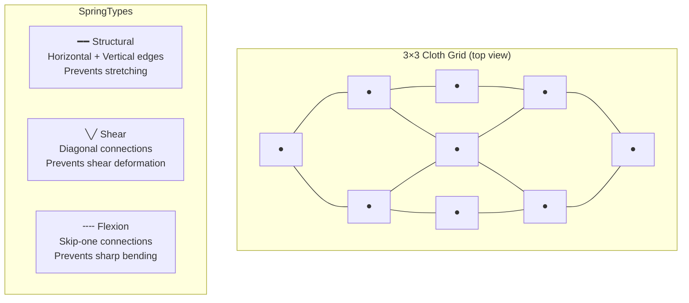
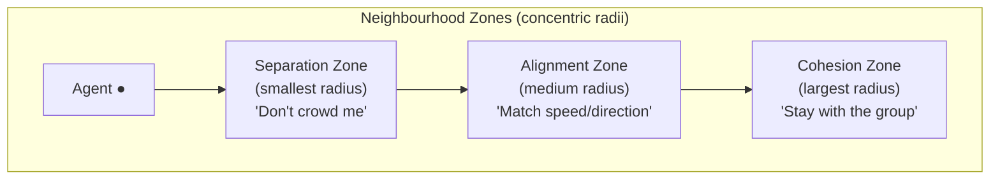

# Chapter 6 — Cloth Simulation & Flocking Boids

---

# Part A: Cloth Simulation

## 6.1 Verlet Integration for Cloth

Mass-spring cloth simulation needs many particles connected by springs. Using Semi-Implicit Euler for each particle works but requires storing velocity for every particle and careful tuning for stability.

**Verlet integration** is an alternative that implicitly captures velocity from the position history:

```
x(t+dt) = 2·x(t) - x(t-dt) + a·dt²
```

Rearranged: `x(t+dt) = x(t) + (x(t) - x(t-dt))·damping + a·dt²`

The term `(x(t) - x(t-dt))` is the displacement from the previous tick — i.e., the implicit velocity. Multiplying by a damping factor `< 1` dissipates energy naturally.

**Why Verlet for cloth?**
- No explicit velocity storage needed (saves memory for thousands of particles)
- Unconditionally stable for small-to-medium timesteps
- Natural damping integration — no extra energy bleed

### ClothParticle Structure

```cpp
// include/components/ClothComponent.h
namespace GE::Components {

struct ClothParticle {
    glm::vec3 position     { 0.0f };   // Current position (world space)
    glm::vec3 prevPosition { 0.0f };   // Position from previous tick (encodes velocity)
    glm::vec3 force        { 0.0f };   // Accumulated forces this tick
    bool      pinned       { false };  // If true, particle doesn't move (fixed pin point)
    float     heat         { 0.0f };   // 0–1 heat accumulation for burning
    bool      burned       { false };  // If true, freed from all springs
};

} // namespace GE::Components
```

### Verlet Integration in ClothSystem

```cpp
// source/systems/ClothSystem.cpp — OnUpdate() (simplified)
void ClothSystem::OnUpdate(float dt) {
    for each entity with ClothComponent cc {

        // Step 1: Accumulate forces (gravity + wind)
        for (auto& p : cc.particles) {
            if (p.pinned) { p.force = glm::vec3{0.0f}; continue; }
            p.force  = glm::vec3{ 0.0f, -9.81f * cc.particleMass, 0.0f };  // Gravity
            p.force += glm::vec3{ cc.windX * cc.particleMass, 0.0f,
                                  cc.windZ * cc.particleMass };              // Wind
        }

        // Step 2–4: Spring forces (structural, shear, flexion)
        for (auto& s : cc.springs) {
            if (!s.active) continue;   // Skip torn springs
            applySpring(cc.particles[s.a], cc.particles[s.b],
                        s.restLen, s.kSpring, cc.damping, dt);
        }

        // Step 5: Verlet integration
        const float dampFactor = 1.0f - cc.damping * dt;
        for (auto& p : cc.particles) {
            if (p.pinned) continue;

            const glm::vec3 acc    = p.force / cc.particleMass;
            const glm::vec3 newPos = p.position
                                   + (p.position - p.prevPosition) * dampFactor
                                   + acc * (dt * dt);   // a·dt²
            p.prevPosition = p.position;
            p.position     = newPos;
            p.force        = glm::vec3{ 0.0f };   // Clear for next tick
        }

        // Step 6: Sphere-cloth collision (push particles out of spheres)
        resolveClothSphereCollisions(cc);

        // Step 7: Upload updated positions to GPU buffer
        uploadVerticesToGpu(cc);
    }
}
```

---

## 6.2 The Spring Network: Three Types

A cloth mesh is divided into a grid of particles. Each particle connects to its neighbours through springs of three types:



```cpp
// include/components/ClothComponent.h
struct ClothSpring {
    uint16_t a       { 0 };        // Index of particle A in cc.particles
    uint16_t b       { 0 };        // Index of particle B in cc.particles
    float    restLen { 0.0f };     // Rest length (target distance)
    float    kSpring { 100.0f };   // Stiffness constant (N/m)
    bool     active  { true };     // false = spring was torn
};

struct ClothComponent {
    int   rows { 10 };       // Particles in Z direction
    int   cols { 10 };       // Particles in X direction
    float cellSize    { 0.2f };    // Distance between adjacent particles
    float particleMass { 0.1f };  // kg per particle
    float springK  { 100.0f };   // Structural spring constant
    float shearK   { 50.0f };    // Shear spring constant
    float flexionK { 25.0f };    // Flexion spring constant
    float damping  { 0.02f };    // Global velocity damping
    float windX    { 0.0f };     // Wind force in X
    float windZ    { 0.0f };     // Wind force in Z
    float tearThreshold { 3.0f }; // Tear when stretch > threshold * restLen

    std::vector<ClothParticle> particles;   // rows * cols particles
    std::vector<ClothSpring>   springs;     // Explicit spring list
};
```

### Spring Force Calculation

```cpp
// source/systems/ClothSystem.cpp
static void applySpring(ClothParticle& pA, ClothParticle& pB,
                        float restLen, float kSpring, float kDamp, float dt)
{
    glm::vec3 d   = pA.position - pB.position;
    float     len = glm::length(d);
    if (len < 1e-6f) return;           // Avoid divide-by-zero

    glm::vec3 dir = d / len;

    // Hooke's Law: F_spring = k * (len - restLen)
    float springMag = kSpring * (len - restLen);

    // Velocity damping: projects relative velocity onto spring direction
    // velocity ≈ (pos - prevPos) / dt  (Verlet implicit velocity)
    glm::vec3 relVel = (pA.position - pA.prevPosition) - (pB.position - pB.prevPosition);
    float dampMag    = kDamp * glm::dot(relVel, dir) / dt;

    glm::vec3 F = (springMag + dampMag) * dir;
    if (!pA.pinned) pA.force -= F;   // Push A away from B
    if (!pB.pinned) pB.force += F;   // Push B toward A
}
```

**Why all three spring types?**

| Spring | Missing Effect |
|--------|---------------|
| Structural only | Cloth shears diagonally; it's too "loose" |
| + Shear | Cloth still folds sharply at grid edges |
| + Flexion | Cloth resists bending — behaves like fabric |

---

## 6.3 Tearing Mechanic

When a spring stretches beyond `tearThreshold * restLen`, it is permanently deactivated:

```cpp
// source/systems/ClothSystem.cpp — tearing check (inside spring loop)
for (auto& s : cc.springs) {
    if (!s.active) continue;

    float len = glm::length(cc.particles[s.a].position - cc.particles[s.b].position);
    if (len > s.restLen * cc.tearThreshold) {
        s.active = false;    // Spring torn — never checked again
    }
}
```

Once a spring is torn, the two connected particles are no longer constrained. If enough structural springs tear in a region, that section of the cloth falls free.

---

## 6.4 Burning Mechanic

```cpp
// source/systems/ClothSystem.cpp — burning update
if (cc.burnActive) {
    for (uint32_t pi = 0; pi < cc.particles.size(); ++pi) {
        ClothParticle& p = cc.particles[pi];
        if (p.burned || p.pinned) continue;

        float dist = glm::length(p.position - cc.burnCenter);
        if (dist < cc.burnRadius) {
            p.heat += cc.burnRate * dt;   // Accumulate heat inside fire zone
        }

        if (p.heat >= 1.0f && !p.burned) {
            p.burned = true;
            p.pinned = false;   // Free the particle (stops being pinned if it was)
            // Sever all springs connected to this particle
            for (auto& s : cc.springs) {
                if (s.a == static_cast<uint16_t>(pi) ||
                    s.b == static_cast<uint16_t>(pi)) {
                    s.active = false;
                }
            }
        }
    }
}
```

---

## 6.5 GPU Buffer: Persistent-Mapped Host-Visible Memory

Cloth vertices change every frame (every particle moves). Rather than creating a staging buffer and copying every frame, the engine uses a **persistently-mapped host-visible buffer** — the CPU can write directly into GPU-accessible memory:

```cpp
// include/components/ClothComponent.h (GPU buffer fields)
struct ClothComponent {
    // ...
    VkBuffer       vertexBuffer  { VK_NULL_HANDLE };   // Combined vertex + index buffer
    VkDeviceMemory vertexMemory  { VK_NULL_HANDLE };   // HOST_VISIBLE | HOST_COHERENT memory
    void*          mappedVertices { nullptr };          // Persistent CPU-side pointer
    uint32_t       vertexCount   { 0 };
    VkDeviceSize   indexOffset   { 0 };    // Byte offset where index data starts
};
```

Every frame, `ClothSystem` writes new vertex positions directly:

```cpp
// source/systems/ClothSystem.cpp — GPU upload
void ClothSystem::uploadVerticesToGpu(GE::Components::ClothComponent& cc) {
    if (cc.mappedVertices == nullptr) return;

    auto* verts = static_cast<GE::Assets::Vertex*>(cc.mappedVertices);
    uint32_t vi = 0;
    for (int row = 0; row < cc.rows; ++row) {
        for (int col = 0; col < cc.cols; ++col) {
            const ClothParticle& p = cc.particles[row * cc.cols + col];
            verts[vi].pos    = p.position;
            verts[vi].normal = computeNormal(cc, row, col);  // From neighbour positions
            verts[vi].color  = { 0.7f, 0.7f, 0.9f };        // Blue-grey cloth colour
            ++vi;
        }
    }
    // No vkFlush needed — HOST_COHERENT flag ensures CPU writes are visible to GPU
}
```

The memory type `VK_MEMORY_PROPERTY_HOST_VISIBLE_BIT | VK_MEMORY_PROPERTY_HOST_COHERENT_BIT` means writes from the CPU are immediately visible to the GPU without explicit flushing.

---

# Part B: Flocking Boids

## 6.6 Reynolds Boids: Three Rules

Craig Reynolds (1986) defined a flocking algorithm using only three simple local rules — no global coordination, no leader. Each agent independently computes forces from its neighbourhood:



### FlockingComponent

```cpp
// include/components/FlockingComponent.h
namespace GE::Components {

struct FlockingComponent {
    // Neighbourhood radii (world units)
    float separationRadius { 1.5f };
    float alignmentRadius  { 3.0f };
    float cohesionRadius   { 5.0f };

    // Force weights (Weighted Truncated Sum)
    float wSeparation { 2.0f };   // Highest priority
    float wAlignment  { 1.0f };
    float wCohesion   { 1.0f };
    float wAvoidance  { 3.0f };   // Static obstacle avoidance

    float   maxSpeed  { 6.0f };    // Maximum agent speed (m/s)
    float   maxForce  { 15.0f };   // Maximum steering force (N)
    uint8_t groupId   { 0 };       // 0 = flock with everyone; >0 = flock only with same group
};

} // namespace GE::Components
```

---

## 6.7 Implementing the Three Behaviours

```cpp
// source/systems/FlockingSystem.cpp — computeSteering() (simplified)

glm::vec3 FlockingSystem::computeSteering(const AgentEntry& self,
                                          const FlockingComponent& fk,
                                          const std::vector<uint32_t>& neighbourIndices) {
    glm::vec3 separation { 0.0f };
    glm::vec3 alignment  { 0.0f };
    glm::vec3 cohesion   { 0.0f };

    int sepCount = 0, alignCount = 0, cohCount = 0;
    glm::vec3 avgVel { 0.0f };
    glm::vec3 centreOfMass { 0.0f };

    for (uint32_t ni : neighbourIndices) {
        const AgentEntry& n = m_agents[ni];
        if (&n == &self) continue;
        if (fk.groupId != 0 && n.group != fk.groupId) continue;  // Different group: ignore

        glm::vec3 diff = self.pos - n.pos;
        float     dist = glm::length(diff);
        if (dist < 1e-6f) continue;

        // --- Separation ---
        if (dist < fk.separationRadius) {
            separation += glm::normalize(diff) / dist;   // Weight by proximity (1/dist)
            ++sepCount;
        }

        // --- Alignment ---
        if (dist < fk.alignmentRadius) {
            avgVel += n.vel;
            ++alignCount;
        }

        // --- Cohesion ---
        if (dist < fk.cohesionRadius) {
            centreOfMass += n.pos;
            ++cohCount;
        }
    }

    // Normalise and scale each force
    if (sepCount > 0) {
        separation = glm::normalize(separation) * fk.maxForce;
    }

    if (alignCount > 0) {
        glm::vec3 desired = avgVel / static_cast<float>(alignCount);
        glm::vec3 steer   = desired - self.vel;
        float     mag     = glm::length(steer);
        if (mag > 1e-6f)
            alignment = glm::normalize(steer) * fk.maxForce;
    }

    if (cohCount > 0) {
        glm::vec3 target  = centreOfMass / static_cast<float>(cohCount);
        glm::vec3 toTarget = target - self.pos;
        float     mag     = glm::length(toTarget);
        if (mag > 1e-6f)
            cohesion = glm::normalize(toTarget) * fk.maxForce;
    }

    // Obstacle avoidance (see §6.8 below)
    glm::vec3 avoidance = computeAvoidance(self, fk);

    // --- Weighted Truncated Sum ---
    return weightedTruncatedSum(separation, avoidance, alignment, cohesion, fk);
}
```

---

## 6.8 Weighted Truncated Sum (Buckland Pattern)

Instead of simply adding all forces, the engine uses a **priority budget** — if the high-priority forces consume the maximum force budget, lower-priority forces are ignored entirely. This prevents agents from flying into walls because cohesion was overriding separation:

```cpp
// source/systems/FlockingSystem.cpp
glm::vec3 FlockingSystem::weightedTruncatedSum(
    const glm::vec3& separation, const glm::vec3& avoidance,
    const glm::vec3& alignment,  const glm::vec3& cohesion,
    const FlockingComponent& fk)
{
    glm::vec3 totalForce { 0.0f };
    float     remaining  = fk.maxForce;  // Remaining force budget

    // Add force, consuming budget. Returns false if budget exhausted.
    auto addForce = [&](const glm::vec3& f, float weight) -> bool {
        glm::vec3 wf  = f * weight;
        float     mag = glm::length(wf);
        if (mag < 1e-6f) return true;   // Zero force — skip, don't reduce budget

        if (mag > remaining) {
            // Clamp to remaining budget and stop
            totalForce += glm::normalize(wf) * remaining;
            remaining = 0.0f;
            return false;
        }
        totalForce += wf;
        remaining  -= mag;
        return true;
    };

    // Priority order: Separation > Obstacle Avoidance > Alignment > Cohesion
    if (!addForce(separation, fk.wSeparation)) return totalForce;
    if (!addForce(avoidance,  fk.wAvoidance))  return totalForce;
    if (!addForce(alignment,  fk.wAlignment))  return totalForce;
    addForce(cohesion, fk.wCohesion);

    return totalForce;
}
```

**Why this priority?**
1. **Separation** — stop agents from overlapping (most urgent)
2. **Avoidance** — don't fly into static obstacles
3. **Alignment** — match flock direction (social behaviour)
4. **Cohesion** — stay with the group (social behaviour, least urgent)

---

## 6.9 Spatial Partitioning Modes

The naive approach checks every agent against every other agent: O(n²). With 1000 agents, that's 1,000,000 pair checks per frame.

The engine provides three spatial modes:

```cpp
// include/systems/FlockingSystem.h
enum class FlockSpatialMode : uint8_t {
    BruteForce  = 0,   // O(n²) — check all pairs
    UniformGrid = 1,   // O(n) build + O(m) query
    Octree      = 2    // O(n log n) build + O(log n + m) query
};
```

### Uniform Grid

Divide 3D space into a grid of cells. For each frame:
1. Hash every agent's position into a cell: `cellX = floor(pos.x / cellSize)`
2. To find neighbours within radius `r`: visit the 27 cells (3×3×3 cube) around the agent

```cpp
// source/systems/FlockingSystem.cpp — buildUniformGrid()
void FlockingSystem::buildUniformGrid() {
    m_gridCells.clear();
    for (uint32_t i = 0; i < m_agents.size(); ++i) {
        int cx = static_cast<int>(std::floor(m_agents[i].pos.x / m_gridCellSize));
        int cy = static_cast<int>(std::floor(m_agents[i].pos.y / m_gridCellSize));
        int cz = static_cast<int>(std::floor(m_agents[i].pos.z / m_gridCellSize));
        uint64_t key = hashCell(cx, cy, cz);
        m_gridCells[key].push_back(i);
    }
}

// queryUniformGrid: visit 27 surrounding cells, collect agents within radius
void FlockingSystem::queryUniformGrid(const glm::vec3& pos, float radius,
                                      std::vector<uint32_t>& results) {
    int cxBase = static_cast<int>(std::floor(pos.x / m_gridCellSize));
    int cyBase = static_cast<int>(std::floor(pos.y / m_gridCellSize));
    int czBase = static_cast<int>(std::floor(pos.z / m_gridCellSize));

    for (int dz = -1; dz <= 1; ++dz)
    for (int dy = -1; dy <= 1; ++dy)
    for (int dx = -1; dx <= 1; ++dx) {
        uint64_t key = hashCell(cxBase+dx, cyBase+dy, czBase+dz);
        auto it = m_gridCells.find(key);
        if (it == m_gridCells.end()) continue;
        for (uint32_t idx : it->second) {
            if (glm::length(m_agents[idx].pos - pos) <= radius) {
                results.push_back(idx);
                ++m_neighbourChecksLastFrame;
            }
        }
    }
}
```

### Octree

An octree recursively subdivides 3D space into 8 equal sub-cells. Agents are stored in leaf nodes. To query a neighbourhood sphere:
1. Visit the root
2. If the sphere doesn't intersect the node's AABB: skip entirely
3. If the node is a leaf: check all agents against the sphere
4. Otherwise: recurse into children

```cpp
// source/systems/FlockingSystem.cpp (OctreeNode structure)
struct OctreeNode {
    glm::vec3 centre;
    float     halfSize;
    std::vector<uint32_t> agentIndices;  // Only populated in leaf nodes
    std::unique_ptr<OctreeNode> children[8];

    bool isLeaf() const {
        return children[0] == nullptr;
    }
    bool intersectsSphere(const glm::vec3& spherePos, float radius) const {
        // Sphere-AABB intersection test
        glm::vec3 closest = glm::clamp(spherePos,
            centre - glm::vec3(halfSize),
            centre + glm::vec3(halfSize));
        return glm::length(spherePos - closest) <= radius;
    }
};
```

Constants: `OCTREE_MAX_DEPTH = 6`, `OCTREE_MAX_LEAF_AGENTS = 8`, world half-extent = 60 units.

### Performance Comparison

| Mode | Agents | Neighbour Checks/Frame | Suitable For |
|------|--------|------------------------|-------------|
| BruteForce | 60 | 3,540 (n²) | Small flocks (< 100) |
| UniformGrid | 60 | ~300–500 | Most use cases |
| Octree | 60 | ~150–300 | Large sparse flocks |
| BruteForce | 500 | 249,750 | **Too slow** |
| UniformGrid | 500 | ~2,000–5,000 | ✓ |
| Octree | 500 | ~1,000–3,000 | ✓ |

The ImGui "Flocking" menu displays `m_neighbourChecksLastFrame` and `m_lastUpdateMs` in real-time so you can observe the performance difference.

---

*Next: [Chapter 7 — UDP Networking](07_UDP_Networking.md)*
