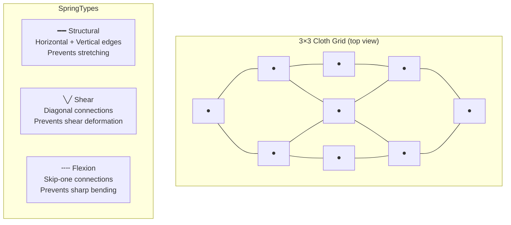
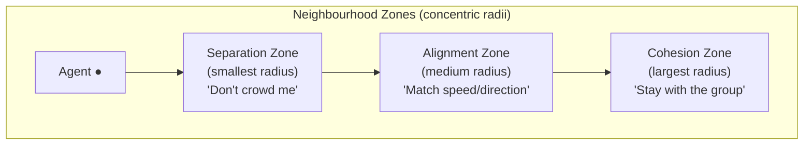

# Chapter 6 — Cloth Simulation & Flocking Boids

---

# Part A: Cloth Simulation

## 6.1 Verlet Integration for Cloth

Mass-spring cloth simulation needs many particles connected by springs. Using Semi-Implicit Euler for each particle works but requires storing velocity for every particle and careful tuning for stability.

**Verlet integration** is an alternative that implicitly captures velocity from the position history:

```
x(t+dt) = 2·x(t) - x(t-dt) + a·dt²
```

Rearranged: `x(t+dt) = x(t) + (x(t) - x(t-dt))·damping + a·dt²`

The term `(x(t) - x(t-dt))` is the displacement from the previous tick — i.e., the implicit velocity. Multiplying by a damping factor `< 1` dissipates energy naturally.

**Why Verlet for cloth?**
- No explicit velocity storage needed (saves memory for thousands of particles)
- Unconditionally stable for small-to-medium timesteps
- Natural damping integration — no extra energy bleed

### ClothParticle Structure

```cpp
// include/components/ClothComponent.h
namespace GE::Components {

struct ClothParticle {
    glm::vec3 position     { 0.0f };   // Current position (world space)
    glm::vec3 prevPosition { 0.0f };   // Position from previous tick (encodes velocity)
    glm::vec3 force        { 0.0f };   // Accumulated forces this tick
    bool      pinned       { false };  // If true, particle doesn't move (fixed pin point)
    float     heat         { 0.0f };   // 0–1 heat accumulation for burning
    bool      burned       { false };  // If true, freed from all springs
};

} // namespace GE::Components
```

### Verlet Integration in ClothSystem

```cpp
// source/systems/ClothSystem.cpp — OnUpdate() (simplified)
void ClothSystem::OnUpdate(float dt) {
    for each entity with ClothComponent cc {

        // Step 1: Accumulate forces (gravity + optional wind)
        for (auto& p : cc.particles) {
            if (p.pinned) { p.force = glm::vec3{0.0f}; continue; }
            p.force  = glm::vec3{ 0.0f, -9.81f * cc.particleMass, 0.0f };  // Gravity
            if (cc.windEnabled) {                                             // Wind (toggle)
                p.force += glm::vec3{ cc.windX * cc.particleMass, 0.0f,
                                      cc.windZ * cc.particleMass };
            }
        }

        // Step 2–4: Spring forces (structural, shear, flexion)
        for (auto& s : cc.springs) {
            if (!s.active) continue;   // Skip torn springs
            applySpring(cc.particles[s.a], cc.particles[s.b],
                        s.restLen, s.kSpring, cc.damping, dt);
        }

        // Step 5: Verlet integration
        const float dampFactor = 1.0f - cc.damping * dt;
        for (auto& p : cc.particles) {
            if (p.pinned) continue;

            const glm::vec3 acc    = p.force / cc.particleMass;
            const glm::vec3 newPos = p.position
                                   + (p.position - p.prevPosition) * dampFactor
                                   + acc * (dt * dt);   // a·dt²
            p.prevPosition = p.position;
            p.position     = newPos;
            p.force        = glm::vec3{ 0.0f };   // Clear for next tick
        }

        // Step 6: Sphere-cloth collision (push particles out of spheres)
        resolveClothSphereCollisions(cc);

        // Step 7: Upload updated positions to GPU buffer
        uploadVerticesToGpu(cc);
    }
}
```

---

## 6.2 The Spring Network: Three Types

A cloth mesh is divided into a grid of particles. Each particle connects to its neighbours through springs of three types:



```cpp
// include/components/ClothComponent.h
struct ClothSpring {
    uint16_t a       { 0 };        // Index of particle A in cc.particles
    uint16_t b       { 0 };        // Index of particle B in cc.particles
    float    restLen { 0.0f };     // Rest length (target distance)
    float    kSpring { 100.0f };   // Stiffness constant (N/m)
    bool     active  { true };     // false = spring was torn
};

struct ClothComponent {
    int   rows { 10 };       // Particles in Z direction
    int   cols { 10 };       // Particles in X direction
    float cellSize    { 0.2f };    // Distance between adjacent particles
    float particleMass { 0.1f };  // kg per particle
    float springK  { 100.0f };   // Structural spring constant
    float shearK   { 50.0f };    // Shear spring constant
    float flexionK { 25.0f };    // Flexion spring constant
    float damping  { 0.02f };    // Global velocity damping
    bool  windEnabled { false };  // Must be true for wind forces to apply (ImGui toggle)
    float windX    { 0.0f };     // Wind force in X (m/s² equivalent per unit mass)
    float windZ    { 0.0f };     // Wind force in Z
    float tearThreshold { 3.0f }; // Tear when stretch > threshold * restLen

    std::vector<ClothParticle> particles;   // rows * cols particles
    std::vector<ClothSpring>   springs;     // Explicit spring list
};
```

### Spring Force Calculation

```cpp
// source/systems/ClothSystem.cpp
static void applySpring(ClothParticle& pA, ClothParticle& pB,
                        float restLen, float kSpring, float kDamp, float dt)
{
    glm::vec3 d   = pA.position - pB.position;
    float     len = glm::length(d);
    if (len < 1e-6f) return;           // Avoid divide-by-zero

    glm::vec3 dir = d / len;

    // Hooke's Law: F_spring = k * (len - restLen)
    float springMag = kSpring * (len - restLen);

    // Velocity damping: projects relative velocity onto spring direction
    // velocity ≈ (pos - prevPos) / dt  (Verlet implicit velocity)
    glm::vec3 relVel = (pA.position - pA.prevPosition) - (pB.position - pB.prevPosition);
    float dampMag    = kDamp * glm::dot(relVel, dir) / dt;

    glm::vec3 F = (springMag + dampMag) * dir;
    if (!pA.pinned) pA.force -= F;   // Push A away from B
    if (!pB.pinned) pB.force += F;   // Push B toward A
}
```

**Why all three spring types?**

| Spring | Missing Effect |
|--------|---------------|
| Structural only | Cloth shears diagonally; it's too "loose" |
| + Shear | Cloth still folds sharply at grid edges |
| + Flexion | Cloth resists bending — behaves like fabric |

---

## 6.3 Tearing Mechanic

When a spring stretches beyond `tearThreshold * restLen`, it is permanently deactivated:

```cpp
// source/systems/ClothSystem.cpp — tearing check (inside spring loop)
for (auto& s : cc.springs) {
    if (!s.active) continue;

    float len = glm::length(cc.particles[s.a].position - cc.particles[s.b].position);
    if (len > s.restLen * cc.tearThreshold) {
        s.active = false;    // Spring torn — never checked again
    }
}
```

Once a spring is torn, the two connected particles are no longer constrained. If enough structural springs tear in a region, that section of the cloth falls free.

---

## 6.4 Burning Mechanic

```cpp
// source/systems/ClothSystem.cpp — burning update
if (cc.burnActive) {
    for (uint32_t pi = 0; pi < cc.particles.size(); ++pi) {
        ClothParticle& p = cc.particles[pi];
        if (p.burned || p.pinned) continue;

        float dist = glm::length(p.position - cc.burnCenter);
        if (dist < cc.burnRadius) {
            p.heat += cc.burnRate * dt;   // Accumulate heat inside fire zone
        }

        if (p.heat >= 1.0f && !p.burned) {
            p.burned = true;
            p.pinned = false;   // Free the particle (stops being pinned if it was)
            // Sever all springs connected to this particle
            for (auto& s : cc.springs) {
                if (s.a == static_cast<uint16_t>(pi) ||
                    s.b == static_cast<uint16_t>(pi)) {
                    s.active = false;
                }
            }
        }
    }
}
```

---

## 6.5 GPU Buffer: Persistent-Mapped Host-Visible Memory

Cloth vertices change every frame (every particle moves). Rather than creating a staging buffer and copying every frame, the engine uses a **persistently-mapped host-visible buffer** — the CPU can write directly into GPU-accessible memory:

```cpp
// include/components/ClothComponent.h (GPU buffer fields)
struct ClothComponent {
    // ...
    VkBuffer       vertexBuffer  { VK_NULL_HANDLE };   // Combined vertex + index buffer
    VkDeviceMemory vertexMemory  { VK_NULL_HANDLE };   // HOST_VISIBLE | HOST_COHERENT memory
    void*          mappedVertices { nullptr };          // Persistent CPU-side pointer
    uint32_t       vertexCount   { 0 };
    VkDeviceSize   indexOffset   { 0 };    // Byte offset where index data starts
};
```

Every frame, `ClothSystem` writes new vertex positions directly:

```cpp
// source/systems/ClothSystem.cpp — GPU upload
void ClothSystem::uploadVerticesToGpu(GE::Components::ClothComponent& cc) {
    if (cc.mappedVertices == nullptr) return;

    auto* verts = static_cast<GE::Assets::Vertex*>(cc.mappedVertices);
    uint32_t vi = 0;
    for (int row = 0; row < cc.rows; ++row) {
        for (int col = 0; col < cc.cols; ++col) {
            const ClothParticle& p = cc.particles[row * cc.cols + col];
            verts[vi].pos    = p.position;
            verts[vi].normal = computeNormal(cc, row, col);  // From neighbour positions
            verts[vi].color  = { 0.7f, 0.7f, 0.9f };        // Blue-grey cloth colour
            ++vi;
        }
    }
    // No vkFlush needed — HOST_COHERENT flag ensures CPU writes are visible to GPU
}
```

The memory type `VK_MEMORY_PROPERTY_HOST_VISIBLE_BIT | VK_MEMORY_PROPERTY_HOST_COHERENT_BIT` means writes from the CPU are immediately visible to the GPU without explicit flushing.

---

## 6.5 GPU Buffer: Persistent-Mapped Host-Visible Memory — Extended

### Per-Frame Normal and Tangent Computation

The cloth mesh deforms every frame, so surface normals and tangents must also be recomputed every frame from the new particle positions. A static normal (e.g. always `(0,1,0)`) would produce flat, plastic-looking lighting regardless of how the cloth folds.

The engine uses a **central-difference approximation** — for each particle at grid position `(r, c)`, sample its four neighbours:

```
           above (r-1, c)
               ↑
left (r, c-1) ← ● → right (r, c+1)
               ↓
           below (r+1, c)
```

```cpp
// source/scene/FlatBuffersScenario.cpp — OnUpdate() cloth vertex refresh
for (uint32_t vi = 0U; vi < cc.vertexCount; ++vi) {
    const int r = static_cast<int>(vi) / C;
    const int c = static_cast<int>(vi) % C;
    const glm::vec3 center = cc.particles[vi].position;

    // Boundary-safe neighbour positions (use center if no neighbour)
    const glm::vec3 right = (c < C-1) ? cc.particles[vi+1].position : center;
    const glm::vec3 left  = (c > 0)   ? cc.particles[vi-1].position : center;
    const glm::vec3 above = (r > 0)   ? cc.particles[vi-C].position : center;
    const glm::vec3 below = (r < R-1) ? cc.particles[vi+C].position : center;

    // Normal: cross product of the two difference vectors
    //   dX = right - left  (horizontal direction in cloth grid)
    //   dY = above - below (vertical direction in cloth grid)
    // cross(dX, dY) gives a vector perpendicular to the local cloth surface.
    const glm::vec3 n = glm::cross(right - left, above - below);
    verts[vi].normal = (glm::dot(n, n) > 1e-8f) ? glm::normalize(n) : glm::vec3(0,0,1);

    // Tangent: direction to next column particle (U-axis of cloth UV map)
    const glm::vec3 tang = (c < C-1) ? (cc.particles[vi+1].position - center)
                                      : (center - cc.particles[vi-1].position);
    verts[vi].tangent = (glm::dot(tang, tang) > 1e-8f) ? glm::normalize(tang) : glm::vec3(1,0,0);
}
```

The boundary guard (use `center` when there is no neighbour) prevents artifacts at cloth edges without branching on the hot path.

**Why `cross(right-left, above-below)` gives the correct outward normal:**  
The cloth UV map lays out columns in X and rows in Z. The vector `right-left` points in the local +U direction; `above-below` points in the local +V direction. Their cross product follows the right-hand rule and points toward the camera when the cloth is hanging flat, matching the winding order of the rendered triangles.

---

## 6.5a Wind Toggle

Early iterations of the engine always applied wind forces if `windX` or `windZ` were non-zero. This caused the cloth to drift at startup. The toggle adds an explicit on/off gate so wind only acts when the user enables it:

```cpp
// include/components/ClothComponent.h
bool  windEnabled { false };   // Defaults OFF — cloth is still at scene load
float windX { 0.0f };
float windZ { 0.0f };
```

```cpp
// source/systems/ClothSystem.cpp — Step 1 of OnUpdate()
if (cc.windEnabled) {
    p.force += glm::vec3{ cc.windX * cc.particleMass, 0.0f,
                          cc.windZ * cc.particleMass };
}
```

In ImGui, the Cloth menu separates spring/damping controls from wind controls with a visual separator:

```cpp
// source/scene/FlatBuffersScenario.cpp — OnGUI() Cloth menu
ImGui::SliderFloat("Spring K",  &cc.springK,  1.0f, 1000.0f);
ImGui::SliderFloat("Shear K",   &cc.shearK,   0.0f,  500.0f);
ImGui::SliderFloat("Flexion K", &cc.flexionK, 0.0f,  250.0f);
ImGui::SliderFloat("Damping",   &cc.damping,  0.0f,    1.0f);

ImGui::Separator();                           // Visual divider
ImGui::Checkbox("Wind", &cc.windEnabled);    // Enable/disable wind
if (cc.windEnabled) {                         // Only show sliders when active
    ImGui::SliderFloat("Wind X", &cc.windX, -10.0f, 10.0f);
    ImGui::SliderFloat("Wind Z", &cc.windZ, -10.0f, 10.0f);
}
```

The `windEnabled` field is a plain bool on the component — the physics thread reads it and the main thread writes it. Because the writes are single-byte aligned stores, this is a benign race (worst case: one frame of stale wind state).

---

## 6.5b Sphere-Cloth Reaction Force

The original sphere-cloth collision only pushed **cloth particles** out of the sphere. The sphere itself was not affected — it passed straight through the cloth. The fix computes an average push normal across all colliding particles and applies an impulse to the sphere's `RigidBody`:

```cpp
// source/systems/ClothSystem.cpp — Section 6 (sphere-cloth collision, updated)
int       collisionCount = 0;
glm::vec3 totalNormal{ 0.0f };

for (auto& p : cc.particles) {
    if (p.pinned) { continue; }
    const glm::vec3 diff = p.position - sphereCenter;
    const float     dist = glm::length(diff);
    if (dist < sphereRadius && dist > MIN_LENGTH) {
        const glm::vec3 normal = diff / dist;
        p.position = sphereCenter + normal * sphereRadius;  // Push particle out
        totalNormal += normal;                               // Accumulate normals
        ++collisionCount;
    }
}

// Apply reaction impulse to the sphere's RigidBody
if (collisionCount > 0 && glm::dot(totalNormal, totalNormal) > MIN_LENGTH) {
    auto* rb = em->TryGetTIComponent<GE::Components::RigidBody>(seid);
    if (rb != nullptr && !rb->isStatic) {
        const glm::vec3 avgNormal = glm::normalize(totalNormal);
        const float     vAlongN   = glm::dot(rb->velocity, avgNormal);
        if (vAlongN < 0.0f) {    // Only if sphere is moving INTO the cloth
            const glm::vec3 vNorm = vAlongN * avgNormal;
            const glm::vec3 vTang = rb->velocity - vNorm;
            // Partial bounce + cloth-surface friction
            rb->velocity = (-CLOTH_RESTITUTION * vNorm) + (CLOTH_FRICTION * vTang);
        }
    }
}
```

**Constants:**
```cpp
static constexpr float CLOTH_RESTITUTION = 0.20f;   // 20% of normal velocity reflected
static constexpr float CLOTH_FRICTION    = 0.70f;   // 30% of tangential velocity absorbed
```

**Design note — why average normal?**  
A sphere overlapping the cloth touches multiple particles simultaneously. Each touched particle exerts a force in a slightly different direction. Summing and normalising gives the net push direction — effectively the surface normal at the contact patch. This is equivalent to averaging the local cloth normals at the contact point.

**Limitation:** The condition `vAlongN < 0` (sphere moving into cloth) is necessary to avoid applying an impulse on exit. But for a sphere approaching the cloth horizontally with a contact normal primarily in the Y direction, `vAlongN ≈ 0`, and no impulse fires. The reaction impulse is most effective when the sphere meets the cloth face-on (e.g. the settled vertical cloth face).

---

## 6.5c PBR Textures and Normal Mapping on Cloth

The cloth mesh can be rendered with full **physically-based textures** instead of a flat colour. The cloth scenario (05) uses a boucle fabric texture set: albedo, normal map, AO, roughness, and metallic (black, since fabric is dielectric).

### How it works

When `FBSceneAdapter::adaptBehaviour()` processes a `ClothObject` and the parent `Object` has a `texture_path` field set, it creates a **Phong material** (with descriptor set 1 bound to all 5 PBR textures) instead of the default flat-color material:

```cpp
// source/scene/fb/FBSceneAdapter.cpp — ClothObject case (simplified)
const bool clothHasTexture = (!ctx.useOwnerColors && obj->texture_path() != nullptr);
if (clothHasTexture) {
    auto albedoTex  = ctx.am->loadTexture(obj->texture_path()->str());
    auto normalTex  = obj->normal_map_path() ?
                      ctx.am->loadTexture(obj->normal_map_path()->str()) :
                      ctx.am->loadTexture("textures/flat_normal.png");  // neutral fallback
    auto aoTex      = obj->ao_path() ?
                      ctx.am->loadTexture(obj->ao_path()->str()) :
                      ctx.am->loadTexture("textures/white.png");
    // ... metallic, roughness
    clothMat = ctx.am->createMaterial(albedoTex, normalTex, aoTex, metalTex, roughTex,
                                      (*ctx.pipelines)[PHONG_PIPELINE_INDEX].get());
    clothMat->SetCastsShadows(true);
}
```

The Phong fragment shader (`shaders/phong.frag`) then computes the **TBN (Tangent-Bitangent-Normal) matrix** using the per-vertex tangent and normal, both of which are recomputed every frame from the deformed particle positions:

```glsl
// shaders/phong.frag — Phong branch (inside if useGouraud == 0)
vec3 N_geom = normalize(fragNormal);
vec3 T      = normalize(fragTangent - dot(fragTangent, N_geom) * N_geom);  // Gram-Schmidt
vec3 B      = cross(N_geom, T);
mat3 TBN    = mat3(T, B, N_geom);

// Decode normal map: [0,1] → [-1,1], then rotate into world space
vec3 normalSample = texture(normalSampler, fragTexCoord).rgb * 2.0 - 1.0;
vec3 N = normalize(TBN * normalSample);
// N is now the world-space shading normal — use it in all lighting calculations
```

**What is a TBN matrix?**  
Normal maps store surface normals in *tangent space* — a local coordinate system where `(0,0,1)` means "geometric surface normal" (no perturbation). The TBN matrix transforms that tangent-space vector into world space by using three perpendicular axes:
- **T (Tangent):** direction along the UV U-axis (for cloth: direction to the next column particle)
- **B (Bitangent):** cross product of N and T
- **N (Normal):** geometric surface normal from the cross-product computation

**Gram-Schmidt re-orthogonalisation** (`T - dot(T,N)*N`) corrects the interpolated tangent to be exactly perpendicular to N, preventing shading artifacts where the interpolated vectors lose orthogonality.

### The neutral normal map placeholder

```
textures/flat_normal.png — 1×1 pixel, RGB = (128, 128, 255)
```

Decoded in the shader: `(128/255)*2 - 1 ≈ 0`, `(128/255)*2 - 1 ≈ 0`, `(255/255)*2 - 1 = 1`.  
Result: `(0, 0, 1)` in tangent space = geometric surface normal = no perturbation.  
Objects without a normal map use this file and look identical to before.

> **Why not `white.png`?** `(1,1,1)*2-1 = (1,1,1)`, which is not a valid unit normal. It would produce wrong lighting. Always use `flat_normal.png` for the normal map binding when no actual normal map is available.

---

## 6.10 Interactive Sphere Spawner — A GameScriptComponent Example

The cloth scene includes an interactive feature: pressing **SPACE** fires a physics sphere that collides with the hanging cloth. This is implemented as a `GameScriptComponent` attached to an invisible manager entity — a good example of how to add reactive gameplay logic without modifying the engine's core systems.

### The Script Architecture

```
FlatBuffersScenario::OnLoad()
    ↓
Creates "ClothSphereSpawner" entity (Transform + Tag + ScriptComponent)
    ↓
ScriptComponent holds ClothSphereSpawnerScript (inherits GameScriptComponent)
    ↓
ScriptSystem::OnUpdate() calls script.Update(dt) each physics tick
    ↓
Script: detects SPACE press → calls SpawnSphere() → creates sphere entity
         destroys old spheres (TTL or floor contact)
```

### Writing a GameScriptComponent

Every custom script inherits from `GE::Scripts::GameScriptComponent` and overrides the lifecycle methods it needs:

```cpp
// include/game-scripts/ClothSphereSpawnerScript.h
#pragma once
#include "scripts/GameScriptComponent.h"
#include "ecs/EntityManager.h"
#include "components/Components.h"        // MeshRenderer, SubMesh
#include "components/PhysicsComponents.h" // RigidBody, SphereCollider
#include "components/Transform.h"
#include "components/Tag.h"
#include "assets/Mesh.h"
#include "assets/Material.h"

namespace GE::Scripts {

class ClothSphereSpawnerScript final : public GameScriptComponent {
public:
    float sphereRadius { 0.18f };
    float launchSpeedZ { 9.0f };
    float sphereTTL    { 10.0f };   // seconds until auto-destroy

    ClothSphereSpawnerScript(GE::Assets::Mesh* mesh, GE::Assets::Material* mat)
        : m_mesh(mesh), m_mat(mat) {}

    // Called every physics tick (~60 Hz)
    void Update(float dt) override {
        auto* input = GetInput();           // InputService — key query
        auto* em    = GetEntityManager();   // EntityManager — create/destroy entities
        if (!input || !em) { return; }

        // SPACE press detection (edge — fires once per press, not once per tick)
        const bool spaceNow = input->IsKeyDown(GLFW_KEY_SPACE);
        if (spaceNow && !m_spaceWasDown) { SpawnSphere(em); }
        m_spaceWasDown = spaceNow;

        // Destroy spheres that have expired (TTL) or hit the floor (y < radius)
        for (auto it = m_spheres.begin(); it != m_spheres.end(); ) {
            it->lifetime -= dt;
            auto* tr = em->TryGetTIComponent<GE::Components::Transform>(it->id);
            if (!tr || it->lifetime <= 0.0f || tr->m_worldPosition.y < sphereRadius) {
                if (tr) { em->DestroyEntity(it->id); }
                it = m_spheres.erase(it);
            } else { ++it; }
        }
    }

    // Called when the manager entity is destroyed (scene unload)
    void OnDestroy() override {
        auto* em = GetEntityManager();
        if (!em) { return; }
        for (const auto& e : m_spheres) { em->DestroyEntity(e.id); }
        m_spheres.clear();
    }

private:
    struct SphereEntry { GE::ECS::EntityID id; float lifetime; };

    GE::Assets::Mesh*            m_mesh         { nullptr };
    GE::Assets::Material*        m_mat          { nullptr };
    bool                         m_spaceWasDown { false };
    std::vector<SphereEntry>     m_spheres;
    std::mt19937                 m_rng          { 42U };

    void SpawnSphere(GE::ECS::EntityManager* em) {
        // ... (see below)
    }
};

} // namespace GE::Scripts
```

### Creating Entities at Runtime

`SpawnSphere()` creates a complete physics entity by adding components one by one:

```cpp
void SpawnSphere(GE::ECS::EntityManager* em) {
    std::uniform_real_distribution<float> xDist( 0.3f,  1.9f);   // cloth X span
    std::uniform_real_distribution<float> yExtra(0.10f, 0.15f);   // gap above cloth y=3.0
    std::uniform_real_distribution<float> xvDist(-0.4f, 0.4f);

    // --- Spawn position and velocity ---
    // Free-fall matching: vy=0 so sphere and cloth rows fall at the same gravity rate.
    // The 0.10–0.15m gap stays constant throughout the approach → always within collision radius.
    // At z=0 (cloth face), t=0.5s: y = 3.1 - 1.225 = 1.875 ≈ cloth vertical centre.
    const glm::vec3 spawnPos { xDist(m_rng), 3.0f + yExtra(m_rng), 4.5f };
    const glm::vec3 velocity { xvDist(m_rng), 0.0f, -launchSpeedZ };

    const GE::ECS::EntityID id = em->CreateEntity();

    // 1. Transform — set BOTH localPosition and worldPosition for root entities
    GE::Components::Transform tr;
    tr.m_localPosition = spawnPos;
    tr.m_worldPosition = spawnPos;
    tr.m_localMatrix   = glm::translate(glm::mat4(1.0f), spawnPos);
    tr.m_worldMatrix   = tr.m_localMatrix;
    em->AddComponent(id, tr);

    // 2. Tag — gives the entity a debug-visible name
    GE::Components::Tag tag;
    tag.m_name = "ClothSphere_" + std::to_string(id);
    em->AddComponent(id, tag);

    // 3. SphereCollider — ClothSystem queries ALL SphereColliders automatically
    em->AddComponent(id, GE::Components::SphereCollider{ sphereRadius, false });

    // 4. RigidBody — enables physics integration and collision response
    GE::Components::RigidBody rb;
    rb.mass        = 0.5f;
    rb.inverseMass = 2.0f;
    rb.restitution = 0.4f;
    rb.isStatic    = false;
    rb.useGravity  = true;
    rb.velocity    = velocity;
    const float r2 = sphereRadius * sphereRadius;
    rb.invInertiaTensor = glm::mat3(5.0f / (2.0f * rb.mass * r2));  // solid sphere
    em->AddComponent(id, rb);

    // 5. MeshRenderer — shares the pre-built mesh; no GPU allocation per spawn
    if (m_mesh && m_mat) {
        GE::Components::MeshRenderer mr;
        mr.subMeshes.push_back({ m_mesh, m_mat });
        em->AddComponent(id, mr);
    }

    m_spheres.push_back({ id, sphereTTL });
}
```

**Key implementation details:**

| Detail | Why |
|--------|-----|
| Set both `m_localPosition` and `m_worldPosition` | For root entities these must match at spawn; PhysicsSystem integrates `m_worldPosition`, TransformSystem syncs it back |
| `SphereCollider` is sufficient for cloth collision | `ClothSystem::OnUpdate()` queries the entire `SphereCollider` component array — any entity with this component collides automatically |
| Shared `Mesh*` and `Material*` pointers | The mesh is pre-built once in `OnLoad()` and stored in `m_ownedModels`. All spawned spheres reference the same GPU buffer — zero additional VRAM per sphere |
| `SphereEntry { id, lifetime }` | Dual destruction condition: TTL (10 s) catches bouncing spheres that never sink below the floor; floor check (`y < radius`) destroys spheres that settle |

### Registering the Script at Scene Load

The spawner entity is created programmatically inside `FlatBuffersScenario::OnLoad()` — only when the scene actually contains cloth (checked via `em->GetCompArr<ClothComponent>().GetCount() > 0`):

```cpp
// source/scene/FlatBuffersScenario.cpp — OnLoad() step 12b
auto& clothArr = em->GetCompArr<GE::Components::ClothComponent>();
if (clothArr.GetCount() > 0U && m_pipelines.size() > 8U) {

    // Pre-build the sphere mesh (16-segment, orange-tinted, flat-color pipeline)
    auto flatMat   = std::make_shared<GE::Assets::Material>(VK_NULL_HANDLE, flatColorPipeline);
    flatMat->SetCastsShadows(false);
    auto sphereMesh = am->processMeshData(
        GeometryUtils::generateSphere(16U, SR, -SR, glm::vec3(0.9f, 0.35f, 0.1f)),
        flatMat, ctx.cmd, ctx.stagingBuffers, ctx.stagingMemories);

    // Move mesh into scene ownership (m_ownedModels keeps it alive)
    GE::Assets::Mesh* const rawMesh = sphereMesh.get();
    auto dummyModel = std::make_unique<Model>();
    dummyModel->addMesh(std::move(sphereMesh));
    m_ownedModels.push_back(std::move(dummyModel));

    // Create manager entity and attach script
    const uint32_t managerID = em->CreateEntity();
    m_clothSpawnerEntityID   = managerID;
    em->AddComponent(managerID, GE::Components::Transform{});
    em->AddComponent(managerID, GE::Components::Tag{ "ClothSphereSpawner" });

    auto script = std::make_shared<GE::Scripts::ClothSphereSpawnerScript>(rawMesh, rawMat);
    script->SetEntityID(managerID);   // Script must know its own entity ID
    em->AddComponent(managerID, GE::Components::ScriptComponent{ std::move(script) });
}
```

**Why pre-build the mesh in `OnLoad()`?**  
Creating a GPU mesh requires a staging buffer and a one-shot command buffer (available only during scene load). At runtime (inside `Update()`), the engine is already rendering — there is no open command buffer. By building the mesh once in `OnLoad()` and sharing the `Mesh*` across all spawned spheres, the runtime path reduces to a pointer copy.

### The Free-Fall Matching Trajectory

The most subtle aspect of the sphere spawner is the trajectory design. The cloth starts as a **horizontal panel at y=3.0** and takes ~2 seconds to settle into its hanging vertical configuration. The sphere must collide with the cloth regardless of whether it fires during settling or after.

```
Initial state (t=0):         Settled state (t=2+s):
  ═══════════════         cloth hanging vertically:
  ║ cloth at y=3 ║             │ (z≈0)
  ║ z=0 .. z=2.2 ║             │ y=3.0 (pinned top)
                               │ y=1.9 (centre)
                               │ y=0.8 (bottom)
```

If the sphere fires at launch with `vy = 0` (no initial vertical velocity), both the sphere **and** the free cloth rows experience the same downward gravity. Their Y-positions change at identical rates — the gap stays constant throughout the Z-approach:

```
sphere_y(t) = spawnY      - 4.9·t²
cloth_y(t)  = clothRowY   - 4.9·t²   (free-fall approx for far rows)

gap = sphere_y - cloth_y = spawnY - clothRowY = yExtra = 0.10 m (constant)
```

Since `yExtra < sphereRadius (0.18 m)`, the sphere overlaps with cloth particles throughout its flight — guaranteed collision regardless of cloth settling state.

At `t = 4.5 / 9.0 = 0.5 s` (when sphere reaches z=0, the settled cloth face):

```
sphere_y = 3.1 - 4.9 × 0.25 = 3.1 - 1.225 = 1.875 ≈ cloth centre
```

> **Critical constraint: `vy` must be exactly 0.**  
> Any initial vertical velocity (even a small upward kick like +0.5) breaks the matching. The sphere's extra momentum separates it from the cloth rows, which have no initial vertical velocity. Within 0.3 s, the gap grows beyond the sphere radius and the sphere misses the cloth.

---

# Part B: Flocking Boids

## 6.6 Reynolds Boids: Three Rules

Craig Reynolds (1986) defined a flocking algorithm using only three simple local rules — no global coordination, no leader. Each agent independently computes forces from its neighbourhood:



### FlockingComponent

```cpp
// include/components/FlockingComponent.h
namespace GE::Components {

struct FlockingComponent {
    // Neighbourhood radii (world units)
    float separationRadius { 1.5f };
    float alignmentRadius  { 3.0f };
    float cohesionRadius   { 5.0f };

    // Force weights (Weighted Truncated Sum)
    float wSeparation { 2.0f };   // Highest priority
    float wAlignment  { 1.0f };
    float wCohesion   { 1.0f };
    float wAvoidance  { 3.0f };   // Static obstacle avoidance

    float   maxSpeed  { 6.0f };    // Maximum agent speed (m/s)
    float   maxForce  { 15.0f };   // Maximum steering force (N)
    uint8_t groupId   { 0 };       // 0 = flock with everyone; >0 = flock only with same group
};

} // namespace GE::Components
```

---

## 6.7 Implementing the Three Behaviours

```cpp
// source/systems/FlockingSystem.cpp — computeSteering() (simplified)

glm::vec3 FlockingSystem::computeSteering(const AgentEntry& self,
                                          const FlockingComponent& fk,
                                          const std::vector<uint32_t>& neighbourIndices) {
    glm::vec3 separation { 0.0f };
    glm::vec3 alignment  { 0.0f };
    glm::vec3 cohesion   { 0.0f };

    int sepCount = 0, alignCount = 0, cohCount = 0;
    glm::vec3 avgVel { 0.0f };
    glm::vec3 centreOfMass { 0.0f };

    for (uint32_t ni : neighbourIndices) {
        const AgentEntry& n = m_agents[ni];
        if (&n == &self) continue;
        if (fk.groupId != 0 && n.group != fk.groupId) continue;  // Different group: ignore

        glm::vec3 diff = self.pos - n.pos;
        float     dist = glm::length(diff);
        if (dist < 1e-6f) continue;

        // --- Separation ---
        if (dist < fk.separationRadius) {
            separation += glm::normalize(diff) / dist;   // Weight by proximity (1/dist)
            ++sepCount;
        }

        // --- Alignment ---
        if (dist < fk.alignmentRadius) {
            avgVel += n.vel;
            ++alignCount;
        }

        // --- Cohesion ---
        if (dist < fk.cohesionRadius) {
            centreOfMass += n.pos;
            ++cohCount;
        }
    }

    // Normalise and scale each force
    if (sepCount > 0) {
        separation = glm::normalize(separation) * fk.maxForce;
    }

    if (alignCount > 0) {
        glm::vec3 desired = avgVel / static_cast<float>(alignCount);
        glm::vec3 steer   = desired - self.vel;
        float     mag     = glm::length(steer);
        if (mag > 1e-6f)
            alignment = glm::normalize(steer) * fk.maxForce;
    }

    if (cohCount > 0) {
        glm::vec3 target  = centreOfMass / static_cast<float>(cohCount);
        glm::vec3 toTarget = target - self.pos;
        float     mag     = glm::length(toTarget);
        if (mag > 1e-6f)
            cohesion = glm::normalize(toTarget) * fk.maxForce;
    }

    // Obstacle avoidance (see §6.8 below)
    glm::vec3 avoidance = computeAvoidance(self, fk);

    // --- Weighted Truncated Sum ---
    return weightedTruncatedSum(separation, avoidance, alignment, cohesion, fk);
}
```

---

## 6.8 Weighted Truncated Sum (Buckland Pattern)

Instead of simply adding all forces, the engine uses a **priority budget** — if the high-priority forces consume the maximum force budget, lower-priority forces are ignored entirely. This prevents agents from flying into walls because cohesion was overriding separation:

```cpp
// source/systems/FlockingSystem.cpp
glm::vec3 FlockingSystem::weightedTruncatedSum(
    const glm::vec3& separation, const glm::vec3& avoidance,
    const glm::vec3& alignment,  const glm::vec3& cohesion,
    const FlockingComponent& fk)
{
    glm::vec3 totalForce { 0.0f };
    float     remaining  = fk.maxForce;  // Remaining force budget

    // Add force, consuming budget. Returns false if budget exhausted.
    auto addForce = [&](const glm::vec3& f, float weight) -> bool {
        glm::vec3 wf  = f * weight;
        float     mag = glm::length(wf);
        if (mag < 1e-6f) return true;   // Zero force — skip, don't reduce budget

        if (mag > remaining) {
            // Clamp to remaining budget and stop
            totalForce += glm::normalize(wf) * remaining;
            remaining = 0.0f;
            return false;
        }
        totalForce += wf;
        remaining  -= mag;
        return true;
    };

    // Priority order: Separation > Obstacle Avoidance > Alignment > Cohesion
    if (!addForce(separation, fk.wSeparation)) return totalForce;
    if (!addForce(avoidance,  fk.wAvoidance))  return totalForce;
    if (!addForce(alignment,  fk.wAlignment))  return totalForce;
    addForce(cohesion, fk.wCohesion);

    return totalForce;
}
```

**Why this priority?**
1. **Separation** — stop agents from overlapping (most urgent)
2. **Avoidance** — don't fly into static obstacles
3. **Alignment** — match flock direction (social behaviour)
4. **Cohesion** — stay with the group (social behaviour, least urgent)

---

## 6.9 Spatial Partitioning Modes

The naive approach checks every agent against every other agent: O(n²). With 1000 agents, that's 1,000,000 pair checks per frame.

The engine provides three spatial modes:

```cpp
// include/systems/FlockingSystem.h
enum class FlockSpatialMode : uint8_t {
    BruteForce  = 0,   // O(n²) — check all pairs
    UniformGrid = 1,   // O(n) build + O(m) query
    Octree      = 2    // O(n log n) build + O(log n + m) query
};
```

### Uniform Grid

Divide 3D space into a grid of cells. For each frame:
1. Hash every agent's position into a cell: `cellX = floor(pos.x / cellSize)`
2. To find neighbours within radius `r`: visit the 27 cells (3×3×3 cube) around the agent

```cpp
// source/systems/FlockingSystem.cpp — buildUniformGrid()
void FlockingSystem::buildUniformGrid() {
    m_gridCells.clear();
    for (uint32_t i = 0; i < m_agents.size(); ++i) {
        int cx = static_cast<int>(std::floor(m_agents[i].pos.x / m_gridCellSize));
        int cy = static_cast<int>(std::floor(m_agents[i].pos.y / m_gridCellSize));
        int cz = static_cast<int>(std::floor(m_agents[i].pos.z / m_gridCellSize));
        uint64_t key = hashCell(cx, cy, cz);
        m_gridCells[key].push_back(i);
    }
}

// queryUniformGrid: visit 27 surrounding cells, collect agents within radius
void FlockingSystem::queryUniformGrid(const glm::vec3& pos, float radius,
                                      std::vector<uint32_t>& results) {
    int cxBase = static_cast<int>(std::floor(pos.x / m_gridCellSize));
    int cyBase = static_cast<int>(std::floor(pos.y / m_gridCellSize));
    int czBase = static_cast<int>(std::floor(pos.z / m_gridCellSize));

    for (int dz = -1; dz <= 1; ++dz)
    for (int dy = -1; dy <= 1; ++dy)
    for (int dx = -1; dx <= 1; ++dx) {
        uint64_t key = hashCell(cxBase+dx, cyBase+dy, czBase+dz);
        auto it = m_gridCells.find(key);
        if (it == m_gridCells.end()) continue;
        for (uint32_t idx : it->second) {
            if (glm::length(m_agents[idx].pos - pos) <= radius) {
                results.push_back(idx);
                ++m_neighbourChecksLastFrame;
            }
        }
    }
}
```

### Octree

An octree recursively subdivides 3D space into 8 equal sub-cells. Agents are stored in leaf nodes. To query a neighbourhood sphere:
1. Visit the root
2. If the sphere doesn't intersect the node's AABB: skip entirely
3. If the node is a leaf: check all agents against the sphere
4. Otherwise: recurse into children

```cpp
// source/systems/FlockingSystem.cpp (OctreeNode structure)
struct OctreeNode {
    glm::vec3 centre;
    float     halfSize;
    std::vector<uint32_t> agentIndices;  // Only populated in leaf nodes
    std::unique_ptr<OctreeNode> children[8];

    bool isLeaf() const {
        return children[0] == nullptr;
    }
    bool intersectsSphere(const glm::vec3& spherePos, float radius) const {
        // Sphere-AABB intersection test
        glm::vec3 closest = glm::clamp(spherePos,
            centre - glm::vec3(halfSize),
            centre + glm::vec3(halfSize));
        return glm::length(spherePos - closest) <= radius;
    }
};
```

Constants: `OCTREE_MAX_DEPTH = 6`, `OCTREE_MAX_LEAF_AGENTS = 8`, world half-extent = 60 units.

### Performance Comparison

| Mode | Agents | Neighbour Checks/Frame | Suitable For |
|------|--------|------------------------|-------------|
| BruteForce | 60 | 3,540 (n²) | Small flocks (< 100) |
| UniformGrid | 60 | ~300–500 | Most use cases |
| Octree | 60 | ~150–300 | Large sparse flocks |
| BruteForce | 500 | 249,750 | **Too slow** |
| UniformGrid | 500 | ~2,000–5,000 | ✓ |
| Octree | 500 | ~1,000–3,000 | ✓ |

The ImGui "Flocking" menu displays `m_neighbourChecksLastFrame` and `m_lastUpdateMs` in real-time so you can observe the performance difference.

---

## 6.11 Flocking: Live Restart Without Freeze/Unfreeze

### The Problem

When tuning flocking behaviour, a common workflow was:
1. Check "Freeze" to stop the simulation
2. Change a parameter (spatial mode, separation radius, weight)
3. Uncheck "Freeze" to resume

This works, but has two problems:
- The flock is still in its last clustered formation — agents don't redistribute, so spatial mode changes don't show a meaningful difference
- Switching from `BruteForce` to `Octree` while agents are tightly packed looks identical until they spread out over many seconds

### The Solution: `FlockingSystem::Restart()`

```cpp
// include/systems/FlockingSystem.h
class FlockingSystem : public ECS::ICpuSystem {
public:
    glm::vec3 m_spawnOrigin { 0.0f };   // Set from scene JSON at load
    float     m_spawnRadius { 5.0f };   // Set from scene JSON at load
    bool      m_frozen      { false };

    // Scatter all agents to random positions in the spawn sphere,
    // assign small random velocities, then unfreeze the simulation.
    void Restart(GE::ECS::EntityManager* em);

    // ...
};
```

`Restart()` performs three operations:
1. For every entity with a `FlockingComponent` + `RigidBody` + `Transform`: set position to a random point inside the sphere defined by `m_spawnOrigin` / `m_spawnRadius`
2. Set each agent's velocity to a small random vector (so they immediately start steering)
3. Set `m_frozen = false` to let the simulation run

```cpp
// source/systems/FlockingSystem.cpp — Restart() (simplified)
void FlockingSystem::Restart(GE::ECS::EntityManager* em) {
    auto& flockArr = em->GetCompArr<GE::Components::FlockingComponent>();
    std::uniform_real_distribution<float> dist(-1.0f, 1.0f);

    for (uint32_t i = 0; i < flockArr.GetCount(); ++i) {
        const GE::ECS::EntityID id = flockArr.Index()[i];
        auto* rb = em->TryGetTIComponent<GE::Components::RigidBody>(id);
        auto* tr = em->TryGetTIComponent<GE::Components::Transform>(id);
        if (!rb || !tr) continue;

        // Random position inside spawn sphere (rejection sampling)
        glm::vec3 offset;
        do { offset = glm::vec3(dist(m_rng), dist(m_rng), dist(m_rng)); }
        while (glm::length(offset) > 1.0f);

        tr->m_worldPosition = m_spawnOrigin + offset * m_spawnRadius;
        tr->m_localPosition = tr->m_worldPosition;
        rb->velocity        = glm::vec3(dist(m_rng), dist(m_rng), dist(m_rng)) * 0.5f;
    }

    m_frozen = false;   // Unfreeze
}
```

### ImGui Integration

The Restart button sits next to the Freeze checkbox so they're visually associated:

```cpp
// source/scene/FlatBuffersScenario.cpp — OnGUI() Flocking section
if (m_flockingSystem) {
    if (ImGui::Button("Restart Flock")) {
        m_flockingSystem->Restart(ServiceLocator::GetEntityManager());
    }
    ImGui::SameLine();
    ImGui::Checkbox("Freeze", &m_flockingSystem->m_frozen);
}
```

### Spawn Origin Wiring

`m_spawnOrigin` and `m_spawnRadius` are populated from the scene JSON at load time, so the restart scatters agents within the same region defined for the scene:

```cpp
// source/scene/FlatBuffersScenario.cpp — OnLoad() step 11b
if (m_flockingSystem != nullptr) {
    m_flockingSystem->m_spawnOrigin = adaptCtx.flockSpawnOrigin;
    m_flockingSystem->m_spawnRadius = adaptCtx.flockSpawnRadius;
}
```

For scene 06 (Flocking Boids), `flockSpawnRadius` is typically 10–20 units, giving agents enough room to immediately demonstrate different spatial query behaviours.

---

*Next: [Chapter 7 — UDP Networking](07_UDP_Networking.md)*
