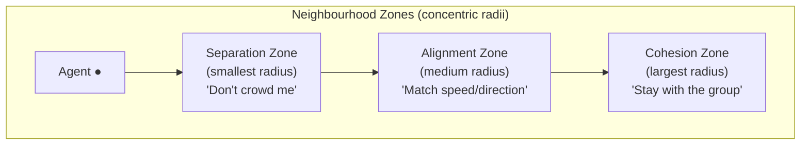

# Chapter 6 — Cloth Simulation & Flocking Boids

---

# Part A: Cloth Simulation

## 6.1 Overview and Update Order

The cloth system uses **Position Verlet integration** for time-stepping combined with **Jakobsen positional constraint relaxation** for spring stiffness. This split eliminates the stability ceiling of force-based springs (`k·dt² < 2m`) — the cloth is stable at any physics rate from 1 Hz to 2000 Hz.

**Per-frame update sequence in `ClothSystem::OnUpdate()`:**

| Step | What happens |
|---|---|
| 1a | Gravity accumulation (per-particle, world-space) |
| 1b | Aerodynamic wind forces (per-triangle panel method) |
| 2 | Verlet integration — external forces only |
| 3 | Jakobsen constraint relaxation (`constraintIters` iterations) |
| 4 | Tearing check (stress-adjusted threshold, cascade transfer, edge jitter) |
| 5a | Sphere-cloth collision |
| 5b | Plane-cloth collision |
| 5c | Capsule-cloth collision |
| 5d | Box/OBB-cloth collision |
| 6 | Burn ignition (per `BurnSource`) |
| 7 | Heat diffusion (spring-graph Laplacian) + burn-state transition (vertex curl) |

---

## 6.1a Verlet Integration

Verlet captures velocity implicitly from the position history, requiring no separate velocity field per particle:

```
x(t+dt) = x(t) + (x(t) - x(t-dt))·dampFactor + a·dt²
```

Where `dampFactor = 1 - damping·dt`. The term `(x(t) - x(t-dt))` encodes the previous velocity. In step 2, **only external forces** (gravity, aerodynamic wind) are integrated — spring stiffness is handled separately in step 3.

```cpp
// ClothSystem::OnUpdate() — step 2
const float dampFactor = 1.0f - cc.damping * dt;
for (auto& p : cc.particles) {
    if (p.pinned) continue;
    const glm::vec3 acc    = p.force / cc.particleMass;
    const glm::vec3 newPos = p.position
                           + (p.position - p.prevPosition) * dampFactor
                           + acc * (dt * dt);
    p.prevPosition = p.position;
    p.position     = newPos;
    p.force        = glm::vec3{ 0.0f };
}
```

---

## 6.1b Jakobsen Constraint Relaxation

Instead of computing a Hooke spring force and integrating it (which is numerically stiff), the Jakobsen method directly moves particles to satisfy the rest-length constraint. Corrections are absorbed into the Verlet velocity implicitly on the next tick.

**`satisfyDistance()` — the core constraint:**

```cpp
// source/systems/ClothSystem.cpp
static void satisfyDistance(
    ClothParticle& A, ClothParticle& B,
    float restLen, float stiffness, float shrinkScale)
{
    // Reduce rest length with heat → wrinkling (Dayong 2011)
    const float avgHeat       = 0.5f * (A.heat + B.heat);
    const float effectiveRest = restLen * glm::max(1.0f - avgHeat * shrinkScale, 0.1f);

    const glm::vec3 delta = B.position - A.position;
    const float     len   = glm::length(delta);
    if (len < 1e-6f) return;

    const glm::vec3 move = delta * (0.5f * stiffness * (len - effectiveRest) / len);
    if (!A.pinned && !A.burned) A.position += move;
    if (!B.pinned && !B.burned) B.position -= move;
}
```

**Stiffness mapping:** Each spring's `kSpring` is normalised against a reference of 200 (the default structural stiffness):

| Spring type | `kSpring` | Jakobsen stiffness |
|---|---|---|
| Structural | 200 | 1.0 (fully rigid) |
| Shear | 100 | 0.5 |
| Flexion | 50 | 0.25 (soft bending) |

**Constraint iteration loop (step 3):**

```cpp
const int iters = glm::clamp(cc.constraintIters, 1, 8);
for (int iter = 0; iter < iters; ++iter) {
    for (ClothSpring& s : cc.springs) {
        if (!s.active) continue;
        ClothParticle& pA = cc.particles[s.a];
        ClothParticle& pB = cc.particles[s.b];
        if (pA.burned || pB.burned) { s.active = false; continue; }
        const float stiffness = glm::clamp(s.kSpring / JAKOBSEN_REF_K, 0.0f, 1.0f);
        satisfyDistance(pA, pB, s.restLen, stiffness, cc.shrinkScale);
    }
}
```

More iterations improve convergence; 2 is the default and sufficient for visual quality. The ImGui slider **Constraint Iters** (1–8) lets you tune this live.

**Rest-length shrinkage (Dayong 2011):** `effectiveRest = restLen × max(1 - heat × shrinkScale, 0.1)`. As a particle heats up, the constraint target shortens, pulling neighbouring fabric inward and creating natural wrinkling around burn zones.

---

## 6.2 The Spring Network: Three Types

### Structs

```cpp
// include/components/ClothComponent.h
namespace GE::Components {

enum class SpringType : uint8_t { Structural = 0, Shear = 1, Flexion = 2 };

struct ClothParticle {
    glm::vec3 position     { 0.0f };   // world-space position (physics works here)
    glm::vec3 prevPosition { 0.0f };   // previous tick position (encodes velocity)
    glm::vec3 force        { 0.0f };   // external forces accumulated this tick
    bool      pinned       { false };  // if true: never moves
    float     heat         { 0.0f };   // 0 = cold, 1 = fully burned
    bool      burned       { false };  // severed from all springs, falls freely
    bool      wasCurled    { false };  // vertex-curl warp already applied
};

struct ClothSpring {
    uint16_t   a           { 0 };
    uint16_t   b           { 0 };
    float      restLen     { 0.0f };
    float      kSpring     { 100.0f };
    bool       active      { true };
    float      stressAccum { 0.0f };             // accumulated stress from torn neighbours
    SpringType type        { SpringType::Structural }; // used for debug colour coding
};

struct BurnSource {
    glm::vec3 center { 0.0f, -1000.0f, 0.0f }; // world-space (default = off-scene)
    float     radius { 0.8f };
    bool      active { false };
};

struct ClothComponent {
    // Grid dimensions
    int   rows { 10 }, cols { 10 };
    float cellSize    { 0.2f };
    float particleMass{ 0.1f };

    // Spring constants (also control Jakobsen stiffness via /200 normalisation)
    float springK  { 100.0f }; // structural
    float shearK   {  50.0f }; // shear diagonal
    float flexionK {  25.0f }; // flexion skip-one
    float damping  {   0.1f }; // Verlet velocity decay

    // Jakobsen solver
    int   constraintIters  { 2 };
    float shrinkScale      { 0.35f }; // rest-length reduction per unit heat

    // Tearing
    std::vector<ClothSpring> springs;
    float tearThreshold    { 3.0f };
    float tearRoughness    { 0.04f };  // tear-edge jitter magnitude
    float stressTransferRate{ 0.4f }; // fraction of excess stress sent to neighbours

    // Burning
    float burnRate         { 1.5f };
    float curlAmount       { 0.05f };   // position warp applied once at burn moment
    float heatConductivity { 0.4f };    // heat diffusion rate along springs
    std::vector<BurnSource> burnSources;

    // Aerodynamic wind
    bool  windEnabled   { false };
    float windX         { 0.0f }, windZ { 0.0f };
    float dragCoeff     { 1.2f };
    float gustAmplitude { 0.3f };  // ±fraction of base wind
    float gustFrequency { 0.8f };  // Hz

    // Physics state + GPU buffer
    std::vector<ClothParticle> particles;
    VkBuffer       vertexBuffer   { VK_NULL_HANDLE };
    VkDeviceMemory vertexMemory   { VK_NULL_HANDLE };
    void*          mappedVertices { nullptr };
    uint32_t       vertexCount    { 0 };
    VkDeviceSize   indexOffset    { 0 };
    uint32_t       indexCount     { 0 };

    glm::vec3 color        { 0.8f, 0.8f, 0.8f };
    bool      useTextureMode{ false }; // cold vertex writes white so phong albedo is unmodified
};

} // namespace GE::Components
```

### Spring types and grid layout

```
Structural ─── : horizontal + vertical edges (prevent stretching)
Shear     ╲╱  : diagonal connections (prevent shear deformation)
Flexion   ╌╌  : skip-one connections (resist bending)
```

Springs are built at scene load time in `FBSceneAdapter::adaptBehaviour()` and their `kSpring` is baked; changing the ImGui slider affects new scene loads only.

---

## 6.3 Tearing Mechanic

After all constraint iterations settle (step 4), each active spring's length is compared against its **stress-adjusted threshold**:

```cpp
const float effectiveThreshold = glm::max(cc.tearThreshold - s.stressAccum, 0.5f);
if (curLen > effectiveThreshold * s.restLen) {
    s.active = false;

    // Cascade: transfer excess tension to neighbour springs
    if (cc.stressTransferRate > 0.0f) {
        const float excessStress = (curLen / s.restLen - cc.tearThreshold)
                                   / glm::max(cc.tearThreshold, 0.1f);
        if (excessStress > 0.0f) {
            const float delta = excessStress * cc.stressTransferRate;
            for (ClothSpring& nb : cc.springs) {
                if (!nb.active) continue;
                if (nb.a == s.a || nb.b == s.a || nb.a == s.b || nb.b == s.b)
                    nb.stressAccum += delta;
            }
        }
    }

    // Edge jitter: ragged tear rather than a surgical cut
    if (cc.tearRoughness > 0.0f) {
        auto jitter = [&](uint16_t idx) {
            ClothParticle& p = cc.particles[idx];
            if (p.pinned || p.burned) return;
            const float fi = static_cast<float>(idx) * 7.13f + static_cast<float>(s.b) * 3.71f;
            const glm::vec3 j = { (hashNoise(fi, 0) - 0.5f) * cc.tearRoughness,
                                   (hashNoise(fi+1, 0) - 0.5f) * cc.tearRoughness * 0.3f,
                                   (hashNoise(fi+2, 0) - 0.5f) * cc.tearRoughness };
            p.position     += j;
            p.prevPosition += j; // preserve Verlet velocity
        };
        jitter(s.a); jitter(s.b);
    }
}
```

**Stress transfer** lowers `stressAccum` on neighbour springs, enabling cracks to propagate along lines of tension. The effective threshold floor (0.5) prevents zero-length tears from accumulating stress instability.

**Tear edge jitter** uses `hashNoise` (deterministic, thread-safe, no RNG) seeded from particle and spring indices so the same spring always jitters in the same direction.

**ImGui:** Tearing section — Tear Threshold, Tear Roughness, Stress Transfer, **Reset Cloth** (reactivates all springs, clears `stressAccum` and `wasCurled`, resets all particle heat).

---

## 6.4 Burning Mechanic

### Multiple ignition sources

Each active `BurnSource` accumulates heat on nearby particles each tick (step 6):

```cpp
for (const BurnSource& src : cc.burnSources) {
    if (!src.active) continue;
    for (auto& p : cc.particles) {
        if (p.burned || p.pinned) continue;
        if (glm::length(p.position - src.center) < src.radius)
            p.heat += cc.burnRate * dt;
    }
}
```

Sources are independent; their heat fronts merge organically via the diffusion pass.

### Heat diffusion (Laplacian on spring graph)

After ignition (step 7), heat spreads from hot particles to cooler neighbours through active springs:

```cpp
// Two-pass diffusion: read current heat → compute deltas → apply
m_heatDelta.assign(N, 0.0f);
for (const ClothSpring& s : cc.springs) {
    if (!s.active) continue;
    const float flux = cc.heatConductivity * (particles[s.b].heat - particles[s.a].heat) * dt;
    m_heatDelta[s.a] += flux;
    m_heatDelta[s.b] -= flux;
}
for (uint32_t pi = 0; pi < N; ++pi) {
    p.heat = glm::clamp(p.heat + m_heatDelta[pi], 0.0f, 1.0f);
}
```

**Stability:** `conductivity × dt × max_spring_degree < 1`. At 60 Hz, interior particles have degree ~8, so max stable `conductivity ≈ 7.5`. The default of 0.4 is safely within range at all supported physics rates.

**`heatConductivity = 0` disables diffusion** — only direct ignition sources heat particles (original behaviour).

### Burn-state transition and vertex curl

When a particle's heat reaches 1.0:

```cpp
auto burnParticle = [&](uint32_t pi) {
    ClothParticle& p = cc.particles[pi];
    p.burned = true; p.pinned = false;

    // Vertex curl: one-time random warp at the burn moment
    if (!p.wasCurled && cc.curlAmount > 0.0f) {
        p.wasCurled = true;
        const float fi = static_cast<float>(pi) * 7.13f;
        const glm::vec3 curl = {
            (hashNoise(fi, m_simTime) - 0.5f) * cc.curlAmount,
            (hashNoise(fi+1, m_simTime) - 0.5f) * cc.curlAmount * 0.3f,
            (hashNoise(fi+2, m_simTime) - 0.5f) * cc.curlAmount
        };
        p.position    += curl;
        p.prevPosition = p.position; // zero Verlet velocity at curl point
    }

    // Sever all connected springs
    for (ClothSpring& s : cc.springs)
        if (s.a == (uint16_t)pi || s.b == (uint16_t)pi) s.active = false;
};
```

`p.prevPosition = p.position` zeroes the implicit Verlet velocity so the charred particle drifts from its curled position under gravity, not flies off.

### Heat colour gradient

Written to the vertex buffer each frame in `FlatBuffersScenario::OnUpdate()`:

| Heat range | Colour |
|---|---|
| 0 (cold) | cloth colour (flat mode) / white (texture mode) |
| 0 – 0.25 | → yellow |
| 0.25 – 0.55 | → orange |
| 0.55 – 0.80 | → red |
| 0.80 – 1.0 | → charred near-black |

In **texture mode** (Phong + PBR fabric), cold particles write white `(1,1,1)` as vertex colour so the shader multiply `albedo *= fragVertexColor` is a no-op when unheated. Hot particles tint the fabric texture through the same multiply.

### Emissive glow (shaders)

Both `flatcolor.frag` and `phong.frag` add a self-illumination term:

```glsl
float warmth   = clamp(fragVertexColor.r - fragVertexColor.b, 0.0, 1.0);
float emissive = smoothstep(0.2, 0.7, warmth) * 0.45;
outColor = vec4(litResult + fragVertexColor * emissive, 1.0);
```

`R − B` is high for yellow/orange/red and ~0 for grey cold cloth or near-black charred, so glow is selective.

---

## 6.5 GPU Buffer: Persistent-Mapped Host-Visible Memory

Cloth vertices change every frame. The engine uses `VK_MEMORY_PROPERTY_HOST_VISIBLE_BIT | VK_MEMORY_PROPERTY_HOST_COHERENT_BIT` — the CPU writes directly into GPU-accessible memory, no staging or `vkFlushMappedMemoryRanges` needed.

**Layout:** `[0, indexOffset)` = `Vertex` data; `[indexOffset, total)` = `uint32_t` indices.

**Critical — vertex space:** Vertices are stored in **local space** (relative to the cloth entity's origin), not world space. The Renderer applies the cloth entity's `m_worldMatrix` as the model push-constant; if vertices stored world positions, the entity translation would be double-counted and the cloth would render offset above its physics particles.

```cpp
// FlatBuffersScenario::OnUpdate() — per-frame vertex refresh
const GE::ECS::EntityID clothEid = clothArr.Index()[i];
const Transform* clothTr = em->TryGetTIComponent<Transform>(clothEid);
const glm::vec3 entityWorldPos = clothTr ? clothTr->m_worldPosition : glm::vec3{0};

for (uint32_t vi = 0; vi < cc.vertexCount; ++vi) {
    verts[vi].position = cc.particles[vi].position - entityWorldPos; // world → local
    // normal, tangent, color also written here
}
```

The debug spring visualization reads `cc.particles[].position` (world space) with an identity push-constant, so physics and rendered mesh agree visually.

---

## 6.5a Aerodynamic Wind (Panel Method)

**Old approach (removed):** `p.force += vec3(windX, 0, windZ) * mass` — identical force on every particle regardless of cloth orientation. Cloth parallel to the wind was pushed identically to cloth facing into it.

**Current approach:** per-triangle aerodynamic drag.

```cpp
// For each quad → 2 triangles:
const glm::vec3 e1 = pb.position - pa.position;
const glm::vec3 e2 = pc.position - pa.position;
const glm::vec3 normalScaled = glm::cross(e1, e2);  // magnitude = 2 × area
const float area2 = glm::length(normalScaled);
if (area2 < 1e-6f) return;
const glm::vec3 normal = normalScaled / area2;

// Triangle velocity from Verlet (estimate)
const glm::vec3 triVel = ((pa.position - pa.prevPosition) +
                          (pb.position - pb.prevPosition) +
                          (pc.position - pc.prevPosition)) / (3.0f * dt);

// Effective wind with gust + turbulence
const float gustScale = 1.0f + cc.gustAmplitude *
    std::sin(2π * cc.gustFrequency * simTime);
const glm::vec3 baseWind{ cc.windX * gustScale, 0, cc.windZ * gustScale };
// + per-centroid hash-noise turbulence...

const float normalComp = glm::dot(baseWind - triVel, normal); // signed
const glm::vec3 F = cc.dragCoeff * 1.225f * (area2 * 0.5f) * normalComp * normal;

// Distribute equally to 3 vertices
if (!pa.pinned && !pa.burned) pa.force += F / 3;
// ...
```

**Signed force** — both cloth faces react. Cloth facing the wind billows away; reversed cloth billows back. This is correct for a free-hanging curtain (unlike a sail where only the concave face catches wind).

**Sinusoidal gust** scales the entire wind vector periodically. **Hash turbulence** adds per-quad spatial variation from `hashNoise(centroid.x, simTime)` scaled by `gustAmplitude × |baseWind| × 0.4`.

**ImGui controls:** Wind X, Wind Z, Drag Coeff (0.1–4.0), Gust Amp (0–1), Gust Freq (0.1–3 Hz).

---

## 6.5b Sphere-Cloth Collision

Each `SphereCollider` in the scene is checked against all cloth particles. If a particle is inside the sphere, it is pushed to the surface:

```cpp
const glm::vec3 diff = p.position - sphereCenter;
const float dist = glm::length(diff);
if (dist < sphereRadius && dist > MIN_LENGTH) {
    p.position = sphereCenter + (diff / dist) * sphereRadius;
    totalNormal += diff / dist;
    ++collisionCount;
}
```

The accumulated `totalNormal` drives a reaction impulse on the sphere's `RigidBody` (if not static): `CLOTH_RESTITUTION = 0.20` (20% of normal velocity reflected), `CLOTH_FRICTION = 0.70` (30% tangential damping).

---

## 6.5c Plane / Capsule / Box Cloth Collision

Three additional collider types, all run after sphere collision (steps 5b–5d).

### Plane (step 5b)

```cpp
// PlaneCollider: normal (unit), offset (plane equation: dot(n,x) = offset)
const float sd = glm::dot(p.position, pc.normal) - pc.offset;
if (sd < 0.0f) {
    p.position -= sd * pc.normal;   // push to surface (sd is negative)
    // Verlet friction: remove normal velocity, damp tangential
    const glm::vec3 vel   = p.position - p.prevPosition;
    const glm::vec3 vNorm = glm::dot(vel, pc.normal) * pc.normal;
    const glm::vec3 vTang = vel - vNorm;
    p.prevPosition = p.position - vTang * CLOTH_FRICTION;
}
```

Zero restitution (cloth rests on the floor without bouncing), `CLOTH_FRICTION` tangential damping. Uses the same `offset` encoding as `PhysicsSystem`.

### Capsule (step 5c)

Treats the capsule as a sphere swept along its spine. The spine endpoints are `(0, ±height/2, 0)` in local space, transformed to world via `tr->m_worldMatrix`.

```cpp
static glm::vec3 closestPointOnSegment(const glm::vec3& A, const glm::vec3& B, const glm::vec3& P) {
    const glm::vec3 AB = B - A;
    const float denom = glm::dot(AB, AB);
    if (denom < 1e-12f) return A;
    return A + AB * glm::clamp(glm::dot(P - A, AB) / denom, 0.0f, 1.0f);
}

// Per particle:
const glm::vec3 closest = closestPointOnSegment(worldBase, worldTip, p.position);
const glm::vec3 diff = p.position - closest;
const float dist = glm::length(diff);
if (dist < cap.radius && dist > MIN_LENGTH)
    p.position = closest + (diff / dist) * cap.radius;
```

Structurally identical to sphere collision — just the "sphere center" is replaced by the closest spine point.

### Box / OBB (step 5d)

Transforms the particle into the box's local space, handles arbitrary rotation:

```cpp
// computed once per box, outside the particle loop:
const glm::mat4 invWorld = glm::inverse(tr->m_worldMatrix);
const glm::vec3 half{ box.sizeX * 0.5f, box.sizeY * 0.5f, box.sizeZ * 0.5f };

// per particle:
const glm::vec3 lp = glm::vec3(invWorld * glm::vec4(p.position, 1.0f));
if (glm::abs(lp.x) < half.x && glm::abs(lp.y) < half.y && glm::abs(lp.z) < half.z) {
    // Inside: eject along minimum penetration axis
    const glm::vec3 pen = half - glm::abs(lp);
    int axis = (pen.x < pen.y) ? 0 : 1;
    if (pen.z < pen[axis]) axis = 2;
    glm::vec3 corrLocal = lp;
    corrLocal[axis] = (lp[axis] >= 0.0f ? 1.0f : -1.0f) * half[axis];
    p.position = glm::vec3(tr->m_worldMatrix * glm::vec4(corrLocal, 1.0f));
}
```

`glm::inverse()` is called once per box per cloth update, not per particle.

---

## 6.5d Cloth Debug Visualization

The `ColliderVisualizerSystem` (pipeline index 7, `LINE_LIST` topology) draws cloth debug geometry alongside the existing collider wireframes. All debug lines are in world space with an identity push-constant.

### Spring colour coding

| Spring state | Colour |
|---|---|
| Structural (active) | White |
| Shear (active) | Cyan |
| Flexion (active) | Yellow |
| Any type, hot endpoint (`heat > 0.05`) | Orange |
| Torn (inactive, if enabled) | Red |

`SpringType` is set at scene load time (`FBSceneAdapter`) on each `ClothSpring`. The `ColliderVisualizerSystem` reads it in `RecordPass()` to select the colour.

### Particle crosses

Each particle is rendered as a 3-axis cross glyph (6 line segments, half-size 0.04 m) coloured by the same 4-stage heat gradient used in the vertex colour update.

### Normal vectors

For each particle, a green line from `p.position` to `p.position + normal × 0.06` is drawn. Normals are read directly from `cc.mappedVertices` (the persistently-mapped cloth buffer), which is CPU-accessible.

### GPU buffer

A single host-coherent buffer (`m_clothDebugBuf`, 50,000 vertices ≈ 2.8 MB) is allocated in the `ColliderVisualizerSystem` constructor. It is filled each frame in `RecordPass()` and drawn with one `vkCmdDraw` call per cloth.

### ImGui controls

Inside `Cloth → Debug Visualisation` at the bottom of the cloth menu:

```
☐ Springs
    ☐ Structural
    ☐ Shear
    ☐ Flexion
    ☐ Torn
☐ Particles
☐ Normals
```

These flags live on `m_visualizerSystem` (the `ColliderVisualizerSystem*` stored in `FlatBuffersScenario`).

---

## 6.5e PBR Textures, Normal Mapping, and Heat Tinting

When a cloth entity in the scene JSON has `texture_path` set and the scene is in **material colour mode** (`useOwnerColors = false`), `FBSceneAdapter` creates a Phong material (pipeline 0) with descriptor set 1 bound to five PBR textures: albedo, normal map, AO, metallic, roughness.

The Phong fragment shader computes a TBN matrix from the per-vertex tangent and geometric normal (both recomputed each frame from deformed particle positions) and uses it to decode the normal map into world-space shading normals.

**Heat tinting in texture mode:**

The `phong.vert` shader forwards `inColor` (the vertex colour written by `FlatBuffersScenario::OnUpdate()`) as `fragVertexColor` (location 6). The fragment shader multiplies:

```glsl
vec3 albedo = texture(texSampler, fragTexCoord).rgb * fragVertexColor;
```

Cold particles write white `(1,1,1)` so the multiply is a no-op. Heating particles write the heat gradient colours, tinting the fabric texture organically — the boucle weave shows through even while burning.

---

## 6.10 Interactive Sphere Spawner

The cloth scene (05) includes a `ClothSphereSpawnerScript` attached to an invisible manager entity. Pressing **SPACE** fires a physics sphere (`SphereCollider + RigidBody`) that collides with the hanging cloth.

**Trajectory design:** Spawn position `(xRand[0.3,1.9], 3.0+yExtra[0.10,0.15], 4.5)` with `vy=0`, `vz=-9 m/s`. With `vy=0`, both the sphere and free cloth rows fall at identical gravity rates — the Y-gap stays at `yExtra` throughout the entire approach, guaranteeing collision regardless of cloth settling state.

**Sphere mesh:** Built once at scene load, shared across all spawned spheres — zero GPU allocation per spawn. Spheres are tracked with `{ EntityID, float lifetime }` and destroyed when lifetime expires (10 s) or `y < sphereRadius`.

---

---

# Part B: Flocking Boids

## 6.6 Reynolds Boids: Three Rules

Craig Reynolds (1986) defined a flocking algorithm using only three simple local rules — no global coordination, no leader. Each agent independently computes forces from its neighbourhood:



### FlockingComponent

```cpp
// include/components/FlockingComponent.h
namespace GE::Components {

struct FlockingComponent {
    float separationRadius { 1.5f };
    float alignmentRadius  { 3.0f };
    float cohesionRadius   { 5.0f };

    float wSeparation { 2.0f };   // Highest priority
    float wAlignment  { 1.0f };
    float wCohesion   { 1.0f };
    float wAvoidance  { 3.0f };   // Static obstacle avoidance

    float   maxSpeed  { 6.0f };
    float   maxForce  { 15.0f };
    uint8_t groupId   { 0 };      // 0 = flock with everyone; >0 = same group only
};

} // namespace GE::Components
```

---

## 6.7 Implementing the Three Behaviours

```cpp
// source/systems/FlockingSystem.cpp — computeSteering() (simplified)
glm::vec3 FlockingSystem::computeSteering(const AgentEntry& self,
                                          const FlockingComponent& fk,
                                          const std::vector<uint32_t>& neighbourIndices)
{
    glm::vec3 separation{0}, alignment{0}, cohesion{0};
    int sepCount=0, alignCount=0, cohCount=0;
    glm::vec3 avgVel{0}, centreOfMass{0};

    for (uint32_t ni : neighbourIndices) {
        const AgentEntry& n = m_agents[ni];
        if (&n == &self) continue;
        if (fk.groupId != 0 && n.group != fk.groupId) continue;

        glm::vec3 diff = self.pos - n.pos;
        float dist = glm::length(diff);
        if (dist < 1e-6f) continue;

        if (dist < fk.separationRadius) { separation += glm::normalize(diff) / dist; ++sepCount; }
        if (dist < fk.alignmentRadius)  { avgVel += n.vel; ++alignCount; }
        if (dist < fk.cohesionRadius)   { centreOfMass += n.pos; ++cohCount; }
    }

    if (sepCount > 0)  separation = glm::normalize(separation) * fk.maxForce;
    if (alignCount > 0) {
        glm::vec3 steer = avgVel / (float)alignCount - self.vel;
        if (glm::length(steer) > 1e-6f) alignment = glm::normalize(steer) * fk.maxForce;
    }
    if (cohCount > 0) {
        glm::vec3 toTarget = centreOfMass / (float)cohCount - self.pos;
        if (glm::length(toTarget) > 1e-6f) cohesion = glm::normalize(toTarget) * fk.maxForce;
    }

    glm::vec3 avoidance = computeAvoidance(self, fk);
    return weightedTruncatedSum(separation, avoidance, alignment, cohesion, fk);
}
```

---

## 6.8 Weighted Truncated Sum (Buckland Pattern)

Instead of adding all forces, the engine uses a priority budget — high-priority forces are applied first; if they exhaust the budget, lower-priority forces are ignored entirely:

```cpp
glm::vec3 FlockingSystem::weightedTruncatedSum(
    const glm::vec3& separation, const glm::vec3& avoidance,
    const glm::vec3& alignment,  const glm::vec3& cohesion,
    const FlockingComponent& fk)
{
    glm::vec3 totalForce{0};
    float remaining = fk.maxForce;

    auto addForce = [&](const glm::vec3& f, float weight) -> bool {
        glm::vec3 wf = f * weight;
        float mag = glm::length(wf);
        if (mag < 1e-6f) return true;
        if (mag > remaining) {
            totalForce += glm::normalize(wf) * remaining;
            remaining = 0; return false;
        }
        totalForce += wf; remaining -= mag; return true;
    };

    // Priority: Separation > Avoidance > Alignment > Cohesion
    if (!addForce(separation, fk.wSeparation)) return totalForce;
    if (!addForce(avoidance,  fk.wAvoidance))  return totalForce;
    if (!addForce(alignment,  fk.wAlignment))  return totalForce;
    addForce(cohesion, fk.wCohesion);
    return totalForce;
}
```

---

## 6.9 Spatial Partitioning Modes

```cpp
// include/systems/FlockingSystem.h
enum class FlockSpatialMode : uint8_t {
    BruteForce  = 0,   // O(n²)
    UniformGrid = 1,   // O(n) build + O(m) query
    Octree      = 2    // O(n log n) build + O(log n + m) query
};
```

### Uniform Grid

Hash every agent's position into a cell (`cellX = floor(pos.x / cellSize)`). To find neighbours within radius `r`, visit the 27 surrounding cells (3×3×3 cube). Uses a `hashCell(cx, cy, cz)` integer key into an `unordered_map`.

### Octree

Recursively subdivides 3D space into 8 equal sub-cells. Query culls entire subtrees via sphere-AABB overlap test. Constants: `OCTREE_MAX_DEPTH = 6`, `OCTREE_MAX_LEAF_AGENTS = 8`, world half-extent = 60 units.

### Performance Comparison

| Mode | Agents | Neighbour Checks/Frame | Suitable For |
|---|---|---|---|
| BruteForce | 60 | 3,540 (n²) | Small flocks (< 100) |
| UniformGrid | 60 | ~300–500 | Most use cases |
| Octree | 60 | ~150–300 | Large sparse flocks |
| BruteForce | 500 | 249,750 | Too slow |
| UniformGrid | 500 | ~2,000–5,000 | ✓ |
| Octree | 500 | ~1,000–3,000 | ✓ |

The ImGui Flocking menu displays `m_neighbourChecksLastFrame` and `m_lastUpdateMs` in real-time.

---

## 6.11 Flocking: Live Restart Without Freeze/Unfreeze

`FlockingSystem::Restart()` scatters all agents to random positions inside the original spawn sphere and assigns small random velocities, then sets `m_frozen = false`. This is more useful than Freeze/Unfreeze for demonstrating spatial mode differences — agents immediately redistribute and show distinct behaviour from frame one.

```cpp
// source/systems/FlockingSystem.cpp
void FlockingSystem::Restart(GE::ECS::EntityManager* em) {
    auto& flockArr = em->GetCompArr<GE::Components::FlockingComponent>();
    std::uniform_real_distribution<float> dist(-1.0f, 1.0f);

    for (uint32_t i = 0; i < flockArr.GetCount(); ++i) {
        const GE::ECS::EntityID id = flockArr.Index()[i];
        auto* rb = em->TryGetTIComponent<GE::Components::RigidBody>(id);
        auto* tr = em->TryGetTIComponent<GE::Components::Transform>(id);
        if (!rb || !tr) continue;

        glm::vec3 offset;
        do { offset = glm::vec3(dist(m_rng), dist(m_rng), dist(m_rng)); }
        while (glm::length(offset) > 1.0f);

        tr->m_worldPosition = m_spawnOrigin + offset * m_spawnRadius;
        tr->m_localPosition = tr->m_worldPosition;
        rb->velocity = glm::vec3(dist(m_rng), dist(m_rng), dist(m_rng)) * 0.5f;
    }
    m_frozen = false;
}
```

`m_spawnOrigin` and `m_spawnRadius` are set from the scene JSON at load time via `adaptCtx.flockSpawnOrigin / flockSpawnRadius`.

---

*Next: [Chapter 7 — UDP Networking](07_UDP_Networking.md)*
