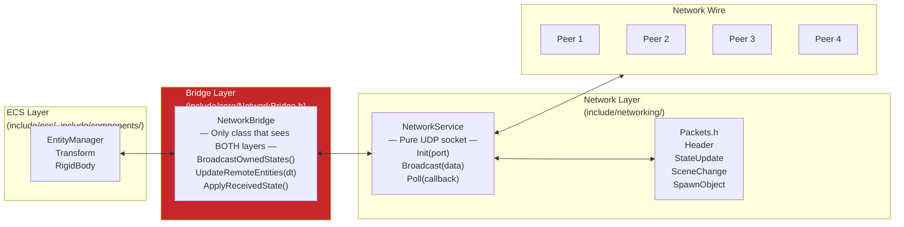
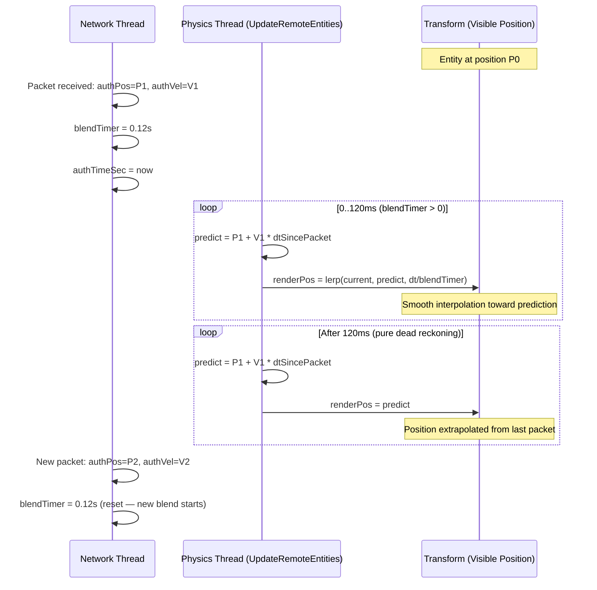

# Chapter 7 — UDP Peer-to-Peer Networking: State Sync & Dead Reckoning

## 7.1 Why UDP Instead of TCP?

For physics state synchronisation in a multiplayer simulation, the properties of UDP are exactly what we want:

| Property | TCP | UDP | Why UDP Wins |
|---------|-----|-----|-------------|
| **Delivery** | Guaranteed | Best-effort | Old physics state is useless — drop it |
| **Order** | Maintained | Out-of-order possible | We track sequence numbers ourselves |
| **Latency** | Higher (retransmit delays) | Lower | No waiting for lost packets |
| **Overhead** | Higher (connection state) | Lower | 4-byte header instead of 20 |

**The key insight:** If we send position updates at 60Hz and a packet is lost, we don't need the old position — we already have a newer one (or we can predict using dead reckoning). Retransmitting a stale physics update is worse than ignoring it.

---

## 7.2 Architecture: Strict Layer Decoupling

One of the most important design constraints in this engine is that **networking code must not depend on ECS or Vulkan**. This keeps the networking layer portable, testable, and reusable.



The rule: `NetworkService.h` and `Packets.h` must **never** include `EntityManager.h`, `Transform.h`, or any Vulkan header. `NetworkBridge` is the only permitted bridge.

---

## 7.3 Packet Definitions

```cpp
// include/networking/Packets.h

// Packet type identifier (1 byte)
enum class PacketType : uint8_t {
    Heartbeat   = 0,   // Keep-alive ping (header only, 4 bytes total)
    StateUpdate = 1,   // Physics state broadcast
    SceneChange = 2,   // Request all peers to load a new scene
    SpawnObject = 3    // Activate a pre-pooled entity on all peers
};

// Common header for all packets (4 bytes, aligned)
struct Header {
    PacketType type     { PacketType::Heartbeat };
    uint8_t    senderId { 0 };       // Peer ID of the sender (1–4)
    uint16_t   sequence { 0 };       // Monotonically increasing; drop if <= last seen
};

// Physics state broadcast — sent ~60 times/sec per owned entity
struct StateUpdate {
    Header    header    {};
    uint32_t  entityId  { 0 };
    glm::vec3 position  { 0.0f };
    float     orientation[4] { 0.0f, 0.0f, 0.0f, 1.0f };  // quaternion x,y,z,w
    // Note: float[4] instead of glm::quat to avoid including glm/gtc/quaternion.hpp
    // in a pure networking header
    glm::vec3 linearVelocity  { 0.0f };
    glm::vec3 angularVelocity { 0.0f };
};

// Request all peers to switch to a different scene file
struct SceneChange {
    Header header {};
    char   path[256] {};   // Relative path to .bin file
};

// Activate a pre-created entity (from spawner pool) on remote peers
struct SpawnObject {
    Header    header       {};
    uint32_t  entityId     { 0 };
    uint8_t   ownerPeerId  { 0 };
    uint8_t   shapeType    { 0 };   // 0=sphere, 1=box, etc.
    glm::vec3 position     { 0.0f };
    glm::vec3 scale        { 1.0f };
    glm::vec3 linVelocity  { 0.0f };
    float     mass         { 1.0f };
};
```

---

## 7.4 NetworkService: The Raw UDP Layer

```cpp
// include/networking/NetworkService.h
namespace GE::Networking {

class NetworkService {
public:
    static constexpr uint8_t MAX_PEERS = 4;

    using ReceiveCallback = std::function<void(uint8_t senderId,
                                               const uint8_t* data,
                                               std::size_t size)>;

    // Initialise: create a UDP socket and bind to localPort
    bool Init(uint16_t localPort);

    // Add a peer to the address book
    void AddPeer(uint8_t peerId, const std::string& ip, uint16_t port);

    // Send to a specific peer
    void Send(uint8_t peerId, const void* data, std::size_t size);

    // Send to all registered peers
    void Broadcast(const void* data, std::size_t size);

    // Non-blocking receive: calls cb for each packet received
    // waitMs: max milliseconds to wait if no packet is ready (0 = pure non-blocking)
    void Poll(const ReceiveCallback& cb, int waitMs = 0);

    void Shutdown();

    bool IsConnected() const { return m_initialised; }
    uint8_t GetLocalPeerId() const { return m_localPeerId; }

private:
    // SOCKET stored as uintptr_t to hide <winsock2.h> from this header
    // (Winsock's SOCKET type is uintptr_t on all Windows platforms)
    uintptr_t m_socket { static_cast<uintptr_t>(-1) };

    struct PeerEntry {
        bool     active { false };
        uint32_t addr   { 0 };    // sin_addr.s_addr in network byte order
        uint16_t port   { 0 };    // sin_port in network byte order
    };
    std::array<PeerEntry, MAX_PEERS> m_peers {};

    bool    m_initialised { false };
    uint8_t m_localPeerId { 1 };
};

} // namespace GE::Networking
```

### Why `uintptr_t` for the socket?

Windows defines `SOCKET` as `UINT_PTR` (= `uintptr_t` on 64-bit). If we used `SOCKET` in the header, every file that includes `NetworkService.h` would transitively include `<winsock2.h>` — which clashes with `<windows.h>` unless included in the right order. Hiding it as `uintptr_t` prevents this.

### Socket Initialisation (Non-blocking)

```cpp
// source/networking/NetworkService.cpp
bool NetworkService::Init(uint16_t localPort) {
    WSADATA wsa;
    WSAStartup(MAKEWORD(2, 2), &wsa);

    m_socket = socket(AF_INET, SOCK_DGRAM, IPPROTO_UDP);   // UDP socket

    // Non-blocking mode: recv() returns immediately if no data
    u_long mode = 1;
    ioctlsocket(static_cast<SOCKET>(m_socket), FIONBIO, &mode);

    // Bind to local port
    sockaddr_in addr {};
    addr.sin_family      = AF_INET;
    addr.sin_addr.s_addr = INADDR_ANY;
    addr.sin_port        = htons(localPort);
    bind(static_cast<SOCKET>(m_socket),
         reinterpret_cast<sockaddr*>(&addr), sizeof(addr));

    m_initialised = true;
    return true;
}
```

---

## 7.5 NetworkBridge: The ECS–Network Seam

`NetworkBridge` lives in `include/core/` (not `include/networking/`) precisely because it must include both ECS headers and networking headers. It is the only class with this privilege.

### Outgoing: BroadcastOwnedStates

Called once per physics tick, throttled to ~60 packets/sec per entity:

```cpp
// source/core/NetworkBridge.cpp
void NetworkBridge::BroadcastOwnedStates() {
    if (!m_service || !m_service->IsConnected()) return;

    const auto now = std::chrono::steady_clock::now();
    const float dtSinceLastBroadcast =
        std::chrono::duration<float>(now - m_lastBroadcastTime).count();

    if (dtSinceLastBroadcast < (1.0f / 60.0f)) return;   // Throttle to 60/sec
    m_lastBroadcastTime = now;

    auto* em            = ServiceLocator::GetEntityManager();
    const uint8_t myId  = m_service->GetLocalPeerId();

    auto& owners = em->GetCompArr<GE::Components::OwnerComponent>();
    for (uint32_t i = 0; i < owners.GetCount(); ++i) {
        if (owners.Data()[i].peerId != myId) continue;  // Only broadcast owned entities

        EntityID eid = owners.Index()[i];
        auto* tr = em->GetTIComponent<GE::Components::Transform>(eid);
        auto* rb = em->GetTIComponent<GE::Components::RigidBody>(eid);
        if (!tr || !rb) continue;

        StateUpdate pkt;
        pkt.header.type     = PacketType::StateUpdate;
        pkt.header.senderId = myId;
        pkt.header.sequence = ++m_outSequence;

        pkt.entityId        = eid;
        pkt.position        = tr->m_position;
        pkt.linearVelocity  = rb->velocity;
        pkt.angularVelocity = rb->angularVelocity;

        // Extract quaternion from rotation matrix (mat4→quat decomposition)
        glm::quat q = glm::quat_cast(glm::mat3(tr->m_worldMatrix));
        pkt.orientation[0] = q.x;
        pkt.orientation[1] = q.y;
        pkt.orientation[2] = q.z;
        pkt.orientation[3] = q.w;

        m_service->Broadcast(&pkt, sizeof(pkt));
    }
}
```

### Incoming: ApplyReceivedState

Called by the networking thread's `Poll()` callback when a packet arrives:

```cpp
void NetworkBridge::ApplyReceivedState(uint8_t senderId,
                                       const uint8_t* data, std::size_t size)
{
    if (size < sizeof(Header)) return;
    Header hdr;
    std::memcpy(&hdr, data, sizeof(hdr));

    switch (hdr.type) {
    case PacketType::StateUpdate:
        handleStateUpdate(senderId, data, size);
        break;
    case PacketType::SceneChange:
        handleSceneChange(data, size);
        break;
    case PacketType::SpawnObject:
        handleSpawnObject(data, size);
        break;
    default:
        break;
    }
}

void NetworkBridge::handleStateUpdate(uint8_t senderId,
                                      const uint8_t* data, std::size_t size) {
    if (size < sizeof(StateUpdate)) return;
    StateUpdate pkt;
    std::memcpy(&pkt, data, sizeof(pkt));

    // Sequence-drop guard: ignore out-of-order packets
    auto& seqTracker = m_lastInSequence[senderId];
    if (pkt.header.sequence <= seqTracker) return;   // Old packet — drop
    seqTracker = pkt.header.sequence;

    // Store in remote entity state map for UpdateRemoteEntities to apply
    auto& rs = m_remoteStates[pkt.entityId];
    rs.authPosition   = pkt.position;
    rs.authVelocity   = pkt.linearVelocity;
    rs.authTimeSec    = currentTimeSec();
    rs.blendTimer     = RemoteEntityState::BLEND_DURATION;  // Start 120ms blend
}
```

---

## 7.6 Dead Reckoning + Blend Correction

Between received packets, remote entities must still move smoothly. The engine uses **dead reckoning** — extrapolating position from the last known velocity:

```
predicted_pos = lastPos + lastVel * (time since last packet)
```

However, when a new packet arrives, the predicted position and the new authoritative position may disagree (the remote physics didn't match our prediction exactly). Snapping immediately causes visual jitter. Instead, the engine **blends** over 120ms:

```cpp
// include/core/NetworkBridge.h
struct RemoteEntityState {
    glm::vec3 authPosition  { 0.0f };    // Authoritative position from last packet
    glm::vec3 authVelocity  { 0.0f };    // Authoritative velocity from last packet
    glm::vec3 renderPosition { 0.0f };   // Current interpolated render position
    double    authTimeSec   { 0.0 };     // Wall-clock time of last received packet
    float     blendTimer    { 0.0f };    // Seconds remaining in blend window
    static constexpr float BLEND_DURATION = 0.12f;  // 120ms blend window
};
```

```cpp
// source/core/NetworkBridge.cpp — UpdateRemoteEntities()
void NetworkBridge::UpdateRemoteEntities(float dt) {
    if (!m_service || !m_service->IsConnected()) return;

    const double now = currentTimeSec();
    auto* em         = ServiceLocator::GetEntityManager();

    for (auto& [entityId, rs] : m_remoteStates) {
        auto* tr = em->GetTIComponent<GE::Components::Transform>(entityId);
        if (!tr) continue;

        // Dead reckoning: predict where the remote body should be now
        float dtSincePacket      = static_cast<float>(now - rs.authTimeSec);
        glm::vec3 predictedPos   = rs.authPosition + rs.authVelocity * dtSincePacket;

        if (rs.blendTimer > 0.0f) {
            // Active blend: lerp from current render position toward prediction
            float alpha          = dt / rs.blendTimer;
            rs.renderPosition    = glm::mix(tr->m_position, predictedPos,
                                            glm::clamp(alpha, 0.0f, 1.0f));
            rs.blendTimer       -= dt;
        } else {
            // Pure dead reckoning: jump straight to prediction
            rs.renderPosition    = predictedPos;
        }

        // Apply interpolated position to the transform
        tr->m_position = rs.renderPosition;
    }
}
```

### Dead Reckoning Timeline



---

## 7.7 Scene Change Synchronisation

When one peer changes scene, all peers should change simultaneously:

```cpp
// source/core/NetworkBridge.cpp
void NetworkBridge::handleSceneChange(const uint8_t* data, std::size_t size) {
    if (size < sizeof(SceneChange)) return;
    SceneChange pkt;
    std::memcpy(&pkt, data, sizeof(pkt));
    pkt.path[255] = '\0';   // Safety: null-terminate

    // Defer the scene change safely (processed in drawFrame() after GPU idle)
    ServiceLocator::GetExperience()->requestScenarioChange(std::string(pkt.path));
}
```

To trigger a scene change on all peers:
```cpp
// In FlatBuffersScenario::OnGUI() (simplified):
if (ImGui::Button("Change Scene (All Peers)")) {
    SceneChange pkt;
    pkt.header.type     = PacketType::SceneChange;
    pkt.header.senderId = m_localPeerId;
    strncpy(pkt.path, newScenePath.c_str(), 255);
    m_networkService->Broadcast(&pkt, sizeof(pkt));

    // Also change locally
    ServiceLocator::GetExperience()->requestScenarioChange(newScenePath);
}
```

---

## 7.8 Spawn Synchronisation

Spawners pre-create entities at scene load time. When a spawner activates an entity, it broadcasts to all peers:

```cpp
// source/systems/SpawnerSystem.cpp — broadcast spawn
void SpawnerSystem::broadcastSpawn(EntityID id, const SpawnerComponent& sc,
                                   const glm::vec3& pos, const glm::vec3& vel) {
    auto* bridge = ServiceLocator::GetNetworkBridge();
    if (!bridge) return;

    SpawnObject pkt;
    pkt.header.type     = PacketType::SpawnObject;
    pkt.header.senderId = m_localPeerId;
    pkt.entityId        = id;
    pkt.ownerPeerId     = sc.ownerPeerId;
    pkt.position        = pos;
    pkt.linVelocity     = vel;
    pkt.mass            = lookupMass(id);

    bridge->GetService()->Broadcast(&pkt, sizeof(pkt));
}
```

Remote peers receive the `SpawnObject` packet and activate the matching pre-created entity (looked up by `entityId`) at the given position.

---

## 7.9 The ImGui Network Menu

`FlatBuffersScenario::OnGUI()` provides the connection UI:

```cpp
// Simplified from source/scene/FlatBuffersScenario.cpp
if (ImGui::CollapsingHeader("Network")) {
    ImGui::Text("Local Peer ID: %d", m_localPeerId);
    ImGui::InputInt("Local Port", &m_localPort);

    for (int i = 0; i < 3; ++i) {
        ImGui::InputText("IP", m_peerEntries[i].ip, 64);
        ImGui::InputInt("Port", &m_peerEntries[i].port);
        ImGui::InputInt("Peer ID", &m_peerEntries[i].peerId);
    }

    if (ImGui::Button("Connect") && !m_netInitialised) {
        if (m_networkService->Init(static_cast<uint16_t>(m_localPort))) {
            for (auto& pe : m_peerEntries) {
                m_networkService->AddPeer(static_cast<uint8_t>(pe.peerId),
                                         pe.ip,
                                         static_cast<uint16_t>(pe.port));
            }
            m_netInitialised = true;
        }
    }
}
```

---

*Next: [Chapter 8 — Gameplay Scripting & Services](08_Scripting_and_Services.md)*
