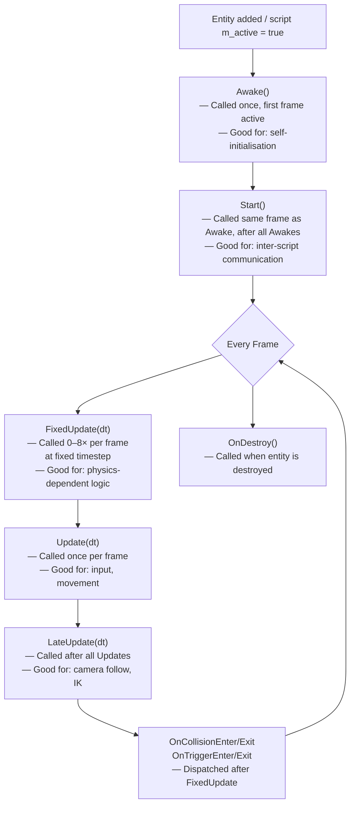
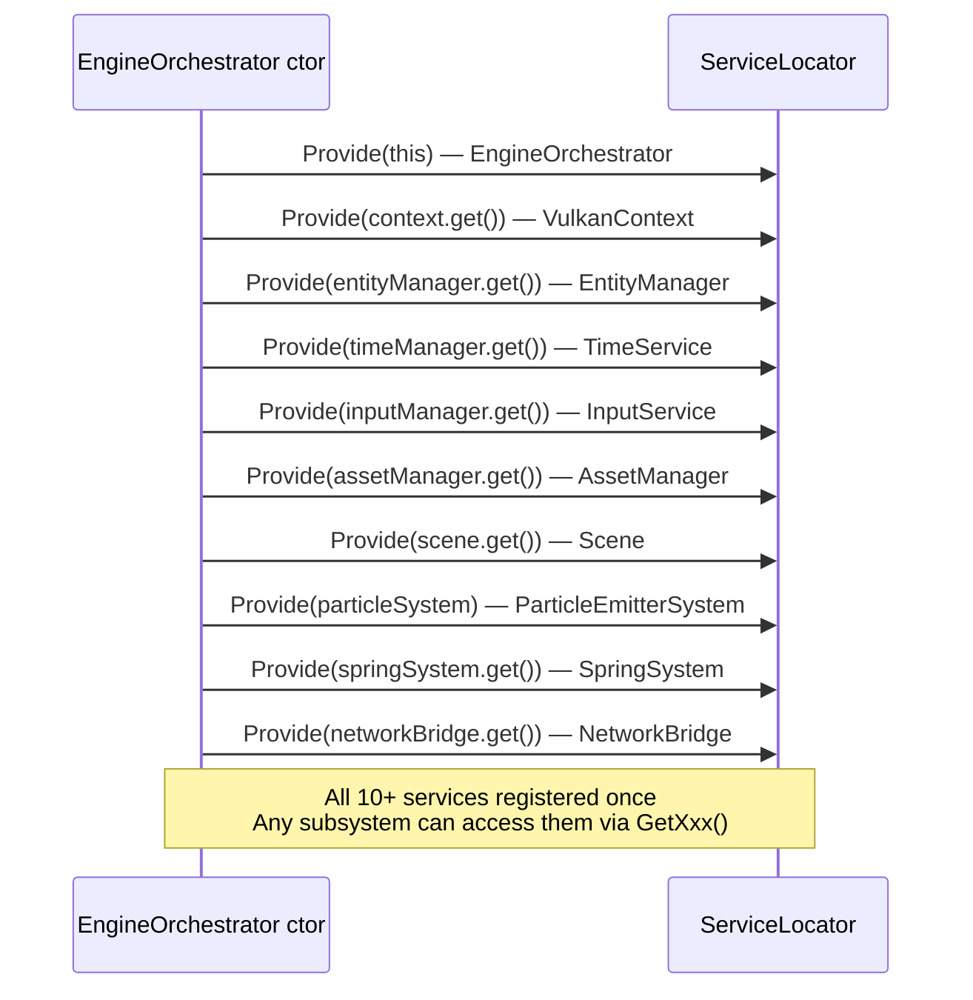

# Chapter 8 — Gameplay Scripting & Service Locator

## 8.1 Why a Scripting Layer?

ECS systems are powerful but impersonal: `PhysicsSystem` applies identical physics rules to **every** entity that has a `RigidBody`. There's no built-in way to say "entity 42 should jump when I press space, but entity 51 should patrol between two waypoints."

The engine provides a **per-entity C++ scripting layer** — a MonoBehaviour-style interface similar to Unity, but with no scripting language overhead. Scripts are pure C++20 classes compiled with the engine.

**Comparison to other approaches:**

| Approach | Pros | Cons |
|---------|------|------|
| Lua/Python scripting | Hot-reload, designer-friendly | Runtime overhead, FFI complexity |
| ECS system per behaviour | Fast, data-oriented | One system per unique behaviour = system explosion |
| **C++ GameScriptComponent** | Full C++ speed, familiar interface | Must recompile for changes |

---

## 8.2 GameScriptComponent: The Base Class

```cpp
// include/scripts/GameScriptComponent.h
namespace GE::Scripts {

class GameScriptComponent {
public:
    virtual ~GameScriptComponent() = default;

    // --- Lifecycle callbacks (called by ScriptSystem) ---

    virtual void Awake() {}    // Called once when entity first becomes active
    virtual void Start() {}    // Called immediately after Awake() on the same frame

    virtual void Update(float dt) {}        // Called every frame
    virtual void FixedUpdate(float dt) {}   // Called at fixed timestep (default ~60Hz)
    virtual void LateUpdate(float dt) {}    // Called after all Update() calls

    virtual void OnCollisionEnter(const CollisionInfo& info) {}
    virtual void OnCollisionExit(const CollisionInfo& info) {}
    virtual void OnTriggerEnter(GE::ECS::EntityID otherEntity) {}
    virtual void OnTriggerExit(GE::ECS::EntityID otherEntity) {}

    virtual void OnDestroy() {}            // Called when entity is about to be destroyed

    virtual void OnDrawInspector() {}      // Optional: add ImGui controls per entity
    virtual const char* GetScriptName() const { return "Script"; }

    // --- State ---
    bool m_active  { true };    // While false, no callbacks are fired
    bool m_started { false };   // Set to true after Awake+Start; do not touch directly

    // --- Convenience helpers (call ServiceLocator internally) ---
    GE::Components::Transform* GetTransform() const;    // Transform of this entity
    GE::ECS::EntityManager*    GetEntityManager() const;
    InputService*              GetInput() const;
    const std::string&         GetName() const;         // Entity Tag name
    GE::ECS::EntityID          GetEntityID() const;
};

} // namespace GE::Scripts
```

### Lifecycle Order



---

## 8.3 ScriptComponent: Attaching a Script to an Entity

```cpp
// include/components/ScriptComponent.h
namespace GE::Components {

struct ScriptComponent {
    std::shared_ptr<GE::Scripts::GameScriptComponent> script;
};

} // namespace GE::Components
```

**Why `shared_ptr`?**

When `em->AddComponent<ScriptComponent>(id, sc)` is called, `ComponentArray::Add` does a `push_back` copy of the struct. If `script` were a raw pointer or `unique_ptr`, the copy would be invalid. `shared_ptr` makes the copy a cheap reference count increment — both the caller and the packed array share ownership of the same script object.

### Attaching a script

```cpp
// In Scenario::OnLoad() or from another script:
EntityID playerID = em->CreateEntity();
em->AddComponent<GE::Components::Transform>(playerID, {});

em->AddComponent<GE::Components::ScriptComponent>(playerID, GE::Components::ScriptComponent{
    std::make_shared<PlayerControllerScript>()
});
```

### Writing a Script — Minimal Example

```cpp
// MyScript.h
#include "scripts/GameScriptComponent.h"
#include "core/ServiceLocator.h"

class PlayerControllerScript final : public GE::Scripts::GameScriptComponent {
public:
    const char* GetScriptName() const override { return "PlayerController"; }

    void Start() override {
        m_transform = GetTransform();
        m_input     = GetInput();
    }

    void Update(float dt) override {
        if (m_input->IsKeyHeld(GLFW_KEY_W)) {
            m_transform->m_position.z -= m_speed * dt;
        }
        if (m_input->IsKeyHeld(GLFW_KEY_S)) {
            m_transform->m_position.z += m_speed * dt;
        }
        if (m_input->IsKeyHeld(GLFW_KEY_A)) {
            m_transform->m_position.x -= m_speed * dt;
        }
        if (m_input->IsKeyHeld(GLFW_KEY_D)) {
            m_transform->m_position.x += m_speed * dt;
        }
    }

    void OnCollisionEnter(const GE::Scripts::CollisionInfo& info) override {
        // React to collision — info.otherEntityId, info.normal, info.impulse
        if (info.impulse > 5.0f) {
            // Big hit!
        }
    }

    void OnDrawInspector() override {
        ImGui::SliderFloat("Speed", &m_speed, 0.1f, 20.0f);
    }

private:
    GE::Components::Transform* m_transform { nullptr };
    InputService*              m_input     { nullptr };
    float                      m_speed     { 5.0f };
};
```

---

## 8.4 ScriptSystem: How Scripts Execute

`ScriptSystem` is an `ICpuSystem` at `ESystemStage::GameLogic`, so it runs every physics tick (fixed-step), not every render frame.

```cpp
// include/systems/ScriptSystem.h
class ScriptSystem final : public GE::ECS::ICpuSystem {
public:
    float m_fixedTimestep { 1.0f / 60.0f };   // ~60Hz fixed step (configurable via ImGui)

    explicit ScriptSystem(GE::Systems::PhysicsSystem* physicsSystem = nullptr);
    void OnUpdate(float dt) override;

    GE::ECS::ESystemStage GetStage() const override {
        return GE::ECS::ESystemStage::GameLogic;
    }

private:
    GE::Systems::PhysicsSystem* m_physicsSystem;

    float m_accumulator { 0.0f };
    static constexpr int MAX_FIXED_STEPS = 8;   // Spiral-of-death guard

    // Track which entities have been Awakened (Awake+Start called)
    std::unordered_set<GE::ECS::EntityID> m_awakenedEntities;

    // Collision contact sets (for OnCollisionEnter/Exit dispatch)
    GE::Scripts::ContactSet m_prevContacts;    // Solid contacts from last frame
    GE::Scripts::ContactSet m_prevTriggers;    // Trigger overlaps from last frame

    void RunFixedUpdate(float dt);
    void DispatchCollisionEvents();
};
```

### Per-Frame Execution

```cpp
// source/systems/ScriptSystem.cpp — OnUpdate() (pseudocode)
void ScriptSystem::OnUpdate(float dt) {
    auto* em = ServiceLocator::GetEntityManager();
    auto& scripts = em->GetCompArr<GE::Components::ScriptComponent>();

    // 1. Awake + Start for newly active scripts
    for (uint32_t i = 0; i < scripts.GetCount(); ++i) {
        EntityID eid    = scripts.Index()[i];
        auto& sc        = scripts.Data()[i];
        if (!sc.script || !sc.script->m_active) continue;

        if (m_awakenedEntities.find(eid) == m_awakenedEntities.end()) {
            sc.script->m_started = false;
            sc.script->Awake();
            sc.script->Start();
            sc.script->m_started = true;
            m_awakenedEntities.insert(eid);
        }
    }

    // 2. FixedUpdate (accumulator — same pattern as the physics loop)
    m_accumulator += dt;
    int steps = 0;
    while (m_accumulator >= m_fixedTimestep && steps < MAX_FIXED_STEPS) {
        RunFixedUpdate(m_fixedTimestep);
        m_accumulator -= m_fixedTimestep;
        ++steps;
    }

    // 3. Update — called once per physics tick for each active script
    for (uint32_t i = 0; i < scripts.GetCount(); ++i) {
        auto& sc = scripts.Data()[i];
        if (sc.script && sc.script->m_active && sc.script->m_started) {
            sc.script->Update(dt);
        }
    }

    // 4. LateUpdate — after all Updates
    for (uint32_t i = 0; i < scripts.GetCount(); ++i) {
        auto& sc = scripts.Data()[i];
        if (sc.script && sc.script->m_active && sc.script->m_started) {
            sc.script->LateUpdate(dt);
        }
    }

    // 5. Collision events (set-diff against prev-frame contacts)
    DispatchCollisionEvents();

    // 6. OnDestroy for entities removed this frame
    // (EntityManager notifies systems before destruction)
}
```

### Collision Event Dispatch

`ScriptSystem` reads the current frame's contact set from `PhysicsSystem` and diffs it against the previous frame's contacts:

```cpp
void ScriptSystem::DispatchCollisionEvents() {
    if (!m_physicsSystem) return;
    const auto& currentContacts = m_physicsSystem->GetCurrentContacts();

    // OnCollisionEnter: contacts in current but not in prev
    for (const auto& contact : currentContacts) {
        if (m_prevContacts.find(contact) == m_prevContacts.end()) {
            // New contact this frame → fire OnCollisionEnter
            auto* sc = getScript(contact.entityA);
            if (sc) sc->OnCollisionEnter({ contact.entityB, contact.normal, contact.impulse });
            // ... and for entityB too
        }
    }

    // OnCollisionExit: contacts in prev but not in current
    for (const auto& contact : m_prevContacts) {
        if (currentContacts.find(contact) == currentContacts.end()) {
            // Contact ended → fire OnCollisionExit
            auto* sc = getScript(contact.entityA);
            if (sc) sc->OnCollisionExit({ contact.entityB, contact.normal, 0.0f });
        }
    }

    m_prevContacts = currentContacts;
}
```

---

## 8.5 Service Locator Pattern

### The Problem

Systems and scripts need access to shared engine services: `EntityManager`, `InputService`, `AssetManager`, etc. Passing these as constructor parameters to every class creates deep dependency chains:

```cpp
// Bad: deep dependency injection
PhysicsSystem(EntityManager* em, TimeService* time, ...);
FlockingSystem(EntityManager* em, PerformanceTracker* perf, ...);
PlayerScript(EntityManager* em, InputService* input, AssetManager* am, ...);
```

With 12+ services, every constructor signature becomes unwieldy.

### The Solution: Static Service Registry

```cpp
// include/core/ServiceLocator.h
class ServiceLocator final {
public:
    // Providers — called at engine startup in EngineOrchestrator constructor
    static void Provide(GE::Graphics::VulkanContext*        context);
    static void Provide(GE::ECS::EntityManager*             em);
    static void Provide(InputService*                       input);
    static void Provide(GE::Assets::AssetManager*           am);
    static void Provide(TimeService*                        time);
    static void Provide(GE::Systems::ParticleEmitterSystem* particles);
    static void Provide(GE::Systems::SpringSystem*          springs);
    static void Provide(GE::NetworkBridge*                  bridge);
    static void Provide(EngineOrchestrator*                 orchestrator);
    static void Provide(GE::Scene::Scene*                   scene);
    // ... (12+ services total)

    // Retrievers — called anywhere in the codebase
    static GE::Graphics::VulkanContext*  GetContext();
    static GE::ECS::EntityManager*       GetEntityManager();
    static InputService*                 GetInput();
    static GE::Assets::AssetManager*     GetAssetManager();
    static TimeService*                  GetTimeManager();
    static GE::NetworkBridge*            GetNetworkBridge();
    static EngineOrchestrator*           GetExperience();
    // ... etc.

private:
    // All static inline members — zero-cost abstraction
    static inline GE::Graphics::VulkanContext*        m_context         { nullptr };
    static inline GE::ECS::EntityManager*             m_entityManager   { nullptr };
    static inline InputService*                       m_input           { nullptr };
    static inline GE::Assets::AssetManager*           m_assetManager    { nullptr };
    // ...
};
```

### Registration at Startup



### Usage from Any Subsystem

```cpp
// In a physics system:
auto* em = ServiceLocator::GetEntityManager();

// In a script:
auto* input = ServiceLocator::GetInput();
bool jumpPressed = input->IsKeyPressed(GLFW_KEY_SPACE);

// In FBSceneAdapter:
auto* am = ServiceLocator::GetAssetManager();
auto meshPtr = am->processMeshData(meshData, material, uploadCtx);

// In NetworkBridge:
ServiceLocator::GetExperience()->requestScenarioChange("new_scene.bin");
```

### Safety Guarantee

Getters throw `std::runtime_error` if the service hasn't been provided:

```cpp
static GE::ECS::EntityManager* GetEntityManager() {
    if (m_entityManager == nullptr)
        throw std::runtime_error("ServiceLocator: EntityManager not provided!");
    return m_entityManager;
}
```

This makes missing registrations immediately obvious (crash with message at startup), not silent null-pointer dereferences deep in a system.

### Trade-offs

| Benefit | Trade-off |
|---------|-----------|
| Zero-ceremony access | Global state (hidden dependencies) |
| No constructor boilerplate | Harder to unit test (no injection) |
| All services in one registry | Services are non-owning (lifetime managed elsewhere) |

For an engine codebase where subsystem lifetimes are fully controlled by `EngineOrchestrator`, the trade-offs are acceptable. Avoid this pattern in application-level business logic.

---

## 8.6 Writing Your Own Script: Step-by-Step Guide

1. Create a `.h` file in your feature area:
```cpp
#pragma once
#include "scripts/GameScriptComponent.h"

class MyBehaviourScript final : public GE::Scripts::GameScriptComponent {
public:
    const char* GetScriptName() const override { return "MyBehaviour"; }

    void Start() override {
        // Get references to things you'll use every frame
        m_transform = GetTransform();
        m_input     = GetInput();
    }

    void Update(float dt) override {
        // Your per-frame logic here
    }

    void OnDrawInspector() override {
        // Optional: expose fields to ImGui
        ImGui::SliderFloat("Speed", &m_speed, 0.0f, 20.0f);
    }

private:
    GE::Components::Transform* m_transform { nullptr };
    InputService*              m_input     { nullptr };
    float m_speed { 5.0f };
};
```

2. Attach it to an entity (typically in `Scenario::OnLoad()`):
```cpp
EntityID id = em->CreateEntity();
em->AddComponent<GE::Components::Transform>(id, {});
em->AddComponent<GE::Components::ScriptComponent>(id,
    GE::Components::ScriptComponent{ std::make_shared<MyBehaviourScript>() });
```

3. Make sure `ScriptSystem` is registered for the scenario:
```cpp
// In FlatBuffersScenario::OnLoad(), ScriptSystem is always registered.
// For GenericScenario, it's added in OnLoad() alongside PhysicsSystem.
```

4. Build the project (`Ctrl+Shift+B` in Visual Studio) and run.

---

---

## 8.7 Trigger Volumes

### What Is a Trigger?

A **trigger volume** is a collider that detects overlap with other objects but does **not** push them away. Instead of applying forces, it fires events — `OnTriggerEnter` when an object enters the volume, and `OnTriggerExit` when it leaves.

Common uses:
- A checkpoint zone that registers a lap time when a player drives through it
- A door that opens when the player approaches
- A danger area that applies a heat effect to every entity inside it

### Enabling a Trigger

Any collider (except `PlaneCollider`) can become a trigger by setting `isTrigger = true`. The field is exposed in the entity inspector:

```
Entity Inspector — SphereCollider
  [v] Sphere Collider
      Radius: [0.180]
      Is Trigger: [✓]      ← tick this box
```

Supported collider types with `isTrigger`:
- `SphereCollider` ✓
- `BoxCollider` ✓
- `CapsuleCollider` ✓
- `CylinderCollider` ✓
- `PlaneCollider` ✗ (planes are used as infinite floors/walls; trigger semantics don't apply)

### How PhysicsSystem Handles Triggers

All 12 collision passes in `PhysicsSystem::ResolveCollisions()` follow the same pattern:

```cpp
// source/systems/PhysicsSystem.cpp — same guard in every collision pass
if (aCol.isTrigger || bCol.isTrigger) {
    // Record the contact pair — but apply NO impulse, NO positional correction
    GE::Scripts::EntityPair pair { std::min(aID, bID), std::max(aID, bID) };
    m_currentTriggers.insert(pair);
    continue;   // Skip all physics response for this pair
}
```

`m_currentTriggers` is a `std::unordered_set<EntityPair>` populated fresh every tick. It's passed to `ScriptSystem` for event dispatch.

### How ScriptSystem Dispatches Events

`ScriptSystem` uses **set-difference** between the current frame's trigger contacts and the previous frame's:

```cpp
// source/systems/ScriptSystem.cpp — DispatchCollisionEvents()
const auto& currentTriggers = m_physicsSystem->GetCurrentTriggers();

// --- OnTriggerEnter: pairs that appear this frame but weren't there last frame ---
for (const auto& pair : currentTriggers) {
    if (m_prevTriggers.find(pair) == m_prevTriggers.end()) {
        FireTriggerEnter(pair.first,  pair.second);   // Script on A: "B entered"
        FireTriggerEnter(pair.second, pair.first);    // Script on B: "A entered"
    }
}

// --- OnTriggerExit: pairs present last frame but gone this frame ---
for (const auto& pair : m_prevTriggers) {
    if (currentTriggers.find(pair) == currentTriggers.end()) {
        FireTriggerExit(pair.first,  pair.second);
        FireTriggerExit(pair.second, pair.first);
    }
}

m_prevTriggers = currentTriggers;   // Remember for next frame
```

This gives exactly-once `Enter` at the moment of first overlap, and exactly-once `Exit` at the moment of separation — regardless of how many frames the overlap lasts.

### Writing a Trigger Script

```cpp
// Example: a zone that logs which entity entered it
class CheckpointScript final : public GE::Scripts::GameScriptComponent {
public:
    const char* GetScriptName() const override { return "Checkpoint"; }

    void OnTriggerEnter(GE::ECS::EntityID other) override {
        // 'other' is the EntityID of whatever just entered this trigger volume
        auto* em  = GetEntityManager();
        auto* tag = em->TryGetTIComponent<GE::Components::Tag>(other);
        const std::string name = tag ? tag->m_name : std::to_string(other);
        GE_LOG_INFO("Checkpoint reached by: " + name);
    }

    void OnTriggerExit(GE::ECS::EntityID other) override {
        GE_LOG_INFO("Entity " + std::to_string(other) + " left checkpoint");
    }
};
```

### Full Setup: Trigger Zone with a Script

```cpp
// In FlatBuffersScenario::OnLoad() or in a scene JSON adapter —
// create an entity that acts as an invisible trigger zone:

const GE::ECS::EntityID zoneID = em->CreateEntity();

// Transform: position the zone in world space
GE::Components::Transform tr;
tr.m_localPosition = glm::vec3(5.0f, 1.0f, 0.0f);
tr.m_worldPosition = tr.m_localPosition;
tr.m_worldMatrix   = glm::translate(glm::mat4(1.0f), tr.m_localPosition);
em->AddComponent(zoneID, tr);

// Collider: a sphere with isTrigger=true — no mesh, invisible
em->AddComponent(zoneID, GE::Components::SphereCollider{ 2.0f, true /* isTrigger */ });

// Script: attach the checkpoint behaviour
auto script = std::make_shared<CheckpointScript>();
script->SetEntityID(zoneID);
em->AddComponent(zoneID, GE::Components::ScriptComponent{ std::move(script) });
```

No `RigidBody` is needed — the trigger zone is stationary and has no physics mass. No `MeshRenderer` is needed — it's invisible. The `SphereCollider` with `isTrigger=true` is the only requirement for detection to work.

### Trigger vs. Collision: Summary

| Property | `isTrigger = false` | `isTrigger = true` |
|----------|---------------------|---------------------|
| Overlap detected? | ✓ | ✓ |
| Positional correction? | ✓ (pushed apart) | ✗ |
| Velocity impulse? | ✓ | ✗ |
| `OnCollisionEnter/Exit` fired? | ✓ (if script present) | ✗ |
| `OnTriggerEnter/Exit` fired? | ✗ | ✓ (if script present) |
| Can walk through? | ✗ (blocked) | ✓ (passes through) |

---

*Next: [Chapter 9 — Animation & Spawning](09_Animation_Spawning.md)*
