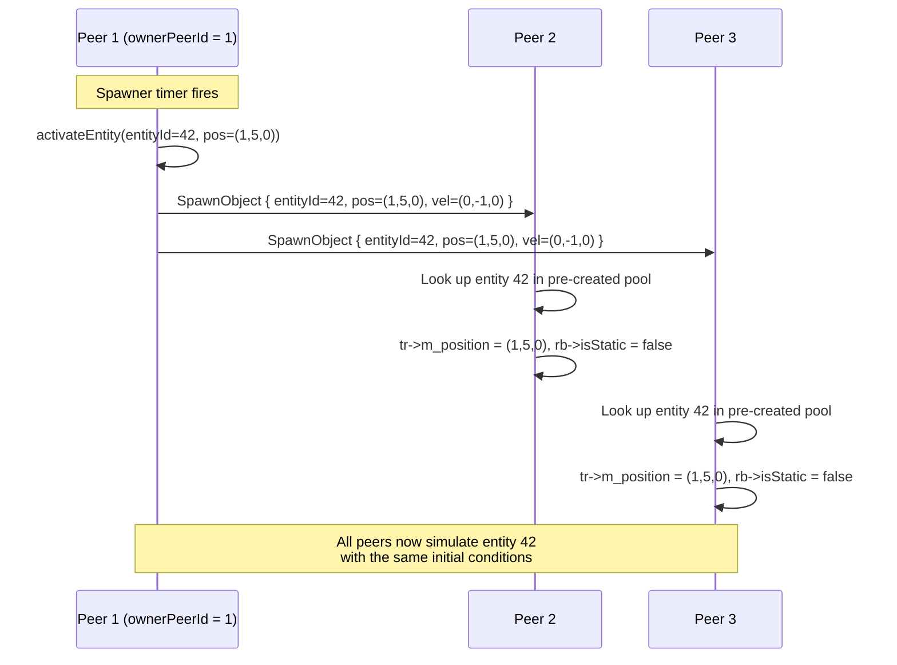

# Chapter 9 — Animation System & Spawner System

---

# Part A: Animation System

## 9.1 Waypoint-Based Animation

The animation system drives objects along predefined **waypoints** — a sequence of positions and rotations, each with a timestamp. The object interpolates smoothly between consecutive waypoints as time advances.

This is a purely kinematic system — animated objects move along their path regardless of physics forces. Other physics bodies can collide with them (they register as kinematic bodies), but the animated object's position is always driven by the waypoint curve.

### AnimatedObjectComponent

```cpp
// include/components/AnimationComponents.h
namespace GE::Components {

enum class EasingType : uint8_t {
    LINEAR,      // Constant velocity between waypoints
    SMOOTHSTEP   // S-curve: ease in and ease out at each waypoint
};

enum class PathMode : uint8_t {
    STOP,    // Play once, hold at last waypoint
    LOOP,    // Loop back to the first waypoint when done
    REVERSE  // Ping-pong: play forward then backward alternately
};

struct FBWaypoint {
    glm::vec3 position { 0.0f };    // World-space position at this waypoint
    glm::vec3 rotDeg   { 0.0f };   // Euler angles (yaw, pitch, roll) in degrees
    float     time     { 0.0f };    // Time (seconds) to reach this waypoint
};

struct AnimatedObjectComponent {
    std::vector<FBWaypoint> waypoints;
    float        totalDuration { 1.0f };   // Full cycle duration (seconds)
    EasingType   easing        { EasingType::LINEAR };
    PathMode     pathMode      { PathMode::STOP };

    // Runtime state (updated by AnimationSystem each tick)
    float     elapsed      { 0.0f };   // Current playback time
    glm::vec3 prevPosition { 0.0f };   // Position before this tick (for kinematic velocity)
    bool      reversed     { false };  // REVERSE mode: are we playing backward?
};

} // namespace GE::Components
```

---

## 9.2 Waypoint Interpolation

Given the current `elapsed` time, `AnimationSystem` finds the two surrounding waypoints and linearly interpolates between them:

```cpp
// source/systems/AnimationSystem.cpp — OnUpdate() (simplified)
void AnimationSystem::OnUpdate(float dt) {
    auto* em = ServiceLocator::GetEntityManager();
    auto& animComps = em->GetCompArr<GE::Components::AnimatedObjectComponent>();

    for (uint32_t i = 0; i < animComps.GetCount(); ++i) {
        auto& ac   = animComps.Data()[i];
        EntityID eid = animComps.Index()[i];
        auto* tr   = em->GetTIComponent<GE::Components::Transform>(eid);
        if (!tr || ac.waypoints.size() < 2) continue;

        // Store previous position so physics can compute kinematic velocity
        ac.prevPosition = tr->m_position;

        // Advance time (respecting path mode)
        advanceTime(ac, dt);

        // Find which segment we're in
        const FBWaypoint* prev = &ac.waypoints[0];
        const FBWaypoint* next = &ac.waypoints[1];

        for (std::size_t w = 1; w < ac.waypoints.size(); ++w) {
            if (ac.elapsed <= ac.waypoints[w].time) {
                prev = &ac.waypoints[w - 1];
                next = &ac.waypoints[w];
                break;
            }
        }

        // t = normalised progress within this segment [0, 1]
        float segDuration = next->time - prev->time;
        float t = (segDuration > 0.0f)
                ? (ac.elapsed - prev->time) / segDuration
                : 0.0f;
        t = glm::clamp(t, 0.0f, 1.0f);

        // Apply easing to t
        float easedT = applyEasing(t, ac.easing);

        // Interpolate position and rotation
        tr->m_position = glm::mix(prev->position, next->position, easedT);
        tr->m_rotation = glm::mix(prev->rotDeg,   next->rotDeg,   easedT);
    }
}
```

---

## 9.3 Easing Functions

Easing functions remap the linear `t` parameter to a non-linear curve, creating the perception of acceleration and deceleration.

**LINEAR** — no remapping:

```
t → t
```

**SMOOTHSTEP** — cubic Hermite S-curve:

```
t → t² * (3 - 2t)
```

```cpp
float applyEasing(float t, EasingType easing) {
    switch (easing) {
    case EasingType::LINEAR:
        return t;
    case EasingType::SMOOTHSTEP:
        // Hermite: smooth start and end, flat in the middle
        return t * t * (3.0f - 2.0f * t);
    }
    return t;
}
```

```
LINEAR:           SMOOTHSTEP (S-curve):
t ↑               t ↑
1 │      /        1 │    ╭──
  │     /           │   /
  │    /            │  /
  │   /             │ /
0 └──────→ t      0 └──╯───→ t
  0       1          0       1
```

With SMOOTHSTEP, objects appear to ease in (accelerate from rest) and ease out (decelerate to a stop) at each waypoint, which looks much more natural for platform animation.

---

## 9.4 Path Modes

```cpp
// source/systems/AnimationSystem.cpp — advanceTime()
void AnimationSystem::advanceTime(GE::Components::AnimatedObjectComponent& ac, float dt) {
    float speed = (ac.reversed) ? -1.0f : 1.0f;
    ac.elapsed += speed * dt;

    switch (ac.pathMode) {
    case PathMode::STOP:
        // Clamp to [0, totalDuration] — hold at the end
        ac.elapsed = glm::clamp(ac.elapsed, 0.0f, ac.totalDuration);
        break;

    case PathMode::LOOP:
        // Wrap around: when elapsed exceeds duration, restart from 0
        while (ac.elapsed >= ac.totalDuration) ac.elapsed -= ac.totalDuration;
        while (ac.elapsed < 0.0f)              ac.elapsed += ac.totalDuration;
        break;

    case PathMode::REVERSE:
        // Ping-pong: flip direction at each end
        if (ac.elapsed >= ac.totalDuration) {
            ac.elapsed   = ac.totalDuration;
            ac.reversed  = true;   // Start playing backward
        }
        if (ac.elapsed <= 0.0f) {
            ac.elapsed   = 0.0f;
            ac.reversed  = false;  // Start playing forward again
        }
        break;
    }
}
```

| Mode | Behaviour | Use Case |
|------|-----------|---------|
| STOP | Object arrives at final waypoint and stays | Cinematic sequences, one-time events |
| LOOP | Object teleports back to start | Conveyor belts, patrol loops |
| REVERSE | Object ping-pongs back and forth | Elevator platforms, oscillating objects |

---

## 9.5 Kinematic Velocity for Collision

The `AnimationSystem` stores `prevPosition` so that the `PhysicsSystem` can compute the kinematic velocity of the platform — used when a physics body collides with a moving platform:

```cpp
// PhysicsSystem — when sphere collides with animated platform:
if (auto* ac = em->GetTIComponent<AnimatedObjectComponent>(platformID)) {
    // Kinematic velocity ≈ displacement per physics tick
    glm::vec3 kinematicVel = (ac->prevPosition - tr->m_position) / (-dt);
    //                         ↑ negative because prevPosition is BEFORE the update

    // Add platform velocity to the ball's impulse calculation
    vRel = dot(ballVel - kinematicVel, n);
    // ... standard impulse formula
}
```

This makes the ball pick up the platform's velocity when bouncing off it — without the platform having a `RigidBody`.

---

# Part B: Spawner System

## 9.6 Entity Pooling: Zero Runtime Allocation

The spawner system pre-creates all entities at scene load time. At runtime, "spawning" an entity just means: **change its position, mark it active, release it into the physics simulation**. No GPU buffer uploads, no component registration, no memory allocation.

This is important because:
1. `vkCreateBuffer` (GPU memory allocation) is expensive — must not happen mid-frame
2. `EntityManager::AddComponent` may trigger `ComponentArray` resize — potential frame spike
3. Pre-created entities have consistent `EntityID` values — needed for networked spawn sync

### SpawnerComponent

```cpp
// include/components/AnimationComponents.h
namespace GE::Components {

enum class SpawnLocType : uint8_t {
    FIXED,         // Always spawn at fixedPos
    RANDOM_BOX,    // Uniform random in [boxMin, boxMax]
    RANDOM_SPHERE  // Uniform random inside sphere
};

struct SpawnerComponent {
    // --- Timing ---
    float startTime         { 0.0f };  // Delay before first spawn (seconds from scene start)
    float elapsed           { 0.0f };  // Accumulated scene time
    float timeSinceLastSpawn { 0.0f };

    // --- Spawn type ---
    bool     isBurst    { true };   // true = one-time burst; false = continuous interval
    uint32_t burstCount { 1 };      // Number of entities to activate in a burst
    float    interval   { 1.0f };   // Seconds between repeating spawns

    // --- Location ---
    SpawnLocType locationType { SpawnLocType::FIXED };
    glm::vec3    fixedPos     { 0.0f };
    glm::vec3    boxMin       { -1.0f };
    glm::vec3    boxMax       {  1.0f };
    glm::vec3    sphereCenter { 0.0f };
    float        sphereRadius { 1.0f };

    // --- Initial velocity ranges ---
    glm::vec3 linVelMin { 0.0f };
    glm::vec3 linVelMax { 0.0f };
    glm::vec3 angVelMin { 0.0f };
    glm::vec3 angVelMax { 0.0f };

    // --- Ownership (networking) ---
    uint8_t ownerPeerId { 0 };   // 0 = all peers; 1–4 = specific peer only

    // --- Pre-created entity pool ---
    std::deque<GE::ECS::EntityID> pendingIds;   // IDs of dormant entities
    bool activated { false };    // Burst: fire-once guard; Repeating: first-tick marker
};

} // namespace GE::Components
```

---

## 9.7 Scene Load: Pre-Creating the Pool

`FBSceneAdapter::adaptSpawners()` is called during scene load. For each spawner:

1. Parse spawn configuration from FlatBuffers
2. Create `burstCount` (or `maxCount`) entities with full components (Transform, RigidBody, MeshRenderer)
3. Mark each entity `isStatic = true` and position it off-screen (e.g. y = -9999)
4. Store their IDs in `SpawnerComponent::pendingIds`

```cpp
// source/scene/fb/FBSceneAdapter.cpp — adaptSpawners() (simplified)
for (const auto* sp : *scene->spawners()) {
    EntityID spawnerID = em->CreateEntity();
    GE::Components::SpawnerComponent sc;

    sc.isBurst     = (sp->spawn_type() == Simulation::SpawnType::SingleBurst);
    sc.burstCount  = sp->burst_count();
    sc.interval    = sp->interval();
    sc.startTime   = sp->start_time();
    sc.ownerPeerId = static_cast<uint8_t>(sp->owner_peer_id());
    // ... other fields

    // Pre-create N dormant entities
    uint32_t poolSize = sc.isBurst ? sc.burstCount : sp->max_pool_size();
    for (uint32_t k = 0; k < poolSize; ++k) {
        EntityID id = em->CreateEntity();

        // Add a Transform (dormant position, off-screen)
        GE::Components::Transform tr;
        tr.m_position = glm::vec3{ 0.0f, -9999.0f, 0.0f };
        em->AddComponent(id, tr);

        // Add a RigidBody, initially static (no physics)
        GE::Components::RigidBody rb;
        rb.mass         = computeMassFromShape(sp);
        rb.inverseMass  = 1.0f / rb.mass;
        rb.isStatic     = true;       // Excluded from physics until activated
        rb.useGravity   = false;
        em->AddComponent(id, rb);

        // Add MeshRenderer (geometry already uploaded at scene load)
        attachMeshRenderer(id, sp, ctx);

        sc.pendingIds.push_back(id);
    }

    em->AddComponent(spawnerID, sc);
}
```

---

## 9.8 Runtime: Activating Entities

`SpawnerSystem::OnUpdate()` checks timing each physics tick and activates entities when their time arrives:

```cpp
// source/systems/SpawnerSystem.cpp — OnUpdate() (simplified)
void SpawnerSystem::OnUpdate(float dt) {
    auto* em  = ServiceLocator::GetEntityManager();
    auto* bridge = ServiceLocator::GetNetworkBridge();
    const bool netActive    = bridge && bridge->GetService() && bridge->GetService()->IsConnected();
    const uint8_t localPeer = netActive ? bridge->GetService()->GetLocalPeerId() : 0U;

    auto& spawners = em->GetCompArr<GE::Components::SpawnerComponent>();

    for (uint32_t i = 0; i < spawners.GetCount(); ++i) {
        auto& sc     = spawners.Data()[i];
        EntityID eid = spawners.Index()[i];

        sc.elapsed += dt;

        // Check ownership gate
        if (netActive && sc.ownerPeerId != 0U && sc.ownerPeerId != localPeer) {
            continue;   // Remote peer owns this spawner — they fire it, we receive SpawnObject packet
        }

        if (sc.elapsed < sc.startTime) continue;

        if (sc.isBurst) {
            // --- Burst Mode: fire once ---
            if (!sc.activated && !sc.pendingIds.empty()) {
                sc.activated = true;
                uint32_t count = std::min(sc.burstCount,
                                          static_cast<uint32_t>(sc.pendingIds.size()));
                for (uint32_t k = 0; k < count; ++k) {
                    activateEntity(em, sc, bridge);
                }
            }
        } else {
            // --- Repeating Mode: fire every interval ---
            sc.timeSinceLastSpawn += dt;
            if (!sc.activated) { sc.activated = true; }

            while (sc.timeSinceLastSpawn >= sc.interval && !sc.pendingIds.empty()) {
                sc.timeSinceLastSpawn -= sc.interval;
                activateEntity(em, sc, bridge);
            }
        }
    }
}
```

### Activating a Single Entity

```cpp
void SpawnerSystem::activateEntity(GE::ECS::EntityManager* em,
                                   GE::Components::SpawnerComponent& sc,
                                   GE::NetworkBridge* bridge)
{
    if (sc.pendingIds.empty()) return;

    EntityID id = sc.pendingIds.front();
    sc.pendingIds.pop_front();

    auto* tr = em->TryGetTIComponent<GE::Components::Transform>(id);
    auto* rb = em->TryGetTIComponent<GE::Components::RigidBody>(id);
    if (!tr || !rb) return;

    // 1. Set position
    tr->m_position = pickLocation(sc);

    // 2. Enable physics
    rb->isStatic   = false;
    rb->useGravity = true;
    rb->velocity   = randomInRange(sc.linVelMin, sc.linVelMax);
    rb->angularVelocity = glm::radians(randomInRange(sc.angVelMin, sc.angVelMax));

    // 3. Broadcast to peers if networked
    if (bridge && bridge->GetService() && bridge->GetService()->IsConnected()) {
        bridge->BroadcastSpawnObject(id, sc.ownerPeerId, 0,
                                     tr->m_position, glm::vec3{1.0f},
                                     rb->velocity, rb->mass);
    }
}
```

---

## 9.9 Spawn Location Modes

### FIXED

Always spawn at the same point — use for fountains, targeted drops:

```cpp
case SpawnLocType::FIXED:
    return sc.fixedPos;
```

### RANDOM_BOX

Uniform random point inside an axis-aligned box:

```cpp
case SpawnLocType::RANDOM_BOX: {
    std::uniform_real_distribution<float> dx(sc.boxMin.x, sc.boxMax.x);
    std::uniform_real_distribution<float> dy(sc.boxMin.y, sc.boxMax.y);
    std::uniform_real_distribution<float> dz(sc.boxMin.z, sc.boxMax.z);
    return glm::vec3{ dx(m_rng), dy(m_rng), dz(m_rng) };
}
```

### RANDOM_SPHERE

Uniform random point **inside** a sphere. Naively using `r = rand() * radius` would cluster points at the centre. The cube-root trick gives uniform volume distribution:

```cpp
case SpawnLocType::RANDOM_SPHERE: {
    std::uniform_real_distribution<float> uniform(0.0f, 1.0f);

    float u     = uniform(m_rng);
    float v     = uniform(m_rng);
    float theta = 2.0f * glm::pi<float>() * u;             // Azimuth angle
    float phi   = std::acos(1.0f - 2.0f * v);              // Elevation angle

    // cbrt gives uniform distribution in volume (not just surface)
    float r = sc.sphereRadius * std::cbrt(uniform(m_rng));

    return sc.sphereCenter + glm::vec3{
        r * std::sin(phi) * std::cos(theta),
        r * std::cos(phi),
        r * std::sin(phi) * std::sin(theta)
    };
}
```

**Why `cbrt`?** In a sphere, the volume grows as r³. To uniformly sample volume, we need `r = R * ∛(u)` where u is uniform on [0,1]. Without this, the point density would be `3u²` — concentrated near the centre.

---

## 9.10 Networked Spawning

When `ownerPeerId > 0`, only the owning peer fires the spawner. Other peers receive a `SpawnObject` packet and activate the matching entity:



**Requirement:** All peers must have loaded the same scene file (same pre-created entity pool). This is enforced by the scene-change sync protocol (see Chapter 7).

---

## 9.11 Summary: Animation vs. Physics vs. Spawner

| System | Entity Control | Physics Interaction | NetworkSync |
|--------|---------------|--------------------|--------------------|
| `AnimationSystem` | Waypoint script (kinematic) | Passive collision surface; provides kinematic velocity | None (local only) |
| `PhysicsSystem` | Force/impulse (dynamic) | Full impulse response | Via `NetworkBridge::BroadcastOwnedStates` |
| `SpawnerSystem` | Timed activation | Enables physics on activation | `SpawnObject` packet to peers |

---

*This concludes the Technical Manual.*

*Return to: [README — Index](README.md)*
