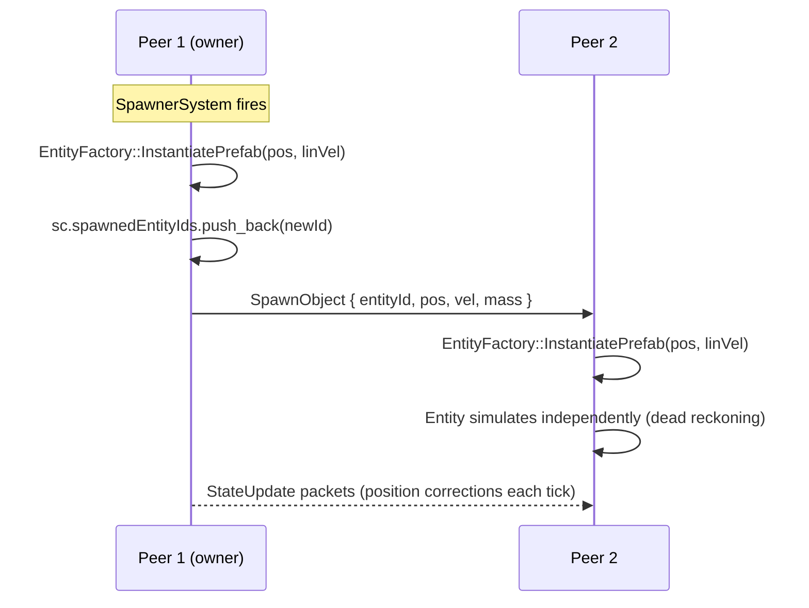

# Chapter 9 — Animation System & Spawner System

---

# Part A: Animation System

## 9.1 Waypoint-Based Animation

The animation system drives objects along predefined **waypoints** — a sequence of positions and rotations, each with a timestamp. The object interpolates smoothly between consecutive waypoints as time advances.

This is a purely kinematic system — animated objects move along their path regardless of physics forces. Other physics bodies can collide with them (they register as kinematic bodies), but the animated object's position is always driven by the waypoint curve.

### AnimatedObjectComponent

```cpp
// include/components/AnimationComponent.h
namespace GE::Components {

enum class EasingType : uint8_t {
    LINEAR,      // Constant velocity between waypoints
    SMOOTHSTEP   // S-curve: ease in and ease out at each waypoint
};

enum class PathMode : uint8_t {
    STOP,    // Play once, hold at last waypoint
    LOOP,    // Loop back to the first waypoint when done
    REVERSE  // Ping-pong: play forward then backward alternately
};

struct FBWaypoint {
    glm::vec3 position { 0.0f };    // Local-space position at this waypoint
    glm::vec3 rotDeg   { 0.0f };   // Euler angles (yaw, pitch, roll) in degrees
    float     time     { 0.0f };    // Time (seconds) to reach this waypoint
};

struct AnimatedObjectComponent {
    std::vector<FBWaypoint> waypoints;
    float        totalDuration { 1.0f };   // Full cycle duration (seconds)
    EasingType   easing        { EasingType::LINEAR };
    PathMode     pathMode      { PathMode::STOP };

    // Runtime state (updated by AnimationSystem each tick)
    float     elapsed      { 0.0f };   // Current playback time
    glm::vec3 prevPosition { 0.0f };   // Position before this tick (for kinematic velocity)
    bool      reversed     { false };  // REVERSE mode: are we playing backward?
};

} // namespace GE::Components
```

---

## 9.2 Waypoint Interpolation

Given the current `elapsed` time, `AnimationSystem` finds the two surrounding waypoints and linearly (or smoothly) interpolates between them. Because animated platforms are root entities, `m_localPosition` equals `m_worldPosition` — but the system writes only the local field to stay consistent with the dual-transform convention.

```cpp
// source/systems/AnimationSystem.cpp — OnUpdate() key lines
void AnimationSystem::OnUpdate(float dt) {
    for each AnimatedObjectComponent ac {
        auto* tr = em->TryGetTIComponent<GE::Components::Transform>(id);

        // Store previous position so PhysicsSystem can compute kinematic velocity
        ac.prevPosition = tr->m_localPosition;

        // Advance time, find segment, compute eased t...

        // Write result to local fields and mark Dirty
        tr->m_localPosition = pos;
        tr->m_localRotation = rot;
        tr->m_state = GE::Components::Transform::TransformState::Dirty;
    }
}
```

TransformSystem (stage 1, which runs before Animation at stage 2) will pick up the Dirty flag next tick and rebuild the world matrix from the new local position.

---

## 9.3 Easing Functions

Easing functions remap the linear `t` parameter to a non-linear curve, creating the perception of acceleration and deceleration.

**LINEAR** — no remapping:

```
t → t
```

**SMOOTHSTEP** — cubic Hermite S-curve:

```
t → t² * (3 - 2t)
```

```cpp
float applyEasing(float t, EasingType easing) {
    switch (easing) {
    case EasingType::LINEAR:
        return t;
    case EasingType::SMOOTHSTEP:
        return t * t * (3.0f - 2.0f * t);
    }
    return t;
}
```

```
LINEAR:           SMOOTHSTEP (S-curve):
t ↑               t ↑
1 │      /        1 │    ╭──
  │     /           │   /
  │    /            │  /
  │   /             │ /
0 └──────→ t      0 └──╯───→ t
  0       1          0       1
```

With SMOOTHSTEP, objects appear to ease in and ease out at each waypoint, which looks much more natural for platform animation.

---

## 9.4 Path Modes

| Mode | Behaviour | Use Case |
|------|-----------|---------|
| STOP | Object arrives at final waypoint and stays | Cinematic sequences, one-time events |
| LOOP | Object wraps back to start | Conveyor belts, patrol loops |
| REVERSE | Object ping-pongs back and forth | Elevator platforms, oscillating objects |

---

## 9.5 Kinematic Velocity for Collision

The `AnimationSystem` stores `prevPosition` so that the `PhysicsSystem` can compute the kinematic velocity of the platform — used when a physics body collides with a moving platform:

```cpp
// PhysicsSystem — when sphere collides with animated plane:
const auto* aoc = em->TryGetTIComponent<GE::Components::AnimatedObjectComponent>(pID);
if (aoc && pTrans && m_lastDt > 1e-6f) {
    planeVel = (pTrans->m_worldPosition - aoc->prevPosition) / m_lastDt;
}
// planeVel enters the relative-velocity calculation for the impulse formula
```

Note that `prevPosition` is stored from `m_localPosition` (before the animation tick writes a new position), and then compared against `m_worldPosition` (set by TransformSystem pass 3 this frame). For root animated entities these are equal, so the kinematic velocity is correct.

---

# Part B: Spawner System

## 9.6 Design: Runtime Prefab Instantiation

The spawner system creates **real ECS entities at runtime** from a **PrefabTemplate** blueprint. This is the industry-standard approach used in Unity, Unreal, and Godot — "instantiate a prefab" means: create a new entity with all the necessary components right now, using a pre-defined set of parameters.

This replaced an earlier entity-pooling design ("teleport dormant entities into position") because pooling:
- Prevents components from being constructed with correct initial state
- Requires pre-allocating the maximum entity count at load time
- Complicates reset logic — every "reset" must put entities back off-screen

With prefab instantiation:
- Entities are created exactly when needed, with correct state from birth
- `maxCount` caps total spawns, but no entities exist until they're actually spawned
- Resetting a spawner means `spawnedCount = 0; activated = false` — no entity cleanup needed

**GPU cost:** The prefab's shared mesh is uploaded once at scene load time (stored in `PrefabTemplate`). Each new entity receives a `MeshRenderer` that points to the already-uploaded `Mesh*` — no GPU allocation at runtime.

---

## 9.7 PrefabTemplate: The Spawn Blueprint

`PrefabTemplate` is the data structure that describes everything about a spawnable entity. It is built by `FBSceneAdapter::adaptPrefabs()` at scene load and stored in `FBSceneContext`.

```cpp
// include/scene/fb/FBSceneContext.h
namespace GE::Scene::FB {

enum class PrefabShapeKind : uint8_t { Sphere, Capsule, Cylinder, Cuboid };

struct PrefabTemplate {
    std::string      name;         // Base name; instances get "_0", "_1" suffix
    PrefabShapeKind  shapeKind;

    // Physics shape parameters
    float     radius      { 0.5f };
    float     height      { 1.0f };
    glm::vec3 size        { 1.0f };

    // Physics material parameters
    float     mass        { 1.0f };
    float     restitution { 0.5f };
    glm::mat3 invInertia  { 1.0f };  // Body-space inverse inertia tensor

    // Rendering — four owner-coloured meshes + one material/texture mesh.
    // Exactly one of these two paths will be populated per prefab.
    std::array<GE::Assets::Mesh*, 4> ownerMeshes  { nullptr, … };  // Flat-color, one per peer
    GE::Assets::Mesh*                materialMesh  { nullptr };     // Phong/textured fallback

    // Script type string (empty = no script)
    std::string scriptType;
};

} // namespace GE::Scene::FB
```

### Mesh Selection at Spawn Time

When `useOwnerColors = true` in the scene JSON, `adaptPrefabs()` uploads four flat-color mesh variants, each tinted to a peer's assigned color:

```
ownerMeshes[0]  →  Peer 1 color (e.g. red)
ownerMeshes[1]  →  Peer 2 color (e.g. blue)
ownerMeshes[2]  →  Peer 3 color (e.g. green)
ownerMeshes[3]  →  Peer 4 color (e.g. yellow)
```

When `useOwnerColors = false`, only `materialMesh` is filled — a Phong or textured mesh using the prefab's declared material.

`EntityFactory` picks the correct mesh at instantiation time from `colorOwnerIdx` (0–3).

---

## 9.8 EntityFactory: Runtime Entity Creation

`EntityFactory::InstantiatePrefab` is the single function responsible for creating a fully-initialised physics entity from a `PrefabTemplate`.

```cpp
// include/scene/EntityFactory.h
namespace GE::Scene {
    class EntityFactory {
    public:
        static GE::ECS::EntityID InstantiatePrefab(
            const GE::Scene::FB::PrefabTemplate& tmpl,
            const glm::vec3& position,      // World-space spawn position
            const glm::vec3& rotationDeg,   // Euler rotation in degrees
            const glm::vec3& linVel,        // Initial linear velocity (m/s)
            const glm::vec3& angVelDeg,     // Initial angular velocity (deg/s)
            uint8_t          ownerPeerId,   // Network peer that owns this entity
            uint8_t          colorOwnerIdx, // 0–3 — selects ownerMesh or materialMesh
            GE::ECS::EntityManager* em
        );
    private:
        static uint32_t s_instanceCounter;
    };
}
```

### What InstantiatePrefab Does

1. **Creates entity ID** via `em->CreateEntity()`
2. **Transform** — sets `m_localPosition = position`, pre-computes `m_localMatrix`, `m_worldMatrix`, `m_worldPosition` immediately (see §9.14 for why this matters)
3. **Tag** — generates a unique name: `"RubberSphere_42"` etc.
4. **OwnerComponent** — maps `ownerPeerId` → `OwnerType::ONE/TWO/THREE/FOUR`
5. **Collider** — adds the shape-appropriate collider (`SphereCollider`, `BoxCollider`, etc.) with `isTrigger = false`
6. **RigidBody** — enables gravity, sets mass/inertia/restitution, applies initial `linVel` and `angVel`
7. **MeshRenderer** — selects and attaches the correct mesh (no GPU upload)
8. **ScriptComponent** — if `tmpl.scriptType` is non-empty, creates the script via `ScriptFactory`

```cpp
// source/scene/EntityFactory.cpp — Transform setup (key block)
GE::Components::Transform tr;
tr.m_localPosition = position;
tr.m_localRotation = rotationDeg;
tr.m_localScale    = glm::vec3(1.0f);

// Pre-compute matrices so the entity is at the correct world position
// even before TransformSystem runs. Without this, a one-frame flash at
// the world origin would appear (see §9.14 for full explanation).
{
    glm::mat4 m = glm::translate(glm::mat4(1.0f), position);
    m = glm::rotate(m, glm::radians(rotationDeg.y), {0,1,0});
    m = glm::rotate(m, glm::radians(rotationDeg.x), {1,0,0});
    m = glm::rotate(m, glm::radians(rotationDeg.z), {0,0,1});
    tr.m_localMatrix   = m;
    tr.m_worldMatrix   = m;       // Root entity → world == local
    tr.m_worldPosition = position;
    tr.m_worldScale    = glm::vec3(1.0f);
    tr.m_state = GE::Components::Transform::TransformState::Clean;
}
em->AddComponent(id, tr);
```

---

## 9.9 SpawnerComponent

```cpp
// include/components/SpawnerComponent.h
namespace GE::Components {

enum class SpawnLocType : uint8_t {
    FIXED,         // Always spawn at fixedPos
    RANDOM_BOX,    // Uniform random inside an AABB
    RANDOM_SPHERE  // Uniform random inside a sphere volume
};

struct SpawnerComponent {
    // --- Timing ---
    float startTime          { 0.0f };  // Delay before first spawn
    float elapsed            { 0.0f };  // Accumulated scene time
    float timeSinceLastSpawn { 0.0f };

    // --- Spawn mode ---
    bool     isBurst    { true };   // true = one-shot burst; false = repeating interval
    uint32_t burstCount { 1 };
    float    interval   { 1.0f };   // Seconds between repeating spawns
    uint32_t maxCount   { 0 };      // Hard cap on total entities spawned

    // --- Location ---
    SpawnLocType locationType { SpawnLocType::FIXED };
    glm::vec3    fixedPos     { 0.0f };
    glm::vec3    boxMin, boxMax;
    glm::vec3    sphereCenter { 0.0f };
    float        sphereRadius { 1.0f };

    // --- Initial velocity ranges ---
    glm::vec3 linVelMin, linVelMax;
    glm::vec3 angVelMin, angVelMax;

    // --- Ownership (networking) ---
    uint8_t ownerPeerId { 0 };   // 0 = all peers; 1–4 = specific peer

    // --- Prefab reference ---
    const GE::Scene::FB::PrefabTemplate* prefabTemplate { nullptr };

    // --- Color cycling ---
    bool isSequential { false };  // true = cycle ownership AND color 1→2→3→4→1 per spawn
                                  // false = all spawns belong to ownerPeerId

    // --- Runtime state ---
    uint32_t spawnedCount { 0 };
    bool     activated    { false };
    bool     paused       { false };

    // IDs of entities spawned by this spawner.
    // Used by DebugOverlay to render them as virtual children
    // without setting m_parentEntityID (which would break physics).
    std::vector<uint32_t> spawnedEntityIds;
};

} // namespace GE::Components
```

---

## 9.10 SpawnerSystem: Timing and Activation

`SpawnerSystem` runs at `ESystemStage::GameLogic`. Each tick it:

1. Advances `elapsed` if not paused
2. Skips if before `startTime` or `spawnedCount >= maxCount`
3. Checks the networking ownership gate
4. Fires in burst mode (once) or repeating mode (every `interval` seconds)

```cpp
// source/systems/SpawnerSystem.cpp — OnUpdate() structure
void SpawnerSystem::OnUpdate(float dt) {
    for each SpawnerComponent sc {
        if (!sc.paused) { sc.elapsed += dt; }

        if (sc.paused || sc.elapsed < sc.startTime) continue;
        if (sc.spawnedCount >= sc.maxCount)         continue;
        if (sc.prefabTemplate == nullptr)            continue;

        // Networking ownership gate:
        // When networked, only the owning peer fires the spawner.
        // Other peers receive SpawnObject packets instead.
        if (netActive && sc.ownerPeerId != 0 && sc.ownerPeerId != localPeerId) continue;

        auto doSpawn = [&]() {
            const glm::vec3 pos    = pickLocation(sc);
            const glm::vec3 linVel = randomInRange(sc.linVelMin, sc.linVelMax);
            const glm::vec3 angVel = randomInRange(sc.angVelMin, sc.angVelMax);

            // Color and ownership selection:
            // SEQUENTIAL: colorIdx cycles 0→1→2→3; effectiveOwner = colorIdx+1 rotates 1→2→3→4
            // NON-SEQUENTIAL: both derived from the spawner's fixed ownerPeerId
            const uint8_t colorIdx = sc.isSequential
                ? static_cast<uint8_t>(sc.spawnedCount % 4)
                : (sc.ownerPeerId > 0 ? sc.ownerPeerId - 1 : 0);

            const uint8_t effectiveOwner = sc.isSequential
                ? static_cast<uint8_t>(colorIdx + 1U)
                : sc.ownerPeerId;

            const GE::ECS::EntityID id = GE::Scene::EntityFactory::InstantiatePrefab(
                *sc.prefabTemplate, pos, glm::vec3{0.0f},
                linVel, angVel, effectiveOwner, colorIdx, em);

            if (id == UINT32_MAX) return;
            ++sc.spawnedCount;
            sc.spawnedEntityIds.push_back(id);   // Register for hierarchy display

            // Broadcast to remote peers if networked
            if (netActive && bridge) {
                const auto* rb = em->TryGetTIComponent<GE::Components::RigidBody>(id);
                const float mass = (rb && rb->inverseMass > 0) ? (1.0f / rb->inverseMass) : 0.0f;
                bridge->BroadcastSpawnObject(id, effectiveOwner, 0, pos, {1,1,1}, linVel, mass);
            }
        };

        if (sc.isBurst) {
            if (sc.activated) continue;
            sc.activated = true;
            for (uint32_t k = 0; k < glm::min(sc.burstCount, sc.maxCount); ++k) doSpawn();
        } else {
            if (!sc.activated) sc.activated = true;
            sc.timeSinceLastSpawn += dt;
            while (sc.timeSinceLastSpawn >= sc.interval && sc.spawnedCount < sc.maxCount) {
                sc.timeSinceLastSpawn -= sc.interval;
                doSpawn();
            }
        }
    }
}
```

### ForceSpawnOne (ImGui Fire Button)

The ImGui "Fire" button per spawner calls `ForceSpawnOne`, which bypasses the timer and immediately runs one `doSpawn` equivalent — useful for live debugging.

---

## 9.11 Spawn Location Modes

### FIXED

Always spawn at the same point — use for fountains, targeted drops:

```cpp
case SpawnLocType::FIXED:
    return sc.fixedPos;
```

### RANDOM_BOX

Uniform random point inside an axis-aligned box:

```cpp
case SpawnLocType::RANDOM_BOX: {
    std::uniform_real_distribution<float> dist(0.0f, 1.0f);
    return {
        sc.boxMin.x + dist(rng) * (sc.boxMax.x - sc.boxMin.x),
        sc.boxMin.y + dist(rng) * (sc.boxMax.y - sc.boxMin.y),
        sc.boxMin.z + dist(rng) * (sc.boxMax.z - sc.boxMin.z)
    };
}
```

### RANDOM_SPHERE

Uniform random point **inside** a sphere volume. Naively using `r = rand() * radius` would cluster points at the centre. The cube-root trick gives uniform volume distribution:

```cpp
case SpawnLocType::RANDOM_SPHERE: {
    std::uniform_real_distribution<float> uniform(0.0f, 1.0f);
    float u     = uniform(rng);
    float v     = uniform(rng);
    float theta = 2.0f * glm::pi<float>() * u;        // Azimuth angle
    float phi   = std::acos(1.0f - 2.0f * v);         // Elevation angle
    float r     = sc.sphereRadius * std::cbrt(uniform(rng));  // Uniform in volume

    return sc.sphereCenter + glm::vec3{
        r * std::sin(phi) * std::cos(theta),
        r * std::cos(phi),
        r * std::sin(phi) * std::sin(theta)
    };
}
```

**Why `cbrt`?** Volume grows as r³. To uniformly sample inside a sphere, we need `r = R · ∛(u)` where `u ∈ [0,1]`. Without this, point density would be `3u²` — heavily concentrated near the centre.

---

## 9.12 Owner Color Assignment

Each prefab optionally carries four flat-color mesh variants, one per network peer:

```
ownerMeshes[0]  →  Peer 1 color (red)
ownerMeshes[1]  →  Peer 2 color (blue)
ownerMeshes[2]  →  Peer 3 color (green)
ownerMeshes[3]  →  Peer 4 color (yellow)
```

At spawn time, `colorIdx` selects which slot to use:

| `isSequential` | `colorIdx` | `effectiveOwner` | Effect |
|----------------|-----------|-----------------|--------|
| `false` | `ownerPeerId - 1` | `ownerPeerId` | All entities from peer N are color N and owned by N |
| `true` | `spawnedCount % 4` | `colorIdx + 1` | Ownership rotates 1→2→3→4→1; color always matches owner |

Sequential mode distributes ownership across all peers from a single spawner — useful for demo scenes and networked sessions where one peer fires a spawner whose entities should be controlled by different players.

---

## 9.13 Virtual Hierarchy in the Debug Overlay

Spawned entities are **root entities** (`m_parentEntityID = UINT32_MAX`). Setting a parent would break physics — `PhysicsSystem` treats `m_worldPosition` as world-space coordinates, and if an entity had a parent, the local-to-world conversion would need to be correct from birth (before the first TransformSystem pass).

Instead, the visual "grouping" is achieved through `SpawnerComponent::spawnedEntityIds`. The `DebugOverlay` hierarchy panel:

1. **Builds an exclusion set** — all entity IDs in any `spawnedEntityIds` are collected
2. **Root iteration** — skips entities in the exclusion set (they are not drawn as top-level nodes)
3. **DrawEntityNode** — when drawing a spawner node, appends its `spawnedEntityIds` as virtual children

```
Hierarchy panel result:
▼ GameMap
    ▸ Floor
    ▸ WallNorth …
▼ BurstSpheres_Spawner         ← spawner entity (has SpawnerComponent)
    ▸ RubberSphere_0            ← virtual child (root entity in ECS)
    ▸ RubberSphere_1            ← virtual child
▼ RepeatingCuboids_Spawner
    ▸ WoodCuboid_0
    ▸ WoodCuboid_1
```

The hierarchy display updates in real time as `spawnedEntityIds` grows.

---

## 9.14 Stage Ordering and the One-Frame Flash Fix

`ESystemStage` values in ascending execution order:

| Stage | Value | Examples |
|-------|-------|---------|
| `EarlyUpdate` | 0 | — |
| `Transform` | 1 | **TransformSystem** |
| `Animation` | 2 | AnimationSystem |
| `Physics` | 3 | PhysicsSystem, ClothSystem |
| `GameLogic` | 6 | SpawnerSystem, FlockingSystem, ScriptSystem |

**The problem:** `TransformSystem` runs at stage 1. `SpawnerSystem` runs at stage 6. When SpawnerSystem creates a new entity, TransformSystem has **already run for this tick**. The new entity has `m_worldMatrix = identity` (the GLM default) in the snapshot — the renderer draws it at the world origin (0,0,0) for one frame.

**The fix (in EntityFactory):** Immediately pre-compute the full `m_localMatrix` and `m_worldMatrix` from the spawn position at creation time, before `AddComponent` is called. Set `m_state = Clean` so TransformSystem does not need to recompute it next tick.

```
Timeline (one tick where entity is spawned):
┌──────────────────────────────────────────────────────────────┐
│ 1. TransformSystem (stage 1) — runs, no new entity yet       │
│ 2. PhysicsSystem (stage 3)  — runs, no new entity yet        │
│ 3. SpawnerSystem (stage 6)  — calls EntityFactory            │
│    EntityFactory sets worldMatrix = translate(spawnPos)       │
│    entity is immediately at correct position                  │
│ 4. Snapshot taken ← entity appears at spawnPos ✓            │
│ 5. Graphics thread renders at spawnPos ✓                     │
└──────────────────────────────────────────────────────────────┘
```

Without the pre-computation, step 3 would leave `worldMatrix = I` and the snapshot would include the entity at the origin.

---

## 9.15 Networked Spawning

When `ownerPeerId > 0`, only the owning peer fires the spawner. After instantiating locally, it broadcasts a `SpawnObject` packet:

```cpp
bridge->BroadcastSpawnObject(
    id,               // New entity's EntityID
    effectiveOwner,   // Per-spawn owner (cycles 1→2→3→4 for sequential, fixed otherwise)
    0U,               // Prefab type hint (unused in current protocol)
    pos,              // Spawn world position
    glm::vec3{1.0f},  // Scale (always 1 for spawned entities)
    linVel,           // Initial velocity
    mass              // RigidBody mass
);
```

Remote peers receive this packet in `NetworkBridge::handleSpawnObject`. Because remote peers do not have a pre-created pool anymore, **both peers must run EntityFactory** — the packet carries enough information (position, velocity, mass) to reconstruct the entity on the remote side. The entity ID is used to match the entity to the owning peer's state updates that follow.



---

## 9.16 Summary: Animation vs. Physics vs. Spawner

| System | Entity Control | Physics Interaction | Network Sync |
|--------|---------------|--------------------|--------------------|
| `AnimationSystem` | Waypoint script (kinematic) | Passive collision surface; provides kinematic velocity | Local only |
| `PhysicsSystem` | Force/impulse (dynamic) | Full impulse response, multi-pass solver | `BroadcastOwnedStates` (60 Hz) |
| `SpawnerSystem` | Timed prefab instantiation | Entities enter physics simulation immediately | `BroadcastSpawnObject` on creation |

---

---

## 9.17 Animation & Spawner Debugging

| Symptom | Most Likely Cause | Fix |
|---------|------------------|-----|
| Spawned entity appears at world origin for one frame | `InstantiatePrefab` does not pre-compute `worldMatrix` before first render | Verify the spawner pre-computes `tr->m_worldMatrix` immediately after setting `m_localPosition`, before the ECS snapshot is taken |
| Spawner entities have wrong color (white instead of owner color) | `ownerPeerId` in `SpawnerComponent` not set, or does not match local peer ID | Check that `ownerPeerId` matches the scene's local peer assignment; the owner-color lookup uses `peerId - 1` as array index |
| Animation jumps instead of interpolating | `elapsed` timer set to wrong initial value after `BroadcastAnimationStates` | Ensure `handleAnimationSync` sets `elapsed` AND `reversed` from the packet, not just one |
| Waypoint animation overshoots (goes past the last waypoint) | `STOP` mode not handled; missing clamp after `t` reaches 1.0 | Check `AnimationSystem::OnUpdate` — `t` must be clamped to [0, 1] in STOP mode |
| REVERSE mode goes back to start instead of reversing in place | Waypoint list reversed instead of progress reversed | The `reversed` flag should invert `t` from 1→0, not swap the waypoint array |
| Networked spawner fires twice | Spawn broadcast sent by both owner AND receiving peer | Guard: `if (spawner.ownerPeerId != localPeerID) return;` before calling `BroadcastSpawnObject` |
| Spawner pool exhausted (no more entities spawn) | Despawn not implemented — pooled entities never return | Implement a "lifetime" field on spawned entities; return them to the pool when life expires |
| Fast-moving animated platform misses physics contact | Kinematic velocity not computed for collision | Ensure `AnimationSystem` stores `prevWorldPos` and computes `kinematicVelocity = (world - prev) / dt` each tick |
| Spawned entity falls through floor on first frame | Physics system has not run yet on the new entity | This is expected on the first tick after spawn; the entity's first physics pass will correct the position |

---

*This concludes the Technical Manual.*

*Return to: [README — Index](README.md)*
