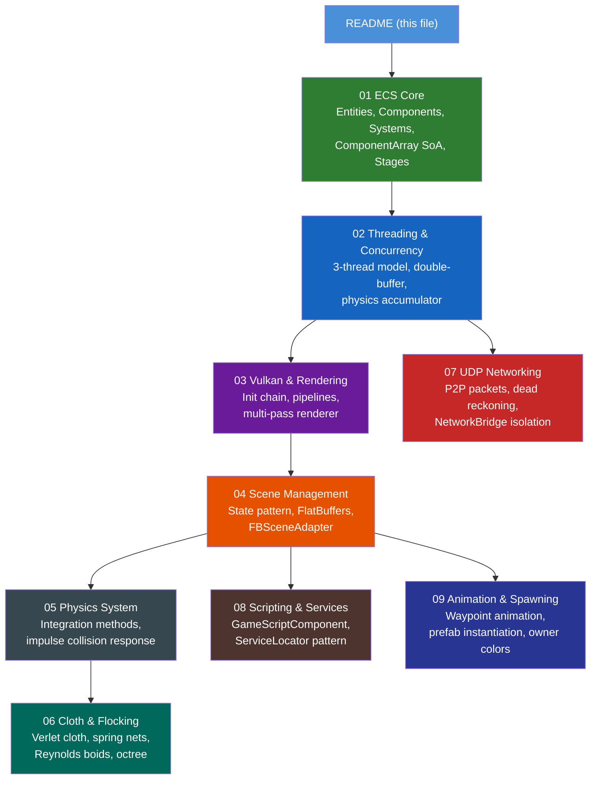

# Technical Manual — Simulation Engine

> **Audience:** Students and developers with no prior knowledge of this codebase. Each chapter is self-contained and explains concepts from first principles before showing how they are implemented here.

---

## What Is This Engine?

This is a **real-time 3D simulation engine** written in C++20 on Windows, using the **Vulkan graphics API**. It combines three major architectural patterns:

| Pattern | Purpose |
|---------|---------|
| **Entity Component System (ECS)** | Organises game objects as data + logic, not class hierarchies |
| **State Pattern (Scenarios)** | Switches between simulation scenes safely, tearing down and rebuilding GPU state |
| **Three-Thread Model** | Separates physics, rendering, and networking onto dedicated CPU cores |

The engine can simulate cloth, flocking boids, rigid-body physics, animated objects, particle effects, and networked multiplayer across 4 peers — all driven by binary scene files loaded at runtime.

---

## Chapter Map



---

## Recommended Reading Order

### For a complete beginner (start here):
1. **[01 — ECS Core](01_ECS_Core.md)** — Understand entities, components, systems
2. **[02 — Threading & Concurrency](02_Threading_and_Concurrency.md)** — How the engine's three threads work together
3. **[04 — Scene Management](04_Scene_Management.md)** — How scenes are loaded from binary files
4. **[05 — Physics System](05_Physics_System.md)** — How rigid bodies move and collide

### For graphics / Vulkan focus:
1. **[03 — Vulkan & Rendering](03_Vulkan_and_Rendering.md)** — The full Vulkan architecture
2. **[04 — Scene Management](04_Scene_Management.md)** — How objects get their pipelines
3. **[06 — Cloth & Flocking](06_Cloth_and_Flocking.md)** — GPU cloth buffers and boid agents

### For networking / multiplayer focus:
1. **[02 — Threading](02_Threading_and_Concurrency.md)** — The networking thread
2. **[07 — UDP Networking](07_UDP_Networking.md)** — Full P2P networking breakdown

### For gameplay programming:
1. **[08 — Scripting & Services](08_Scripting_and_Services.md)** — Writing custom per-entity behaviours
2. **[09 — Animation & Spawning](09_Animation_Spawning.md)** — Waypoints, easing, prefab instantiation, owner colors, virtual hierarchy

---

## Project Structure Quick Reference

```
simulation-engine/
├── include/                  # All headers, mirrored in source/
│   ├── core/                 # EngineOrchestrator, ServiceLocator, Logger
│   ├── ecs/                  # EntityManager, ComponentArray, IECSystem
│   ├── components/           # Transform, RigidBody, ClothComponent, FlockingComponent…
│   ├── systems/              # PhysicsSystem, ClothSystem, FlockingSystem, AnimationSystem…
│   ├── scene/                # Scenario, FlatBuffersScenario, FBSceneAdapter
│   ├── graphics/             # VulkanContext, Renderer, GraphicsPipeline, GpuResourceManager
│   ├── networking/           # NetworkService, Packets
│   ├── particles/            # GpuParticleBackend
│   └── memory/               # SimpleAllocator
├── source/                   # .cpp implementations
├── shaders/                  # GLSL sources + compiled .spv
├── config/
│   └── flatbufferConfig/     # .bin scene files (primary) + .json human-readable
├── flatbuffers/              # Scene.fbs schema + Scene_generated.h
└── markdown/TechnicalManual/ # ← You are here
```

---

## Key Vocabulary

| Term | Meaning |
|------|---------|
| **Entity** | A `uint32_t` ID — nothing more |
| **Component** | A plain C++ struct holding data (no logic) |
| **System** | A class that processes components each frame |
| **Scenario** | A loaded simulation scene (one active at a time) |
| **ICpuSystem** | System subtype that runs pure CPU logic (physics thread safe) |
| **IGpuSystem** | System subtype that records Vulkan commands (main thread only) |
| **ESystemStage** | Ordered execution bucket for systems (Physics runs before Camera, etc.) |
| **SimulationState** | Double-buffered snapshot of all entity transforms (physics → renderer) |
| **FlatBuffers** | Binary serialisation format; `.bin` scene files are FlatBuffers |
| **FBSceneAdapter** | Reads FlatBuffers tables and creates ECS entities from them |
| **NetworkBridge** | The only class allowed to see both ECS and networking headers |
| **Dead Reckoning** | Predicting a remote entity's position between received packets |
| **ServiceLocator** | Static registry giving any system access to global services |
| **PrefabTemplate** | Blueprint describing shape, physics params, and meshes for a spawnable entity |
| **EntityFactory** | Creates fully-initialised ECS entities at runtime from a PrefabTemplate |
| **m_localPosition** | Position relative to the parent entity (stored, authored by loaders/animation) |
| **m_worldPosition** | World-space position (computed by TransformSystem each frame; read by physics/renderer) |
| **SyncWorldToLocal** | Converts a physics world-space correction back into local-space for the next TransformSystem pass |
| **Solver Iterations** | Number of times ResolveCollisions runs per physics tick; higher = more stable stacking |

---

*All code snippets reference actual source files. Line numbers may shift as the codebase evolves; use the file paths to locate the current definitions.*
