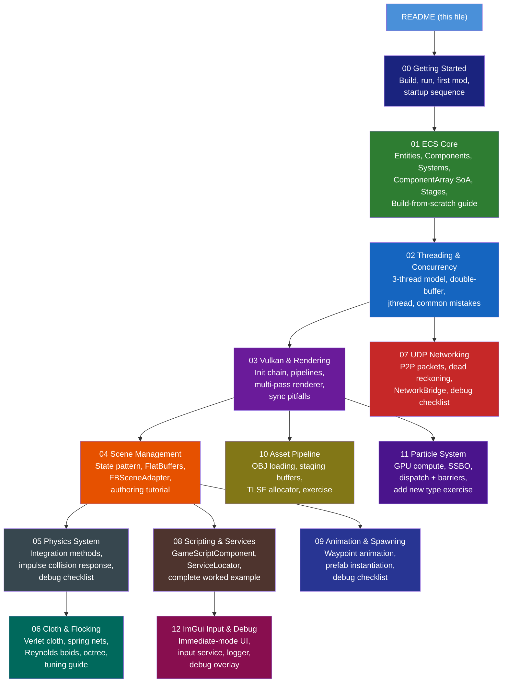

# Technical Manual — Simulation Engine

> **Audience:** Students and developers with no prior knowledge of this codebase. Each chapter
> is self-contained and explains concepts from first principles before showing how they are
> implemented here. Chapters 1–9 explain HOW systems work. Chapters 0 and 10–12 add the missing
> pieces: setup, assets, particles, and UI. Every chapter ending in §X.10+ teaches you how to
> **build that system from scratch**.

---

## What Is This Engine?

This is a **real-time 3D simulation engine** written in C++20 on Windows, using the **Vulkan
graphics API**. It combines three major architectural patterns:

| Pattern | Purpose |
|---------|---------|
| **Entity Component System (ECS)** | Organises game objects as data + logic, not class hierarchies |
| **State Pattern (Scenarios)** | Switches between simulation scenes safely, tearing down and rebuilding GPU state |
| **Three-Thread Model** | Separates physics, rendering, and networking onto dedicated CPU cores |

The engine simulates cloth, flocking boids, rigid-body physics, animated objects, particle
effects, and networked multiplayer across 4 peers — all driven by binary scene files.

---

## Prerequisites

Before building, install:

| Tool | Minimum Version | Notes |
|------|----------------|-------|
| **Windows** | 10 or 11 | Only supported platform |
| **Visual Studio 2022** | 17.x | Community edition is free |
| **Vulkan SDK** | 1.4.x | Install from vulkan.lunarg.com |
| **GLFW** | 3.4 | Pre-compiled Win64 binaries already in `external-libraries/` |
| **GLM** | 0.9.9+ | Header-only, already in `external-libraries/` |

Optional (for scene authoring only):

| Tool | Notes |
|------|-------|
| **flatc** (FlatBuffers compiler) | Only needed to compile `.json` scenes to `.bin` |

See **[Chapter 0 — Getting Started](00_Getting_Started.md)** for step-by-step build instructions.

---

## Chapter Map



---

## Recommended Reading Order

### Build From Scratch (complete sequence — replicate the engine)

Follow this track to understand every layer, in the order you would build it:

1. **[00 — Getting Started](00_Getting_Started.md)** — Build + run; project layout; first modification
2. **[01 — ECS Core §1.10](01_ECS_Core.md)** — Build your own ECS in 6 steps
3. **[02 — Threading §2.10](02_Threading_and_Concurrency.md)** — Implement double-buffering + jthread
4. **[03 — Vulkan §3.12](03_Vulkan_and_Rendering.md)** — Vulkan init step-by-step from nothing
5. **[10 — Asset Pipeline](10_Asset_Pipeline.md)** — Upload geometry and textures to GPU
6. **[04 — Scene Management §4.9](04_Scene_Management.md)** — Author a scene from scratch
7. **[05 — Physics §5.12](05_Physics_System.md)** — Integration methods + angular dynamics derivation
8. **[11 — Particle System](11_Particle_System.md)** — GPU compute shaders + add new particle type
9. **[06 — Cloth & Flocking §6.13](06_Cloth_and_Flocking.md)** — Verlet cloth + flocking tuning
10. **[07 — UDP Networking](07_UDP_Networking.md)** — P2P protocol + dead reckoning
11. **[08 — Scripting §8.8](08_Scripting_and_Services.md)** — Complete script example
12. **[09 — Animation & Spawning](09_Animation_Spawning.md)** — Waypoints + prefab spawning
13. **[12 — ImGui, Input & Debug](12_ImGui_Input_Debug.md)** — Runtime UI + logging + inspector

### For a complete beginner (understand existing code):
1. **[01 — ECS Core](01_ECS_Core.md)** — Entities, components, systems
2. **[02 — Threading & Concurrency](02_Threading_and_Concurrency.md)** — How three threads cooperate
3. **[04 — Scene Management](04_Scene_Management.md)** — How scenes load from binary files
4. **[05 — Physics System](05_Physics_System.md)** — How rigid bodies move and collide

### For graphics / Vulkan focus:
1. **[03 — Vulkan & Rendering](03_Vulkan_and_Rendering.md)** — Full Vulkan architecture
2. **[10 — Asset Pipeline](10_Asset_Pipeline.md)** — Vertex + texture upload to GPU
3. **[11 — Particle System](11_Particle_System.md)** — GPU compute shaders
4. **[06 — Cloth & Flocking](06_Cloth_and_Flocking.md)** — GPU cloth buffers and boid agents

### For networking / multiplayer focus:
1. **[02 — Threading](02_Threading_and_Concurrency.md)** — The networking thread model
2. **[07 — UDP Networking](07_UDP_Networking.md)** — Full P2P networking breakdown

### For gameplay programming:
1. **[08 — Scripting & Services](08_Scripting_and_Services.md)** — Writing custom per-entity behaviours
2. **[09 — Animation & Spawning](09_Animation_Spawning.md)** — Waypoints, easing, prefabs, owner colors
3. **[12 — ImGui, Input & Debug](12_ImGui_Input_Debug.md)** — Reading input, using the logger

---

## Project Structure Quick Reference

```
simulation-engine/
├── simulation-engine.sln / .vcxproj   # Open this to build
├── include/                            # All headers, mirrored in source/
│   ├── core/                           # EngineOrchestrator, ServiceLocator, Logger
│   ├── ecs/                            # EntityManager, ComponentArray, IECSystem
│   ├── components/                     # Transform, RigidBody, ClothComponent…
│   ├── systems/                        # PhysicsSystem, ClothSystem, FlockingSystem…
│   ├── scene/                          # Scenario, FlatBuffersScenario, FBSceneAdapter
│   ├── graphics/                       # VulkanContext, Renderer, GraphicsPipeline
│   ├── networking/                     # NetworkService, Packets
│   ├── particles/                      # GpuParticleBackend, Particle
│   ├── assets/                         # AssetManager, OBJLoader, Vertex, Mesh
│   └── memory/                         # SimpleAllocator (TLSF VRAM pool)
├── source/                             # .cpp implementations (mirrors include/)
├── shaders/                            # GLSL sources + compiled .spv
│   └── compile.bat                     # Recompile all shaders
├── config/
│   └── flatbufferConfig/
│       ├── showcases/                  # Active demo scenes (.bin)
│       └── tests/                      # Dev/test scenes
├── flatbuffers/
│   ├── Scene.fbs                       # FlatBuffers schema (edit to extend)
│   └── Scene_generated.h              # Hand-patched (DO NOT regenerate via flatc)
├── models/                             # OBJ mesh files
├── textures/                           # PNG textures + cubemaps
└── external-libraries/                 # Vendored deps (READ-ONLY)
    ├── glfw-3.4.bin.WIN64/
    ├── glm/
    ├── imgui/                          # Dear ImGui (NEVER EDIT)
    └── stb/
```

---

## Key Vocabulary

| Term | Meaning |
|------|---------|
| **Entity** | A `uint32_t` ID — nothing more |
| **Component** | A plain C++ struct holding data (no logic) |
| **System** | A class that processes components each frame |
| **Scenario** | A loaded simulation scene (one active at a time) |
| **ICpuSystem** | System subtype that runs pure CPU logic (physics thread safe) |
| **IGpuSystem** | System subtype that records Vulkan commands (main thread only) |
| **ESystemStage** | Ordered execution bucket for systems (Physics runs before Camera, etc.) |
| **SimulationState** | Double-buffered snapshot of all entity transforms (physics → renderer) |
| **FlatBuffers** | Binary serialisation format; `.bin` scene files are FlatBuffers |
| **FBSceneAdapter** | Reads FlatBuffers tables and creates ECS entities from them |
| **NetworkBridge** | The only class allowed to see both ECS and networking headers |
| **Dead Reckoning** | Predicting a remote entity's position between received packets |
| **ServiceLocator** | Static registry giving any system access to global services |
| **PrefabTemplate** | Blueprint describing shape, physics params, and meshes for a spawnable entity |
| **EntityFactory** | Creates fully-initialised ECS entities at runtime from a PrefabTemplate |
| **m_localPosition** | Position relative to the parent entity (authored by loaders/animation) |
| **m_worldPosition** | World-space position (computed by TransformSystem; read by physics/renderer) |
| **SyncWorldToLocal** | Converts a physics world-space correction back into local-space |
| **Solver Iterations** | Number of collision-resolution passes per physics tick |
| **SSBO** | Shader Storage Buffer Object — GPU buffer readable and writable in compute shaders |
| **TLSF** | Two-Level Segregated Fit — O(1) real-time memory allocator for the VRAM pool |
| **Staging Buffer** | CPU-visible temporary buffer used to upload data to device-local GPU memory |
| **Jakobsen Constraint** | Iterative distance constraint: directly moves particles to satisfy spring rest lengths |
| **Peer Mask** | 8-bit bitmask in `m_acceptedPeerMask`; gates which peers' packets are applied |
| **stop_token** | C++20 cooperative cancellation token used with `std::jthread` |
| **Immediate-mode UI** | GUI described every frame from scratch (Dear ImGui) — no retained widget state |

---

*All code snippets reference actual source files. Line numbers may shift as the codebase
evolves; use the file paths and function names to locate the current definitions.*
